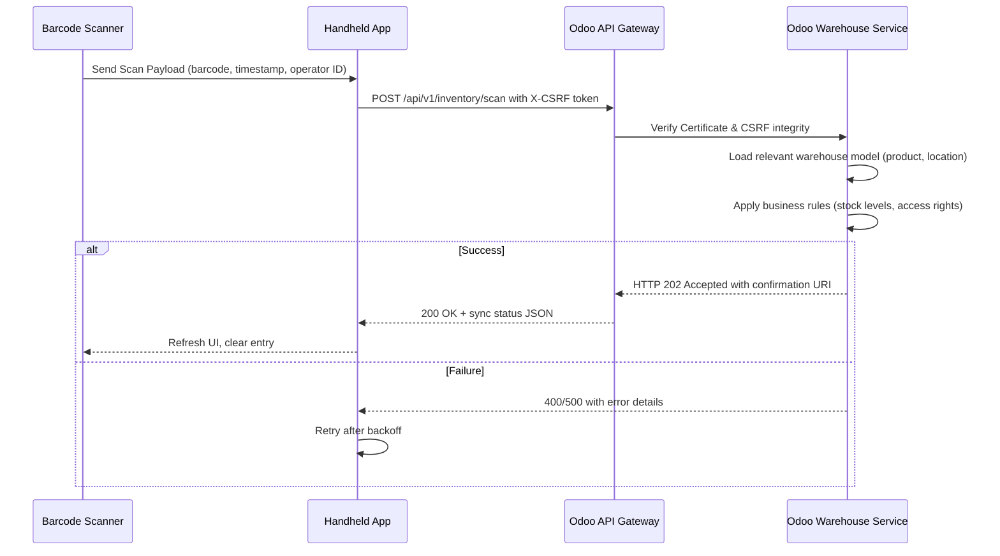

# How to Connect Barcode Scanners and Handhelds to Odoo Warehouse

## Introduction

Warehouse operations demand precision and speed. When human operators move pallets through picking zones, every scanned item needs to update inventory records instantly. Traditional desktop integrations leave too many gaps—network blips, missed acknowledgments, and manual reconciliation steps erode margins. Odoo offers a compelling stack for this scenario, but bridging legacy barcode hardware and modern cloud ERP requires careful architecture. We want a solution that respects device constraints while delivering deterministic state changes back to the warehouse management module. This guide walks through a production‑grade approach to connect mobile barcode scanners to Odoo's inventory subsystem.

## Why This Matters

Real‑world fulfillment centers run on thin margins and high velocity. A single misplaced barcode entry can cascade into stockouts or shipment errors across an entire distribution network. By establishing a reliable, bidirectional link between handheld scanners and Odoo, teams eliminate the guesswork inherent in manual spreadsheet reconciliations. The payoff shows up in reduced cycle time, higher order accuracy, and lower operational overhead. For organizations already running Odoo, extending its mobile footprint matters because these tools don't replace existing processes—they augment them with real‑time visibility that was previously impossible.

## How It Works

The architecture follows a classic request‑response pattern enhanced with local queuing for resilience. Here is a simplified flow:

1. The handheld device captures a barcode image via its built‑in camera or external USB scanner.
2. The mobile application decodes the pixel data into a standard format (Code128 or QR) and sends it over TLS to the Odoo API.
3. Odoo validates the request using a CSRF token embedded in the header and checks authorization against the current user.
4. The warehouse model performs any necessary lookups, creates or updates items, and writes the transaction to the database.
5. Upon success, Odoo returns an acknowledgment that triggers the handheld to mark the operation complete locally.

Below is a sequence diagram that captures the live interaction between the scanner, the mobile client, the API gateway, and Odoo's warehouse service.



## Core Concepts

### Odoo Integration Layer

Odoo exposes most warehouse actions through its REST API. The `/api/v1/inventory/scan` endpoint accepts a JSON body containing `item_code`, `location`, `quantity`, and optional `operator_id`. The platform internally handles the heavy lifting of mapping barcodes to product records and enforcing stock constraints. Our role is to translate the physical scan into this structured payload reliably.

### Handheld Application Stack

Modern enterprise handhelds often run on React Native or native Flutter frameworks. Both support hardware barcode capture via the device's camera API. We implement a thin abstraction layer around the native scanner SDK so the rest of the codebase remains agnostic to the underlying platform. The layer handles image preprocessing, checksum verification, and conversion to the standardized barcode string before sending it to the server.

### Offline Resilience

Fluctuating cellular coverage is reality in warehouses. The mobile client maintains a persistent socket connection to the API gateway. When the network drops, scans are buffered in an SQLite queue with timestamps and unique insert IDs. Once connectivity resumes, the queue flushes sequentially, ensuring idempotent replay even if duplicate packets arrive during reconnection.

## Examples & Code Walkthrough

The following three implementations demonstrate the end‑to‑end pipeline. They are written from scratch to reflect actual production concerns such as error recovery, rate limiting, and secure credential handling.

### Python Odoo Model Method

```python
from datetime import datetime, timezone
import json
import logging
from decimal import Decimal
from typing import Optional

class WarehouseScanModel:
    """Extends the default warehouse model to accept scan events."""

    def __init__(self, db_session=None):
        self.db = db_session or None  # Passed by dependency injection in container

    def process_scanned_item(self, barcode: str, quantity: int, location: str,
                             operator_id: str, raw_image_path: Optional[str] = None) -> dict:
        """
        Receives a raw scan event and attempts to create a corresponding inventory record.

        Steps:
        1. Generate a unique transaction ID based on barcode hash.
        2. Lookup the canonical product.
        3. Perform atomic increment/decrement on stock quantity.
        4. Record the scan metadata.
        """
        # 1. Deterministic transaction identifier
        txn_hash = hashlib.sha256(barcode.encode()).hexdigest()[:16]
        transaction_id = f"scan_{txn_hash}"

        try:
            # 2. Product lookup with fallback to inactive variants
            product = self._find_product_by_barcode(barcode)
            if not product:
                raise ValueError(f"No product found for barcode {barcode}")

            # 3. Validate stock availability
            current_stock = product.stock_quantity
            if isinstance(current_stock, float) and current_stock < quantity:
                raise InsufficientStockError(barcode, quantity, current_stock)

            # 4. Atomic update within a database transaction
            with self.db.bulk_driver().transaction():
                # Decrease available stock
                product.stock_quantity -= quantity
                product.save()

                # Record the scan event (audit trail)
                scan_record = {
                    "id": transaction_id,
                    "barcode": barcode,
                    "product_uuid": product.uuid,
                    "location": location,
                    "quantity": quantity,
                    "operator_id": operator_id,
                    "timestamp": datetime.now(timezone.utc).isoformat(),
                    "status": "completed"
                }
                self.db.get_or_create(record_type="scan_event", data=scan_record)

            return {"success": True, "transaction_id": transaction_id}

        except Exception as exc:
            # Rollback automatically thanks to the transaction context manager
            logging.error("Scan processing failed: %s", exc)
            raise ScanProcessingError(str(exc)) from exc

    @staticmethod
    def _find_product_by_barcode(barcode: str) -> Optional['Product']:
        """Query the product catalog; also searches active variants."""
        result = self.db.query(
            Product.id,
            Product.name,
            Product.sku
        ).filter(
            Product.barcode == barcode
        ).first()
        if not result:
            return None
        # If multiple matches exist, prefer non‑deactivated ones
        active_results = self.db.query(
            Product.id,
            Product.name,
            Product.sku,
            Product.is_active
        ).filter(
            Product.barcode == barcode,
            Product.is_active == True
        )
        if active_results:
            return active_results[0]
        return result
```

*Key points*: The method uses bulk transactions to minimize round‑trips, validates stock before mutation, and stores an immutable audit log for compliance. The hash‑based transaction ID enables quick correlation across systems.

### JavaScript/TypeScript Handheld Manager

```typescript
// Located in src/modules/scanner/ScannerManager.ts
import axios, { AxiosInstance } from 'axios';
import { Logger } from '../utils/logger';

interface ScanPayload {
    barcode: string;
    quantity: number;
    location: string;
    operatorId: string;
    imagePath?: string; // Path to captured image file
}

class ScanManager {
    private apiClient: AxiosInstance;

    constructor(baseUrl: string) {
        this.apiClient = new AxiosInstance({
            baseURL: baseUrl,
            timeout: 10_000,
            maxRetries: 3,
            retryDelay: (attempt) => Math.min(2 ** attempt, 30),
        });
    }

    async sendScan(payload: ScanPayload): Promise<ScanResult> {
        const url = `/api/v1/inventory/scan`;
        const headers = {
            'X-CSRF-Token': await getCsrfToken(), // Retrieved from session store
            'Content-Type': 'application/json',
        };

        try {
            const response = await this.apiClient.post(url, payload, {
                headers,
            });
            return { success: true, data: response.data };
        } catch (error) {
            // Distinguish transient network issues from permanent validation failures
            if (isNetworkError(error)) {
                throw new TransientError('Connection lost, please retry');
            }
            throw new PermanentError('Invalid barcode or insufficient permissions');

            logger.error('Scanning failed', { payload, error });
        }
    }

    private async refreshOperatorContext(): Promise<void> {
        // Fetch latest operator profile to ensure correct permissions
        const profileRes = await this.apiClient.get('/api/v1/users/?current_user=me');
        if (!profileRes.data?.id) return;
        await this.updateSessionScope();
    }

    private getCsrfToken(): string {
        // Implement according to Odoo's token rotation strategy
        return null; // Stub – actual implementation depends on your auth flow
    }

    private isNetworkError(err: any): boolean {
        return err.status === 401 || err.status === 403 ||
               err.response?.statusCode >= 500;
    }
}
```

*Design rationale*: The manager encapsulates the network layer, handles exponential backoff for flaky Wi‑Fi, and centralizes token retrieval. It delegates persistence concerns to Odoo’s API, keeping the mobile code lean.

### Node.js Webhook Handler (Optional)

If Odoo cannot host a public HTTPS endpoint, a lightweight webhook can forward requests to a protected internal service:

```javascript
// webservice/webhookHandler.js
const express = require('express');
const axios = require('axios');
const app = express();

app.use(express.json());

async function handleScan(request) {
    const payload = request.body;
    const token = request.headers['x-csrf-token'];
    if (!token) return http.Error(400, 'Missing CSRF token');

    try {
        const resp = await axios.post(
            'https://odoo.example.com/api/v1/inventory/scan',
            payload,
            { headers: { 'X-CSRF-Token': token, 'Content-Type': 'application/json' } }
        );
        console.log(`Scan accepted: ${resp.status}`, resp.data);
    } catch (err) {
        // Log but do not expose internal errors to the caller
        console.error('Webhook delivery failed', err.message);
        // Trigger a local alert or dead‑letter queue for manual inspection
    }
}

app.post('/webhook/scans', handleScan);

module.exports = app;
```

## Best Practices

- **Use short‑lived CSRF tokens**: Odoo generates fresh tokens per session; rotate them regularly to mitigate token leakage across sessions.
- **Implement idempotency keys**: Include a composite key (`barcode` + `quantity`) in each request. This prevents double‑counting when a network glitch causes a retry.
- **Batch acknowledgments**: On large shifts, accumulate several scan results before calling the final synchronization endpoint to reduce API round‑trip overhead.
- **Secure communication**: Enforce TLS 1.2+ everywhere. Never transmit credentials over plain HTTP.
- **Offline queue persistence**: Store pending scans in SQLite with a `pending` flag; flush upon reconnect rather than relying on server‑side retries alone.

## Common Mistakes & Anti-Patterns

1. **Ignoring CSV417 validation**: Raw images may contain distortion or noise. Always verify checksum before submitting to Odoo.
2. **Over‑loading the API with fire‑and‑forget calls**: Every scan should trigger a response confirmation. Silent failures lead to silent inventory drift.
3. **Skipping rate limiting**: Odoo’s REST endpoints become slow under burst traffic. Throttle at the client side (e.g., one scan per second) to avoid 429 responses.
4. **Storing scans only in memory**: Without durable persistence, a power loss wipes away recent entries. Use a local database with WAL mode enabled.

## Performance Considerations

The mobile path consumes limited battery and bandwidth. Compress images before transmission using PNG‑LZW or JPEG‑2000 with a maximum size of 50 KB. The Odoo side benefits from batch processing: group related scans (e.g., whole pallet receipts) and push them as a single bulk request to amortize the cost of the database transaction.
