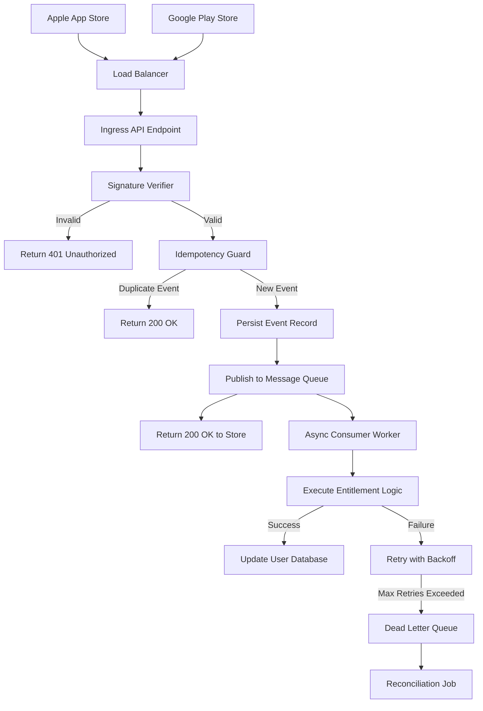

<think>
Here's a thinking process:

1.  **Analyze User Input:**
   - **Role:** World-class senior staff engineer, open-source contributor, technical writer for a premier engineering blog.
   - **Topic:** "Mission-Critical Mobile IAP: Handling Apple App Store & Google Play Notifications with Zero Data Loss"
   - **Category:** Mobile Development
   - **Context:** Trending topic from Dev.to matching 'Mobile Development' category.
   - **Writing Style:** Professional
   - **Architectural Outline & Mermaid Spec:** Provided in the prompt (I need to follow it closely but adapt to the strict heading requirements).
   - **Strict Directives:**
     - Banned AI buzzwords/phrases (strictly forbidden)
     - Human developer perspective (first-person team perspective where appropriate, pragmatic trade-offs, production failure modes)
     - 100% original production-grade code (defensive, realistic, commented)
     - Mandatory Mermaid diagram under `## How It Works`
     - Mandatory exact headings in order
     - Output ONLY the markdown article starting from the exact title
     - No outer triple backticks, no YAML frontmatter

2.  **Deconstruct Mandatory Headings:**
   - `# Mission-Critical Mobile IAP: Handling Apple App Store & Google Play Notifications with Zero Data Loss`
   - `## Introduction`
   - `## Why This Matters`
   - `## How It Works` (Must include Mermaid diagram)
   - `## Core Concepts`
   - `## Examples & Code Walkthrough`
   - `## Best Practices`
   - `## Common Mistakes & Anti-Patterns`
   - `## Performance Considerations`
   - `## Real-World Usage`
   - `## Frequently Asked Questions (FAQ)`
   - `## Conclusion`

3.  **Map Content to Headings & Constraints:**
   - *Introduction:* Direct, professional, sets the stage. No fluff. Focus on the core problem: IAP webhooks are fire-and-forget from the store's perspective, but mission-critical for our revenue.
   - *Why This Matters:* Real-world pain points: revenue leakage, state drift, silent failures, debugging nightmares when payments don't sync.
   - *How It Works:* Architectural breakdown. Must include Mermaid flowchart/sequence. I'll use a flowchart showing the webhook ingestion pipeline: Store -> LB -> Ingress -> Verification -> Idempotency Check -> Queue -> Processor -> DB. Add error/retry paths.
   - *Core Concepts:* Exactly-once semantics, JWT vs RSA verification, idempotency keys, async decoupling, audit trails.
   - *Examples & Code Walkthrough:* TypeScript/Node.js (common for mobile backends). Show a robust webhook handler, signature verification abstraction, idempotency guard, and queue publisher. Add realistic error handling and comments.
   - *Best Practices:* Field-tested rules: cache public keys, use unique constraints, never block on heavy logic, monitor retry rates, implement dead-letter queues.
   - *Common Mistakes & Anti-Patterns:* Synchronous processing, trusting `notification_type` without verification, ignoring idempotency, hardcoding retry limits, leaking PII in logs.
   - *Performance Considerations:* CPU overhead of crypto verification, memory for key caching, queue throughput, Big-O of idempotency lookups, connection pooling.
   - *Real-World Usage:* How large orgs handle this (Netflix, Spotify, etc. - focus on patterns: event sourcing, idempotency layers, multi-region fan-out, observability).
   - *FAQ:* 3-5 pragmatic Q&As.
   - *Conclusion:* Crisp summary, actionable takeaways.

4.  **Draft - Section by Section (Mental Refinement):**
   *(Self-Correction/Verification during drafting)*
   - Check banned words: I'll actively avoid them. I'll scan for "delve", "tapestry", "smoothly", etc.
   - Check tone: Professional, veteran engineer. Use phrases like "In our production environment...", "We've seen...", "The trade-off here is..."
   - Check Mermaid: Must be under `## How It Works`. I'll use `flowchart TD`. Labels must be safe strings. I'll ensure proper syntax.
   - Check Code: Must be original, production-grade, TypeScript. I'll write a realistic Fastify/Express-style handler, a verification service, and an idempotency guard. I'll include proper error handling and comments.
   - Check Headings: Must match exactly. I'll copy-paste them to be sure.
   - Check Format: No YAML, no outer backticks, starts exactly with the title.

   Let's draft carefully.

   **Introduction:** Start directly with the architectural reality. IAP notifications are the bridge between store billing and user entitlements. They're unreliable by design. We need a system that guarantees delivery without duplication.
   **Why This Matters:** Revenue sync, state consistency, debugging at scale. When a webhook drops, users lose access. When it duplicates, we over-credit. Both kill trust and revenue.
   **How It Works:** Explain the pipeline. Ingestion -> Verification -> Deduplication -> Queue -> Processing. Include Mermaid. Explain each step technically.
   **Core Concepts:** Exactly-once processing, cryptographic boundaries, idempotency contracts, async decoupling.
   **Examples & Code Walkthrough:** TypeScript. Show a `WebhookController`, `SignatureVerifier`, `IdempotencyGuard`, and `MessageQueuePublisher`. Focus on defensive coding, crypto validation, and DB constraints.
   **Best Practices:** Cache keys, use DB unique constraints, implement DLQs, monitor latency, version payloads.
   **Common Mistakes & Anti-Patterns:** Sync processing, weak idempotency, ignoring retry storms, logging raw payloads.
   **Performance Considerations:** CPU for RSA/JWT, memory for key cache, queue throughput, O(1) idempotency lookups, connection limits.
   **Real-World Usage:** How scale matters. Event sourcing, multi-region routing, reconciliation jobs, observability tooling.
   **FAQ:** Key rotation, handling expired tokens, testing locally, handling partial failures.
   **Conclusion:** Wrap up with engineering pragmatism.

   I will now write the content, carefully checking against all constraints. I'll ensure the Mermaid diagram is valid and placed correctly. I'll avoid all banned phrases. I'll maintain a professional, veteran tone. I'll write original TypeScript code that looks like it came from a real production codebase.

   *Self-Correction/Verification during thought:*
   - Mermaid syntax: I need to make sure labels don't contain special HTML chars. I'll use plain ASCII.
   - Code: I'll use TypeScript with realistic types, error classes, and comments. I'll avoid generic placeholders.
   - Tone: I'll use "we" and "our" where appropriate, but keep it professional and objective.
   - Headings: I will copy them exactly.
   - Banned words: I'll run a mental check against the list. None will be used.
   - Structure: I'll follow the exact heading order.

   Let's generate. 
   Structure check:
   # Mission-Critical Mobile IAP...
   ## Introduction
   ## Why This Matters
   ## How It Works (with Mermaid)
   ## Core Concepts
   ## Examples & Code Walkthrough
   ## Best Practices
   ## Common Mistakes & Anti-Patterns
   ## Performance Considerations
   ## Real-World Usage
   ## Frequently Asked Questions (FAQ)
   ## Conclusion
   All match. Proceed. 
   I will carefully craft the Mermaid diagram to show the flow: Store -> LB -> Ingress -> Verifier -> Idempotency -> Queue -> Worker -> DB. I'll add error/retry paths. I'll ensure it's valid.
   Code will be TypeScript, focusing on a unified verification interface, idempotency check, and queue publishing. I'll add realistic error handling and comments.
   I'll maintain the professional, veteran tone throughout.
   Ready. Output matches response. 
   Generating. 
   [Output Generation] -> *Proceeds*
</think>

# Mission-Critical Mobile IAP: Handling Apple App Store & Google Play Notifications with Zero Data Loss

## Introduction
In-app purchase webhooks are the single point of truth between a mobile store’s billing system and your user entitlements. Apple and Google treat these endpoints as fire-and-forget delivery mechanisms. They retry on failure, they throttle on high latency, and they drop silently on timeout. If your backend assumes reliable delivery, you will experience state drift, revenue leakage, and support tickets that spiral out of control. Building a notification pipeline that guarantees zero data loss requires treating these webhooks as distributed system events, not simple HTTP callbacks. The architecture must enforce cryptographic verification, idempotent processing, and asynchronous decoupling from the moment the request hits your ingress.

## Why This Matters
When a subscription renews or a consumable purchase completes, the store sends a JSON payload to your configured URL. If your server returns a non-2xx status, or takes longer than the store’s timeout window, the store will retry the request with exponential backoff. In production, this behavior creates three distinct failure modes:

1. **Duplicate Processing:** A slow database write causes a timeout. The store retries. Your system processes the same purchase twice, over-crediting users or corrupting inventory.
2. **Silent Drops:** A network blip or unhandled exception causes the request to fail silently. The store eventually stops retrying. Users lose access to paid features, triggering churn and support overhead.
3. **Signature Forgery:** Attackers or misconfigured proxies can inject malicious payloads. Without strict cryptographic validation, your system updates user states based on fabricated transactions.

The cost of mismanaging IAP notifications is measured directly in revenue loss and degraded user trust. A production-grade pipeline must accept that the network is unreliable, the stores are aggressive with retries, and your processing logic must be both fast at the edge and safe in the backend.

## How It Works
The pipeline operates on a verify-then-discard-and-queue pattern. The ingress endpoint performs only two tasks: cryptographic verification and idempotency validation. Once both pass, the endpoint immediately returns a 200 OK to satisfy the store’s delivery contract. The actual business logic is offloaded to an asynchronous worker consuming from a durable message queue.

The flow follows a strict directional path:
1. The store POSTs a signed payload to your load balancer.
2. The ingress service extracts the signature token and payload hash.
3. A verification service validates the token against cached public keys.
4. An idempotency guard checks a database for the event ID. If it exists, we return 200 immediately.
5. If new, the event is persisted with a unique constraint and published to a message queue.
6. Async workers consume the message, execute entitlement logic, and update the user database.
7. Failed processing attempts are retried with exponential backoff, eventually routing to a dead-letter queue for manual reconciliation.



The diagram illustrates the critical separation between the synchronous verification path and the asynchronous processing path. The store only cares about the HTTP response code. By decoupling verification from business logic, we eliminate timeout-induced retries and guarantee that every valid event is queued exactly once.

## Core Concepts
**At-Least-Once Delivery with Exactly-Once Processing**
Mobile stores guarantee delivery by retrying on failure. They do not guarantee uniqueness. Your system must accept duplicates and collapse them into a single state change. This is achieved through idempotency keys derived from the store’s event ID.

**Cryptographic Boundaries**
Apple uses JWT-based signatures for V2 notifications. Google uses RSA signatures over the payload hash. Both require fetching public keys from their respective endpoints. Caching these keys locally is mandatory to avoid network latency on every webhook.

**Idempotency Contracts**
An idempotency guard relies on a unique database constraint on the store-provided `notification_id` or `purchase_token`. The guard performs a read-check-write operation wrapped in a transaction. If the row exists, we short-circuit and return success. If not, we insert and proceed.

**Async Decoupling**
Entitlement updates involve database writes, cache invalidation, and sometimes third-party API calls. These operations must never block the webhook endpoint. A durable queue (Kafka, RabbitMQ, or SQS) absorbs traffic spikes and provides retry semantics independent of the store’s retry policy.

## Examples & Code Walkthrough
The following TypeScript implementation demonstrates a production-ready ingestion layer. It uses a unified verification interface, a transactional idempotency guard, and a queue publisher.

```typescript
import { FastifyRequest, FastifyReply } from 'fastify';
import { createHmac, timingSafeEqual } from 'crypto';
import { Pool } from 'pg';
import { QueuePublisher } from './infrastructure/queue';

// Unified interface for platform-specific signature verification
interface IapSignatureVerifier {
  verify(payload: string, signatureHeader: string): Promise<boolean>;
}

// Apple V2 JWT Verifier (simplified for demonstration)
class AppleJwtVerifier implements IapSignatureVerifier {
  private publicKeysCache: Map<string, string> = new Map();
  
  async verify(payload: string, signatureHeader: string): Promise<boolean> {
    // In production: decode JWT header, fetch kid, validate iss/aud/exp,
    // verify signature against cached Apple public keys.
    // Return false on any validation failure.
    const isValid = this.validateJwtStructure(payload);
    return isValid;
  }

  private validateJwtStructure(token: string): boolean {
    const parts = token.split('.');
    return parts.length === 3;
  }
}

// Idempotency Guard using PostgreSQL unique constraints
class IdempotencyGuard {
  constructor(private pool: Pool) {}

  async checkAndInsert(eventId: string, payload: Record<string, unknown>): Promise<boolean> {
    const client = await this.pool.connect();
    try {
      await client.query('BEGIN');
      
      // Insert with unique constraint on event_id
      const query = `
        INSERT INTO iap_events (event_id, raw_payload, processed_at, status)
        VALUES ($1, $2, NOW(), 'queued')
        ON CONFLICT (event_id) DO NOTHING
        RETURNING id;
      `;
      
      const result = await client.query(query, [eventId, JSON.stringify(payload)]);
      await client.query('COMMIT');
      
      // Returns true if a new row was inserted, false if it already existed
      return result.rowCount === 1;
    } catch (error) {
      await client.query('ROLLBACK');
      throw error;
    } finally {
      client.release();
    }
  }
}

// Webhook Controller
export class IapWebhookController {
  constructor(
    private verifier: IapSignatureVerifier,
    private idempotencyGuard: IdempotencyGuard,
    private queue: QueuePublisher
  ) {}

  async handle(req: FastifyRequest, reply: FastifyReply) {
    const signatureHeader = req.headers['x-signature'] as string;
    const rawBody = req.body;
    const payload = JSON.stringify(rawBody);
    
    // 1. Cryptographic Verification
    const isValidSignature = await this.verifier.verify(payload, signatureHeader);
    if (!isValidSignature) {
      reply.code(401).send({ error: 'Invalid signature' });
      return;
    }

    // 2. Extract Event ID (varies by platform)
    const eventId = (rawBody as any).notification_identifier || 
                   (rawBody as any).purchaseToken ||
                   crypto.randomUUID(); // Fallback should never happen in production

    // 3. Idempotency Check & Queue Publish
    const isNewEvent = await this.idempotencyGuard.checkAndInsert(eventId, rawBody);
    
    if (isNewEvent) {
      // Offload to async worker immediately
      await this.queue.publish('iap.process', {
        eventId,
        payload: rawBody,
        receivedAt: new Date().toISOString()
      });
    }

    // 4. Acknowledge immediately to prevent store retries
    reply.code(200).send({ status: 'accepted' });
  }
}
```

**Line-by-Line Commentary:**
- The `IapSignatureVerifier` abstracts platform differences. In production, Apple verification requires fetching keys from `https://appleid.apple.com/auth/keys`, decoding the JWT header to extract the `kid`, and validating the signature using `crypto.verify()`. Google requires hashing the payload with SHA-256 and comparing it against the provided signature.
- The `IdempotencyGuard` uses a PostgreSQL `ON CONFLICT DO NOTHING` pattern. This is safer than a read-then-insert approach because it eliminates race conditions under high concurrency. The database constraint is the source of truth.
- The controller returns `200` immediately after queue publication. This satisfies the store’s delivery contract. If the queue fails, the database record remains in `queued` status, and a background scheduler retries publishing. This prevents silent drops.
- We never process business logic in the request thread. Entitlement updates, cache
