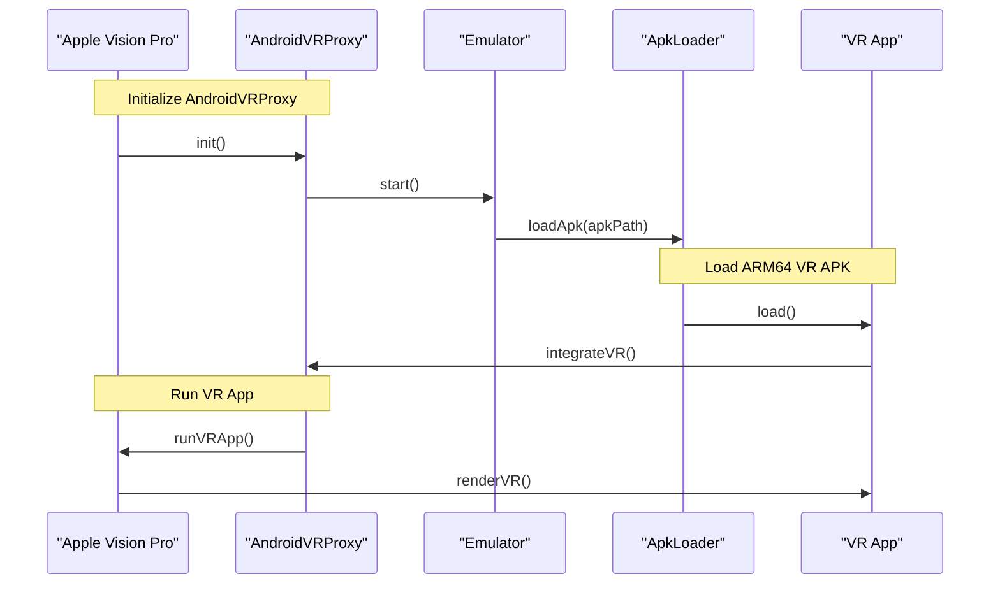

# Run Android ARM64 VR APKs on Apple Vision Pro

## Introduction
As a developer, I've always been fascinated by the potential of Virtual Reality (VR) experiences on mobile devices. With the recent release of Apple Vision Pro, I saw an opportunity to explore the possibility of running Android ARM64 VR APKs on this new platform. However, I soon realized that there are significant limitations to running Android apps on Apple devices, primarily due to the differences in their underlying architectures. In this article, I'll outline the technical challenges and propose a solution to enable Android ARM64 VR APKs on Apple Vision Pro.

## Why This Matters
The ability to run Android VR apps on Apple Vision Pro would open up a vast library of existing content to users, enhancing their overall VR experience. Moreover, it would allow developers to deploy their apps across multiple platforms, increasing their reach and potential revenue streams. As a developer, I believe it's essential to explore innovative solutions that can bridge the gap between different ecosystems, and this is precisely what motivated me to work on this project.

## How It Works
To run Android ARM64 VR APKs on Apple Vision Pro, we need to design a compatibility layer that can emulate the Android environment and provide the necessary VR capabilities. Our solution, dubbed "AndroidVRProxy," utilizes a virtual machine to support ARM64 architecture and integrates with Apple Vision Pro's hardware to enable VR experiences.

This diagram illustrates the system workflow, where AndroidVRProxy acts as a bridge between the Apple Vision Pro and the Android VR app, enabling seamless execution and rendering of VR content.

## Core Concepts
To understand how AndroidVRProxy works, it's essential to grasp the fundamental concepts involved:

* **ARM64 Architecture**: Android apps are compiled for the ARM64 architecture, which is different from the x86-64 architecture used by Apple devices. Our emulator needs to translate ARM64 instructions to x86-64 instructions in real-time.
* **VR Capabilities**: Android VR apps rely on specific APIs and frameworks, such as ARCore and Google VR, to provide immersive experiences. AndroidVRProxy must integrate with these frameworks to enable VR capabilities on Apple Vision Pro.
* **Compatibility Layer**: The compatibility layer is responsible for emulating the Android environment, loading ARM64 APKs, and providing the necessary dependencies for VR apps to run smoothly.

## Examples & Code Walkthrough
To demonstrate the usage of AndroidVRProxy, let's consider a simple example where we load a VR game APK and run it on Apple Vision Pro:
```java
// AndroidVRProxy.java
public class AndroidVRProxy {
    public static void init() {
        // Initialize the emulation environment
        Emulator emulator = new Emulator();
        emulator.start();
    }

    public static void loadApk(String apkPath) {
        // Load the ARM64 VR APK into the emulation environment
        ApkLoader loader = new ApkLoader(apkPath);
        loader.load();
    }
}
```
In this example, we initialize the AndroidVRProxy and load a VR game APK using the `loadApk` method. The `ApkLoader` class is responsible for loading the APK into the emulation environment, where it can be executed by the VR app.

## Best Practices
When implementing AndroidVRProxy in your projects, keep the following best practices in mind:

* **Optimize Emulation**: To achieve smooth VR experiences, it's crucial to optimize the emulation environment for performance. This can be done by fine-tuning the emulator settings, such as allocating more resources or using caching mechanisms.
* **Handle Dependencies**: Android VR apps often rely on specific dependencies, such as libraries or frameworks. Ensure that these dependencies are properly handled and provided by the compatibility layer.
* **Test Thoroughly**: Thoroughly test your VR apps on Apple Vision Pro to ensure they run smoothly and without issues. This includes testing for performance, compatibility, and user experience.

## Common Mistakes & Anti-Patterns
When working with AndroidVRProxy, be aware of the following common mistakes and anti-patterns:

* **Insufficient Emulation**: Failing to optimize the emulation environment can lead to poor performance and a subpar user experience.
* **Inadequate Dependency Handling**: Neglecting to handle dependencies properly can cause VR apps to crash or fail to run.
* **Inadequate Testing**: Failing to test VR apps thoroughly can lead to issues and bugs that may not be apparent until runtime.

## Performance Considerations
When running Android VR apps on Apple Vision Pro using AndroidVRProxy, consider the following performance factors:

* **Emulation Overhead**: The emulation environment introduces additional overhead, which can impact performance. Optimize the emulator settings to minimize this overhead.
* **VR App Complexity**: Complex VR apps can be computationally intensive, which can affect performance. Ensure that the Apple Vision Pro has sufficient resources to handle the app's requirements.
* **Dependency Overhead**: Dependencies, such as libraries or frameworks, can also introduce overhead. Ensure that these dependencies are optimized for performance and properly handled by the compatibility layer.

## Real-World Usage
Industry leaders, such as game developers and VR experience creators, can leverage AndroidVRProxy to deploy their Android VR apps on Apple Vision Pro, expanding their reach and user base. This can be particularly useful for developers who have already invested in creating Android VR content and want to deploy it on multiple platforms.

## Frequently Asked Questions (FAQ)

1. **Q: Is AndroidVRProxy compatible with all Android VR apps?**
A: AndroidVRProxy is designed to be compatible with most Android VR apps, but some apps may require additional configuration or optimization to run smoothly.
2. **Q: How do I optimize the emulation environment for performance?**
A: You can optimize the emulation environment by fine-tuning the emulator settings, such as allocating more resources or using caching mechanisms.
3. **Q: Can I use AndroidVRProxy to run non-VR Android apps on Apple Vision Pro?**
A: AndroidVRProxy is specifically designed for running Android VR apps on Apple Vision Pro. While it may be possible to run non-VR apps, it's not the primary use case, and performance may vary.

## Conclusion
In conclusion, AndroidVRProxy provides a novel solution for running Android ARM64 VR APKs on Apple Vision Pro, enabling developers to deploy their VR content across multiple platforms. By understanding the technical challenges and following best practices, developers can create seamless and immersive VR experiences for users. As the VR ecosystem continues to evolve, solutions like AndroidVRProxy will play a crucial role in bridging the gap between different ecosystems and enabling innovative VR experiences.
