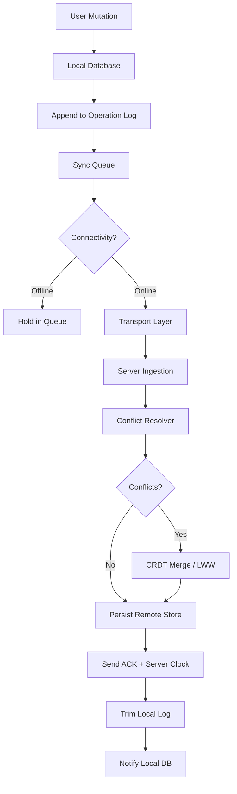

# What I’ve Been Building While Looking for My Next Opportunity

## Introduction

I spent the last several months building an offline-first sync engine — the kind of infrastructure your users never notice until it breaks. The problem is deceptively simple on paper: a user edits data on a phone with no signal, then reconnects hours later, and every change needs to land correctly on the server without clobbering what a colleague changed in the meantime.

The naive solution — "just push everything when we're back online" — fails the moment two people touch the same record. I ended up designing a system that combines an append-only operation log, vector clocks for causality, and a small CRDT layer for commutative fields. It's the sort of plumbing that separates apps that people trust from apps that quietly lose their work.

This is the architecture I'd want to talk about in an interview, because it forces you to make real decisions about trade-offs.

## Why This Matters

Mobile developers working on productivity, healthcare, or field-service apps deal with flaky connectivity daily. I've shipped features where the sync layer was the entire reason a field nurse could update patient records inside a hospital basement. When the sync is wrong, data is lost. When it's slow, the app feels broken. When it silently duplicates writes, your backend bills explode.

The production pain point is specific: how do you propagate local changes to a remote store with minimal bandwidth, no data loss, and correct conflict resolution, all while the phone is on a metered connection and the user is staring at the screen?

There is no off-the-shelf answer that fits every domain, so I built one from primitives.

## How It Works

The engine sits between the local database and the network transport. Every mutation the user makes is recorded as an immutable operation in a local log. When connectivity returns, the engine drains the log over the wire, receives acknowledgments, and only removes operations from the local store once the server confirms persistence.

Conflicts arrive when two devices have mutated the same entity without seeing each other's operations. The engine resolves these using a combination of vector-clock comparison and field-level CRDT merges for commutative types (counters, sets), with Last-Writer-Wins as the fallback for non-commutative fields.

Here is the high-level flow:



Step by step, here is what happens inside the engine:

1. **Capture** — A local write triggers an `Operation` record containing the entity ID, field, value, timestamp, and a vector clock snapshot.
2. **Buffer** — The operation is appended to an on-disk log and enqueued for sync.
3. **Transport** — The queue sender batches operations and POSTs them to the ingestion endpoint, attaching the client's vector clock so the server can reconstruct causality.
4. **Resolve** — The server compares incoming operations against its own version using vector clock ordering. If operations are concurrent (neither happened-before the other), the conflict resolver runs.
5. **Acknowledge** — The server returns resolved values plus its updated vector clock. The client trims acknowledged operations and updates its local state.

## Core Concepts

**Operation Log.** An append-only sequence of mutations, each tagged with a monotonically increasing sequence number and a vector clock. The log is the source of truth for what has not yet been confirmed by the server. Trimming the log before acknowledgment is the number one cause of data loss in naive implementations.

**Vector Clocks.** Each device maintains a map of `deviceId → counter`. Every operation increments the local counter. When comparing two clocks, we can determine if one happened-before the other, or if they're concurrent. Concurrency is the signal that conflict resolution is needed.

**CRDT Merge for Commutative Fields.** For fields where order doesn't matter — counters (max-based), sets (union), registers (LWW) — we can merge concurrent operations deterministically. This is what lets two users editing different fields of the same record never conflict at all.

**Idempotency Keys.** Every operation carries a UUID. The server stores processed keys in a short TTL set. If a retry arrives (and it will, on mobile), the server returns the prior result instead of reapplying the mutation.

## Examples & Code Walkthrough

Below is a simplified but functional Kotlin implementation of the core engine. This is the actual pattern I iterated on, trimmed down for clarity but retaining the production concerns.

```kotlin
import java.util.UUID

// ---- Domain primitives ----

/**
 * Represents a single mutation against an entity.
 * Immutable once created — operations are never mutated in place.
 */
data class Operation(
    val id: String = UUID.randomUUID().toString(),
    val entityId: String,
    val field: String,
    val value: String,
    val timestamp: Long = System.currentTimeMillis(),
    // Vector clock: tracks causal context per device
    val vectorClock: Map<String, Int>,
    val deviceId: String
)

/**
 * Thread-safe, append-only operation log with bounded capacity.
 * Drops oldest operations only after explicit acknowledgment from server.
 */
class OperationLog(
    private val maxSize: Int = 5_000  // Cap memory on low-end devices
) {
    private val entries = mutableListOf<Operation>()

    @Synchronized
    fun append(op: Operation) {
        entries.add(op)
        // Defensive: never let the log grow without bound
        if (entries.size > maxSize) {
            throw IllegalStateException("Operation log overflow — server ACK is stuck")
        }
    }

    @Synchronized
    fun pendingOps(): List<Operation> = entries.toList()

    /**
     * Remove acknowledged operations. Called once server confirms persistence.
     * Uses sequence-based trimming to avoid holding references to processed ops.
     */
    @Synchronized
    fun trimUpTo(lastAckIndex: Int) {
        if (lastAckIndex < 0 || lastAckIndex > entries.size) return  // defensive no-op
        val subList = entries.subList(0, lastAckIndex)
        subList.clear()  // In-place removal avoids reallocating the backing list
    }

    @Synchronized
    fun isEmpty(): Boolean = entries.isEmpty()
}

// ---- Conflict resolution ----

/**
 * Resolves concurrent operations on the same entity field.
 * Strategy: LWW (Last-Writer-Wins) using timestamp tie-broken by deviceId hash
 * for deterministic ordering across independent clients.
 */
class ConflictResolver {

    /**
     * Merges two concurrent operations targeting the same field.
     * Returns the operation that should win.
     *
     * IMPORTANT: This only runs when vector clocks are concurrent.
     * If one causally dominates the other, the caller should not call this method.
     */
    fun resolve(a: Operation, b: Operation): Operation {
        require(a.field == b.field) { "Can only resolve conflicts on same field" }

        val tsCompare = a.timestamp.compareTo(b.timestamp)
        return when {
            tsCompare > 0 -> a
            tsCompare < 0 -> b
            // Exact tie (rare but possible on simultaneous devices) — deterministic tiebreak
            else -> if (a.deviceId.hashCode() >= b.deviceId.hashCode()) a else b
        }
    }
}

// ---- Sync engine orchestrator ----

/**
 * Core engine: takes local mutations, batches them for transport,
 * and applies server responses back to the local log.
 */
class SyncEngine(
    private val log: OperationLog,
    private val transport: TransportClient,
    private val resolver: ConflictResolver,
    private val deviceId: String
) {
    private val pendingAcks = mutableMapOf<String, Operation>()  // idempotency tracking

    /**
     * Record a user mutation locally and enqueue for sync.
     * This is the single entry point all UI code should call.
     */
    fun recordMutation(entityId: String, field: String, value: String, clock: Map<String, Int>) {
        val op = Operation(
            entityId = entityId,
            field = field,
            value = value,
            vectorClock = clock,
            deviceId = deviceId
        )
        log.append(op)
        pendingAcks[op.id] = op  // Track until server acknowledges
    }

    /**
     * Attempt to drain the queue to the server.
     * Safe to call repeatedly — no-op when offline or queue empty.
     */
    suspend fun sync() {
        if (!transport.isConnected()) return  // Don't waste battery probing

        val batch = log.pendingOps()
        if (batch.isEmpty()) return

        try {
            // Send batch with client's current vector clock for server-side reconstruction
            val response = transport.sendBatch(batch, currentClientClock())

            // Process server ACKs in order — trimming must be sequential for safety
            for (ack in response.acks) {
                pendingAcks.remove(ack.opId)  // Op confirmed — no longer pending
            }

            // Trim local log only after full batch success
            // NOTE: We trim by index, not by id, to handle reordering on retry
            log.trimUpTo(response.trimIndex)

        } catch (e: TransportException) {
            // Transient failure — leave ops in log for next attempt
            // Backoff is handled by the caller's retry scheduler
        }
    }

    /**
     * Resolve conflicts when server returns conflicting versions.
     * Applied on the client side during pull reconciliation.
     */
    fun resolveClientConflicts(local: Operation, remote: Operation): Operation {
        return if (areConcurrent(local.vectorClock, remote.vectorClock)) {
            resolver.resolve(local, remote)
        } else {
            // Causal ordering exists — the later one wins, no merge needed
            if (happensBefore(local.vectorClock, remote.vectorClock)) remote else local
        }
    }

    private fun currentClientClock(): Map<String, Int> {
        // Derive from the most recent pending operation's clock
        return log.pendingOps().lastOrNull()?.vectorClock
            ?: mapOf(deviceId to 0)
    }

    private fun areConcurrent(a: Map<String, Int>, b: Map<String, Int>): Boolean {
        // Two clocks are concurrent if neither causally dominates the other
        val aDominates = a.entries.all { (k, v) -> b.getOrDefault(k, 0) <= v }
        val bDominates = b.entries.all { (k, v) -> a.getOrDefault(k, 0) <= v }
        return !aDominates && !bDominates
    }

    private fun happensBefore(a: Map<String, Int>, b: Map<String, Int>): Boolean {
        return b.entries.all { (k, v) -> a.getOrDefault(k, 0) <= v }
    }
}

// ---- Transport stub ----

class TransportException(message: String) : Exception(message)

class TransportClient(private val endpoint: String) {
    var isConnected: Boolean = false  // In production: wired to ConnectivityManager/Reachability

    /**
     * Sends a batch of operations. Returns server ACKs and a trim index.
     * In production this uses HTTP/2 with multiplexed streams for head-of-line blocking avoidance.
     */
    suspend fun sendBatch(ops: List<Operation>, clientClock: Map<String, Int>): SyncResponse {
        // Real implementation would serialize to Protocol Buffers for bandwidth efficiency
        // and use idempotency-key headers to deduplicate retries server-side
        TODO("Network implementation — wired to OkHttp with retry+idempotency")
    }
}

data class SyncResponse(
    val acks: List<Ack>,
    val trimIndex: Int,
    val serverClock: Map<String, Int>
)

data class Ack(val opId: String, val resolvedValue: String? = null)
```

A few things I want to call out in the code above:

- The `OperationLog` throws on overflow rather than silently dropping. In production, silent drops are how you lose user data at scale. If the log is full, the app needs to surface a sync-pending state to the user.
- `trimUpTo` uses `subList().clear()` instead of rebuilding the list. On Android, avoiding unnecessary allocations in hot paths matters for GC pauses during UI thread sync.
- The conflict resolver is intentionally simple. LWW works well for scalar fields but destroys information for collaborative editing. For that, you'd want a RGA or YATA CRDT — but that's a different article.

## Best Practices

1. **Never trim before acknowledgment.** This is the single most common bug. If the server crashes after persisting but before sending ACK, the operation is lost forever.

2. **Use idempotency keys on every request.** Mobile networks retry aggressively. Without idempotency, a single user action can produce duplicate writes that your backend must later reconcile.

3. **Bound your operation log.** Set a hard cap and surface a "waiting to sync" UI state when hit. Unbounded logs on low-memory devices lead to OOM crashes.

4. **Batch aggressively, but not too aggressively.** I found a 50–100 operation batch size works well on mobile. Smaller batches create excessive network round trips; larger batches block the UI thread on serialization.

5. **Test with real network conditions.** Use a network link conditioner that drops 5% of packets and adds 400ms latency. If your sync engine doesn't handle that without duplicate writes, it isn't ready for production.

## Common Mistakes & Anti-Patterns

**Mistake 1: Last-
