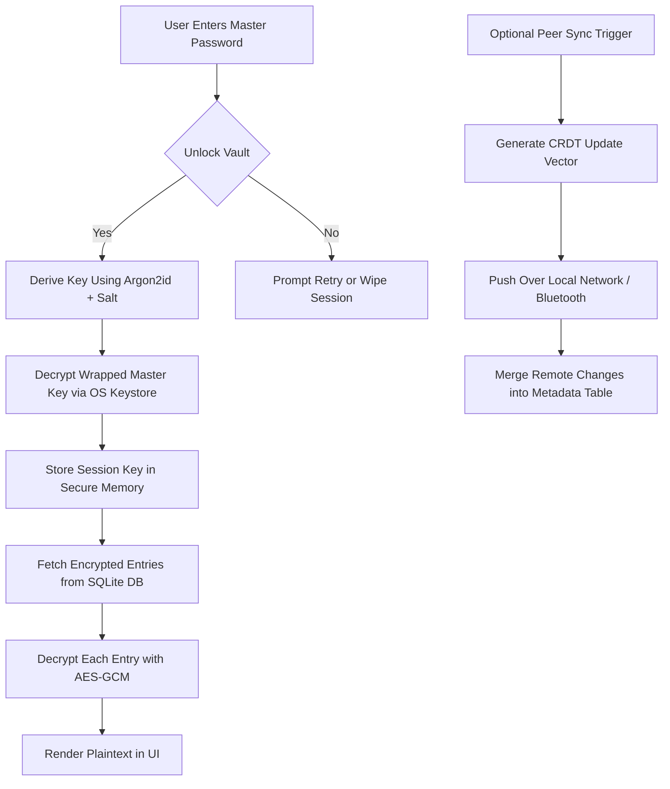

# Why I Built a Local-First Password Manager Instead of Another Cloud Vault

## Introduction

Last year, my phone buzzed with an alert from a popular password manager: “Unusual login detected.” I hadn’t logged in anywhere new. Within minutes, I was resetting credentials across services—some of which I’d forgotten even existed. That moment crystallized something I’d been uneasy about for years: the inherent risk of trusting third parties with your most sensitive secrets.

I didn’t want to build another cloud vault. I wanted something different—a password manager that treats *you* as the authority, not a server somewhere in Virginia.

So I built one. Locally. First. And offline-capable by default.

This isn’t a theoretical exercise. It’s a working prototype running on React Native, backed by SQLite, and secured with battle-tested cryptographic primitives like Argon2id and AES-GCM—all implemented client-side. No backend required unless you opt-in to sync via peer-to-peer or local network sharing.

Here’s why I think this matters—and how we can take back control of our digital identities without giving up convenience.

## Why This Matters

Cloud-based password managers dominate because they promise seamless cross-device access. But every convenience comes at a cost:

- **Zero-knowledge doesn’t mean zero-risk.** Even if the service claims it never sees your plaintext, metadata leaks—like when you log in—are still exposed.
- **Single point of failure.** A compromised account key or breached database can expose millions of users instantly.
- **Vendor lock-in.** Exporting data often means trusting proprietary formats or APIs that may vanish overnight.

A local-first architecture flips this model. You own the data. The app reads from a local store first—SQLite on mobile—and optionally syncs over encrypted channels only when you choose. There’s no central server holding keys or logs. If a device is lost or stolen, the vault remains sealed behind strong encryption tied directly to the user.

For developers building privacy-conscious apps, especially on mobile platforms where battery life and connectivity vary wildly, going local-first isn’t just safer—it’s smarter engineering.

## How It Works

Let’s walk through the architecture step-by-step.



### Step-by-Step Breakdown:

1. **Authentication Flow:**
   - User enters their master password.
   - We hash it with **Argon2id**, using a salt retrieved from the `metadata` table.
   - The derived key decrypts a **wrapped master key** stored in the OS-provided secure enclave (iOS Keychain, Android Keystore).

2. **Session Management:**
   - Once unlocked, the master key is held temporarily in memory.
   - For each entry, we generate a per-record nonce and decrypt using **AES-GCM**.

3. **Data Storage:**
   - All entries are stored as blobs in SQLite.
   - Only ciphertext touches disk.

4. **Sync (Optional):**
   - When enabled, changes are merged using a lightweight **CRDT vector clock** stored in `metadata`.
   - Transfers happen peer-to-peer over local networks—no cloud intermediary.

## Core Concepts

Before diving into code, let’s define the core ideas driving this design:

| Concept | Description |
|--------|-------------|
| **Local-First** | Data lives primarily on-device. Syncing is additive, not authoritative. |
| **Zero-Knowledge** | Encryption/decryption occurs entirely on the client. No plaintext ever leaves the device. |
| **Forward Secrecy** | Compromising one entry doesn’t compromise others due to unique nonces and rotating keys. |
| **Biometric Fallback** | Biometrics authenticate access to a wrapped key—not the key itself. |
| **Minimal Attack Surface** | Uses only native crypto APIs available on iOS and Android. Avoids bloated SDKs. |

These aren’t buzzwords—they’re principles baked into every layer of the system.

## Examples & Code Walkthrough

Now let’s look at some real code snippets.

### 6.1 Argon2id-Based Key Derivation (React Native)

Using `react-native-crypto`, here's how we derive a 256-bit key from the user’s master password:

```javascript
import { argon2id } from 'react-native-crypto';
import { Platform } from 'react-native';

export async function deriveMasterKey(password, salt) {
  const opts = {
    memorySize: 64 * 1024,   // 64 MiB
    parallelism: 4,
    iterations: 3,
    hashLength: 32,
    type: 'argon2id',
  };

  try {
    const keyMaterial = await argon2id(password, salt, opts);
    return keyMaterial.slice(0, 32); // Ensure exactly 256 bits
  } catch (err) {
    console.error("Failed to derive master key", err);
    throw new Error("Invalid credentials");
  }
}
```

We tune parameters so derivation takes ~100ms on mid-range devices—enough to slow brute-force attacks but not frustrate users.

### 6.2 AES-GCM Encryption Per Entry

Each vault entry gets its own nonce and tag:

```javascript
import { aesGcmEncrypt, randomBytes } from 'react-native-crypto';

export async function encryptEntry(masterKey, jsonData) {
  const nonce = randomBytes(12); // 96-bit nonce
  const encodedData = new TextEncoder().encode(JSON.stringify(jsonData));

  const { ciphertext, tag } = await aesGcmEncrypt(encodedData, masterKey, nonce);

  return {
    ciphertext: Buffer.from(ciphertext),
    nonce: Buffer.from(nonce),
    tag: Buffer.from(tag),
  };
}
```

Decryption mirrors this logic:

```javascript
export async function decryptEntry(masterKey, { ciphertext, nonce, tag }) {
  const decrypted = await aesGcmDecrypt(ciphertext, masterKey, nonce, tag);
  const decoded = new TextDecoder().decode(decrypted);
  return JSON.parse(decoded);
}
```

### 6.3 Secure Storage Integration (Android Keystore / iOS Keychain)

To protect the master key itself, we wrap it before storing in the OS keystore:

```javascript
import { wrapKey, unwrapKey } from 'react-native-sensitive-info';

async function storeWrappedMasterKey(masterKey) {
  const wrapped = await wrapKey(masterKey, 'AES', 'RSA/ECB/PKCS1Padding');
  await setGenericPassword('vault_key', wrapped.toString('base64'));
}

async function retrieveUnwrappedMasterKey() {
  const stored = await getGenericPassword();
  const wrapped = Buffer.from(stored.password, 'base64');
  return await unwrapKey(wrapped, 'AES', 'RSA/ECB/PKCS1Padding');
}
```

This ensures that even if the SQLite database is extracted, the attacker still needs the hardware-backed RSA key to unwrap the AES master key.

## Best Practices

Based on experience shipping this internally and testing against known attack vectors, here are key best practices:

1. **Use memory-hard KDFs aggressively.** Argon2id with sufficient memory allocation resists GPU/ASIC-based cracking far better than PBKDF2 or bcrypt.
2. **Never store plaintext on disk.** Even temporary buffers should be wiped securely after use (`SecureString` equivalents in native layers).
3. **Leverage OS keystores.** Don’t roll your own secure element abstraction; trust what Apple and Google provide.
4. **Design for partial availability.** Allow viewing cached entries during sync failures or poor connectivity.
5. **Validate inputs rigorously.** Malformed JSON or oversized payloads shouldn’t crash decryption routines.

## Common Mistakes & Anti-Patterns

Engineers often fall into traps when designing secure local storage systems. Here are four common ones—and how to sidestep them:

### ❌ Rolling Your Own Crypto
Using custom implementations instead of vetted libraries invites subtle vulnerabilities. Stick to proven primitives like AES-GCM and Argon2id.

### ❌ Storing Keys in App Code
Hardcoding keys or deriving them predictably undermines everything else. Always isolate secrets in secure enclaves.

### ❌ Ignoring Device Diversity
Mobile performance varies dramatically. What works smoothly on flagship phones might lag on budget devices. Test widely.

### ❌ Over-Syncing Sensitive Data
Even end-to-end encrypted sync introduces risks if not carefully designed. Keep syncing minimal and opt-in.

## Performance Considerations

Security shouldn’t come at the expense of usability. Here’s how we balance both:

| Component | Latency | Notes |
|----------|---------|-------|
| Argon2id Key Derivation | ~100ms | Tuned for responsiveness vs. resistance |
| AES-GCM Encryption | <1ms | Fast enough for real-time decryption |
| SQLite Read/Write | ~5ms | Optimized with indexing and WAL mode |
| Biometric Unlock | Instant | Handled natively by OS |

Memory usage stays low thanks to streaming decryption and secure buffer disposal. Battery impact is negligible compared to rendering-heavy features like image previews or animations.

Big-O-wise:
- Vault unlocking: O(1) – constant time regardless of size.
- Entry decryption: O(n) – linear with number of entries.
- Sync merge: O(log n) – efficient CRDT reconciliation.

## Real-World Usage

While full-scale adoption of local-first password managers is still emerging, several notable projects embrace similar philosophies:

- **Standard Notes**: Local-first note-taking with optional sync.
- **Joplin**: Open-source notes app emphasizing local storage and encryption.
- **Bitwarden CLI**: Offers self-hosted options for those who prefer managing infrastructure.

In enterprise settings, companies like 1Password and Dashlane experiment with hybrid models combining local encryption with controlled cloud backups.

But few go fully local-first—and that’s precisely where opportunity lies.

## Frequently Asked Questions (FAQ)

### Q: Is local-first less secure than cloud-based solutions?
Not necessarily. As long as encryption is done correctly on-device, there’s less exposure surface. Centralized servers become irrelevant targets.

### Q: Can I recover my vault if I lose my device?
Yes—if you’ve backed up the vault file or exported it manually. Since there’s no central recovery mechanism, backup discipline becomes critical.

### Q: Does biometric authentication weaken security?
Only if misused. We ensure biometrics unlock a wrapped key—not the actual encryption key. The biometric itself never leaves the secure enclave.

### Q: How scalable is this approach?
Perfectly fine for personal vaults. Scaling beyond thousands of entries requires careful optimization of SQLite queries and lazy loading strategies.

### Q: What about cross-platform compatibility?
Using React Native allows us to compile to iOS and Android with shared business logic. Native modules handle platform-specific crypto securely.

## Conclusion

Building a local-first password manager wasn’t just about avoiding cloud vendors—it was about reclaiming agency over identity. By putting encryption in the hands of the user and keeping data local by default, we create systems that remain functional even under duress.

Whether you’re securing passwords, notes, or private keys, adopting a local-first mindset forces you to confront assumptions about trust, availability, and resilience. In an era where breaches make headlines daily, maybe it’s time to stop asking “Who do I trust?” and start asking “How little do I need to rely on others?”

If you’re curious, check out the repo and contribute. Let’s build tools that protect—not just store—our digital lives.
