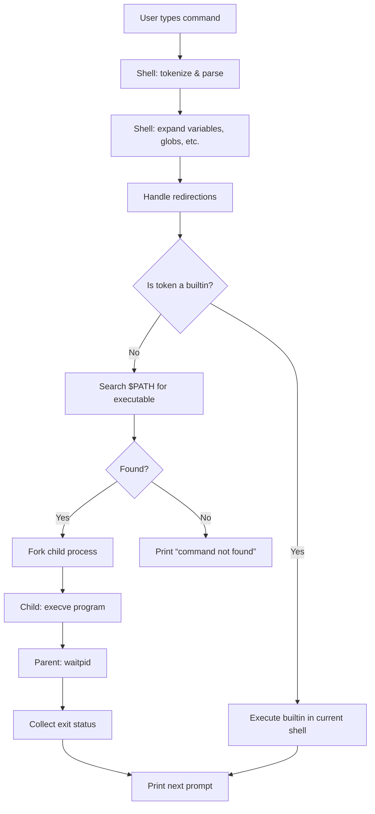

# 2. Linux Commands - Beginner

## Introduction
When you first log into a Linux server, the shell is your primary interface to the system. Knowing how to navigate, inspect, and manipulate files and processes lets you diagnose issues, automate routine tasks, and build reliable tooling without reaching for a full‑blown programming language. This guide walks through the core concepts that underpin everyday command‑line work, with a focus on what actually happens when you type a command and press Enter.

## Why This Matters
In production environments, engineers spend a surprising amount of time at the terminal: checking logs, verifying service health, deploying hot‑fixes, or gathering forensic data after an incident. A solid grasp of basic commands reduces the mean time to recovery, prevents accidental data loss, and enables you to write portable scripts that run on any *nix host—from a bare‑metal box to a container image. Misunderstanding how the shell works, on the other hand, leads to fragile automation, security oversights, and confusing debugging sessions.

## How It Works
When you enter a line at the prompt, the shell performs a sequence of steps before any program runs:

1. **Parsing** – The input is split into tokens (words, operators, redirections). Quotes and escapes are interpreted here.
2. **Expansion** – Variable substitution, command substitution, arithmetic expansion, pathname expansion (globbing), and tilde expansion occur.
3. **Redirection handling** – File descriptors for stdin, stdout, and stderr are set up according to `<`, `>`, `>>`, `2>&1`, etc.
4. **Builtin check** – If the first token matches a shell builtin (e.g., `cd`, `exit`, `test`), it is executed directly in the current process.
5. **External command lookup** – If not a builtin, the shell searches the directories listed in `$PATH` for an executable file with that name.
6. **Fork‑exec** – The shell forks a child process; the child attempts to `execve` the located program with the prepared argument vector and environment.
7. **Wait** – The parent shell waits for the child to terminate, captures its exit status, and then prints the next prompt.

The following diagram visualizes this flow.



## Core Concepts
Understanding a few foundational ideas makes the command line far less mysterious.

- **Standard streams** – Every process starts with three file descriptors: `0` (stdin), `1` (stdout), `2` (stderr). Redirection operators let you rewire these to files, pipes, or `/dev/null`.
- **Pipes** – The `|` operator connects the stdout of the left command to the stdin of the right command, creating a unidirectional data flow without intermediate files.
- **Exit status** – A command returns an 8‑bit integer; `0` signals success, any non‑zero value indicates failure. The shell makes this available via `$?`.
- **Quoting** – Single quotes (`'…'`) prevent all expansion; double quotes (`"…"`) allow variable and command substitution but suppress globbing and word splitting; backslashes escape the next character.
- **Environment** – Variables exported with `export` become part of the environment inherited by child processes. Modifying them in a script does not affect the parent unless the script is sourced.
- **Job control** – Commands can be run in the background (`&`), paused (`Ctrl+Z`), and resumed (`fg`, `bg`). The shell tracks each job with a numeric identifier.

## Examples & Code Walkthrough
Below is a practical Bash script that rotates application logs, compresses old ones, and emails a summary if any errors are found. It demonstrates defensive programming, proper quoting, and use of builtins versus external tools.

```bash
#!/usr/bin/env bash
# logrotate.sh – Rotate logs for a simple web app
# -------------------------------------------------
# Safety settings: exit on error, unset variable, and pipe failures.
set -euo pipefail

# ---- Configuration -------------------------------------------------
LOG_DIR="/var/www/myapp/logs"
ARCHIVE_DIR="/var/www/myapp/logs/archive"
RETENTION_DAYS=14
MAIL_TO="ops@example.com"
# --------------------------------------------------------------------

# Ensure required directories exist; create them with safe permissions.
if [[ ! -d "$LOG_DIR" ]]; then
    echo "Error: log directory $LOG_DIR does not exist" >&2
    exit 1
fi
mkdir -p "$ARCHIVE_DIR"
chmod 750 "$ARCHIVE_DIR"

# Timestamp for archive naming.
TS=$(date +%Y%m%d%H%M%S)

# Rotate each *.log file.
shopt -s nullglob   # make the loop skip if no matches
for logfile in "$LOG_DIR"/*.log; do
    # Skip if it's already an archive.
    [[ "$logfile" == *.gz ]] && continue

    # Move the current log to a timestamped file, then start a fresh log.
    mv "$logfile" "$LOG_DIR/${logfile##*/}.$TS"
    # Some apps need a signal to reopen logs; adjust as needed.
    # kill -HUP $(cat /var/run/myapp.pid) 2>/dev/null || true

    # Compress the rotated log in the archive directory.
    gzip -c "$LOG_DIR/${logfile##*/}.$TS" > "$ARCHIVE_DIR/${logfile##*/}.$TS.gz"
    rm -f "$LOG_DIR/${logfile##*/}.$TS"
done
shopt -u nullglob

# Delete archives older than $RETENTION_DAYS.
find "$ARCHIVE_DIR" -type f -name '*.gz' -mtime +"$RETENTION_DAYS" -print0 |
    while IFS= read -r -d '' oldfile; do
        rm -f "$oldfile"
        echo "Removed old archive: $oldfile"
    done

# Scan for error lines in the last hour of logs (if any).
ERROR_COUNT=$(grep -i error "$LOG_DIR"/*.log 2>/dev/null | wc -l || true)
if (( ERROR_COUNT > 0 )); then
    {
        echo "Log rotation completed at $(date)"
        echo "Found $ERROR_COUNT error lines in recent logs."
        echo "--- Sample errors ---"
        grep -i error "$LOG_DIR"/*.log 2>/dev/null | head -5
    } | mail -s "[ALERT] Logrotate detected errors" "$MAIL_TO"
fi

exit 0
```

**Line‑by‑line commentary**

- `set -euo pipefail` – Guarantees the script stops on the first error, treats unset variables as fatal, and makes pipelines fail if any component fails.
- `shopt -s nullglob` – Prevents the `for` loop from executing once with the literal pattern when no files match.
- `${logfile##*/}` – Parameter expansion that strips the directory path, leaving just the filename.
- `gzip -c … > …` – Streams compression to avoid needing extra disk space for an uncompressed intermediate.
- `find … -print0` + `while IFS= read -r -d ''` – Safely handles filenames containing spaces or newlines.
- `grep -i error … || true` – Ensures the variable assignment succeeds even when no matches are found (grep returns non‑zero).
- The `mail` call is wrapped in a group `{ … }` to combine stdout and stderr into a single message body.

## Best Practices
- **Always quote variable expansions** (`"$var"`). Unquoted strings undergo word splitting and globbing, which can turn a harmless filename into a dangerous command.
- **Prefer shell builtins** (`[[`, `((`, `printf`, `read`) over external equivalents (`[`, `test`, `echo`) when possible; they avoid unnecessary `fork‑exec` cycles.
- **Use `set -euo pipefail`** in any script that runs unattended. It catches subtle bugs early.
- **Avoid parsing `ls`** for filenames; rely on globbing or `find` with `-print0` instead.
- **Keep environment modifications local** unless you explicitly `export` them; otherwise changes disappear when the script ends.
- **Document assumptions** (e.g., required commands, expected directory layout) at the top of the file.
- **Test with `shellcheck`** before deploying; it catches many portability and style issues.

## Common Mistakes & Anti-Patterns
| Mistake | Why it’s problematic | Fix |
|---------|----------------------|-----|
| `if [ $VAR = "value" ]` without quotes | If `$VAR` is empty or contains spaces, the test breaks or suffers from word splitting. | Use `if [[ "$VAR" = "value" ]]` or `if [ "$VAR" = "value" ]`. |
| `for f in $(ls *.txt); do …` | `ls` output may be altered by aliases, and filenames with newlines or spaces break the loop. | Use `for f in *.txt; do …` (with `nullglob`) or `find … -print0 | while …`. |
| Ignoring exit status of a pipeline (`cmd1 \| cmd2`) | Only the last command’s status is visible; earlier failures go unnoticed. | Enable `pipefail` (`set -o pipefail`) or check each command individually (`cmd1 && cmd2`). |
| Running `sudo` inside a script for trivial tasks | Unnecessarily elevates privilege and widens the attack surface. | Restrict sudo to the specific commands that need it, or redesign to avoid root. |
| Assuming `$PATH` is identical across environments | A script may fail on a minimal container where expected utilities are missing. | Declare required commands at the start (`command -v foo >/dev/null || { echo "foo missing"; exit 1; }`). |

## Performance Considerations
- **Builtins vs. externals** – A builtin like `printf` runs in the current shell process, avoiding the ~0.5‑1 ms overhead of a fork‑exec. In tight loops (e.g., processing thousands of lines), this difference adds up.
- **Pipe bandwidth** – Each pipe incurs a small kernel buffer copy; for large data streams, consider using temporary files or utilities that support direct file I/O (e.g., `sort -o out.txt in.txt`).
- **Globbing** – Expanding `*` in a directory with hundreds of thousands of entries can be costly because the kernel must scan the directory and allocate memory for the list. Limit scope with more specific patterns (`log*.txt`) or use `find`.
- **Subshells** – Constructs like `(cd dir && cmd)` create a subshell (fork). If you only need to change the directory temporarily, use `pushd`/`popd` or `cd …; cmd; cd -`.
- **External sort vs. `sort -m`** – Merging already‑sorted files with `sort -m` is linear, whereas re‑sorting concatenated data is O(n log n). Choose the algorithm that matches your data’s ordering properties.

## Real-World Usage
- **Netflix** – Their instance initialization scripts (used in AMI builds) rely heavily on Bash for installing packages, configuring tuned profiles, and verifying health checks before handing control to the Java application. They enforce `set -euo pipefail` and run all scripts through `shellcheck` in CI.
- **Cloudflare** – Network diagnostics tools like `cf-trace` are thin wrappers around `dig`, `curl`, and `tcpdump`. The wrappers handle argument validation, output formatting, and automatic retries, keeping the core logic in Bash to stay portable across their Linux‑based edge nodes.
- **Shopify** – Log rotation for their Ruby on Rails fleets is performed by a centralized Bash agent that runs via cron on each host. The agent uses `flock` to prevent overlapping runs, talks to an internal metrics endpoint via `curl`, and compresses old logs with `pigz` (parallel gzip) to reduce CPU impact on busy hosts.

## Frequently Asked Questions (FAQ)
**Q: When should I use `source` (or `.`) versus executing a script?**  
A: `source file.sh` runs the commands in the current shell, so any variable changes, function definitions, or `cd` commands persist after it finishes. Executing `./file.sh` spawns a subshell; modifications disappear when the script ends. Use sourcing for environment setup (e.g., `. ./venv/bin/activate`) and execution for independent tasks.

**Q: What’s the difference between `[` and `[[` in Bash?**  
A: `[` is the POSIX test command (an external builtin in Bash) and follows word splitting and pathname expansion rules. `[[` is a Bash keyword that suppresses those expansions, allows pattern matching (`==`), and provides safer handling of empty variables. Prefer `[[` for new Bash‑only scripts.

**Q: How can I debug a script that fails intermittently?**  
A: Add `set -x` at the top or wrap suspicious sections in `set -x; …; set +x` to see each command as it’s executed. Combine with `set -euo pipefail` to catch hidden failures. Logging timestamps (`date +%s`) helps correlate with external events.

**Q: Is it safe to use `tmpfile=$(mktemp)` in a script that might run concurrently?**  
A: Yes, `mktemp` creates a unique filename with a random suffix, making collisions extremely unlikely
