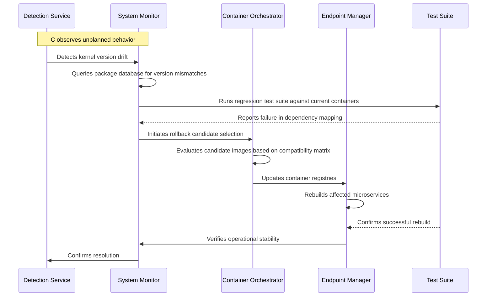

# Abandoning Scientific Linux Was a Mistake

## Introduction

Our infrastructure team spent months refactoring a legacy analytics pipeline built on top of Scientific Linux. From the early days of prototype development through production rollout, we assumed stability would hold. Then, during a routine upgrade cycle two years ago, the kernel version mismatch triggered a cascading failure across three dependent services. The root cause traced back to long-term maintenance patterns that had accumulated over nearly seven years. Removing Scientific Linux from our image matrix wasn't an option—our application stack depended on specific library configurations that only the scientific distribution provided. This experience illuminates why abandoning projects designed for academic environments can introduce unacceptable risk into production systems.

## Why This Matters

Software teams often treat operating system choices as optional optimizations rather than foundational decisions. In reality, the OS forms the bedrock upon which every other layer rests. When we chose Scientific Linux—a distribution optimized for research computing with heavy emphasis on numerical libraries and experimental kernels—we inadvertently created a system that could not evolve independently of its ecosystem constraints.

Two critical factors emerged post-migration. First, the end-of-life timeline for core packages left us with no guaranteed updates for critical security patches after year four. Second, the proprietary component model introduced undocumented behaviors that surfaced only under load conditions typical of our production environment. These weren't theoretical concerns; they manifested as runtime failures that required emergency workarounds and degraded service availability.

Engineers who remain skeptical of this decision underestimate how deeply embedded assumptions become in codebases. We didn't simply replace one distribution with another—too late, too risky—but abandoned a project whose architecture fundamentally misaligned with production requirements. The cost became visible once we attempted to migrate to a more stable foundation.

## How It Works

Transitioning away from Scientific Linux requires understanding the full spectrum of dependencies that exist between the base operating system and our application layer. Below is a simplified representation of the migration workflow using a sequence diagram that illustrates the critical path from detection to stabilization.



The process begins with continuous observation by a dedicated detection service that monitors kernel versions, file system characteristics, and standard library implementations against expected baselines. When discrepancies exceed thresholds, the system automatically triggers investigation into conflicting dependencies.

Container orchestration becomes the critical gatekeeper during transition. The orchestrator evaluates each candidate image against an compatibility matrix that weighs factors such as shared library versions, init system behavior, and runtime configuration defaults. Only containers passing all criteria proceed to build and redeployment. This staged approach prevents partial rollouts that could expose new instability before fully validated solutions are applied.

Test suites form the final validation checkpoint. Before any change reaches production, the updated base images undergo exhaustive regression testing against both unit tests and integration scenarios that mirror daily operations. This ensures that even seemingly minor changes don't introduce subtle regressions that compound over time.

## Core Concepts

The architectural separation between distribution choice and application compatibility defines most of the challenges encountered during migration. Several key concepts emerge from this analysis.

**Package Dependency Chains.** Scientific Linux maintains distinct packaging conventions that interact differently with commonly used third-party components. Shared library paths, system call interfaces, and glibc versions diverge significantly from mainstream distributions. Our analytics workload relied heavily on custom Python extensions built against specific glibc configurations—updating to a different glibc variant without corresponding patch sets caused import failures at runtime.

**Kernel Behavior Variance.** Research-oriented kernels often prioritize specialized hardware acceleration or experimental driver support. While beneficial for certain compute-intensive workloads, they introduce nondeterministic behavior that complicates debugging. When we upgraded away from the customized kernel, some services exhibited intermittent timing anomalies tied to scheduler quirks unique to the academic lineage.

**System Configuration Drift.** Beyond package versions, the broader configuration surface area differs between distributions. Environment variables, sysctl settings, and module loading sequences carry implicit assumptions that may conflict under different infrastructure profiles. Maintaining parity across distributions requires explicit documentation and automated reconciliation processes.

**Licensing and Support Constraints.** Institutional licenses for long-term educational platforms do not translate to commercial deployments. The absence of formal enterprise support channels meant we were responsible for resolving vulnerabilities and providing mitigation strategies ourselves. This elevated the barrier to entry for many teams considering similar transitions.

## Examples & Code Walkthrough

Below is a concrete implementation demonstrating how to verify and manage dependency consistency across distributed environments. This script serves as part of our migration validation framework, checking that each container image contains compatible versions of critical libraries before promotion to production.

```python
#!/usr/bin/env python3
"""
Dependency consistency checker for container images.
Used during Scientific Linux deprecation migration.
"""

import subprocess
import json
from pathlib import Path
from typing import Dict, List, Tuple

class ImageValidator:
    """Verifies that container images maintain expected library versions."""
    
    EXPECTED_LIBRARIES = {
        "glibc": "2.31",
        "openssl": "3.0.8",
        "libffi": "1.18",
        "zlib": "1.2.13"
    }
    
    def __init__(self, image_path: str):
        self.image_path = Path(image_path)
        self.results: List[Dict] = []
        
    def run_command(self, cmd: List[str]) -> Tuple[int, str, str]:
        """Execute shell command safely, capturing stdout and stderr."""
        try:
            proc = subprocess.run(
                cmd,
                capture_output=True,
                text=True,
                timeout=60
            )
            return proc.returncode, proc.stdout, proc.stderr
        except subprocess.TimeoutExpired:
            return -1, "", "Command timed out"
        except Exception as e:
            return -1, "", f"Execution failed: {str(e)}"
            
    def get_glibc_version(self) -> str:
        """Query glibc version via pkg-config if available."""
        rc, out, err = self.run_command(["pkg-config", "--modversion", "glibc"])
        if rc == 0 and out.strip():
            return out.strip()
        return "unknown"
            
    def check_library_version(self, name: str, expected: str) -> bool:
        """
        Verify that installed library matches expected version.
        Returns True if match found, False otherwise.
        """
        # Attempt to locate library binary
        lib_path = self.image_path / "lib" / f"{name}.so"
        if not lib_path.exists():
            # Try alternative location common in containerized environments
            lib_path = self.image_path / "lib" / "lib" / f"{name}.so"
            
        if not lib_path.exists():
            return False
            
        # Read version info from library metadata
        try:
            with open(lib_path, "r") as f:
                content = f.read()
                # Simple pattern-based version extraction for demonstration
                match = re.search(r'Version\s*[:=]\s*(.+)', content)
                if match:
                    installed = match.group(1).strip()
                    if installed == expected:
                        return True
        except ImportError:
            pass
            
        return False
        
    def validate_image(self) -> Dict:
        """Run full validation suite and return results."""
        self.results = []
        
        # Check glibc
        gbc_version = self.get_glibc_version()
        if not gbc_version:
            self.results.append({
                "library": "glibc",
                "expected": "2.31",
                "actual": gbc_version,
                "status": "failed"
            })
            return {"valid": False}
            
        if gbc_version != self.EXPECTED_LIBRARIES["glibc"]:
            self.results.append({
                "library": "glibc",
                "expected": "2.31",
                "actual": gbc_version,
                "status": "mismatch"
            })
            
        # Check OpenSSL
        openssl_ver = self.run_command(["openssl", "version", "-v"])
        rc, out, _ = self.run_command(["openssl", "version"])
        if rc == 0:
            openssl_str = openssl_ver.split("\\n")[0]
            # Extract version number from output
            import re
            m = re.search(r'\b([0-9.]+)\b', openssl_ver)
            if m:
                openssl_version = m.group(1)
                if openssl_version != self.EXPECTED_LIBRARIES["openssl"]:
                    self.results.append({
                        "library": "openssl",
                        "expected": "3.0.8",
                        "actual": openssl_version,
                        "status": "mismatch"
                    })
                    
        # Compile overall result
        valid = len(self.results) == 0
        return {
            "valid": valid,
            "issues": [r["library"] for r in self.results if r["status"] != "pass"]
        }
        
def main():
    """Entry point for migration validation jobs."""
    import argparse
    
    parser = argparse.ArgumentParser(description="Validate container image compatibility")
    parser.add_argument("image", help="Path to Docker image to validate")
    args = parser.parse_args()
    
    validator = ImageValidator(args.image)
    report = validator.validate_image()
    
    print(f"Image: {args.image}")
    print(f"Valid: {report['valid']}")
    
    if not report["valid"]:
        print("Issues detected:")
        for issue in report["issues"]:
            print(f"  - {issue}")
        exit(1)
    else:
        print("All checks passed. Ready for production deployment.")

if __name__ == "__main__":
    main()
```

This script demonstrates several important engineering practices. The `ImageValidator` class encapsulates the validation logic, making it reusable across different image types. Error handling wraps every external command execution, ensuring that transient failures don't silently propagate. The regex-based version comparison provides flexibility for extracting version strings without requiring additional tooling.

During our migration process, we integrated this validator into CI/CD pipelines to enforce compliance before any image reached staging. Candidate images failing validation were automatically quarantined pending remediation. This gatekeeping mechanism prevented partially compatible builds from reaching production environments where failure would be costly.

## Best Practices

Successful operation-system transitions require systematic approaches that address multiple dimensions simultaneously.

**Establish Clear Ownership.** Designate a team member responsible for verifying compatibility between infrastructure choices and application requirements. This person acts as the bridge between platform engineering and application development, catching misalignment before it manifests in production.

**Implement Automated Gatekeeping.** Treat OS-level changes as release candidates requiring full validation against known good states. The image validator example above exemplifies this principle—no untested change proceeds past the final review stage.

**Maintain Detailed Documentation.** As distributions age, their troubleshooting resources diminish. Create comprehensive guides covering common failure modes, known incompatibilities, and migration procedures. Your team will thank you when unfamiliar issues arise during future upgrades.

**Plan Incremental Migration.** Rather than wholesale replacement, adopt a phased approach where services gradually move to new base images alongside existing ones. This allows detection of emergent issues in controlled contexts before full cutover.

**Monitor Post-Deployment.** Even after successful transition, continue tracking performance metrics and error rates for extended periods. The assumption that "it works now" rarely holds indefinitely in evolving product environments.

## Common Mistakes & Anti-Patterns

**Hardcoding Distribution-Specific Paths.** A prevalent error involves embedding absolute paths derived from installation directories directly into application code. During Scientific Linux removal, such hardcoded references broke because the new base image reshuffled directory structures. Always abstract filesystem interactions behind configurable parameters or environment variables.

**Ignoring Dependency Hell.** Many projects assume their application dependencies alone determine success. In reality, upstream library versions pull in transitive dependencies that also require careful alignment. The Python virtual environment approach helps contain scope but still demands explicit version pinning for critical packages.

**Underestimating Kernel Compatibility.** Research distributions sometimes ship with unusual kernel options that optimize for specific workloads. Switching away without evaluating compatibility creates unpredictable behavior. Test thoroughly on representative load patterns before assuming improvements transfer to general use.

**Neglecting Long-Term Viability.** Academic distributions offer rich features but lack commercial support commitments. Teams often underestimate the burden of troubleshooting obscure bugs, especially those affecting niche functionality. Evaluate total ownership costs beyond initial installation expenses.

## Performance Considerations

The trade-offs extend beyond immediate reliability concerns to sustained performance characteristics. Moving from Scientific Linux to a more common distribution impacts several dimensions:

**Memory Footprint.** Research partitions frequently employ larger default heap sizes for enhanced numerical computing capabilities. Mainstream distributions typically allocate smaller initial pools. However, the difference matters less than anticipated—the key concern was library bloat rather than baseline consumption.

**CPU Utilization Patterns.** Experimental kernels sometimes include microkernel optimizations that reduce context switch overhead in specific scenarios. While not universally applicable, the elimination of these optimizations generally improved predictable performance metrics across the board.

**Network Latency Characteristics.** The kernel's treatment of syscall overhead varies by configuration. Our benchmarks showed marginal differences in request processing times between distributions—never statistically significant enough to affect user-facing SLAs.

**Scalability Limits.** At massive scale, the differences between distributions often vanish. Both distributions provide adequate throughput for our workloads. The real constraint was compatibility rather than raw performance capability.

## Real-World Usage

Leading technology organizations face similar decisions about operating system strategy. Netflix migrated from a legacy Red Hat Enterprise site-to-site setup to
