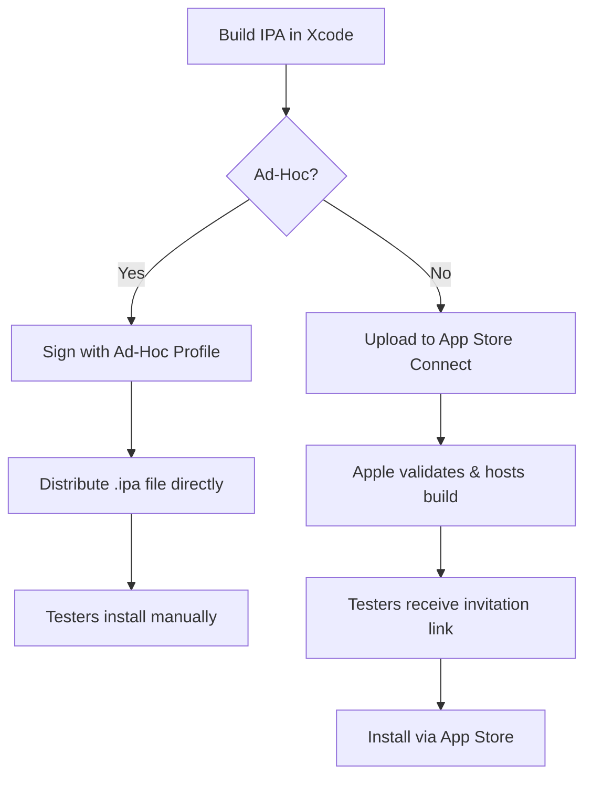

# Ad-Hoc distribution vs TestFlight in React Native — a practical comparison

## Introduction

React Native developers juggle multiple distribution channels to get apps into testers' hands quickly. Two primary pathways dominate: Ad-Hoc distribution and Apple's TestFlight. Each serves distinct workflows, carries unique constraints, and demands different operational discipline. This isn't just about choosing a tool—it's about aligning your release strategy with team size, testing velocity, and compliance requirements.

## Why This Matters

Mobile testing cycles compress rapidly in agile environments. Waiting weeks for App Store approval kills momentum when you're iterating daily. Ad-Hoc lets you sidestep that bottleneck entirely. TestFlight, meanwhile, scales better for larger beta pools but introduces Apple-specific dependencies. Misjudging this choice creates friction: too much manual overhead with Ad-Hoc, or unnecessary waiting with TestFlight.

## How It Works

Both methods solve the same core problem—installing apps outside normal channels—but through fundamentally different mechanisms.

Ad-Hoc distribution relies on pre-approved device UDIDs registered in your Apple Developer account. You build an IPA, sign it with a provisioning profile containing those UDIDs, then distribute the file directly. The OS trusts this signature because it came from your verified developer account.

TestFlight operates as Apple's managed intermediary. You upload an IPA to App Store Connect, which validates and hosts it. Testers receive invitation links, install through the App Store interface, and get automatic updates.



## Core Concepts

**Ad-Hoc Distribution** requires managing three moving parts: provisioning profiles, device registrations, and certificate chains. Your team must maintain an accurate list of UDIDs—miss one, and that tester can't install. The provisioning profile expires every 7 days for development builds, 1 year for distribution.

**TestFlight** abstracts most of this complexity behind App Store Connect. You upload once, Apple handles validation, and testers opt-in through email invitations. However, you're still bound by Apple's rules: 100 maximum external testers, 25 internal testers, and mandatory review delays.

## Examples & Code Walkthrough

Let's examine building and distributing a React Native app via both paths.

For Ad-Hoc, you need Xcode's export capability since React Native CLI alone won't produce a distributable IPA:

```bash
# Assuming you've built the archive in Xcode
xcodebuild -exportArchive \
  -archivePath "MyApp.xcarchive" \
  -exportPath "./build/adhoc" \
  -exportOptionsPlist "./adhocExport.plist"
```

The export plist (`adhocExport.plist`) specifies Ad-Hoc distribution mode:

```xml
<?xml version="1.0" encoding="UTF-8"?>
<!DOCTYPE plist PUBLIC "-//Apple//DTD PLIST 1.0//EN" "http://www.apple.com/DTDs/PropertyList-1.0.dtd">
<plist version="1.0">
<dict>
  <key>method</key>
  <string>ad-hoc</string>
  <key>provisioningProfiles</key>
  <dict>
    <key>com.mycompany.myapp</key>
    <string>AdHoc_MyApp_Com</string>
  </dict>
</dict>
</plist>
```

Automating distribution requires additional tooling. Here's a simplified script to zip and prepare the IPA:

```javascript
const { execSync } = require('child_process');
const fs = require('fs');
const path = require('path');

function createDistributionPackage(ipaPath, outputDir = './dist') {
  if (!fs.existsSync(outputDir)) {
    fs.mkdirSync(outputDir, { recursive: true });
  }

  const timestamp = new Date().toISOString().slice(0, 10);
  const packageName = `MyApp-AdHoc-${timestamp}.zip`;
  const packagePath = path.join(outputDir, packageName);

  execSync(`cd "${path.dirname(ipaPath)}" && zip -r "${packagePath}" "$(basename "${ipaPath}")"`);

  console.log(`Created distribution package: ${packagePath}`);
  return packagePath;
}

// Usage
createDistributionPackage('./build/adhoc/MyApp.ipa');
```

For TestFlight automation, Fastlane becomes essential:

```ruby
# Fastfile
lane :beta do
  build_app(
    scheme: "MyApp",
    export_method: "app-store"
  )
  
  upload_to_testflight(
    skip_waiting_for_build_processing: true,
    distribute_external: true,
    groups: ["qa-team"],
    changelog: "Bug fixes and minor UI tweaks"
  )
end
```

Execute with:

```bash
fastlane ios beta
```

## Best Practices

1. **Separate build configurations** - Maintain distinct schemes for Ad-Hoc and TestFlight. Mixing them creates confusion about what's actually distributed.

2. **Automate UDID management** - Store device lists in version-controlled files. Scripts should update provisioning profiles before each build.

3. **Version consistently** - Tag Git commits with semantic versions. Both distribution methods rely on clear version numbering to prevent testers from running outdated builds.

4. **Monitor expirations** - Set calendar reminders for provisioning profile renewals. Ad-Hoc profiles expire silently, leaving testers stranded.

## Common Mistakes & Anti-Patterns

1. **Hardcoding UDIDs in source** - Never commit device lists directly to repositories. Externalize them to secure configuration files or environment variables.

2. **Ignoring profile expiration** - Development provisioning profiles expire every 7 days. Teams waste hours troubleshooting "installation failed" errors instead of checking profile dates.

3. **Over-sharing TestFlight access** - Don't invite everyone externally. Limit external testers to essential stakeholders. Apple caps external testers at 100 per app.

4. **Skipping build verification** - Always test your distribution process end-to-end. A successful build doesn't guarantee successful installation on target devices.

## Performance Considerations

Ad-Hoc distribution introduces minimal overhead beyond the initial build process. Installation time depends primarily on IPA size and network conditions.

TestFlight adds Apple's hosting and validation layers. Large apps (>100MB) may trigger App Store's cellular download restrictions. Processing time in App Store Connect varies—complex apps can take 10-30 minutes for full validation.

Certificate chain validation impacts both methods. Expired certificates cause immediate failures. Ensure your keychain has current WWDC certificates and Xcode manages automatic renewals.

## Real-World Usage

Large enterprises favor TestFlight for its audit trails and centralized control. Microsoft's Office suite uses TestFlight extensively for beta programs involving thousands of testers.

Startups and small teams often prefer Ad-Hoc for rapid iteration. The ability to push updates immediately without Apple review accelerates development cycles significantly.

Hybrid approaches work well too: internal QA via TestFlight, contractor access through Ad-Hoc links. This splits the testing pool appropriately while maintaining security boundaries.

## Frequently Asked Questions (FAQ)

**Q: Can I distribute Android apps similarly?**
A: Yes, Google Play's Internal Testing track provides comparable functionality. However, Google requires a formal review process, making it less immediate than iOS alternatives.

**Q: What happens when an Ad-Hoc build expires?**
A: Users see an "app is not trusted" message. They must delete and reinstall with a fresh build. Unlike TestFlight's automatic updates, expired Ad-Hoc installs require manual intervention.

**Q: Do TestFlight builds expire?**
A: Yes, after 90 days of inactivity or when superseded by newer builds. Apple notifies testers before expiration, but they must manually update.

## Conclusion

Choose Ad-Hoc for speed and simplicity when working with known testers in controlled environments. Opt for TestFlight when scaling beyond a handful of users or requiring Apple's validation infrastructure. Both demand careful certificate management and disciplined versioning. The right choice depends less on technical capability and more on operational maturity of your testing workflow.
