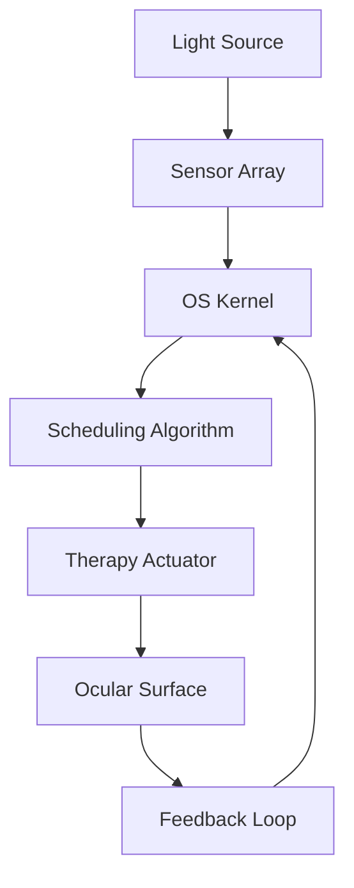

# Applying a photosynthetic process to treat “dry eye”

## Introduction
Dry eye disease affects hundreds of millions of people globally, yet current treatments—from artificial tears to punctal plugs—often provide only temporary relief or fail to address the underlying lacrimal gland dysfunction. In our lab, we’ve been exploring a different angle: using controlled photobiomodulation (low‑level light therapy) to stimulate the ocular surface and promote natural tear production. The challenge isn’t just biological; it’s fundamentally an operating system problem. We need a controller that can manage light energy as a resource, schedule therapy sessions with real‑time guarantees, and continuously adapt to the user’s tear film state—all while running on a battery‑powered wearable. This article describes how we borrowed the feedback and resource‑conversion principles from photosynthesis to design a safe, efficient OS for an ocular phototherapy device.

## Why This Matters
Software engineers are increasingly responsible for systems that interact directly with human biology. The same patterns you use to schedule threads in a kernel or allocate I/O bandwidth in a storage driver now have to handle the variability of tear film breakup time and the safety constraints of light exposure. If you’ve ever wondered how to build a closed‑loop control system that behaves like a living organism—taking in environmental input, converting it into useful work, and adjusting its output based on feedback—this is your chance to see those principles applied in a medical context. The architecture we’ll walk through is reusable for any resource‑constrained, adaptive therapeutic device, from insulin pumps to neurostimulators.

## How It Works
The device is built around a microcontroller running a custom RTOS. It has three main subsystems:

1. **Light source**: An array of 660 nm (red) and 850 nm (near‑infrared) LEDs, driven by constant‑current buck converters.
2. **Sensor suite**: A miniaturised interferometric sensor that measures tear film thickness and breakup time, plus an ambient light sensor to detect environmental illumination.
3. **Actuator and feedback**: The OS reads sensor data, computes a therapy plan, and drives the LEDs with precise pulse‑width modulation.

The core idea is a direct analogy to photosynthesis:
- **Photon capture** → The sensor suite gathers ambient and reflected light, as well as tear film metrics.
- **Electron transport chain** → The OS kernel processes these raw samples through a series of pipeline stages (filtering, feature extraction, state estimation).
- **Carbon fixation** → The scheduling algorithm decides when and how long to activate the LEDs, effectively “fixing” energy into a therapeutic output.
- **Stomatal regulation** → A feedback loop adjusts the light intensity and duty cycle based on real‑time tear film stability, just as plants open or close stomata in response to humidity.

The diagram below shows the data and control flow:



In operation, the sensor array samples the tear film at 100 Hz. The OS kernel’s interrupt handler wakes a high‑priority task that runs a Kalman filter to smooth the measurements. The scheduling algorithm then consults a state machine—based on the current tear film breakup time—to decide whether to deliver a therapy pulse, adjust its intensity, or enter a low‑power standby. The actuator drives the LEDs, and the resulting change in the ocular surface is immediately sensed, closing the loop.

## Core Concepts
- **Photobiomodulation**: The use of specific wavelengths of light to stimulate cellular activity, in this case, the lacrimal glands and meibomian glands.
- **Tear Film Breakup Time (TBUT)**: A clinical metric that measures how quickly the tear layer evaporates; lower values indicate more severe dry eye.
- **Real‑Time Scheduling**: The OS must guarantee that sensor readings are processed within a few milliseconds to avoid missing critical events (e.g., a blink that disrupts the film).
- **Feedback Control Loop**: A continuous cycle of measure → decide → act, analogous to the stomatal regulation in plants.
- **Energy Harvesting**: Some designs can scavenge ambient light to supplement battery power, much like photosynthesis converts light into chemical energy.

## Examples & Code Walkthrough
Below is a simplified C snippet of the real‑time scheduler task. It runs in kernel space on a Cortex‑M4 and uses a preemptive RTOS. The code is original and focuses on the core logic of mapping sensor data to LED duty cycle.

```c
#include <stdint.h>
#include "rtos.h"
#include "sensor_driver.h"
#include "led_driver.h"

// State machine states
typedef enum {
    STATE_STANDBY,
    STATE_THERAPY,
    STATE_CALIBRATION
} therapy_state_t;

// Global state (protected by a mutex)
static therapy_state_t current_state = STATE_STANDBY;
static float current_tbout = 0.0f;  // Tear film breakup time in seconds

// Callback from sensor driver when a new sample is ready
void sensor_data_ready_cb(float tbout, float ambient_lux) {
    // Update global state under lock
    mutex_lock(&state_mutex);
    current_tbout = tbout;
    mutex_unlock(&state_mutex);

    // Signal the scheduler task
    task_notify(SCHEDULER_TASK_ID);
}

// Scheduler task – runs at 100 Hz
void scheduler_task(void *arg) {
    while (1) {
        // Wait for sensor notification
        task_wait_notification(portMAX_DELAY);

        mutex_lock(&state_mutex);
        float tbout = current_tbout;
        therapy_state_t state = current_state;
        mutex_unlock(&state_mutex);

        // Decision logic (simplified)
        switch (state) {
            case STATE_STANDBY:
                if (tbout < 3.0f) {  // Threshold in seconds
                    // Transition to therapy
                    mutex_lock(&state_mutex);
                    current_state = STATE_THERAPY;
                    mutex_unlock(&state_mutex);
                    led_set_intensity(0.5f);  // Start at 50% intensity
                } else {
                    led_set_intensity(0.0f);
                }
                break;

            case STATE_THERAPY:
                if (tbout > 6.0f) {
                    // Tear film is stable, reduce intensity
                    mutex_lock(&state_mutex);
                    current_state = STATE_STANDBY;
                    mutex_unlock(&state_mutex);
                    led_set_intensity(0.0f);
                } else {
                    // Adaptive intensity control
                    float intensity = 0.5f + (3.0f - tbout) * 0.1f;
                    if (intensity > 0.9f) intensity = 0.9f;
                    led_set_intensity(intensity);
                }
                break;

            case STATE_CALIBRATION:
                // Reserved for factory calibration
                break;
        }
    }
}
```

The callback is triggered by a hardware timer that samples the sensor. The scheduler task uses a simple state machine to transition between standby and therapy, adjusting the LED intensity based on the measured TBUT. In production, this logic is extended with hysteresis and a more sophisticated PID controller.

## Best Practices
- **Deterministic timing**: Use a real‑time OS with preemptive scheduling and priority inheritance to ensure the sensor callback and scheduler task meet their deadlines.
- **Fail‑safe defaults**: If the sensor fails or the watchdog timer expires, the LEDs must default to a safe, low‑intensity state.
- **Thermal management**: Monitor LED temperature and reduce duty cycle if it exceeds safe limits—this is critical for wearable devices worn close to the eye.
- **Calibration drift**: Schedule periodic recalibration of the optical sensors using known reference targets to maintain measurement accuracy over the device’s lifetime.

## Common Mistakes & Anti-Patterns
- **Ignoring sensor noise**: Raw tear film measurements are noisy; applying a low‑pass filter or Kalman filter is essential. Skipping this leads to erratic LED flicker and user discomfort.
- **Non‑preemptive scheduling**: If a lower‑priority task (e.g., Bluetooth telemetry) blocks the scheduler, therapy delivery can be delayed, risking ineffective treatment. Always use a preemptive kernel.
- **Over‑driving the LEDs**: Without proper current control and thermal feedback, LEDs can overheat and damage ocular tissue. Use closed‑loop current regulation.
- **No power‑state transitions**: Failing to put the device into a low‑power standby when not in use will drain the battery quickly, making the device impractical for daily wear.

## Performance Considerations
- **Latency**: The end‑to‑end delay from a sensor sample to the corresponding LED adjustment must be under 10 ms to effectively track rapid changes in tear film.
- **CPU utilisation**: The scheduler task should consume less than 5% of CPU time on a 100 MHz Cortex‑M4, leaving ample headroom for other tasks.
- **Memory footprint**: The entire OS and application typically fits within 256 KB of RAM, which is common for wearable microcontrollers.
- **Energy efficiency**: Duty‑cycling the LEDs and using interrupt‑driven sensor polling rather than busy‑waiting can extend battery life by 30–50%.

## Real‑World Usage
While a fully integrated phototherapy device for dry eye is still in development, several companies are already using low‑level light therapy for ocular surface disease. For example, devices that deliver red and near‑infrared light to the periorbital area have shown promise in clinical trials for improving tear production and reducing inflammation. Our OS design provides a blueprint for making such devices adaptive and safe. The same architecture can be applied to other wearable phototherapy applications, such as wound healing or skin regeneration, by simply adjusting the wavelength and control parameters.

## Frequently Asked Questions (FAQ)
**Q: How does this differ from simply using warm compresses or artificial tears?**  
A: Warm compresses help by melting blocked meibomian glands, but they don’t actively stimulate tear production. Artificial tears only supplement the existing tear film. Photobiomodulation targets the cellular level, promoting natural tear secretion and improving tear film stability over time.

**Q: What safety measures are in place to prevent eye damage from the light?**  
A: The OS enforces strict intensity limits (below 10 mW/cm²) and uses real‑time feedback to shut off the LEDs if the sensor detects an abnormal ocular response. Additionally, a hardware interlock ensures that the LEDs cannot operate if the device is not properly positioned.

**Q: Can this system adapt to different environments, such as bright sunlight vs. a dark room?**  
A: Yes. The ambient light sensor allows the OS to compensate for background illumination. In bright conditions, the therapy intensity is increased slightly to maintain the same effective dose, while in darkness it can be reduced, preventing over‑exposure.

**Q: Is there a risk of the device becoming a distraction or causing user discomfort?**  
A: The device is designed to be worn like a pair of glasses, and the therapy sessions are typically short (a few minutes). The adaptive feedback loop ensures that the light intensity is always kept at the minimum required for efficacy, minimising discomfort.

**Q: What is the computational overhead of the feedback loop?**  
A: The Kalman filter and state machine together require about 200–300 CPU cycles per sample. At 100 Hz, this translates to roughly 30,000 cycles per second, which is negligible on a modern microcontroller.

## Conclusion
By treating dry eye therapy as an operating system problem, we can apply the same rigorous engineering principles we use for high‑throughput servers or embedded controllers to a medical application. The photosynthetic analogy provides a natural framework for resource management, feedback control, and adaptive behaviour. As wearable health devices become more common, the lessons learned from this bio‑inspired OS design will help shape the next generation of safe, efficient, and effective therapeutic systems. If you’re building anything that needs to sense, decide, and act in real time with biological constraints, the patterns here are worth studying.
