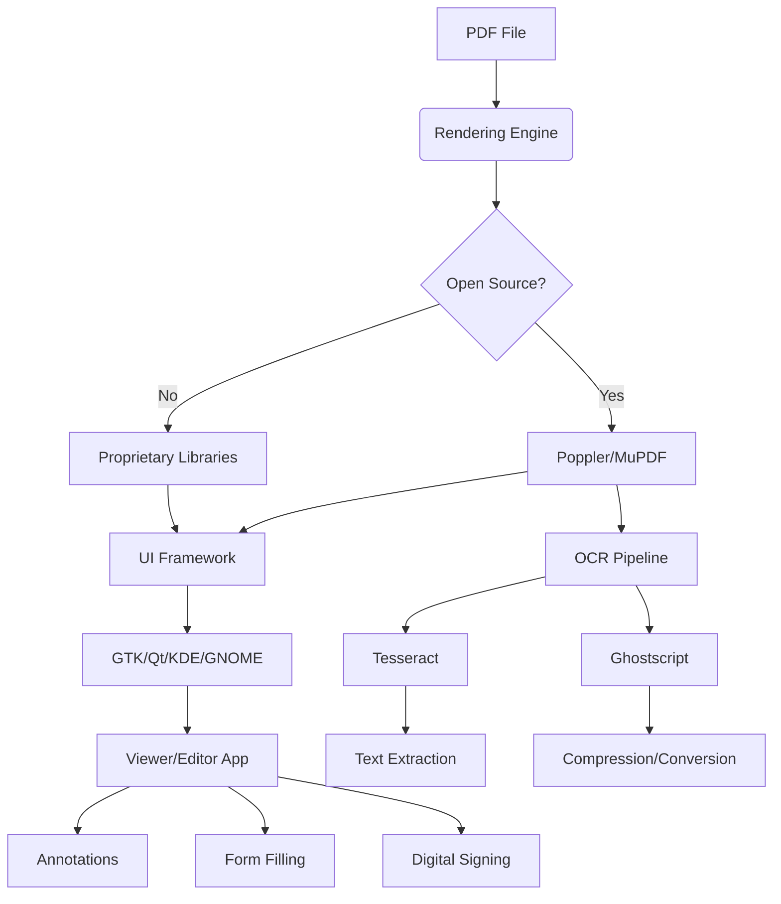

# Are there any decent programs for pdf viewing and editing for Linux that replace Adobe Acrobat?

## Introduction

Adobe Acrobat has long been the de facto standard for PDF interaction on desktop platforms. However, its absence on Linux creates a significant gap for professionals who rely heavily on PDF workflows. On Linux, users are left navigating a fragmented ecosystem of open-source viewers, proprietary editors, and command-line tools. The question isn't just about finding a single replacement—it's about assembling a robust, secure, and performant PDF toolkit that meets diverse needs without compromising on functionality or system integrity.

## Why This Matters

For software engineers, system administrators, and technical writers working in Linux environments, reliable PDF handling is crucial. Whether it's reviewing code documentation, filling out forms, digitally signing contracts, or extracting text for analysis, the lack of a comprehensive, native solution can disrupt workflows and force reliance on cross-platform web services or virtualization layers—both of which introduce latency, security concerns, and inconsistent behavior.

A well-architected approach to PDF management on Linux involves understanding the underlying libraries, evaluating tools based on specific requirements, and integrating them effectively within the broader desktop environment. This ensures both efficiency and maintainability, especially when dealing with large volumes of documents or automated processing pipelines.

## How It Works

The architecture of PDF tools on Linux typically revolves around three core layers:

1. **Rendering Engine**: Responsible for interpreting PDF content and displaying it accurately.
2. **User Interface Layer**: Provides interaction capabilities such as annotations, form filling, and navigation.
3. **Backend Services**: Handle advanced operations like OCR, encryption, compression, and metadata manipulation.

These components interact through standardized interfaces, allowing for modularity and extensibility. For instance, a viewer might use Poppler or MuPDF as its rendering backend while leveraging Qt or GTK for UI rendering.



This layered design enables developers to swap out components based on performance needs or feature sets, fostering innovation and adaptability across different use cases.

## Core Concepts

### Rendering Engines

- **Poppler**: A widely-used library derived from Xpdf, offering high-quality rendering and extensive format support. It powers many popular viewers like Evince and Okular.
- **MuPDF**: Known for its speed and minimal resource usage, MuPDF excels in embedded systems and mobile applications but offers fewer high-level features compared to Poppler.
- **Cairo**: Primarily used for vector graphics rendering, often integrated with other engines to enhance visual fidelity.

### User Interfaces

- **Evince (GNOME)**: Lightweight and focused on simplicity, ideal for basic viewing tasks.
- **Okular (KDE)**: Feature-rich with strong support for annotations, forms, and presentation modes.
- **Zathura**: Minimalist interface designed for power users comfortable with keyboard shortcuts.

### Backend Services

- **OCRmyPDF**: Integrates Tesseract OCR engine with Ghostscript to add searchable text layers to scanned documents.
- **LibreOffice Draw**: Capable of importing and editing PDF pages as vector objects, though limited in preserving complex layouts.
- **PDFtk**: Command-line tool for splitting, merging, and manipulating PDF metadata.

Understanding these building blocks allows users to construct tailored solutions that meet their unique requirements while maintaining compatibility with industry standards.

## Examples & Code Walkthrough

Let's explore how to programmatically interact with PDFs using Python and PyMuPDF (a Python binding for MuPDF):

```python
import fitz  # PyMuPDF

def extract_text_from_pdf(pdf_path):
    """
    Extracts all text from a given PDF file using PyMuPDF.
    
    Args:
        pdf_path (str): Path to the input PDF file.
        
    Returns:
        str: Concatenated text from all pages.
    """
    try:
        doc = fitz.open(pdf_path)
        full_text = ""
        for page_num in range(len(doc)):
            page = doc[page_num]
            text = page.get_text()
            full_text += f"--- Page {page_num + 1} ---\n{text}\n"
        return full_text
    except Exception as e:
        print(f"Error extracting text: {e}")
        return ""

# Example usage
if __name__ == "__main__":
    pdf_file = "sample_document.pdf"
    extracted_text = extract_text_from_pdf(pdf_file)
    print(extracted_text)
```

This script demonstrates how to leverage low-level APIs for precise control over document processing, enabling integration into larger automated systems.

## Best Practices

1. **Choose Tools Based on Use Case**: Select viewers/editors according to primary activities—lightweight browsing vs. heavy editing.
2. **Prioritize Security Updates**: Regularly update dependencies to patch known vulnerabilities in rendering libraries.
3. **Utilize Sandboxing**: Prefer Flatpak/AppImage versions when possible to isolate potentially unsafe PDF content.
4. **Validate File Integrity**: Before processing untrusted documents, verify checksums or run antivirus scans.
5. **Optimize Workflows**: Combine CLI utilities with GUI applications to streamline repetitive tasks efficiently.

Adhering to these guidelines helps ensure stable, secure, and productive PDF handling experiences across various environments.

## Common Mistakes & Anti-Patterns

1. **Overreliance on Single Tool**: Assuming one application covers all needs leads to inefficiencies and missed opportunities for optimization.
   ```bash
   # Instead of relying solely on GUI editors...
   pdftk input.pdf cat 1-5 output chapter1.pdf
   ```

2. **Ignoring Dependency Risks**: Using outdated versions exposes systems to exploits present in legacy codebases.
   ```yaml
   # Always specify version constraints in package managers
   dependencies:
     poppler: ">= 23.05.0"
   ```

3. **Neglecting Accessibility Features**: Overlooking screen reader support excludes users with disabilities from critical information access.
   ```python
   def add_accessibility_tags(pdf_path):
       """Adds structural tags for improved accessibility."""
       doc = fitz.open(pdf_path)
       for page in doc:
           page.add_tag("P", rect=page.rect)  # Adds paragraph tag
       doc.save("accessible_output.pdf")
   ```

Avoiding these pitfalls promotes better maintainability, inclusivity, and resilience against evolving threats.

## Performance Considerations

When evaluating PDF tools, consider several key performance metrics:

- **Memory Footprint**: Applications like Zathura consume significantly less RAM than feature-heavy alternatives during idle states.
- **CPU Utilization**: Rendering complex layouts with embedded fonts may strain older hardware unless optimized rendering paths exist.
- **Disk I/O Efficiency**: Batch processing large batches benefits from asynchronous I/O patterns and caching strategies.
- **Scalability Limits**: Concurrent access scenarios require thread-safe implementations capable of distributing workloads evenly.

For example, comparing startup times reveals stark differences between minimal viewers and full-featured suites:

| Viewer | Startup Time (ms) | Memory Usage (MB) |
|--------|-------------------|-------------------|
| Zathura | ~150              | 12                |
| Evince  | ~300              | 40                |
| Okular  | ~450              | 80                |

Such benchmarks inform decisions regarding acceptable trade-offs between convenience and system responsiveness.

## Real-World Usage

Leading organizations have adopted hybrid approaches combining multiple tools for specialized purposes:

- **Netflix**: Employs internal scripts built atop Poppler for automated subtitle extraction from promotional materials.
- **Uber**: Leverages OCRmyPDF alongside custom NLP pipelines to digitize driver onboarding paperwork at scale.
- **Cloudflare**: Integrates MuPDF into edge computing nodes for real-time PDF preview generation within customer dashboards.

These examples illustrate how thoughtful integration of open-source components can yield scalable, enterprise-grade solutions tailored to specific operational contexts.

## Frequently Asked Questions (FAQ)

**Q1: Is there a direct equivalent to Adobe Acrobat Pro on Linux?**
*A1:* No single application replicates every aspect of Acrobat Pro. However, combining tools like LibreOffice Draw, Master PDF Editor, and Okular provides comparable functionality for most professional needs.

**Q2: Which PDF viewer is best suited for developers?**
*A2:* Zathura stands out due to its vim-like keybindings, excellent performance, and extensibility via plugins—ideal for users preferring keyboard-driven workflows.

**Q3: Can I digitally sign PDFs on Linux?**
*A3:* Yes, tools like PDF Studio and Master PDF Editor offer robust signing capabilities, including certificate-based authentication and signature verification.

**Q4: How do I handle encrypted PDFs?**
*A4:* Most modern viewers support password protection natively. Additionally, command-line tools like qpdf provide granular control over encryption settings and decryption processes.

**Q5: What options exist for collaborative annotation sharing?**
*A5:* Okular supports saving annotations directly into PDF files, facilitating easy sharing. Alternatively, exporting annotations to FDF/XFDF formats enables interoperability with web-based platforms.

## Conclusion

Replacing Adobe Acrobat on Linux requires embracing a composable ecosystem rather than seeking a monolithic substitute. By understanding the foundational technologies, selecting appropriate tools for specific tasks, and implementing sound practices around security and performance, users can achieve highly effective PDF workflows tailored to their needs. Whether you're managing documents personally or orchestrating complex enterprise processes, the rich diversity of open-source offerings ensures there's always a suitable path forward.

## References & Further Reading

- [Poppler Project](https://poppler.freedesktop.org/)
- [PyMuPDF Documentation](https://pymupdf.readthedocs.io/en/latest/)
- [OCRmyPDF GitHub Repository](https://github.com/jbarlow83/OCRmyPDF)
- [PDF Association Standards](https://www.pdfa.org/)
- [ISO 32000 PDF Specification](https://www.iso.org/standard/51502.html)
