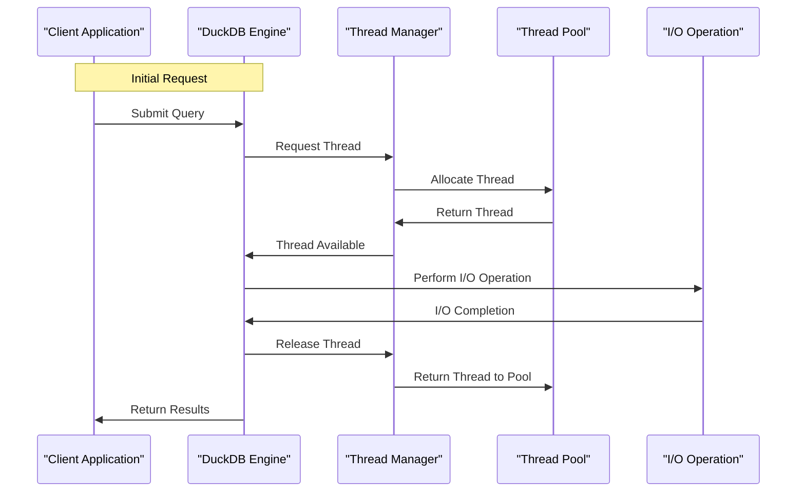

# Asynchronous I/O in DuckDB: Work, Thread, Work

## Introduction
DuckDB is a columnar database management system designed to provide high-performance data analysis capabilities. As a key component of modern data management systems, DuckDB relies heavily on efficient input/output (I/O) operations to deliver its promised performance. Asynchronous I/O is a crucial aspect of DuckDB's architecture, enabling it to handle multiple queries concurrently and improve overall system responsiveness. In this article, we will explore the world of asynchronous I/O in DuckDB, exploring its implementation, benefits, and best practices for leveraging its capabilities.

## Why This Matters
Asynchronous I/O is essential for DuckDB's performance, as it allows the database to overlap I/O operations with other tasks, such as query processing and optimization. By doing so, DuckDB can significantly reduce the latency associated with I/O-bound operations, resulting in faster query execution times and improved system throughput. As a developer working with DuckDB, understanding how asynchronous I/O works and how to optimize its performance is vital for getting the most out of this powerful database system.

## How It Works
The asynchronous I/O workflow in DuckDB involves several key components, including the client application, the DuckDB engine, the thread manager, the thread pool, and the I/O operation. The following Mermaid diagram illustrates the workflow:

This diagram shows how the client application submits a query to the DuckDB engine, which then requests a thread from the thread manager. The thread manager allocates a thread from the thread pool, and the DuckDB engine uses this thread to perform the I/O operation. Once the I/O operation is complete, the thread is released back to the thread pool, and the results are returned to the client application.

## Core Concepts
To understand asynchronous I/O in DuckDB, it's essential to grasp the following core concepts:

* **Synchronous I/O**: Synchronous I/O operations block the calling thread until the operation is complete. This can lead to significant performance degradation in I/O-bound systems.
* **Asynchronous I/O**: Asynchronous I/O operations do not block the calling thread, allowing other tasks to be executed concurrently.
* **Threads**: Threads are the basic execution units in DuckDB, responsible for performing I/O operations and other tasks.
* **Thread Pool**: The thread pool is a collection of threads that can be allocated and deallocated as needed to perform I/O operations.

## Examples & Code Walkthrough
To demonstrate the usage of asynchronous I/O in DuckDB, let's consider a simple example. Suppose we want to perform a query that involves reading data from a file and processing it in parallel. We can use the following code snippet to achieve this:
```cpp
#include <duckdb.hpp>

int main() {
    // Create a DuckDB connection
    duckdb::DBConnection conn;

    // Create a query that reads data from a file
    std::string query = "SELECT * FROM 'data.csv'";

    // Execute the query asynchronously
    auto future = conn.Execute(query, duckdb::ExecutionMode::ASYNCHRONOUS);

    // Perform other tasks while the query is executing
    // ...

    // Wait for the query to complete
    auto result = future.get();

    // Process the results
    // ...

    return 0;
}
```
In this example, we create a DuckDB connection and execute a query that reads data from a file. We use the `ASYNCHRONOUS` execution mode to execute the query asynchronously, allowing other tasks to be performed while the query is executing. We then wait for the query to complete using the `get()` method and process the results.

## Best Practices
To get the most out of asynchronous I/O in DuckDB, follow these best practices:

* **Use asynchronous execution modes**: Use the `ASYNCHRONOUS` execution mode to execute queries asynchronously, allowing other tasks to be performed while the query is executing.
* **Use thread pools**: Use thread pools to manage threads and perform I/O operations concurrently.
* **Optimize thread pool sizes**: Optimize thread pool sizes to balance the trade-off between concurrency and overhead.

## Common Mistakes & Anti-Patterns
When working with asynchronous I/O in DuckDB, avoid the following common mistakes and anti-patterns:

* **Blocking threads**: Avoid blocking threads using synchronous I/O operations or other blocking calls.
* **Over-allocating threads**: Avoid over-allocating threads, as this can lead to significant performance degradation due to thread overhead.
* **Under-allocating threads**: Avoid under-allocating threads, as this can lead to underutilization of system resources.

## Performance Considerations
Asynchronous I/O in DuckDB can have a significant impact on system performance. To optimize performance, consider the following:

* **Thread pool sizes**: Optimize thread pool sizes to balance concurrency and overhead.
* **I/O operation sizes**: Optimize I/O operation sizes to balance concurrency and overhead.
* **System resources**: Monitor system resources, such as CPU, memory, and I/O bandwidth, to ensure that the system is not bottlenecked by any single resource.

## Real-World Usage
Asynchronous I/O in DuckDB is used in a variety of real-world applications, including:

* **Data analytics**: Asynchronous I/O is used in data analytics applications to perform queries and data processing tasks concurrently.
* **Data science**: Asynchronous I/O is used in data science applications to perform data ingestion, processing, and analysis tasks concurrently.
* **Machine learning**: Asynchronous I/O is used in machine learning applications to perform data ingestion, processing, and model training tasks concurrently.

## Frequently Asked Questions (FAQ)
Here are some frequently asked questions about asynchronous I/O in DuckDB:

* **Q: What is asynchronous I/O in DuckDB?**
A: Asynchronous I/O in DuckDB is a mechanism that allows queries to be executed concurrently, improving system responsiveness and performance.
* **Q: How do I use asynchronous I/O in DuckDB?**
A: You can use asynchronous I/O in DuckDB by executing queries using the `ASYNCHRONOUS` execution mode.
* **Q: What are the benefits of using asynchronous I/O in DuckDB?**
A: The benefits of using asynchronous I/O in DuckDB include improved system responsiveness, improved performance, and better resource utilization.

## Conclusion
Asynchronous I/O is a crucial component of DuckDB's architecture, enabling it to provide high-performance data analysis capabilities. By understanding how asynchronous I/O works and how to optimize its performance, developers can get the most out of this powerful database system. By following best practices, avoiding common mistakes and anti-patterns, and optimizing system resources, developers can unlock the full potential of asynchronous I/O in DuckDB and build high-performance data analytics applications.
