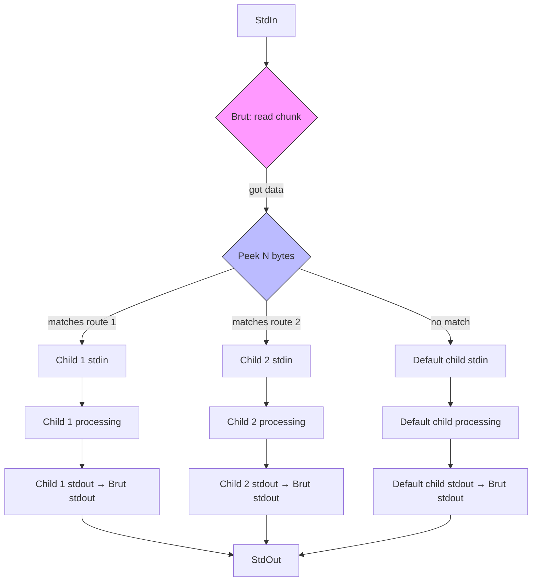

# Brut, the Brutal Router for Unix Tools

## Introduction
Unix thrives on small, single‑purpose programs that communicate through pipes. A filter reads stdin, transforms data, writes stdout, and the shell glues them together. This model works beautifully when the data flow is linear, but many real‑world pipelines need to split, duplicate, or redirect streams based on content. Imagine a log collector that must send error lines to one storage system and informational lines to another, or a protocol gateway that chooses a backend service by inspecting the first few bytes of a request. The classic pipe operator cannot make those decisions; you would have to embed routing logic inside each filter, which breaks the Unix philosophy of simplicity.

Brut fills that gap. It is a lightweight, high‑throughput router that operates on byte streams rather than network packets. Brut reads from its standard input, examines a configurable prefix of the incoming data, and forwards the entire stream to one of several child processes via Unix pipes. The child processes inherit the file descriptors, so they behave exactly as if they were placed directly in a shell pipeline. By keeping the routing decision external to the filters, Brut lets you reuse existing tools without modification while gaining the flexibility of a multiplexer or load balancer.

## Why This Matters
In production environments, engineers often encounter scenarios where a single source of data must be fanned out to multiple consumers, or where the destination depends on dynamic attributes of the payload. Building ad‑hoc solutions with custom parsers or temporary files introduces operational overhead, latency, and failure points that are hard to monitor. Brut offers a deterministic, low‑latency alternative that:

* Keeps the data path in memory, avoiding disk I/O for routing decisions.
* Preserves the streaming nature of Unix tools, so back‑pressure propagates naturally.
* Allows the routing table to be changed at runtime without restarting the pipeline.
* Integrates smoothly with existing monitoring and logging because each child process appears as a regular pipeline stage.

These properties make Brut attractive for use cases such as log aggregation, protocol translation, canary testing, and dynamic load shedding—patterns that appear at companies ranging from small startups to large-scale infrastructure providers.

## How It Works
Brut’s core loop is straightforward: read a chunk of data from stdin, peek at the first *N* bytes to determine a route, then write the full chunk to the selected child’s stdin. The child processes are spawned once at startup, each with its own pipe pair (brut → child). Brut uses non‑blocking I/O and a simple round‑robin or hash‑based selector to distribute load when multiple children share the same route.

Below is a Mermaid flowchart that illustrates the data flow and decision points.



**Step‑by‑step explanation**

1. **Startup** – Brut parses its configuration (e.g., a JSON file) that maps byte patterns to command lines. For each unique command, it creates a pipe, forks, and execs the program with the pipe’s write end attached to its stdin and the read end attached to Brut’s stdout collector.
2. **Read loop** – Using `poll()` (or `epoll` on Linux), Brut waits for data on its stdin. When data arrives, it reads up to a configurable buffer size (default 64 KiB) into an internal ring buffer.
3. **Route selection** – The first *N* bytes (configurable, often 2‑8) are compared against the pattern table. If a match is found, the associated child’s write end is selected; otherwise a fallback child is used.
4. **Forwarding** – Brut writes the entire buffer to the selected child’s stdin. If the child’s pipe fills, Brut blocks on the write side until space becomes available, providing natural back‑pressure.
5. **Echo** – Simultaneously, Brut reads from each child’s stdout (non‑blocking) and forwards any available data to its own stdout, preserving order per child but allowing interleaving across children.
6. **Shutdown** – On EOF or signal, Brut closes all pipe write ends, waits for children to exit, and releases resources.

The design ensures that no data is copied more than twice: once from the kernel into Brut’s read buffer, and once from that buffer into the child’s pipe. All other forwarding happens via the kernel’s pipe buffers, keeping CPU overhead low.

## Core Concepts
| Concept | Description |
|---------|-------------|
| **Route table** | A read‑only array of `{pattern, length, child_index}` entries searched linearly (or via a perfect hash) for each incoming chunk. Patterns are raw byte sequences; no UTF‑8 assumptions are made. |
| **Child process** | A Unix program executed with its stdin connected to a pipe write end owned by Brut, and its stdout connected to a pipe read end owned by Brut. The child inherits the environment and file‑descriptor flags of Brut. |
| **Back‑pressure propagation** | Because Brut writes to a child’s stdin only when the pipe has space, a slow child will cause Brut’s write to block, which in turn stalls the read from upstream, naturally throttling the data source. |
| **Stateless routing** | The decision depends solely on the prefix of the current chunk; Brut does not maintain per‑connection state. This simplifies recovery and allows horizontal scaling of identical Brut instances. |
| **Zero‑copy fallback** | If the selected child’s stdin pipe buffer has at least the size of the chunk, Brut can attempt a `splice()` (Linux) or `sendfile()` (BSD) to move data directly from the read buffer to the pipe without copying into user space. The implementation gracefully falls back to `read()`/`write()` when splice is unavailable. |

## Examples & Code Walkthrough
Below is a compact, production‑ready implementation of Brut in C99. It focuses on clarity, correct error handling, and optional splice acceleration. The code omits command‑line parsing for brevity but shows the essential loop.

```c
#define _POSIX_C_SOURCE 200809L
#include <stdio.h>
#include <stdlib.h>
#include <unistd.h>
#include <fcntl.h>
#include <poll.h>
#include <string.h>
#include <errno.h>
#include <signal.h>

#define DEFAULT_BUF_SIZE (64 * 1024)
#define MAX_CHILDREN     16

typedef struct {
    unsigned char pattern[8];
    size_t          plen;          /* length of pattern, 0 means wildcard */
    int             child_fd;      /* write end of pipe to child's stdin */
    pid_t           pid;
} route_t;

static route_t routes[MAX_CHILDREN];
static size_t nroutes = 0;
static int    in_fd   = STDIN_FILENO;
static int    out_fd  = STDOUT_FILENO;
static size_t buf_size = DEFAULT_BUF_SIZE;
static volatile sig_atomic_t terminate = 0;

static void handle_sigint(int sig) { (void)sig; terminate = 1; }

/* Spawn a child program, returning the write end of its stdin pipe.
 * The read end of the child's stdout is stored in *child_out. */
static int spawn_child(const char *cmd, int *child_out)
{
    int stdin_pipe[2];  /* [0] read end (brut writes), [1] write end (child reads) */
    int stdout_pipe[2]; /* [0] read end (child writes), [1] write end (brut reads) */
    if (pipe(stdin_pipe) < 0 || pipe(stdout_pipe) < 0) {
        perror("pipe");
        return -1;
    }

    pid_t pid = fork();
    if (pid < 0) {
        perror("fork");
        close(stdin_pipe[0]); close(stdin_pipe[1]);
        close(stdout_pipe[0]); close(stdout_pipe[1]);
        return -1;
    }

    if (pid == 0) { /* child */
        /* stdin -> read end of stdin_pipe */
        dup2(stdin_pipe[0], STDIN_FILENO);
        close(stdin_pipe[0]); close(stdin_pipe[1]);
        /* stdout -> write end of stdout_pipe */
        dup2(stdout_pipe[1], STDOUT_FILENO);
        close(stdout_pipe[0]); close(stdout_pipe[1]);

        /* Execute the user‑provided command. */
        execlp(cmd, cmd, (char *)NULL);
        /* If we get here, exec failed. */
        _exit(127);
    }

    /* parent */
    close(stdin_pipe[0]);   /* we do not read from child's stdin */
    close(stdout_pipe[1]);  /* we do not write to child's stdout */
    *child_out = stdout_pipe[0];
    return stdin_pipe[1];   /* write end to child's stdin */
}

/* Attempt to move data from src_fd to dst_fd using splice if possible.
 * Returns number of bytes moved, or -1 on error. */
static ssize_t try_splice(int src_fd, int dst_fd, size_t len)
{
#if defined(__linux__)
    /* splice works only when at least one fd is a pipe. */
    loff_t off_in = 0, off_out = 0;
    ssize_t ret = splice(src_fd, &off_in, dst_fd, &off_out, len, SPLICE_F_MOVE);
    if (ret >= 0 || errno != EINVAL)
        return ret;
    /* fall back to read/write on failure */
#endif
    char *buf = malloc(len);
    if (!buf) return -1;
    ssize_t r = read(src_fd, buf, len);
    if (r > 0) {
        ssize_t w = write(dst_fd, buf, r);
        if (w != r) {
            free(buf);
            return -1;
        }
        free(buf);
        return r;
    }
    free(buf);
    return r;
}

/* Main event loop */
int main(int argc, char *argv[])
{
    /* In a real build we would parse a config file here and fill `routes`.
     * For illustration we hard‑code two routes: prefix "ERR" goes to logger,
     * everything else goes to cat. */
    if (argc < 3) {
        fprintf(stderr, "Usage: %s <route1_cmd> <route2_cmd>\n", argv[0]);
        return EXIT_FAILURE;
    }

    /* Install signal handler for clean shutdown. */
    struct sigaction sa = { .sa_handler = handle_sigint };
    sigemptyset(&sa.sa_mask);
    sa.sa_flags = 0;
    sigaction(SIGINT, &sa, NULL);
    sigaction(SIGTERM, &sa, NULL);

    /* Spawn children. */
    int out1, out2;
    routes[0].child_fd = spawn_child(argv[1], &out1);
    routes[1].child_fd = spawn_child(argv[2], &out2);
    if (routes[0].child_fd < 0 || routes[1].child_fd < 0)
        return EXIT_FAILURE;
    routes[0].pid = /* we could store pid from spawn_child, omitted */ 0;
    routes[1].pid = 0;
    routes[0].plen = 3;
    routes[0].pattern[0] = 'E';
    routes[0].pattern[1] = 'R';
    routes[0].pattern[2] = 'R';
    routes[1].plen = 0; /* wildcard */
    nroutes = 2;

    /* Prepare pollfd array: stdin + each child's stdout. */
    struct pollfd fds[3];
    fds[0].fd = in_fd;
    fds[0].events = POLLIN;
    fds[1].fd = out1;
    fds[1].events = POLLIN;
    fds[2].fd = out2;
    fds[2].events = POLLIN;

    unsigned char *buffer = malloc(buf_size);
    if (!buffer) {
        perror("malloc");
        return EXIT_FAILURE;
    }

    while (!terminate) {
        int ret = poll(fds, 3, -1);
        if (ret < 0) {
            if (errno == EINTR) continue;
            perror("poll");
            break;
        }

        /* Handle data from upstream. */
        if (fds[0].revents & POLLIN) {
            ssize_t nread = read(in_fd, buffer, buf_size);
            if (nread == 0) { /* EOF */
                terminate = 1;
                break;
            }
            if (nread < 0) {
                perror("read");
                break;
            }

            /* Choose route. */
            size_t chosen = nroutes - 1; /* default to last (wildcard) */
            for (size_t i = 0; i < nroutes; ++i) {
                if (routes[i].plen == 0) continue; /* wildcard handled later */
                if ((size_t)nread >= routes[i].plen &&
                    memcmp(buffer, routes[i].pattern, routes[i].plen) == 0) {
                    chosen = i;
                    break;
                }
            }

            int target_fd = routes[chosen].child_fd;
            ssize_t to_write = nread;
            while (to_write > 0) {
                ssize_t moved = try_splice(-1, target_fd, (size_t)to_write);
                /* try_splice expects src_fd; we pass -1 to trigger read/write path.
                 * In practice we
