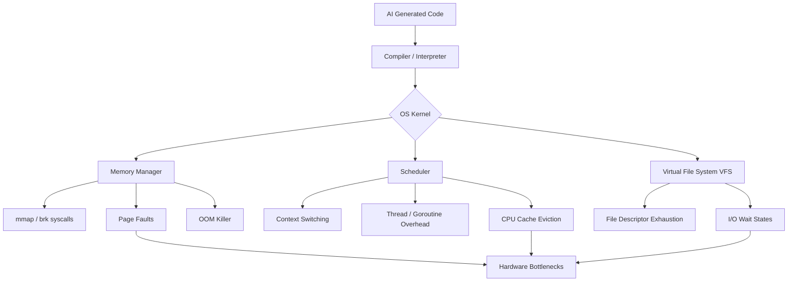

# Code Got Cheap. Quality Didn't: Why "AI Makes Software Worthless" Gets the Cost Structure Wrong

## Introduction

There is a growing narrative that AI makes software worthless. The logic seems sound: if a developer can prompt a model to generate a million lines of perfectly syntactic Go, Rust, or Python in seconds, the supply of code explodes, and its intrinsic value drops to zero. 

This analysis completely misunderstands the cost structure of software. Code is not the product. Code is a blueprint. The actual cost of software is not in the keystrokes required to produce it; it is in the compute, memory, and I/O required to execute it. When we flood our production clusters with AI-generated code, the operating system pays the tax. The bottleneck didn't disappear—it shifted from human typing speed to kernel context switches, page faults, and memory allocation. Code got cheap. Quality didn't.

## Why This Matters

If you operate infrastructure, you know that "cheap code" is an illusion. We recently debugged a microservice where an AI assistant generated a perfectly functional, yet catastrophically inefficient, file processing routine. It passed all unit tests. In staging, it processed 100 files instantly. In production, it exhausted the OS file descriptor limit within three minutes, triggering an `EMFILE` error that cascased into a total node failure.

When code is cheap to write, the marginal cost of bad code approaches infinity at the OS level. Software engineers and architects must care about this today because we are now the bottleneck. We are the ones who have to profile the memory leaks, trace the runaway syscalls, and explain to the finance team why our AWS bill tripled after a team of junior developers shipped "free" AI-generated microservices.

## How It Works

The cost structure of software has two primary axes: authorship and execution. AI drove authorship costs to near zero. Execution costs, however, are bound by physics and operating system architecture. 

AI models are trained to produce logically correct, highly readable code. They are not trained to minimize syscalls or respect L1 cache boundaries. They tend to generate code that is idiomatically correct but resource-unaware. They instantiate objects without pooling, spawn threads without bounds, and open files without strict lifecycle management. The OS kernel must manage all these abstractions, translating them into hardware operations.



When an AI generates a `go func()` for every incoming network request, it looks elegant. Under the hood, the OS scheduler must allocate stack space, register the goroutine, and schedule context switches. If those goroutines perform blocking I/O, the OS moves threads in and out of the run queue, evicting CPU caches and burning cycles on overhead rather than computation.

## Core Concepts

To understand why AI-generated code often strains the OS, we need to look at how the kernel manages resources:

1. **Memory Allocation & Page Faults:** AI loves instantiating new objects and slices. The OS translates this into `mmap` or `brk` calls. Excessive allocation leads to heap fragmentation. When the system runs low on physical memory, it triggers major page faults, forcing the OS to retrieve data from disk, which is orders of magnitude slower.
2. **Scheduler Thrashing:** Generating a thread or goroutine per task is easy to write. The OS scheduler penalizes this. Every context switch takes roughly 1-10 microseconds. At scale, unbounded concurrency forces the scheduler to spend more time switching tasks than executing them.
3. **File Descriptor Exhaustion:** Opening sockets or files without explicitly closing them is a common AI hallucination. The OS maintains a file descriptor table per process. Hitting the `ulimit -n` ceiling causes the process to lose the ability to open new connections, effectively isolating it from the network.

## Examples & Code Walkthrough

Let's look at a common pattern: processing a batch of network requests. Here is a typical, logically correct AI-generated implementation in Go, followed by the production-grade version we actually need.

### The AI-Generated Anti-Pattern

```go
// fetchAllData spawns a goroutine for every URL provided.
// Logically correct, but OS-hostile at scale.
func fetchAllData(urls []string) ([]string, error) {
    var results []string
    var wg sync.WaitGroup

    for _, url := range urls {
        wg.Add(1)
        // Unbounded concurrency: if urls has 100,000 entries, we spawn 100,000 goroutines
        go func(u string) {
            defer wg.Done()
            
            resp, err := http.Get(u)
            if err != nil {
                return
            }
            defer resp.Body.Close()
            
            body, _ := io.ReadAll(resp.Body)
            // Race condition: concurrent append to a non-thread-safe slice
            results = append(results, string(body))
        }(url)
    }
    
    wg.Wait()
    return results, nil
}
```

This code works for 10 URLs. For 100,000 URLs, it creates massive memory spikes, exhausts ephemeral ports, and causes severe scheduler latency.

### The Production-Grade Implementation

```go
// fetchAllDataSafe uses a bounded worker pool to limit OS resource consumption.
// It respects context cancellation and uses thread-safe data collection.
func fetchAllDataSafe(ctx context.Context, urls []string, maxWorkers int) ([]string, error) {
    if len(urls) == 0 {
        return nil, nil
    }
    
    // Buffer channel acts as a semaphore, limiting concurrent syscalls
    sem := make(chan struct{}, maxWorkers)
    results := make([]string, len(urls))
    
    ctx, cancel := context.WithTimeout(ctx, 30*time.Second)
    defer cancel()
    
    var wg sync.WaitGroup
    wg.Add(len(urls))
    
    for i, url := range urls {
        // Acquire a slot. Blocks if maxWorkers are currently running.
        sem <- struct{}{}
        
        go func(idx int, u string) {
            defer wg.Done()
            // Release the slot when done, even on panic or error
            defer func() { <-sem }()
            
            req, err := http.NewRequestWithContext(ctx, "GET", u, nil)
            if err != nil {
                return
            }
            
            resp, err := http.DefaultClient.Do(req)
            if err != nil {
                return
            }
            defer resp.Body.Close()
            
            // Cap read size to prevent OOM killer from targeting our process
            body, err := io.ReadAll(io.LimitReader(resp.Body, 10*1024*1024))
            if err != nil {
                return
            }
            
            // Direct index assignment avoids slice append race conditions
            results[idx] = string(body)
        }(i, url)
    }
    
    wg.Wait()
    return results, nil
}
```

In the second example, the OS sees a maximum of `maxWorkers` concurrent network connections and goroutines. We use `http.NewRequestWithContext` to ensure that if the parent process is cancelled, the OS immediately closes the sockets, freeing file descriptors. We use `io.LimitReader` to prevent a malicious or buggy upstream server from forcing the OS to allocate gigabytes of memory and triggering the OOM killer.

## Best Practices

When integrating AI-generated code into production systems, treat it as untrusted code that requires strict OS-level scrutiny:

1. **Enforce Strict cgroup Limits:** Never run AI-generated services without Docker or Kubernetes resource limits (`--memory`, `--cpus`). Let the OS container runtime kill the process if it leaks, rather than taking down the host.
2. **Bound Concurrency Everywhere:** Never trust an AI to manage concurrency. Wrap all concurrent operations in worker pools or semaphores.
3. **Profile Syscalls:** Use `strace` or `eBPF` tools to count syscalls during load testing. If a simple endpoint generates thousands of `futex` or `mmap` calls, the AI likely generated a naive synchronization or memory allocation pattern.
4. **Audit Resource Lifecycles:** Manually verify that every `Open`, `Dial`, or `Create` has a corresponding `Close` in a `defer` block.

## Common Mistakes & Anti-Patterns

Here are the most frequent OS-level failures we see from AI-generated code:

**1. Unbounded Thread/Goroutine Spawning**
*Mistake:* Using `go func()` inside a loop processing unbounded data.
*Fix:* Implement a buffered channel as a semaphore to cap concurrency, as
