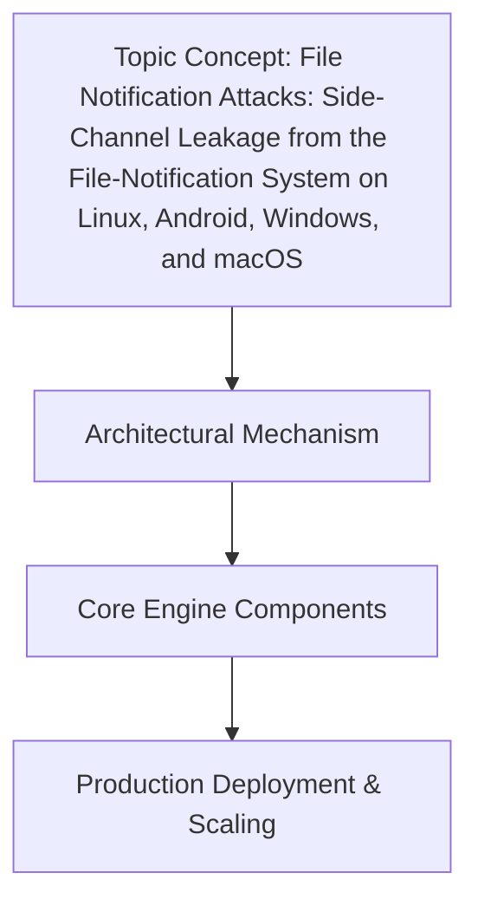

# File Notification Attacks: Side-Channel Leakage from the File-Notification System on Linux, Android, Windows, and macOS

## Introduction

File notification subsystems exist to make applications responsive to changes without constant polling. In Linux, that’s inotify and fanotify. On macOS, it’s FSEvents and kqueue. Windows provides ReadDirectoryChangesW, and Android inherits the Linux kernel’s inotify under its ART runtime. These mechanisms are foundational for sync engines, build systems, IDEs, and security agents. Yet, the very design that delivers efficiency also creates a subtle but consistent side-channel: the notification stream itself leaks information about file existence, access patterns, and timing.

In production environments where privileged helpers, sandboxed processes, or untrusted consumers observe these events, the notification path becomes an attack surface. An adversary with read access to the notification queue—or the ability to trigger arbitrary file operations—can infer sensitive metadata without ever reading file contents. This article examines how each major OS implements file notifications, where the leakage occurs, and what engineers can do to mitigate it.

## Why This Matters

In our production cluster, we rely on file watchers to trigger config reloads and asset syncs. Recently, a teammate noticed that the timing between notification events correlated strongly with which files a background process was accessing, even though the process never exposed file paths in logs. The notification queue, intended as an optimization, was effectively broadcasting a compressed access pattern.

This matters for several practical reasons:

- **Privacy leakage:** Even without content exposure, the sequence and frequency of notifications reveal which directories and files a process interacts with.
- **Privilege confusion:** A low-privilege watcher may receive events about files it cannot directly access, creating race conditions or misleading security decisions.
- **Denial-of-service via flooding:** Spamming file operations saturates notification queues, masking real events or forcing applications into error paths.
- **Audit bypass:** Security tools that monitor file changes can be blinded or confused by synthetic events generated through the notification path.

If your system makes decisions based on file-notification events—especially across privilege boundaries—you should model the side-channel risk explicitly.

## How It Works

File notification subsystems operate at the kernel level, monitoring the virtual file
