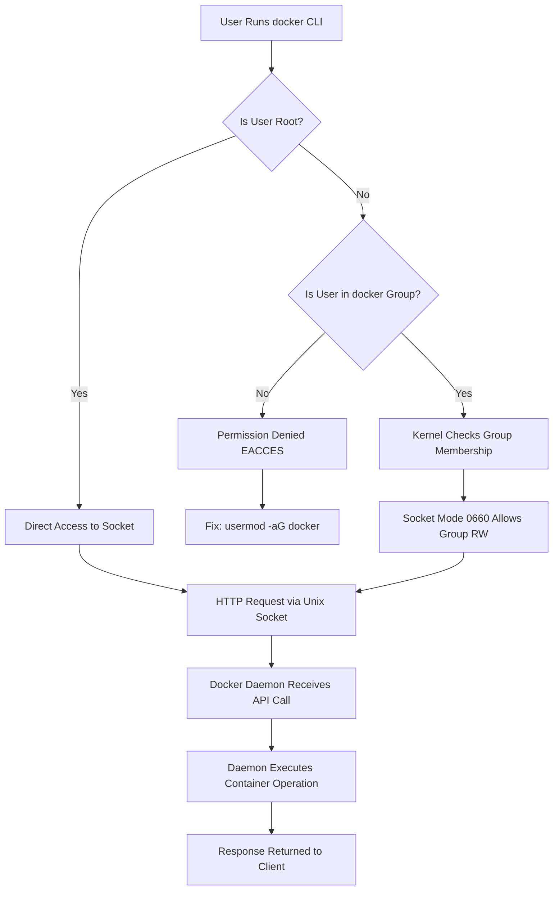

# Fix: Permission Denied on the Docker Daemon Socket

## Introduction

You've just deployed your first containerized service on a new host. You run `docker ps` as a non-root user and get slammed with this:

```
Got permission denied while trying to connect to the Docker daemon socket at unix:///var/run/docker.sock:
Post "http://%2Fvar%2Frun%2Fdocker.sock/v1.24/containers/json": dial unix /var/run/docker.sock:
connect: permission denied
```

It's one of the most common stumbling blocks in Docker adoption. The problem isn't Docker itself — it's how Unix socket permissions and Linux user groups interact. The Docker daemon binds to a Unix socket at `/var/run/docker.sock`, and by default, only `root` has read/write access to that file. Every other user gets a hard `EACCES` error before a single byte of the Docker API request leaves the client.

This article breaks down exactly why this happens, how to fix it safely, and what the security trade-offs look like in production.

## Why This Matters

In our production cluster, we once traced a full CI pipeline failure back to this exact error. The build agent user had been created after the Docker daemon started, so it never got added to the `docker` group. Every build job failed silently until someone noticed the error logs.

This matters because:

- **CI/CD pipelines run as service users.** If those users aren't in the right group, your deployments break.
- **Security misconfigurations compound.** Running containers as root to "fix" permission issues creates privilege escalation paths.
- **Debugging time is real.** The error message is cryptic enough that engineers waste hours chasing phantom network or firewall issues.

Understanding the Unix socket permission model behind Docker isn't just academic — it's a production necessity.

## How It Works

When the Docker daemon starts, it creates a Unix domain socket at `/var/run/docker.sock`. Unix sockets are special files on the filesystem. Like any file, they have an owner, a group, and a permission mode. The daemon process (running as root) creates this socket with mode `0660`, owner `root`, and group `docker`.

Here's the full request flow:



Step by step:

1. **Client invocation.** The `docker` CLI or any Docker API client attempts to connect to `/var/run/docker.sock`.
2. **Kernel-level permission check.** The Linux kernel inspects the socket file's mode bits. If the calling process's effective UID doesn't match the socket owner *and* the effective GID isn't in the socket's group, the kernel returns `EACCES` (error 13).
3. **Group membership resolution.** If the user is a member of the `docker` group (or whichever group owns the socket), the kernel grants read/write access based on the group permission bits.
4. **API communication.** Once connected, the client sends an HTTP request over the Unix socket. The Docker daemon parses the request, executes the operation (pull, run, inspect, etc.), and returns a JSON response.
5. **The fix path.** Adding a user to the `docker` group (`usermod -aG docker $USER`) updates `/etc/group`. The user must re-authenticate for the new group membership to take effect in the kernel's process credentials.

## Core Concepts

**Unix Domain Socket Permissions.** Unlike TCP sockets, Unix sockets are filesystem objects. They obey standard Unix permission semantics — `chmod`, `chown`, `ls -l` all apply. The socket file's mode determines who can connect. Docker defaults to `srw-rw----` (mode `0660`), owned by `root:docker`.

**Linux Group Membership and Process Credentials.** When a process starts, the kernel assigns it a set of supplementary group IDs (SGIDs) from `/etc/group`. Adding a user to a group with `usermod` updates `/etc/group` but does *not* retroactively change running processes. The user must log out and back in, or use `newgrp docker`, for the kernel to recognize the new SGID.

**The docker Group as a Privilege Boundary.** Membership in the `docker` group is functionally equivalent to root access. A user with `docker` group access can run a container mounting the host filesystem (`-v /:/host`), which gives them full root on the host. This is not a bug — it's an architectural trade-off. The Docker daemon runs as root, and the group is the mechanism for non-root clients to reach it.

**Socket Activation and Systemd.** Modern Docker installations use systemd socket activation. The socket file's permissions can be overridden via systemd unit configuration, which we'll cover in the code section.

## Examples & Code Walkthrough

### Diagnosing the Problem

Here's a diagnostic script we use in our onboarding runbooks. It checks every layer of the permission stack:

```bash
#!/usr/bin/env bash
# diagnose_docker_socket.sh — Full permission diagnostic for Docker socket access
set -euo pipefail

SOCKET_PATH="/var/run/docker.sock"
CURRENT_USER="$(id -un)"
CURRENT_GROUPS="$(id -Gn)"

echo "=== Docker Socket Diagnostic ==="
echo "Current user: ${CURRENT_USER}"
echo "Current groups: ${CURRENT_GROUPS}"
echo ""

# Step 1: Verify the socket exists
if [[ ! -S "${SOCKET_PATH}" ]]; then
    echo "[FAIL] Socket does not exist or is not a socket: ${SOCKET_PATH}"
    echo "       Is the Docker daemon running?"
    systemctl status docker --no-pager 2>/dev/null || true
    exit 1
fi
echo "[OK] Socket exists: ${SOCKET_PATH}"

# Step 2: Inspect socket permissions
SOCKET_INFO="$(stat -c '%A %U %G' "${SOCKET_PATH}")"
echo "[INFO] Socket permissions: ${SOCKET_INFO}"

SOCKET_MODE="$(stat -c '%a' "${SOCKET_PATH}")"
SOCKET_OWNER="$(stat -c '%U' "${SOCKET_PATH}")"
SOCKET_GROUP="$(stat -c '%G' "${SOCKET_PATH}")"

# Step 3: Check if current user is root
if [[ "${CURRENT_USER}" == "root" ]]; then
    echo "[OK] Running as root — full access guaranteed"
else
    # Step 4: Check group membership
    if echo "${CURRENT_GROUPS}" | grep -qw "docker"; then
        echo "[OK] User is a member of the docker group"
    else
        echo "[FAIL] User '${CURRENT_USER}' is NOT in the docker group"
        echo "       Fix: sudo usermod -aG docker ${CURRENT_USER}"
        echo "       Then: logout and re-login, or run: newgrp docker"
    fi
fi

# Step 5: Attempt actual socket connection
echo ""
echo "=== Testing Actual Socket Connection ==="
if docker info >/dev/null 2>&1; then
    echo "[OK] Successfully connected to Docker daemon"
else
    echo "[FAIL] Cannot connect to Docker daemon"
    echo "       Error details:"
    docker info 2>&1 | head -5
fi
```

### Fixing the Permission with a Script (Production-Safe)

This script handles the fix with proper error checking and validates that the daemon is healthy afterward:

```bash
#!/usr/bin/env bash
# fix_docker_socket_permissions.sh — Safely grant socket access to a user
set -euo pipefail

TARGET_USER="${1:-}"

if [[ -z "${TARGET_USER}" ]]; then
    echo "Usage: $0 <username>"
    exit 1
fi

# Verify the user exists on the system
if ! id "${TARGET_USER}" >/dev/null 2>&1; then
    echo "[ERROR] User '${TARGET_USER}' does not exist on this system."
    exit 1
fi

# Verify the docker group exists (it should if Docker is installed)
if ! getent group docker >/dev/null 2>&1; then
    echo "[ERROR] The 'docker' group does not exist."
    echo "        Is Docker installed? Creating group..."
    groupadd docker
fi

# Add user to docker group (idempotent — usermod handles duplicates gracefully)
echo "[INFO] Adding ${TARGET_USER} to the docker group..."
usermod -aG docker "${TARGET_USER}"

# Verify the change persisted
if id -nG "${TARGET_USER}" | tr ' ' '\n' | grep -qx "docker"; then
    echo "[OK] User '${TARGET_USER}' is now in the docker group."
else
    echo "[ERROR] Failed to add user to docker group."
    exit 1
fi

# Warn about the security implication
echo ""
echo "============================================"
echo "SECURITY NOTICE"
echo "============================================"
echo "User '${TARGET_USER}' now has root-equivalent"
echo "access to the Docker daemon. They can:"
echo "  - Run containers with host filesystem access"
echo "  - Modify or destroy running containers"
echo "  - Escalate to root on the host"
echo ""
echo "Only grant this to trusted users."
echo "============================================"
echo ""

# Check if daemon is healthy
echo "[INFO] Verifying Docker daemon health..."
if systemctl is-active --quiet docker; then
    echo "[OK] Docker daemon is active."
else
    echo "[WARN] Docker daemon is not active. Starting it..."
    systemctl start docker
    sleep 2
    systemctl is-active --quiet docker && echo "[OK] Docker daemon started." || echo "[FAIL] Could not start Docker daemon."
fi
```

### Python Client with Proper Error Handling

In production services that interact with the Docker API directly (not through the CLI), you need robust error handling around socket access. Here's a Python client we built for internal deployment tools:

```python
#!/usr/bin/env python3
"""docker_socket_client.py — Docker API client with socket permission handling."""

import socket
import json
import os
import sys
import logging
from typing import Optional

logging.basicConfig(
    level=logging.INFO,
    format="%(asctime)s [%(levelname)s] %(message)s"
)
logger = logging.getLogger("docker_client")

DOCKER_SOCKET = os.environ.get("DOCKER_SOCKET", "/var/run/docker.sock")
DOCKER_API_VERSION = "1.47"


class DockerSocketError(Exception):
    """Base exception for Docker socket operations."""
    pass


class PermissionDeniedError(DockerSocketError):
    """Raised when the socket denies access (EACCES)."""
    pass


class ConnectionFailedError(DockerSocketError):
    """Raised when the socket is unreachable."""
    pass


def check_socket_permissions(socket_path: str = DOCKER_SOCKET) -> dict:
    """
    Inspect socket file permissions and compare against
    the current process's UID/GID. Returns a dict with
    diagnostic information.
    """
    if not os.path.exists(socket_path):
        raise ConnectionFailedError(
            f"Socket not found at {socket_path}. "
            "Is the Docker daemon running?"
        )

    if not stat.S_ISSOCK(os.stat(socket_path).st_mode):
        raise ConnectionFailedError(
            f"Path exists but is not a socket: {socket_path}"
        )

    socket_stat = os.stat(socket_path)
    current_uid = os.getuid()
    current_gid = os.getgid()
    supplementary_groups = os.getgroups()

    result = {
        "socket_path": socket_path,
        "socket_owner_uid": socket_stat.st_uid,
        "socket_owner_gid": socket_stat.st_gid,
        "socket_mode": oct(socket_stat.st_mode & 0o777),
        "current_uid": current_uid,
        "current_gid": current_gid,
        "supplementary_groups": supplementary_groups,
        "is_root": current_uid == 0,
        "has_group_access": (
            socket_stat.st_gid in supplementary_groups
            or current_gid == socket_stat.st_gid
        ),
    }

    # Evaluate access: root bypasses everything,
    # group membership grants rw per the mode bits
    if result["is_root"]:
        result["access_granted"] = True
    elif result["has_group_access"] and (socket_stat.st_mode & 0o060):
        result["access_granted"] = True
    else:
        result["access_granted"] = False

    return result


def send_docker_api_request(endpoint: str, method: str = "GET") -> Optional[dict]:
    """
    Send a raw HTTP request to the Docker daemon via the Unix socket.
    Handles permission errors explicitly with actionable messages.
    """
    diagnostics = check_socket_permissions()

    if not diagnostics["access_granted"]:
        raise PermissionDeniedError(
            f"Permission denied connecting to Docker socket at {DOCKER_SOCKET}.\n"
            f"  Socket owner UID: {diagnostics['socket_owner_uid']}\n"
            f"  Your UID: {diagnostics['current_uid']}\n"
            f"  Your groups: {diagnostics['supplementary_groups']}\n"
            f"  Fix: Add your user to the 'docker' group:\n"
            f"        sudo usermod -aG docker $USER\n"
            f"        Then re-login or run: newgrp docker"
        )

    try:
        sock = socket.socket(socket.AF_UNIX, socket.SOCK_STREAM)
        sock.settimeout(10)  # 10-second timeout prevents hangs on dead daemon
        sock.connect(DOCKER_SOCKET)
    except FileNotFoundError:
        raise ConnectionFailedError(
            f"Socket file not found at {DOCKER_SOCKET}"
        )
    except ConnectionRefusedError:
        raise ConnectionFailedError(
            "Connection refused. Docker daemon may not be running."
        )

    try:
        # Build a minimal HTTP request for the Docker API
        request_line = f"{method} /v{DOCKER_API_VERSION}/{endpoint} HTTP/1.1\r\n"
        headers = (
            f"Host: docker\r\n"
            f"User-Agent: docker-client/1.0\r\n"
            f"Accept: application/json\r\n"
            f"\r\n"
        )
        full_request = request_line + headers

        sock.sendall(full_request.encode("utf-8"))

        # Read the response in chunks
        response_chunks = []
        while True:
            chunk = sock.recv(4096)
            if not chunk:
                break
            response_chunks.append(chunk)
            # Safety: stop after 1MB to prevent memory exhaustion
            if sum(len(c) for c in response_chunks) > 1024 * 1024:
                break

        raw_response = b"".join(response_chunks).decode("utf-8", errors="replace")

        # Split headers from body
        header_end = raw_response.find("\r\n\r\n")
        if header_end == -1:
            return {"raw": raw_response}

        headers_raw = raw_response[:header_end]
        body_raw = raw_response[header_end + 4:]
