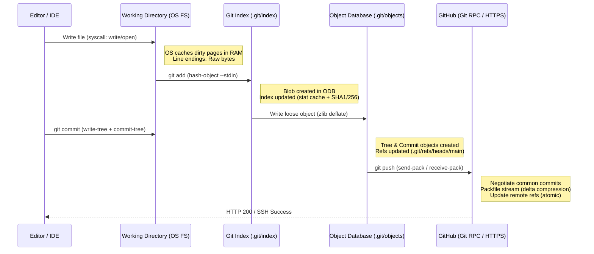

# From Local Folder to Github: Setting Up my First Project With Git and Github: A Guide

## Introduction

You have a folder. It sits on a disk, managed by a filesystem—NTFS, APFS, ext4, maybe ZFS if you're feeling adventurous. It contains source code, configuration, maybe a binary or two. Right now, it is just a directory tree. It has no history, no collaboration model, no safety net.

Turning that folder into a Git repository hosted on GitHub is the rite of passage for every developer, but the tutorials usually skip the part where the operating system fights back. They skip the line-ending normalization that silently corrupts a shell script on Linux after editing it on Windows. They skip the file permission bits that `git add` captures but your CI runner ignores. They skip the credential helper that stores your token in the Windows Credential Manager vs. the macOS Keychain vs. `libsecret` on GNOME.

This guide bridges that gap. We treat Git not as a CLI cheat sheet, but as a content-addressable filesystem layer sitting *on top* of your OS. Understanding that boundary is the difference between "it works on my machine" and a reproducible, professional workflow.

## Why This Matters

Version control is the substrate of modern software delivery. But Git leaks OS abstractions constantly.

*   **Filesystem Semantics:** Git tracks executable bits (`mode 100755`) and symlinks. Windows historically ignores the former and requires admin rights for the latter. If your `gradlew` script loses the `+x` bit because a teammate committed from PowerShell, your build breaks.
*   **Path Constraints:** NTFS allows filenames ending in spaces or dots; ext4 does not. Git allows both. A repo created on Linux with a file named `config ` (trailing space) is unusable on a standard Windows checkout.
*   **Line Endings:** The `core.autocrlf` setting is the single biggest source of "phantom diffs" in cross-platform teams. It is an OS boundary translation layer, not a Git feature.
*   **Credential Storage:** The `credential.helper` protocol delegates secrets to the OS keychain. Misconfigure it, and you leak PATs in shell history or `.git/config`.

Mastering the local-to-remote pipeline means mastering these OS integration points. That is what separates a user from an architect.

## How It Works

The lifecycle of a file moving from your editor to GitHub involves four distinct storage layers, each with different performance and consistency guarantees.



**Step-by-Step Breakdown:**

1.  **Working Directory (OS Filesystem):** Your editor issues `write()` syscalls. The OS manages inodes, directory entries, and page cache. Git sees *snapshots* of this state via `stat()`.
2.  **The Index (Staging Area):** A binary file (`.git/index`) mapping path -> (mode, mtime, size, SHA-1). It is a *cache* of the Working Directory state. `git add` hashes content (`git hash-object -w`), writes a loose object to `.git/objects/`, and updates this index. It does **not** copy file content into the index.
3.  **Object Database (`.git/objects`):** Content-addressable store. Blobs (file content), Trees (directory listings), Commits (metadata + root tree), Tags. Stored initially as loose objects (zlib compressed), later packed into `.pack` files with delta compression for network transfer.
4.  **Remote (GitHub):** The `git push` negotiation (`git-receive-pack` on server) determines missing objects. Client streams a packfile. Server unpacks, verifies connectivity, updates refs atomically (via `git update-ref` or `git-receive-pack` hooks).

## Core Concepts

### The Three Trees
Git manages three "trees" (directory structures) simultaneously:
1.  **HEAD:** The last commit snapshot (immutable).
2.  **Index (Staging Area):** The *proposed* next commit snapshot (mutable).
3.  **Working Directory:** The sandbox where you edit files (chaos).

`git add` copies WD -> Index. `git commit` copies Index -> HEAD (creating new tree/commit objects). `git checkout` (or `switch`/`restore`) copies HEAD -> Index -> WD.

### Object Model & Hashing
Git uses SHA-1 (transitioning to SHA-256) to name objects.
*   **Blob:** `blob <size>\0<content>` -> Hash. Pure file content, no filename.
*   **Tree:** `tree <size>\0<mode> <name>\0<sha>...` -> Hash. Directory listing referencing blobs/trees.
*   **Commit:** `commit <size>\0<tree> <parent> <author> <committer> <msg>` -> Hash. The anchor of history.

### The Packfile Protocol
Loose objects are inefficient for transfer. `git push` creates a **thin pack** (deltas against objects the server *likely* has). The server "fixes" the thin pack (resolves deltas against its own ODB) and installs it. This is why the first push is slow (sends everything), but subsequent pushes are fast (sends only deltas).

### Refs & The Reflog
Branches (`refs/heads/main`), tags (`refs/tags/v1.0`), and `HEAD` are just pointers (files in `.git/refs/` or packed in `.git/packed-refs`). The **Reflog** (`.git/logs/HEAD`, `.git/logs/refs/heads/main`) is your local undo log—it records every tip movement *locally*, even for deleted branches. It expires after 90 days by default (`gc.reflogExpire`).

## Examples & Code Walkthrough

### 1. Cross-Platform Repository Bootstrap Script
Don't run `git init` manually. Bootstrap the repo with OS-aware defaults: line endings, default branch, commit signing, and a safe `core.autocrlf` strategy.

**File:** `scripts/bootstrap-repo.sh` (Run via Git Bash on Windows, native shell on macOS/Linux)

```bash
#!/usr/bin/env bash
# bootstrap-repo.sh
# Idempotent repository initialization with OS-specific safety defaults.
# Usage: curl -fsSL <url>/bootstrap-repo.sh | bash -s "My Project"

set -euo pipefail

PROJECT_NAME="${1:-$(basename "$PWD")}"
REPO_ROOT="$(git rev-parse --show-toplevel 2>/dev/null || echo "$PWD")"

# --- OS Detection & Git Config Strategy ---
OS_KERNEL="$(uname -s)"
case "$OS_KERNEL" in
    Linux*)     OS_FAMILY="linux"; CRED_HELPER="cache --timeout=7200" ;;
    Darwin*)    OS_FAMILY="macos"; CRED_HELPER="osxkeychain" ;;
    CYGWIN*|MINGW*|MSYS*) OS_FAMILY="windows"; CRED_HELPER="manager" ;;
    *)          OS_FAMILY="unknown"; CRED_HELPER="cache" ;;
esac

echo "🛠  Bootstrapping '$PROJECT_NAME' on $OS_FAMILY ($OS_KERNEL)"

# 1. Initialize if needed (safe to re-run)
if [[ ! -d "$REPO_ROOT/.git" ]]; then
    git -C "$REPO_ROOT" init -b main
    echo "✅ Initialized empty Git repository in $REPO_ROOT"
else
    echo "ℹ️  Repository already exists."
fi

# 2. Configure Line Endings (The #1 Cross-Platform Footgun)
# Strategy: "Checkout as LF, Commit as LF" (input) on Unix.
# Windows: "Checkout as CRLF, Commit as LF" (true).
# We enforce this *locally* (--local) so it travels with the repo via .git/config
# but user global config wins if they explicitly set it.
if [[ "$OS_FAMILY" == "windows" ]]; then
    git -C "$REPO_ROOT" config core.autocrlf true
    git -C "$REPO_ROOT" config core.eol crlf
    echo "⚙️  core.autocrlf=true (Checkout CRLF, Commit LF)"
else
    git -C "$REPO_ROOT" config core.autocrlf input
    git -C "$REPO_ROOT" config core.eol lf
    echo "⚙️  core.autocrlf=input (Checkout LF, Commit LF)"
fi

# 3. Safety Defaults
git -C "$REPO_ROOT" config push.default simple          # Push only current branch
git -C "$REPO_ROOT" config pull.rebase true             # Rebase local commits on pull
git -C "$REPO_ROOT" config merge.ff only                # No merge commits on fast-forward
git -C "$REPO_ROOT" config init.defaultBranch main      # Explicit main branch
git -C "$REPO_ROOT" config commit.gpgsign true          # Require signed commits (if key exists)
git -C "$REPO_ROOT" config tag.gpgsign true             # Sign tags
git -C "$REPO_ROOT" config credential.helper "$CRED_HELPER" # OS Keychain integration

# 4. Filesystem Monitor (Performance)
# 'fsmonitor' daemon (built-in since Git 2.37) watches FS events via OS APIs (FSEvents, inotify, ReadDirectoryChangesW)
# Drastically speeds up `git status` on large repos.
git -C "$REPO_ROOT" config core.fsmonitor true
git -C "$REPO_ROOT" config core.untrackedCache true

# 5. Create .gitattributes (Source of Truth for Line Endings)
# This overrides core.autocrlf for specific paths. Commit this file.
cat > "$REPO_ROOT/.gitattributes" <<'EOF'
# Auto detect text files and enforce LF normalization
* text=auto eol=lf

# Explicit binary detection (prevents diff corruption)
*.png binary
*.jpg binary
*.jpeg binary
*.gif binary
*.ico binary
*.woff binary
*.woff2 binary
*.ttf binary
*.eot binary
*.pdf binary
*.zip binary
*.gz binary
*.tar binary

# Scripts/Configs MUST have LF endings everywhere
*.sh text eol=lf
*.bash text eol=lf
*.zsh text eol=lf
*.py text eol=lf
Dockerfile text eol=lf
*.yml text eol=lf
*.yaml text eol=lf
*.json text eol=lf
*.toml text eol=lf
*.ini text eol=lf
*.cfg text eol=lf

# Windows batch files need CRLF on checkout
*.bat text eol=crlf
*.cmd text eol=crlf
*.ps1 text eol=crlf
EOF
echo "📝 Written .gitattributes (enforces LF for code, CRLF for Windows scripts)"

# 6. Initial Commit Scaffold
if [[ -z "$(git -C "$REPO_ROOT" log --oneline -1 2>/dev/null)" ]]; then
    cat > "$REPO_ROOT/README.md" <<EOF
# $PROJECT_NAME

Bootstrapped with OS-aware Git defaults.
OS Family: $OS_FAMILY
EOF
    git -C "$REPO_ROOT" add .gitattributes README.md
    git -C "$REPO_ROOT" commit -m "chore: bootstrap repository with OS-aware defaults

- Configure core.autocrlf/eol for $OS_FAMILY
- Enable fsmonitor & untrackedCache for performance
- Enforce LF for source, CRLF for Windows scripts via .gitattributes
- Set push.default=simple, pull.rebase=true
"
    echo "🎉 Initial commit created."
fi

echo ""
echo "✅ Bootstrap complete. Next steps:"
echo "   1. gh repo create --source=. --push --public  (or --private)"
echo "   2. git push -u origin main"
```

**Why this works:**
*   It detects the OS kernel (`uname -s`) to select the correct `credential.helper` and `core.autocrlf` strategy.
*   It writes `.gitattributes` *into the repo*. This is the only reliable way to enforce line endings across *all* contributors regardless of their local `core.autocrlf` setting.
*   It enables `core.fsmonitor` and `core.untrackedCache`. On a repo with 50k+ files, `git status` drops from ~2s to ~50ms because Git subscribes to OS filesystem events (kqueue/inotify/ReadDirectoryChangesW) instead of `stat()`-ing every file.

---

### 2. Inspecting the Object Database (Python Diagnostic)
When things go wrong (corruption, missing objects, size analysis), you need to read the ODB directly. This script walks `.git/objects` and prints a human-readable manifest.

**File:** `scripts/inspect_odb.py`

```python
#!/usr/bin/env python3
# inspect_odb.py
# Walks .git/objects, decompresses loose objects, and prints type/size/refs.
# Requires: Python 3.8+ (stdlib only: zlib, pathlib, sys, hashlib)

import zlib
import sys
import hashlib
from pathlib import Path
from typing import Tuple, Optional

GIT_DIR = Path(".git")
OBJECTS_DIR = GIT_DIR / "objects"

def read_loose_object(sha_hex: str) -> Tuple[str, int, bytes]:
    """Read, verify hash, decompress, parse header."""
    # Path: .git/objects/ab/cdef1234...
    obj_path = OBJECTS_DIR / sha_hex[:2] / sha_hex[2:]
    if not obj_path.is_file():
        raise FileNotFoundError(f"Loose object not found: {sha_hex}")

    compressed = obj_path.read_bytes()
    try:
        decompressed = zlib.decompress(compressed)
    except zlib.error as e:
        raise ValueError(f"Zlib decompression failed for {sha_hex}: {e}")

    # Verify SHA-1 (Git's current default)
    # Format: "type size\0content"
    header_end = decompressed.find(b'\x00')
    if header_end == -1:
