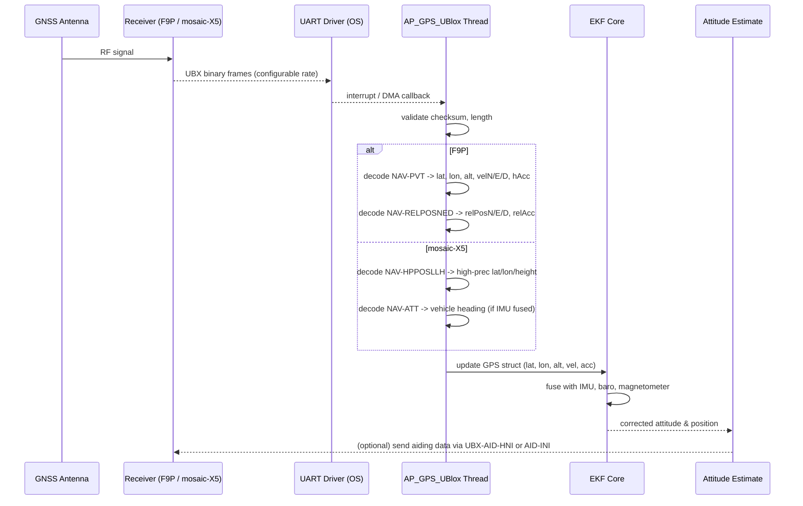

# mosaic-X5 vs u-blox F9P for ArduPilot: what you actually get for the extra cost

## Introduction
When you choose a GNSS receiver for an ArduPilot‑based airframe you are really deciding how the flight controller’s operating system will obtain position, velocity and time (PVT) data. The two modules that come up most often in DIY and professional builds are the u‑blox ZED‑F9P and the newer Septentrio mosaic‑X5. Both can deliver centimeter‑level accuracy when used with an RTK base, but they differ in price, interface complexity and the way they expose measurements to the OS. This article walks through those differences from a software‑engineer’s perspective, focusing on what you actually receive for the extra dollars spent on the mosaic‑X5.

## Why This Matters
ArduPilot runs on a real‑time OS (NuttX on most STM32‑based flight controllers, or a Linux‑based companion computer). The GPS driver lives as a thread or interrupt service routine that reads raw binary messages, converts them into the internal `GPS` struct and feeds the EKF. If the driver cannot keep up with the message rate, or if it misinterprets a field, the filter can diverge and cause sudden jumps in position estimates. Understanding the trade‑offs helps you:

* Pick a receiver that matches your update‑rate requirements without overloading the UART.
* Avoid silent failures where the GPS reports a valid fix but the OS discards it due to checksum or length errors.
* Size your buffer and task priorities correctly when you move from a single‑frequency to a dual‑frequency solution.

## How It Works
Both receivers communicate over a UART (or USB‑CDC) using the UBX binary protocol. ArduPilot’s `AP_GPS_UBlox` driver opens the serial port, configures the receiver to send a subset of messages (NAV‑PVT, NAV‑RELPOSNED, NAV‑CLOCK, etc.) and then parses each incoming packet in a tight loop.

Below is a simplified flow that shows how data moves from the antenna to the EKF.



**Step‑by‑step explanation**

1. **Receiver configuration** – At boot the driver sends a UBX‑CFG‑MSG request to enable only the needed messages. This reduces UART load.
2. **Message reception** – The OS UART peripheral raises an interrupt on each byte (or uses DMA to fill a ring buffer). The GPS thread extracts complete frames when it sees the UBX sync characters `0xB5 0x62`.
3. **Checksum & length validation** – A simple Fletcher checksum is computed; if it fails the frame is dropped and a debug counter increments.
4. **Message‑type dispatch** – Based on the UBX class and ID the driver calls the appropriate decode function.
5. **EKF update** – The decoded fields are copied into a thread‑safe `GPS` structure. The EKF reads this structure at its own rate (typically 50 Hz) and applies a covariance based on the reported accuracy (`hAcc`, `vAcc`).
6. **Optional aiding** – For advanced receivers like the mosaic‑X5 you can feed back vehicle heading or time‑pulse to improve satellite acquisition; the driver can transmit UBX‑AID‑HNI messages when the EKF reports a reliable yaw estimate.

## Core Concepts
* **Message rate vs. UART bandwidth** – A dual‑frequency receiver outputting both NAV‑PVT and NAV‑RELPOSNED at 10 Hz yields roughly 250 bytes per message set. At 20 Hz the UART must sustain >4 KB/s, which is still well within the 115200 baud limit but leaves little margin for other telemetry.
* **Accuracy fields** – Both modules report horizontal (`hAcc`) and vertical (`vAcc`) accuracy in millimeters. The EKF uses these values to weight the GPS measurement; a poorly calibrated accuracy field can cause the filter to trust a noisy fix.
* **Relative positioning** – The F9P’s NAV‑RELPOSNED provides the baseline vector from the rover to a base station when operating in RTK mode. The mosaic‑X5 instead offers NAV‑HPPOSLLH, which delivers a high‑precision latitude/longitude/height directly, removing the need for a separate baseline conversion in the driver.
* **IMU‑aided models** – Some mosaic‑X5 variants integrate a MEMS IMU and can output attitude (NAV‑ATT). When this is present the driver can optionally feed the EKF a heading measurement, reducing yaw drift.
* **Error handling** – The driver maintains per‑message error counters. If a counter exceeds a threshold the driver attempts a hot‑reset of the receiver via UBX‑CFG‑RST.

## Examples & Code Walkthrough
Below is a trimmed‑down version of the ArduPilot `AP_GPS_UBlox::parse_ubx` method that shows how we handle the two receivers. The code is written in C++ with defensive checks and comments explaining each step.

```cpp
// AP_GPS_UBlox.cpp
bool AP_GPS_UBlox::parse_ubx(const uint8_t *buf, uint16_t len)
{
    // Minimal UBX frame: sync0 sync1 class id length(LSB) length(MSB) payload... CK_A CK_B
    if (len < 8) {
        gps_debug_printf("UBX frame too short\n");
        return false;
    }

    if (buf[0] != 0xB5 || buf[1] != 0x62) {
        gps_debug_printf("Bad UBX sync\n");
        return false;
    }

    uint8_t cls   = buf[2];
    uint8_t id    = buf[3];
    uint16_t payload_len = (uint16_t)buf[4] | ((uint16_t)buf[5] << 8);
    if (payload_len + 8 != len) {
        gps_debug_printf("Length mismatch: expected %u got %u\n", payload_len+8, len);
        return false;
    }

    // Fletcher checksum
    uint8_t ck_a = 0, ck_b = 0;
    for (uint16_t i = 2; i < len - 2; ++i) {
        ck_a += buf[i];
        ck_b += ck_a;
    }
    if (ck_a != buf[len-2] || ck_b != buf[len-1]) {
        gps_debug_printf("UBX checksum failed\n");
        return false;
    }

    const uint8_t *payload = buf + 6;

    // ---- F9P specific messages ----
    if (cls == UBX_CLASS_NAV && id == UBX_NAV_PVT) {
        if (payload_len < sizeof(ubx_nav_pvt_t)) {
            gps_debug_printf("NAV-PVT payload too small\n");
            return false;
        }
        const ubx_nav_pvt_t *msg = reinterpret_cast<const ubx_nav_pvt_t*>(payload);
        // Only accept if fix type >= 3 (3D fix)
        if (msg->fixType < 3) {
            gps_debug_printf("No 3D fix (fixType=%u)\n", msg->fixType);
            return false;
        }
        // Convert from degrees * 1e-7 to degrees double
        gps->latitude  = msg->lat * 1e-7;
        gps->longitude = msg->lon * 1e-7;
        gps->altitude  = msg->height * 1e-3; // mm -> m
        gps->ground_speed = sqrt(sq(msg->velN) + sq(msg->velE)) * 1e-3; // mm/s -> m/s
        gps->ground_course = msg->heading * 1e-5; // deg * 1e-5 -> deg
        // Accuracy fields are in mm
        gps->eph = msg->hAcc * 1e-3;
        gps->epv = msg->vAcc * 1e-3;
        gps->fix_type = GPS::GPS_OK_FIX_3D;
        return true;
    }

    if (cls == UBX_CLASS_NAV && id == UBX_NAV_RELPOSNED) {
        if (payload_len < sizeof(ubx_nav_relposned_t)) {
            gps_debug_printf("NAV-RELPOSNED payload too small\n");
            return false;
        }
        const ubx_nav_relposned_t *msg = reinterpret_cast<const ubx_nav_relposned_t*>(payload);
        // Relative north/east/down in mm
        gps->rel_pos_n = msg->relPosN * 1e-3;
        gps->rel_pos_e = msg->relPosE * 1e-3;
        gps->rel_pos_d = msg->relPosD * 1e-3;
        gps->rel_pos_acc = sqrt(sq(msg->relPosAccN) + sq(msg->relPosAccE) + sq(msg->relPosAccD)) * 1e-3;
        // Mark that we have RTK relative data
        gps->rtk_flag = true;
        return true;
    }

    // ---- mosaic‑X5 specific messages ----
    if (cls == UBX_CLASS_NAV && id == UBX_NAV_HPPOSLLH) {
        if (payload_len < sizeof(ubx_nav_hpposllh_t)) {
            gps_debug_printf("NAV-HPPOSLLH payload too small\n");
            return false;
        }
        const ubx_nav_hpposllh_t *msg = reinterpret_cast<const ubx_nav_hpposllh_t*>(payload);
        // High‑precision components are in 0.01 mm units
        double lat = (msg->lat + msg->latHp * 1e-2) * 1e-7;
        double lon = (msg->lon + msg->lonHp * 1e-2) * 1e-7;
        double alt = (msg->height + msg->heightHp * 1e-2) * 1e-3;
        gps->latitude  = lat;
        gps->longitude = lon;
        gps->altitude  = alt;
        // Accuracy fields are already in mm
        gps->eph = msg->hAcc * 1e-3;
        gps->epv = msg->vAcc * 1e-3;
        gps->fix_type = GPS::GPS_OK_FIX_3D;
        return true;
    }

    if (cls == UBX_CLASS_NAV && id == UBX_NAV_ATT) {
        if (payload_len < sizeof(ubx_nav_att_t)) {
            gps_debug_printf("NAV-ATT payload too small\n");
            return false;
        }
        const ubx_nav_att_t *msg = reinterpret_cast<const ubx_nav_att_t*>(payload);
        // Heading in degrees * 1e-5
        gps->ground_course = msg->heading * 1e-5;
        // Optional: we could feed this to the EKF as a yaw measurement
        // (omitted here for brevity)
        return true;
    }

    // Unknown or unsupported message – silently drop
    return false;
}
```

**What the snippet shows**

* Early bail‑outs for malformed frames protect the UART interrupt loop from spending time on bad data.
* Separate blocks for each message type make it easy to add new mosaic‑X5‑specific fields without touching the F9P logic.
* Accuracy fields are converted from millimeters to meters before being stored in the shared `GPS` struct, ensuring the EKF receives SI units.
* The function returns `true` only when a *usable* fix is decoded; otherwise the caller keeps the previous GPS state.

## Best Practices
1. **Limit UART traffic** – Enable only the messages you actually need. For a basic RTK rover, `NAV‑PVT` + `NAV‑RELP
