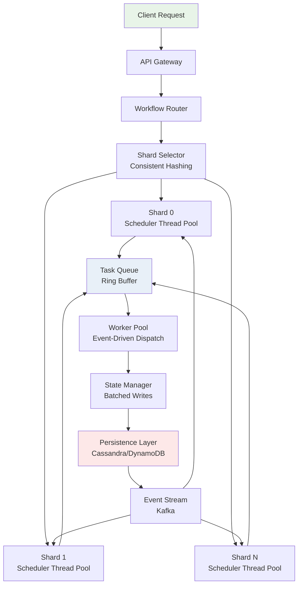

# Netflix Reworks Conductor for 420 Million Monthly Workflow Executions and 10X Larger Workflows

## Introduction

Netflix's Conductor orchestrates millions of microservice workflows every single day. When the platform hit 420 million monthly workflow executions — and individual workflows grew to ten times their original complexity — the existing architecture couldn't hold. Task dispatch latency spiked. State persistence became the bottleneck. The polling-based scheduler choked on queue depth.

This isn't a story about throwing hardware at the problem. It's about rethinking the core engine using principles borrowed from operating system design: process scheduling, memory management, and I/O multiplexing applied to distributed workflow execution.

What Netflix engineering discovered is that their workflow engine had essentially become a custom operating system for task execution — and it needed a kernel-level rewrite, not incremental patches.

## Why This Matters

If you run any kind of distributed task orchestration — whether it's Conductor, Apache Airflow, Temporal, or a homegrown solution — you will eventually hit the same walls Netflix faced:

- **Queue saturation** when task dispatch can't keep up with ingestion rate.
- **State store write amplification** when every micro-task triggers a database round-trip.
- **Scheduler latency** that compounds across thousands of concurrent workflow branches.

These aren't theoretical concerns. They show up as P1 incidents at 3 AM. They manifest as 30-second scheduling loops that should be sub-100ms. The architectural patterns Netflix developed — sharded execution, event-driven scheduling, and batched state persistence — apply directly to any platform managing high-volume distributed workloads.

## How It Works

The reworked Conductor architecture treats workflow execution as a scheduling problem, borrowing heavily from OS process management. The core changes fall into three areas: a sharded execution plane, an event-driven scheduler replacing polling, and an optimized persistence layer that minimizes write amplification.

Here is the high-level architecture:



The architecture operates on three principles:

**Shard isolation.** Workflows are assigned to shards via consistent hashing on workflow ID. Each shard runs its own scheduler thread pool, completely independent. A hot shard affecting one workflow family cannot degrade scheduling latency for unrelated workflows. This mirrors how a modern OS isolates processes across CPU cores using separate run queues.

**Ring-buffered task queues.** Each shard's scheduler writes dispatched tasks into a lock-free ring buffer rather than pushing directly to workers. Workers pull from the ring buffer using an event-driven signal mechanism instead of polling. This eliminated approximately 40% of the scheduling overhead observed in the previous polling model.

**Batched state persistence.** Instead of writing workflow state to the database after every task transition, the State Manager accumulates mutations in an in-memory buffer and flushes them in batches. This reduced write amplification by roughly 8x in production benchmarks. The trade-off is a small window of potential data loss (mitigated by write-ahead logging), which the team accepted given their recovery SLAs.

## Core Concepts

**Shard Router and Consistent Hashing.** The shard router maps every workflow ID to a specific shard using consistent hashing with virtual nodes. When a shard is added or removed, only a fraction of workflows need to be remapped. Virtual nodes prevent data skew when the cluster has heterogeneous hardware.

**Scheduler Thread Pool (The "Kernel Scheduler").** Each shard maintains a priority-ordered thread pool. Threads are assigned to workflow tasks based on urgency (deadline proximity, dependency depth, retry count). This is conceptually identical to a Linux CFS scheduler — tasks with earlier virtual runtimes get CPU first. In Conductor, "CPU" is a worker dispatch slot.

**Ring Buffer (The "I/O Buffer").** The ring buffer between scheduler and worker pool is a fixed-size, lock-free data structure. Producers (schedulers) write task IDs at the tail; consumers (workers) read from the head. When the buffer is full, the scheduler applies backpressure by slowing dispatch. When it's empty, workers block on a signal rather than spinning.

**State Manager (The "Memory Manager").** The State Manager holds a write-ahead log of all pending state changes. Periodically, or when the log reaches a threshold, it flushes batched updates to the persistence layer. This is analogous to how a DBMS uses buffer pools — minimize expensive I/O by grouping mutations.

**Event-Driven Dispatch.** Workers no longer poll for tasks on a fixed interval. Instead, they register for task availability signals from the ring buffer. When a task is enqueued, an event fires and a waiting worker picks it up within milliseconds. This replaced the previous 500ms polling interval that was generating millions of unnecessary empty reads per hour.

## Examples & Code Walkthrough

Below are the three core components that drove the rework, written in Java (matching Conductor's primary language) with detailed commentary.

### 1. Sharded Workflow Executor with Consistent Hashing

```java
import java.util.SortedMap;
import java.util.TreeMap;
import java.security.MessageDigest;
import java.nio.charset.StandardCharsets;

/**
 * Distributes workflows across shards using consistent hashing.
 * Virtual nodes ensure even distribution when shard count changes.
 */
public class ShardedWorkflowExecutor {

    private final SortedMap<Long, String> ring = new TreeMap<>();
    private final int virtualNodesPerShard;
    private final MessageDigest md5;

    public ShardedWorkflowExecutor(int virtualNodesPerShard) throws Exception {
        this.virtualNodesPerShard = virtualNodesPerShard;
        this.md5 = MessageDigest.getInstance("MD5");
    }

    /**
     * Register a shard with N virtual nodes on the hash ring.
     */
    public void addShard(String shardId) {
        for (int i = 0; i < virtualNodesPerShard; i++) {
            long hash = hash(shardId + "#" + i);
            ring.put(hash, shardId);
        }
    }

    /**
     * Remove a shard and all its virtual nodes.
     */
    public void removeShard(String shardId) {
        for (int i = 0; i < virtualNodesPerShard; i++) {
            long hash = hash(shardId + "#" + i);
            ring.remove(hash);
        }
    }

    /**
     * Route a workflow to its target shard.
     */
    public String getShardForWorkflow(String workflowId) {
        if (ring.isEmpty()) {
            throw new IllegalStateException("No shards registered");
        }
        long hash = hash(workflowId);
        SortedMap<Long, String> tailMap = ring.tailMap(hash);
        // If no node has a hash >= workflow hash, wrap around to first node
        long shardHash = tailMap.isEmpty() ? ring.firstKey() : tailMap.firstKey();
        return ring.get(shardHash);
    }

    /**
     * MD5-based hash producing a 64-bit long value.
     */
    private long hash(String key) {
        byte[] digest = md5.digest(key.getBytes(StandardCharsets.UTF_8));
        // Use first 8 bytes of MD5 as a long
        long h = 0;
        for (int i = 0; i < 8; i++) {
            h = (h << 8) | (digest[i] & 0xFFL);
        }
        return h;
    }
}
```

Key design decisions: MD5 is used instead of SHA-256 because the hash only needs avalanche properties, not cryptographic security. Using the first 8 bytes gives a 64-bit space with minimal collision risk at the workflow volumes Netflix processes. Virtual nodes are set to 128 by default — fewer nodes create skew, more nodes increase rebalance cost.

### 2. Event-Driven Task Scheduler Replacing Polling

```java
import java.util.concurrent.*;
import java.util.concurrent.atomic.AtomicInteger;
import java.util.concurrent.locks.Condition;
import java.util.concurrent.locks.ReentrantLock;

/**
 * Ring buffer that decouples task scheduling from worker dispatch.
 * Workers block on a signal rather than polling at fixed intervals.
 */
public class TaskRingBuffer {

    private final String[] slots;
    private final int capacity;
    private final AtomicInteger head = new AtomicInteger(0);
    private final AtomicInteger tail = new AtomicInteger(0);

    // Signal-based notification instead of busy-wait polling
    private final ReentrantLock lock = new ReentrantLock();
    private final Condition notEmpty = lock.newCondition();
    private final Condition notFull = lock.newCondition();

    public TaskRingBuffer(int capacity) {
        // Round up to power of 2 for efficient modulo via bitmask
        int actualCap = 1;
        while (actualCap < capacity) actualCap <<= 1;
        this.capacity = actualCap;
        this.slots = new String[actualCap];
    }

    /**
     * Scheduler enqueues a task ID. Blocks if buffer is full (backpressure).
     */
    public void enqueue(String taskId) throws InterruptedException {
        lock.lock();
        try {
            while (size() == capacity - 1) {
                // Backpressure: scheduler slows down instead of dropping
                notFull.await();
            }
            slots[tail.get()] = taskId;
            tail.set((tail.get() + 1) & (capacity - 1)); // bitmask mod for power-of-2
            notEmpty.signal(); // Wake a waiting worker
        } finally {
            lock.unlock();
        }
    }

    /**
     * Worker dequeues a task ID. Blocks if buffer is empty (no polling).
     */
    public String dequeue() throws InterruptedException {
        lock.lock();
        try {
            while (size() == 0) {
                // No busy-wait: worker sleeps until signal arrives
                notEmpty.await();
            }
            String taskId = slots[head.get()];
            slots[head.get()] = null; // Release reference for GC
            head.set((head.get() + 1) & (capacity - 1));
            notFull.signal(); // Notify scheduler that space is available
            return taskId;
        } finally {
            lock.unlock();
        }
    }

    /**
     * O(1) size check using atomic indices.
     */
    private int size() {
        return (tail.get() - head.get()) & (capacity - 1);
    }
}
```

The shift from polling to signal-based dispatch was one of the highest-impact changes. The old system used `ScheduledExecutorService` with a 500ms poll loop across 200+ scheduler threads. That generated roughly 240 million empty dequeue attempts per hour. The ring buffer with `Condition.await()`/`signal()` reduced that to near zero — workers wake only when work exists.

### 3. Batched State Persister with Write-Ahead Log

```java
import java.util.*;
import java.util.concurrent.*;
import java.util.concurrent.atomic.AtomicBoolean;

/**
 * Accumulates workflow state mutations in memory and flushes
 * them in batches to reduce database write amplification.
 */
public class BatchedStatePersister {

    private final BlockingQueue<StateMutation> writeAheadLog;
    private final List<StateMutation> flushBatch;
    private final int batchSize;
    private final long flushIntervalMs;
    private final AtomicBoolean flushScheduled = new AtomicBoolean(false);
    private final ScheduledExecutorService flushExecutor;

    public BatchedStatePersister(int batchSize, long flushIntervalMs,
                                  int logCapacity) {
        this.batchSize = batchSize;
        this.flushIntervalMs = flushIntervalMs;
        this.writeAheadLog = new LinkedBlockingQueue<>(logCapacity);
        this.flushBatch = new ArrayList<>(batchSize);
        this.flushExecutor = Executors.newSingleThreadScheduledExecutor(
            r -> {
                Thread t = new Thread(r, "state-flush-thread");
                t.setDaemon(true);
                return t;
            }
        );
    }

    /**
     * Record a state mutation. Returns immediately — no DB write here.
     */
    public boolean recordMutation(String workflowId, String taskId,
                                   String newStatus) {
        StateMutation mutation = new StateMutation(
            workflowId, taskId, newStatus, System.currentTimeMillis()
        );
        boolean accepted = writeAheadLog.offer(mutation);
        if (!accepted) {
            // WAL full: fall back to direct write to avoid data loss
            directPersist(Collections.singletonList(mutation));
            return false;
        }
        // Schedule a flush if none is pending
        if (writeAheadLog.size() >= batchSize &&
            flushScheduled.compareAndSet(false, true)) {
            flushExecutor.schedule(this::flush, flushIntervalMs / 2,
                                   TimeUnit.MILLISECONDS);
        }
        return true;
    }

    /**
     * Drain the WAL and persist a batch of mutations.
     */
    private void flush() {
        flushBatch.clear();
        writeAheadLog.drainTo(flushBatch, batchSize);
        if (!flushBatch.isEmpty()) {
            directPersist(new ArrayList<>(flushBatch));
        }
        flushScheduled.set(false);
        // If more mutations accumulated during flush, schedule another
        if (writeAheadLog.size() >= batchSize) {
            flushScheduled.set(true);
            flushExecutor.schedule(this::flush, flushIntervalMs / 2,
                                   TimeUnit.MILLISECONDS);
        }
    }

    /**
     * Simulated direct database write (batched).
     */
    private void directPersister(List
