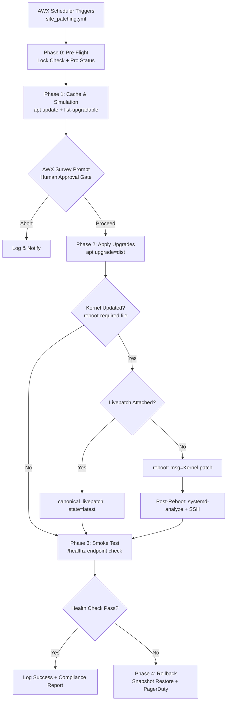

# Patching Ubuntu Linux Servers with Ansible & AWX — A Production Approach — My DevOps Journey

## Introduction

We ran a `unattended-upgrades` cron job for three years. It looked beautiful on the compliance dashboard — green checkmarks, 99.2% patch coverage, clean audit logs. Then a `libc6` update silently restarted during a peak traffic window, a Java app's socket pool didn't reconnect, and we had a 47-minute outage that the monitoring stack didn't even flag because the process was "running," just not serving.

That was the incident that killed "set and forget" patching for us.

Patching isn't a package management problem. It's a **state management** and **blast radius control** problem. AWX (the upstream open-source project behind Ansible Automation Platform) gives you the control plane — RBAC, workflow visualization, survey prompts, callback plugins. But the *playbook design* is what determines whether you survive a kernel panic at 3 AM or become another post-mortem on someone's Slack channel.

This article is the architecture we landed on after burning through four iterations of patching playbooks. It's opinionated. It's battle-tested across 1,200+ Ubuntu nodes. And it assumes you're already comfortable with Ansible basics and want to move to production-grade patching.

---

## Why This Matters

Unpatched Ubuntu servers are the most common initial access vector in cloud breach reports. But the flip side is equally dangerous: **bad patching causes more outages than unpatched vulnerabilities** in most mid-to-large fleets. The problem isn't whether you patch — it's *how* you patch.

Consider the constraints real operations teams face:

- **Stateful services** (databases, message queues) can't tolerate random reboots.
- **Rolling deployments** need health-check gates between batches.
- **Compliance** requires audit trails showing *who approved* what patch *when*.
- **Kernel live-patching** via Canonical Livepatch or Ubuntu Pro changes the reboot calculus entirely.

AWX solves the orchestration layer — scheduling, credentials, inventory sync, approval gates. Ansible solves the execution layer. But the *middleware* — the playbook structure, the decision gates, the rollback triggers — that's where teams either succeed or wake up to PagerDuty at midnight.

---

## How It Works

The architecture splits into four layers:

1. **Control Plane** — AWX as the orchestration brain, not just a runner.
2. **Inventory Layer** — Dynamic grouping by "patch personality" pulled from NetBox or your CMDB.
3. **Execution Engine** — Custom Execution Environment with `python3-apt`, `community.general`, and Ubuntu Pro tooling.
4. **Feedback Loop** — Callback plugins streaming events to Elasticsearch, plus automated rollback on health-check failure.

Here's the core workflow:



**Key design decisions embedded above:**

- **Mutex lock** in Phase 0 prevents concurrent patch jobs from stomping on each other.
- **Survey prompt** is the human-in-the-loop safety net — no automatic "yes" to `dist` upgrades.
- **Livepatch bypass** of reboot only when Canonical Livepatch is attached *and* the kernel is in the upgrade list.
- **Health check** delegates to a dedicated "test runner" host hitting `/healthz` — not the patched node itself, which might be flaky post-reboot.
- **Rollback** is a separate playbook triggered via AWX workflow node on failure, not inline `rescue` blocks (those hide failure context).

---

## Core Concepts

### Patch Personality Taxonomy

Not all nodes are equal. We classify them into groups that dictate patching behavior:

| Group | Reboot Tolerance | Approval | Rollback |
|---|---|---|---|
| `canary` | Auto-reboot | Auto-approve | Snapshot + auto-rollback |
| `stateless_workers` | Rolling 10% max | Auto-approve | None (ephemeral) |
| `stateful_datastores` | Serial: 1 at a time | Manual gate | Pre-patch snapshot required |
| `legacy_frozen` | Excluded | N/A | N/A |

This taxonomy drives `serial`, `throttle`, and `when` conditions throughout the playbook.

### Execution Environment (EE) Pinning

We build a custom EE image rather than relying on the default `ansible-community/awx:latest`. Why? The default image ships with `python3-apt` missing, which means the `apt` module falls back to shelling out to `apt-get` — slower, less idempotent, and prone to parse errors on `apt` output format changes.

Our `ee-patching` image includes:
- `ansible-core 2.16.x` (pinned)
- `python3-apt` (native apt module speed)
- `community.general` (for `canonical_livepatch`, `vmware_snapshot` modules)
- `ubuntu-advantage-tools` (Pro/Livepatch status checks)

### AWX as Source of Truth

AWX isn't just a CI runner here. It's the **source of truth** for:
- Credentials (GPG keys, Landscape API tokens injected via AWX Secret fields, never in vars files)
- Inventory (NetBox plugin syncing custom `patch_window` fields)
- Approval state (Survey prompts create auditable job template records)
- Rollback triggers (Workflow nodes chain on failure)

---

## Examples & Code Walkthrough

### Execution Environment Dockerfile

```dockerfile
# ee-patching: Dockerfile
FROM quay.io/ansible/creator-ee:v1.0.0

USER root

# Pin python3-apt for native apt module idempotency
RUN apt-get update && \
    apt-get install -y --no-install-recommends \
        python3-apt \
        ubuntu-advantage-tools \
        jq && \
    rm -rf /var/lib/apt/lists/*

# Install community.general collection (for canonical_livepatch, snapshot modules)
RUN ansible-galaxy collection install \
        community.general:>=5.0.0 \
        community.aws:>=6.0.0 \
        netbox.netbox:>=3.18.0

USER 1000
```

### NetBox Dynamic Inventory Plugin

```yaml
# netbox_inventory.yml
plugin: netbox.netbox.nb_inventory
api_url: https://netbox.internal/api
token: "{{ lookup('ansible.builtin.env', 'NB_TOKEN') }}"
validate_certs: true

# Compose patch_window from NetBox custom field
compose:
  patch_window: "{{ custom_fields.patch_window | default('weekend') }}"
  patch_group: "{{ custom_fields.patch_group | default('stateless_workers') }}"

# Group nodes by their patch personality
groups:
  patch_group_canary: "'canary' in patch_group"
  patch_group_stateless: "'stateless_workers' in patch_group"
  patch_group_stateful: "'stateful_datastores' in patch_group"
  patch_group_legacy_frozen: "'legacy_frozen' in patch_group"

# Keyed groups for serial/throttle calculations
keyed_groups:
  - prefix: patch_group
    key: patch_group
```

### Main Playbook: `site_patching.yml`

```yaml
---
# site_patching.yml — Production patching playbook
# One playbook, multiple plays, zero roles (flat for AWX log readability)

# ------------------------------------------------------------------
# Phase 0: Pre-Flight (delegated to localhost / control node)
# ------------------------------------------------------------------
- name: Phase 0 — Pre-flight checks
  hosts: localhost
  connection: local
  gather_facts: false
  vars:
    mutex_lock_key: "patching_job_active"
    pd_alert_url: "{{ lookup('ansible.builtin.env', 'PD_WEBHOOK') }}"

  tasks:
    - name: Acquire mutex lock via AWX API
      ansible.builtin.uri:
        url: "https://{{ awx_host }}/api/v2/instances/"
        method: GET
        headers:
          Authorization: "Bearer {{ awx_api_token }}"
        return_content: true
      register: awx_instances
      delegate_to: localhost

    - name: Fail if another patch job is running
      ansible.builtin.fail:
        msg: "Concurrent patch job detected. Aborting."
      when: >
        awx_instances.json | json_query('[].current_job') |
        select('match', '.*patching.*') | list | length > 0

    - name: Validate Ubuntu Pro attachment per host
      community.general.ua:
        state: present
      register: ua_status
      failed_when: ua_status.unattached | bool

    - name: Generate Patch Plan artifact (JSON)
      ansible.builtin.copy:
        content: |
          {
            "triggered_by": "{{ awx_user }}",
            "target_groups": "{{ group_names | join(', ') }}",
            "patch_window": "{{ patch_window }}",
            "timestamp": "{{ ansible_date_time.iso8601 }}"
          }
        dest: /tmp/patch_plan.json
      delegate_to: localhost

# ------------------------------------------------------------------
# Phase 1: Cache & Simulation
# ------------------------------------------------------------------
- name: Phase 1 — Cache update & upgradable listing
  hosts: all:!patch_group_legacy_frozen
  gather_facts: false
  serial: "{{ '1' if 'patch_group_stateful' in group_names else '10%' }}"

  tasks:
    - name: Update apt cache (3600s validity)
      ansible.builtin.apt:
        update_cache: true
        cache_valid_time: 3600

    - name: List upgradable packages (structured JSON)
      ansible.builtin.command:
        cmd: >
          apt list --upgradable 2>/dev/null
          | grep -v "Listing..."
          | awk -F/ '{print $1}'
          | jq -R -s -c 'split("\n") | map(select(length > 0))'
      register: upgradable_raw
      changed_when: false

    - name: Parse upgradable into security / kernel / held_back
      ansible.builtin.set_fact:
        _upgradable_packages: "{{ upgradable_raw.stdout | from_json }}"
        _reboot_required: "{{ lookup('file', '/var/run/reboot-required', errors='ignore') | default('') | length > 0 }}"

    - name: Render Patch Plan summary for AWX survey
      ansible.builtin.debug:
        msg: |
          Upgradable: {{ _upgradable_packages | length }} packages
          Kernel update pending: {{ _reboot_required }}
          Livepatch attached: {{ ua_status.attached | default(false) }}

# ------------------------------------------------------------------
# Phase 2: Application
# ------------------------------------------------------------------
- name: Phase 2 — Apply upgrades
  hosts: all:!patch_group_legacy_frozen
  gather_facts: false
  serial: "{{ '1' if 'patch_group_stateful' in group_names else '10%' }}"

  tasks:
    - name: Upgrade all packages (dist mode, force_apt_get)
      ansible.builtin.apt:
        upgrade: dist
        force_apt_get: true
        update_cache: false
      register: apt_upgrade_result

    - name: Check if reboot is required post-upgrade
      ansible.builtin.stat:
        path: /var/run/reboot-required
      register: reboot_file

    - name: Apply Livepatch if kernel updated and Pro attached
      community.general.canonical_livepatch:
        state: latest
      when:
        - reboot_file.stat.exists
        - ua_status.attached | bool
      register: livepatch_result

    - name: Reboot the node (async, with poll)
      ansible.builtin.reboot:
        msg: "Kernel patch applied — rebooting"
        connect_timeout: 300
        reboot_timeout: 600
        pre_reboot_delay: 10
        post_reboot_delay: 30
      when:
        - reboot_file.stat.exists
        - not livepatch_result.changed | default(false)

# ------------------------------------------------------------------
# Phase 3: Post-Reboot Validation
# ------------------------------------------------------------------
- name: Phase 3 — Post-reboot health validation
  hosts: all:!patch_group_legacy_frozen
  gather_facts: false
  serial: 1

  tasks:
    - name: Wait for SSH to be ready
      ansible.builtin.wait_for:
        host: "{{ inventory_hostname }}"
        port: 22
        timeout: 300
        delay: 10

    - name: Wait for cloud-init completion
      ansible.builtin.command: cloud-init status --wait
      register: cloud_init_status
      changed_when: false

    - name: Verify systemd units
      ansible.builtin.command: systemd-analyze verify
      register: systemd_verify
      changed_when: false
      failed_when: systemd_verify.rc != 0

    - name: Application smoke test (delegate to test runner)
      ansible.builtin.uri:
        url: "https://{{ inventory_hostname }}/healthz"
        method: GET
        status_code: 200
        timeout: 15
      delegate_to: "{{ groups['test_runner'][0] }}"
      register: health_check
      retries: 3
      delay: 10
      until: health_check.status == 200

# ------------------------------------------------------------------
# Phase 4: Rollback (triggered via AWX workflow on failure)
# ------------------------------------------------------------------
# See rollback_patching.yml — separate playbook, separate workflow node
```

### Rollback Playbook: `rollback_patching.yml`

```yaml
---
# rollback_patching.yml — Triggered by AWX workflow on Phase 2/3 failure
# Only runs for stateful_datastores (snapshot-based rollback)

- name: Phase 4 — Rollback & drift remediation
  hosts: all:patch_group_stateful
  gather_facts: false
  serial: 1

  tasks:
    - name: Restore pre-patch EC2 snapshot
      community.aws.ec2_snapshot:
        instance_id: "{{ ansible_ec2_instance_id }}"
        snapshot_id:
