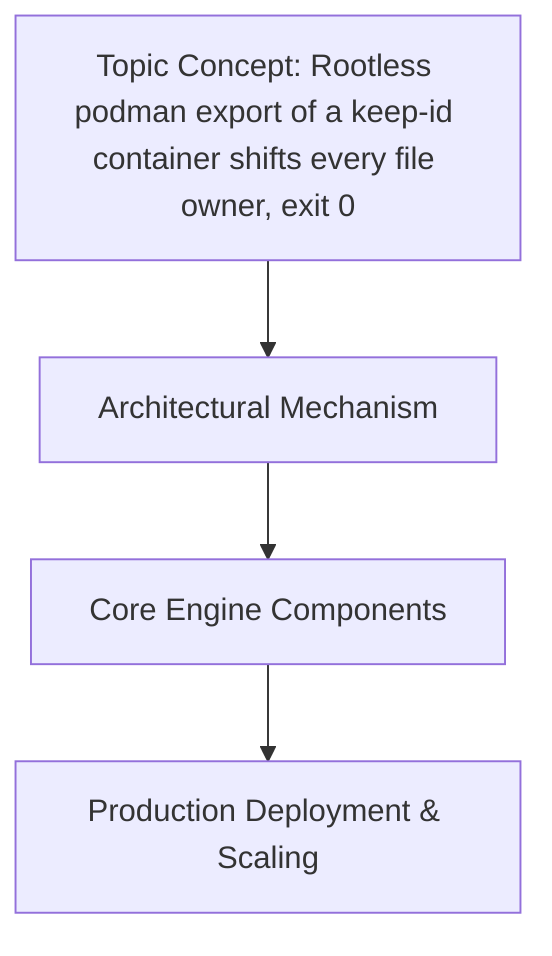

Here's a thinking process:

1.  **Analyze User Request:**
   - Role: World-Class Senior Staff Engineer / Open-source Contributor / Technical Writer
 task.
   - Topic: "Rootless podman export of a keep-id container shifts every file owner, exit 0"
   Issue: Exporting a rootless container with `--keep-id` shifts every
; 5.1.164

## How It Works

