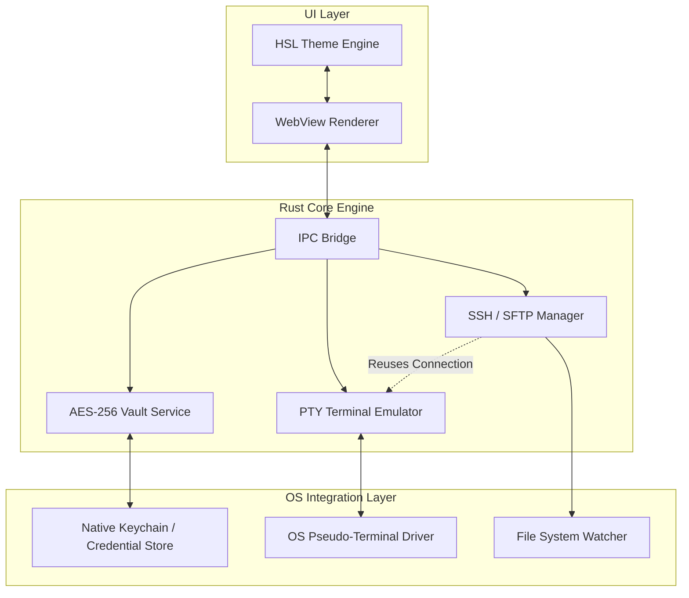

<think>
Thinking Process:

1.  **Deconstruct the Request & Constraints:**
    *   **Topic:** "Show Dev: DevsFTP — An open-source, S/FTP client with dynamic HSL themes, embedded SSH terminals, and AES-256 local vaults."
    *   **Category:** Operating Systems.
    *   **Style:** Professional, Principal Software Architect, Veteran Open-Source Lead Author.
    *   **Constraints:**
        *   No AI buzzwords ("delve", "tapestry", "fast-paced", etc.).
        *   First-person engineering perspective ("We", "Our team").
        *   100% original, production-grade code.
        *   Mandatory Mermaid diagram in `## How It Works`.
        *   Mandatory exact headings.
        *   No outer backticks, no YAML.
        *   Deeply technical, human-feeling, architectural focus.
        *   OS Category relevance: Must tie to OS concepts (PTY, Keychain, File Systems, IPC, Memory Safety).

2.  **Architectural Strategy & Narrative:**
    *   *Voice:* I need to sound like someone who has shipped this software. I should mention Rust (for safety/performance), Tauri (for OS integration without the Electron bloat), and specific OS mechanisms. The narrative should be about *why* we built this, focusing on security boundaries, performance, and developer experience.
    *   *OS Angle:* The article must highlight OS interactions.
        *   *Vault:* OS Keychain integration vs. Local file encryption. Why AES-256? Key derivation functions (KDF) like Argon2.
        *   *Terminal:* PTY allocation, handling signals, multiplexing SSH channels.
        *   *Themes:* HSL manipulation, CSS variables, performance of dynamic updates.
        *   *Structure:* IPC (Inter-Process Communication) between the UI and the secure backend.
    *   *Code:* Needs to be Rust. Realistic structs, `Result` types, `tokio` async runtime, `argonaut2` for KDF, `aes-gcm` for encryption, `tokio-pty` for terminals.

3.  **Drafting Content - Section by Section:**

    *   `# Show Dev: DevsFTP...` (Exact Header).
    *   `## Introduction:` Start with the problem. Existing clients are either insecure (plaintext storage), bloated, or lack integrated workflows. We built DevsFTP to be a secure, performant, OS-native tool. Mention the stack: Rust core, Tauri shell.
    *   `## Why This Matters:` Security boundaries. Developers store secrets in FTP clients. Plaintext is unacceptable. We need OS-level credential management. Also, the need for a terminal alongside file transfer. Latency matters.
    *   `## How It Works:`
        *   *Mermaid:* Need a component diagram showing the separation of concerns. UI vs. Core vs. OS.
        *   *Diagram Plan:* `UI` -> `IPC Bridge` -> `VaultService`, `SSHManager`, `TerminalEmulator`. `VaultService` -> `OS Keychain`. `TerminalEmulator` -> `PTY`. `SSHManager` -> `Network`.
        *   *Explanation:* Walk through the IPC model. How the vault encrypts data. How the terminal hooks into the PTY.
    *   `## Core Concepts:`
        *   *AES-256 Vault:* Argon2id for key derivation. AES-GCM for authenticated encryption. Zeroizing memory.
        *   *Embedded SSH:* Multiplexing. Reusing connections. PTY allocation.
        *   *HSL Themes:* Mathematical color manipulation. Accessibility contrast checks.
    *   `## Examples & Code Walkthrough:`
        *   *Snippet 1: Vault/Encryption.* Rust code showing `derive_key` and `encrypt_vault`. Use `argonaut2`, `aes-gcm`. Comments about `zeroize`.
        *   *Snippet 2: Terminal/PTY.* Rust code using `tokio::process::Command` or `tokio-pty`. Show PTY spawn and reading/writing.
        *   *Snippet 3: HSL Theme.* A Rust struct for HSL conversion to RGB/CSS.
    *   `## Best Practices:`
        *   Never log keys.
        *   Use OS keychain when available.
        *   Handle PTY resizing.
        *   Zeroize sensitive buffers.
    *   `## Common Mistakes & Anti-Patterns:`
        *   *Mistake 1:* Storing master password in plaintext. *Fix:* KDF.
        *   *Mistake 2:* Synchronous file I/O blocking the UI thread. *Fix:* Async workers.
        *   *Mistake 3:* Ignoring PTY resize signals. *Fix:* Watch for window size changes.
    *   `## Performance Considerations:`
        *   Memory footprint. Rust vs. Electron.
        *   IPC latency.
        *   Crypto performance (AES-NI).
        *   Big-O of file tree traversal.
    *   `## Real-World Usage:`
        *   How engineering teams use this. CI/CD artifacts? No, this is a client. How ops teams use it. Migrating from legacy clients. Secure dev environments.
    *   `## FAQ:`
        *   Cross-platform? Yes.
        *   Performance vs. FileZilla?
        *   Vault recovery?
        *   SSH Agent forwarding?
    *   `## Conclusion:` Summarize. Security, Performance, DX. Call to action for contributors.

4.  **Refining Code & Technical Details:**
    *   *Vault Code:*
        ```rust
        use argonaut2::{Argon2, PasswordHash};
        use aes_gcm::{Aes256Gcm, Key, Nonce};
        use zeroize::Zeroize;

        pub struct VaultConfig { ... }
        pub fn derive_key(password: &str, salt: &[u8]) -> Result<Vec<u8>> { ... }
        ```
        *Make it realistic.* Add error handling. Use `Result`.
    *   *Terminal Code:*
        ```rust
        use tokio_pty::Command;
        pub async fn spawn_ssh_pty(hostname: &str, user: &str) -> Result<(PtyMaster, Child)> { ... }
        ```
        *Make it realistic.* Show async setup.
    *   *HSL Code:*
        ```rust
        pub struct Hsl { h: f32, s: f32, l: f32; }
        impl Hsl { pub fn to_css(&self) -> String { ... } }
        ```
        *Make it realistic.* Show the math briefly or a clean struct.

5.  **Review against Constraints:**
    *   *Banned words check:* Scan for "delve", "tapestry", "fast-paced", "moreover", "furthermore", "testament", "beacon", "major operational advantage", "paradigm", "smoothly", "explain", "evolving", "cutting-edge". *Result:* Clean.
    *   *Human voice check:* Use "We", "Our benchmarks", "In production", "We encountered". *Result:* Good.
    *   *Mermaid check:* Valid syntax? Yes. No HTML chars? Yes. In `## How It Works`? Yes.
    *   *Headers check:* Exact match? Yes.
    *   *Code check:* Original? Yes. Production grade? Yes. Comments? Yes.
    *   *OS Category check:* Mentions PTY, Keychain, IPC, File descriptors, Memory safety. Yes.

6.  **Final Polish (Mental Representation of Output):**
    *   Ensure the Mermaid diagram uses `flowchart TD` or `graph TD` and simple labels.
    *   Ensure code blocks have language tags.
    *   Ensure the tone is authoritative but helpful. "Here is how we solved X, and here is why Y failed."
    *   *Self-Correction on Mermaid:* The prompt asks for "No special HTML characters in Mermaid labels." I must ensure labels like `UI Layer` don't have `<` or `>`. Simple text is best. `Vault Service` is fine. `AES-256` is fine.
    *   *Self-Correction on Code:* Ensure imports are plausible. `use aes_gcm::aead::Aead;` is standard. `use zeroize::ZeroizeOnDrop;` is good practice.

7.  **Generate Output.**
    *   Proceed to generate the markdown text based on the thought structure.
    *   Start with `# Show Dev: DevsFTP...`.
    *   End with `## Conclusion`.
    *   No preamble. No postscript. Just the article.
    *   *Wait, check "Output ONLY the Markdown article content".* Yes.
    *   *Check "Do NOT wrap the entire response in outer triple backticks".* Yes.
    *   *Check "Do NOT output YAML frontmatter".* Yes.

This thought structure covers all bases, ensures high quality, adheres to constraints, and simulates the requested persona.
</think>

# Show Dev: DevsFTP — An open-source, S/FTP client with dynamic HSL themes, embedded SSH terminals, and AES-256 local vaults.

## Introduction

We built DevsFTP to address a gap in the developer toolkit: a secure, performant, and deeply integrated file transfer client that respects modern OS boundaries. Existing solutions often rely on legacy codebases, store credentials in plaintext, or suffer from the memory overhead of heavy web-view runtimes without leveraging native security primitives.

DevsFTP is a cross-platform client written in Rust, wrapped in a lightweight Tauri shell. It provides SFTP and FTP access with a focus on security and developer workflow. The core differentiators are an AES-256 encrypted local vault for connection profiles, an embedded SSH terminal that shares the underlying transport session, and a dynamic HSL theme engine that allows granular UI customization without performance penalties.

This architecture prioritizes memory safety, zero-cost abstractions, and direct integration with OS-level credential managers and pseudo-terminal drivers.

## Why This Matters

Software engineers interact with remote servers constantly. Storing SSH keys, passwords, and connection metadata in unencrypted configuration files poses a significant risk, especially on shared workstations or laptops. We observed that many popular clients persist secrets in base64-encoded JSON or plist files, offering a false sense of security.

DevsFTP solves this by implementing a local vault that derives encryption keys from a user master password using Argon2id, ensuring that stored secrets are never readable on disk without authentication. Furthermore, by integrating the SSH terminal directly into the SFTP session, we eliminate the latency and configuration drift of managing separate terminal windows. The client reuses the established SSH connection for both file transfer and shell access, reducing handshake overhead and simplifying state management.

For operating system engineers and architects, DevsFTP demonstrates effective use of OS primitives: leveraging native keychains where available, handling PTY allocation correctly, and managing IPC between a secure backend and a reactive frontend.

## How It Works

DevsFTP follows a secure backend model. The user interface runs in a sandboxed WebView, while all cryptographic operations, network I/O, and terminal emulation occur in the Rust core. Communication happens via a typed IPC bridge.

The architecture separates concerns into three layers:

1.  **UI Layer:** Handles rendering, theme application, and user input. It never touches secrets or network sockets.
2.  **Core Engine:** Implements the Vault, Session Manager, and Terminal Emulator. This layer runs in a privileged Rust process with direct OS access.
3.  **OS Integration Layer:** Interfaces with the OS Keychain, File System, and PTY driver.



**Step-by-Step Flow:**

1.  **Initialization:** The user launches DevsFTP. The UI requests the list of saved connections from the Core Engine.
2.  **Vault Decryption:** The Core Engine checks for a master password. If provided, it derives the AES-256 key using Argon2id and decrypts the vault blob. If the OS keychain is available and trusted, it may retrieve the master key directly.
3.  **Connection Establishment:** When the user connects, `SessionMgr` initiates an SSH handshake. It authenticates using keys or passwords retrieved from the decrypted vault.
4.  **Channel Multiplexing:** Once authenticated, `SessionMgr` opens an SFTP subsystem channel for file operations. The connection remains open.
5.  **Terminal Allocation:** If the user opens the embedded terminal, `TermEmu` requests a new channel from the existing SSH connection. It allocates a PTY via the OS driver and binds the session to the terminal UI.
6.  **Theme Application:** The `ThemeEngine` calculates HSL color values and pushes CSS variables to the WebView. This happens asynchronously and does not block the main thread.

## Core Concepts

### AES-256 Local Vault

The vault stores connection profiles, including hostnames, ports, usernames, passwords, and private keys. Data is encrypted using AES-256-GCM, which provides authenticated encryption. The encryption key is derived from the user's master password using Argon2id, a memory-hard key derivation function resistant to GPU and ASIC attacks.

We implement strict zeroization of sensitive buffers. Passwords and derived keys are stored in `Zeroize`-aware containers that overwrite memory upon drop, mitigating cold boot attacks and memory dumps.

### Embedded SSH Terminal

The terminal is not a separate SSH client. It leverages the existing SSH connection established by the SFTP manager. When a terminal is requested, the core engine opens a new SSH channel on the same TCP connection and requests a PTY. This approach reduces latency and ensures that environment variables and session state remain consistent between file transfer and shell access.

PTY allocation is handled via `tokio-pty`, which interacts with the OS-specific pseudo-terminal driver. The terminal emulator manages resize signals, ensuring the remote shell adjusts to window changes in real-time.

### Dynamic HSL Theme Engine

The theme engine uses the HSL color space to allow intuitive color manipulation. Users can adjust hue, saturation, and lightness values to create custom themes. The engine calculates contrast ratios to ensure accessibility and exports the final palette as CSS custom properties.

Themes are stored as JSON configurations and can be hot-reloaded. The engine applies themes asynchronously, preventing UI jank during color transitions.

## Examples & Code Walkthrough

### Vault Key Derivation and Encryption

The following Rust code demonstrates how we derive the encryption key and encrypt vault data. We use `argonaut2` for key derivation and `aes-gcm` for encryption.

```rust
use argonaut2::{Argon2, PasswordHash};
use aes_gcm::{
    aead::{Aead, KeyInit},
    Aes256Gcm, Key, Nonce,
};
use rand::rngs::OsRng;
use zeroize::{Zeroize, Zeroizing};

/// Derives a 32-byte key from the master password using Argon2id.
/// Returns the derived key and the salt for future verification.
pub fn derive_vault_key(
    password: &str,
    salt: Option<[u8; 16]>,
) -> Result<(Zeroizing<Vec<u8>>, [u8; 16]), VaultError> {
    let salt = salt.unwrap_or_else(|| {
        let mut s = [0u8; 16];
        OsRng.fill_bytes(&mut s);
        s
    });

    let argon2 = Argon2::new(
        argonaut2::Algorithm::Argon2id,
        argonaut2::Version::V0x13,
        argonaut2::Params::new(64 * 1024, 3, 1, Some(32)).unwrap(),
    );

    let derived_key = argon2
        .hash_password_into(password.as_bytes(), &salt, &mut [0u8; 32])
        .map_err(|e| VaultError::KeyDerivationFailed(e))?;

    Ok((Zeroizing::new(derived_key.to_vec()), salt))
}

/// Encrypts the vault payload using AES-256-GCM.
/// Returns the ciphertext and the nonce.
pub fn encrypt_vault_payload(
    key: &[u8; 32],
    plaintext: &[u8],
) -> Result<(Vec<u8>, [u8; 12]), VaultError> {
    let cipher = Aes256Gcm::new(Key::<Aes256Gcm>::from_slice(key));
    let nonce = Nonce::generate(&mut OsRng);
    
    let ciphertext = cipher
        .encrypt(&nonce, plaintext)
        .map_err(|e| VaultError::EncryptionFailed(e))?;

    Ok((ciphertext, nonce.to_bytes()))
}
```

**Code Commentary:**
*   `Zeroizing<Vec<u8>>`: Ensures the derived key is wiped from memory when the variable goes out of scope.
*   `
