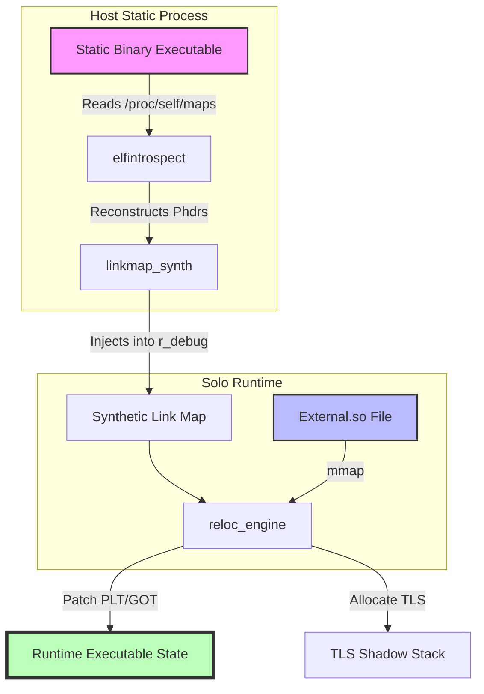

# Solo – a.so loader for static Linux binaries

## Introduction

We are taught that static linking is the ultimate solution for portability. You compile your Go binary, you ship a single, massive blob, and you walk away. No "missing library" errors, no dependency hell, no version mismatches. It’s the dream of the "run anywhere" deployment model.

But then you hit the wall. 

You try to resolve a DNS name, and suddenly your static binary needs `libnss_dns.so`. You try to load a GPU driver or a hardware abstraction layer, and you realize your binary has no way to talk to the system's dynamic libraries. You've built a fortress, but you forgot that the fortress needs to interact with the outside world. Because your binary was compiled with `-static`, the kernel didn't load a dynamic linker (`ld-linux.so`). Without that interpreter, the very mechanism required to use `dlopen()` simply does not exist in your process's memory space.

This is the "Static Binary Paradox." **Solo** is an engineering response to this paradox: a user-space dynamic loader that lives *inside* a static process, bootstrapping a dynamic runtime where none existed before.

## Why This Matters

In modern cloud-native environments, the push toward static binaries (via `musl` or `static-pie`) is driven by security and container predictability. However, this creates a massive friction point when interacting with the host OS.

If you are writing a high-performance networking tool or a specialized database in a language like Rust or Zig, you might want the benefits of a static binary for deployment, but you still need to:
1. **Interface with NSS (Name Service Switch):** To support complex DNS configurations or LDAP.
2. **Load Vendor Blobs:** To access hardware acceleration (CUDA, OpenCL) that only exists in `.so` files.
3. **Implement Plugin Architectures:** Where third-party extensions are loaded at runtime via `.so` files.

Currently, if you need these features, you are forced to abandon pure static linking and move to a dynamic model, re-introducing the very dependency management headaches you were trying to avoid. Solo allows you to stay static while behaving dynamically.

## How It Works

Solo does not rely on the kernel to set up the environment. Instead, it performs "parasitic loading." It treats the existing static process as a host and reconstructs the dynamic ecosystem from within.

The architecture relies on three distinct phases: Introspection, Synthesis, and Relocation.



1.  **`elfintrospect`**: Since the kernel didn't provide an interpreter, we can't rely on standard `dl_iterate_phdr` calls. Solo parses `/proc/self/maps` and uses `AT_PHDR` from the auxiliary vector (via `getauxval`) to locate the original ELF headers in memory.
2.  **`linkmap_synth`**: This is the most "hacky" part. To make `libc` believe a dynamic library has been loaded, Solo must manually construct `struct link_map` objects and inject them into the `r_debug` structure. This allows standard `dlsym` calls to traverse the symbol tree of the newly loaded library.
3.  **`reloc_engine`**: Once the `.so` is mapped into memory, Solo iterates through the relocation sections (`.rel.dyn`, `.rel.plt`). It resolves symbols by searching the synthetic link map and patches the jump slots.
4.  **`namespace_isolation`**: To prevent a loaded library from accidentally overwriting a static function (like `malloc`), Solo implements a scoped symbol lookup, ensuring the library's dependencies are resolved within a private namespace.

## Core Concepts

### The Synthetic Link Map
In a standard dynamic binary, the dynamic linker maintains a linked list of all loaded objects (`struct link_map`). Static binaries have no such list. Solo builds this list manually, effectively "lying" to the `libc` runtime so that when you call `dlsym`, the library thinks it's part of a standard dynamic execution environment.

### The TLS Shadow Stack
Thread-Local Storage (TLS) is the bane of static-to-dynamic transitions. Static binaries have a fixed-size TLS block allocated at startup. When you load a `.so` that requires its own TLS, there is no room in the existing block. Solo solves this by using `mmap` to create a "shadow" TLS region and patching the thread pointer (via `arch_prctl` on x86_64) during the transition into the library's code.

### Post-hoc Relocation
Unlike a kernel-level loader that handles relocations before the first instruction of `main` runs, Solo performs "post-hoc" relocation. This means we can load libraries at any point during execution, provided we correctly manage the `mprotect` transitions from `PROT_WRITE` (during patching) to `PROT_READ|PROT_EXEC` (for execution).

## Examples & Code Walkthrough

One of the hardest parts of building a loader is finding where the "hidden" metadata is in a static binary. Even when stripped, compilers often leave symbol information in memory for backtracing.

```c
/* 
 * solo_elfintrospect.c
 * A snippet demonstrating how Solo finds the program headers 
 * when the kernel hasn't set up a dynamic linker.
 */

#include <stdio.h>
#include <sys/auxv.h>
#include <elf.h>
#include <sys/mman.h>

typedef struct {
    void *phdr_base;
    size_t phdr_count;
} solo_elf_info_t;

solo_elf_info_t solo_discover_self() {
    solo_elf_info_t info = {NULL, 0};

    // Use the Auxiliary Vector to find the Program Header offset
    // This is provided by the kernel during execve()
    unsigned long phdr_addr = getauxval(AT_PHDR);
    unsigned long phnum = getauxval(AT_PHNUM);

    if (phdr_addr!= 0 && phnum > 0) {
        info.phdr_base = (void *)phdr_addr;
        info.phdr_count = phnum;
        printf("[Solo] Discovered %zu program headers at %p\n", phnum, (void*)phdr_addr);
    } else {
        fprintf(stderr, "[Solo] Critical: Could not find PHDR via auxv\n");
    }

    return info;
}

int main() {
    solo_elf_info_t info = solo_discover_self();
    if (info.phdr_base) {
        printf("[Solo] Ready to bootstrap dynamic runtime.\n");
    }
    return 0;
}
```

To handle the TLS issue, Solo uses a small assembly stub to swap the `FS` segment base, allowing the loaded library to access its own thread-local variables without corrupting the host's data.

## Best Practices

*   **Use `mprotect` Aggressively:** When implementing your own relocation engine, always follow the W^X (Write XOR Execute) principle. Map memory as `RW`, perform relocations, and then immediately `mprotect` to `R-X`.
*   **Prefer Eager Binding for Security:** While lazy binding (resolving symbols only when the function is called) saves startup time, it requires making the Global Offset Table (GOT) writable during the entire runtime, which is a massive security risk. For Solo-style loading, eager binding is much safer.
*   **Namespace Isolation:** Always implement a custom symbol lookup scope. You do not want a loaded plugin to be able to resolve and call an internal, private function of your static binary just because they share a symbol name.

## Common Mistakes & Anti-Patterns

1.  **Ignoring `R_X86_64_RELATIVE`:** Many developers focus on function symbols (`R_X86_64_FUNCTION`) but forget that many data pointers in a `.so` are just relative offsets. If you don't handle these, your loaded library will crash the moment it tries to access a global variable.
2.  **Forgetting `dlclose` Logic:** If you implement `solo_dlopen`, you must also implement a reference-counting mechanism for `solo_dlclose`. Failing to do so results in "zombie" memory mappings that can never be reclaimed, leading to memory leaks in long-running processes.
3.  **Assuming `libc` is the only consumer:** Don't assume that every library you load will use standard `glibc`. Some might expect `musl` or a specific version of `uClibc`. Solo's `reloc_engine` must be robust enough to handle different ABI nuances.

## Performance Considerations

*   **Startup Latency:** `solo_dlopen` is significantly slower than a standard `dlopen` because it has to perform the "self-discovery" phase and manually reconstruct the link map. This is a trade-off for the ability to load at all.
*   **Memory Overhead:** Solo introduces a small constant overhead for the synthetic link map and the shadow TLS stack. For most applications, this is negligible (a few hundred KB), but in highly constrained embedded environments, it's worth monitoring.
*   **Complexity Class:** Symbol resolution is $O(N \cdot M)$ where $N$ is the number of symbols in the loaded library and $M$ is the number of symbols in the host/previously loaded libraries. Using a hash table for symbol lookup is non-negotiable for production use.

## Real-World Usage

While Solo is a specialized tool, the pattern of "user-space dynamic loading" is used in several critical contexts:
*   **WebAssembly Runtimes:** Loading Wasm modules within a C++ host requires a custom relocation engine to map Wasm linear memory into the host's address space.
*   **High-Frequency Trading (HFT):** Some HFT engines use static binaries for deterministic latency but use custom loaders to "hot-swap" specific logic modules without restarting the entire process.
*   **Plugin-based IDEs:** Many custom runtimes for scripting languages implement their own loaders to manage the lifecycle of extension modules.

## Frequently Asked Questions (FAQ)

**Q: Can Solo load a library that requires a different version of `libc` than the host?**  
A: Only if you implement full namespace isolation (similar to `dlmopen`). Without it, the loaded library will likely attempt to use the host's `libc` symbols, leading to version mismatches.

**Q: Is Solo safe for use in security-critical applications?**  
A: It is safe *if* you strictly enforce W^X and implement RELRO (Relocation Read-Only). The act of manually patching memory is inherently sensitive.

**Q: Does Solo support `IFUNC` (Indirect Functions)?**  
A: Not out of the box. `IFUNC` requires the loader to execute a resolver function during relocation to determine the correct implementation for the current CPU. This requires a more complex, multi-stage relocation engine.

## Conclusion

The "Static Binary" is often treated as a destination, but in reality, it is just a starting point. As software systems become more modular and hardware-dependent, the ability to transition from a static execution model to a dynamic one—without leaving the safety of a single, portable binary—is a powerful capability. Solo proves that even in a vacuum, you can reconstruct an entire ecosystem.
