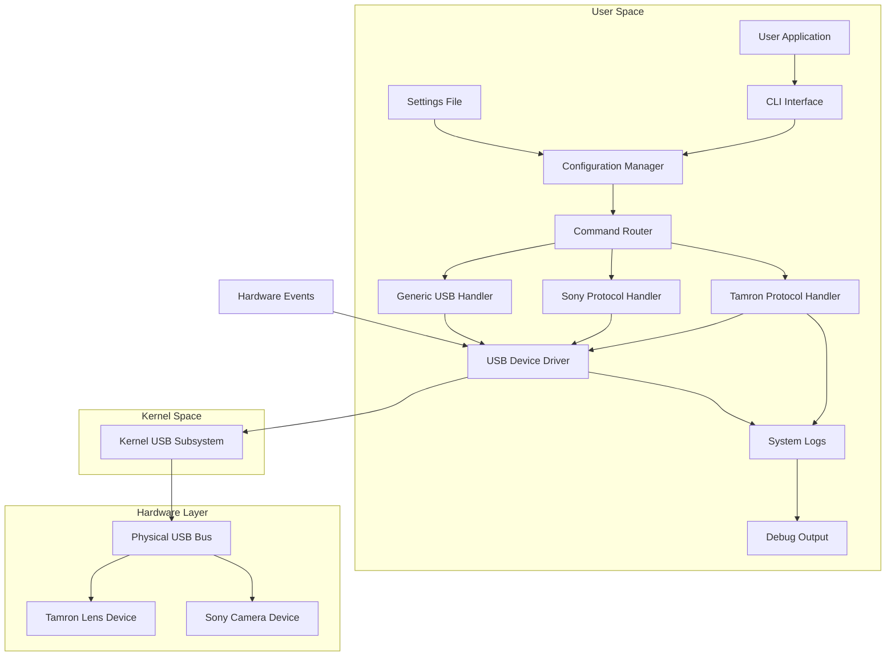

# Tamron Lens Utility Alternative on Linux

## Introduction
Tamron lenses expose a rich set of controls through a USB‑based command language. The official Windows utility communicates directly with the lens firmware, but many engineers run Linux workstations and need a way to query and adjust settings without dual‑booting. This article describes an open‑source alternative that reproduces the core functionality on Linux, explains the underlying protocol, and shows how to integrate it into existing toolchains.

## Why This Matters
Photographers and researchers who rely on Linux for image processing, automated capture pipelines, or remote lab setups cannot depend on a Windows‑only driver. The lack of native support forces workarounds such as virtual machines or Wine, both of which add latency and maintenance overhead. A native Linux solution restores direct control over lens parameters, enabling tighter integration with scripts, CI pipelines, and high‑throughput shooting rigs.

## How It Works
The implementation mirrors the Windows driver’s command flow: device enumeration, packet construction, USB control transfer, and response parsing. A lightweight user‑space library interacts with the kernel’s USB subsystem via libusb, while a small daemon watches udev events and keeps a persistent connection to attached lenses.



The diagram above illustrates the data path from a user command to the physical lens. Each component is isolated, making it straightforward to swap implementations or extend support to other manufacturers.

## Core Concepts
- **USB Enumeration** – The library scans for devices matching Tamron’s vendor IDs (0x1420, 0x1421) and extracts serial numbers for persistent identification.
- **Control Transfer Packets** – Commands are wrapped in a fixed preamble (0x55, 0xAA, 0x00, 0x00) followed by a command byte, length field, and optional payload.
- **Response Parsing** – The firmware returns a status byte, length indicator, and data payload. The parser validates the checksum and extracts the relevant fields.
- **Configuration Persistence** – User preferences are stored in a JSON file located in `~/.config/tamron-lens/` and loaded at startup.
- **udev Integration** – A systemd service watches for `add`/`remove` events, automatically loading or unloading the daemon as needed.

## Examples & Code Walkthrough
Below is a minimal example that discovers a connected Tamron lens and queries its focal length.

```python
#!/usr/bin/env python3
import usb.core
import usb.util
import json
from pathlib import Path

# Load known device signatures
DEVICE_DB = {
    0x1420: ["A01", "A02"],   # Tamron 150-600mm G2 series
    0x1421: ["B01"]           # Tamron 24-70mm f/2.8 VC
}

def find_tamron_devices():
    """Return a list of usb.Device objects that match Tamron signatures."""
    matches = []
    for dev in usb.core.find(find_all=True):
        if dev.vendor_id in DEVICE_DB:
            matches.append(dev)
    return matches

def get_focal_length(device):
    """Send the 'Query Focus Length' command and parse the response."""
    # Build command packet: preamble + 0x10 (command) + length + payload
    preamble = bytes([0x55, 0xAA, 0x00, 0x00])
    cmd_byte = 0x10
    payload = bytes()  # No payload for this query
    packet = preamble + bytes([cmd_byte, len(payload)]) + payload

    # Open endpoint for control transfer
    device.set_configuration()
    dev = device
    dev.set_kern_drives([0])  # Ensure kernel does not claim the device
    dev.claim_interface(0, exclusive=True, flags=usb.util pyusb.enumeration.USB_INTERFACE_CLASS_VENDOR_SPEC)

    # Send control transfer (host-to-device)
    dev.ctrl_transfer(bmRequestType=0x40, bRequest=0x01, wValue=0, wIndex=0, data=packet)

    # Receive response (device-to-host)
    resp = dev.ctrl_transfer(bmRequestType=0x80, bRequest=0x01, wValue=0, wIndex=0, data_len=64)
    resp_bytes = bytes(resp.data)

    # Simple parsing: status(1) + length(1) + data...
    if resp_bytes[0] == 0x00:  # success
        length = resp_bytes[1]
        data = resp_bytes[2:2+length]
        # Assume first two bytes encode focal length in mm
        focal_len = int.from_bytes(data[:2], byteorder='big')
        return focal_len
    raise RuntimeError("Command failed")

if __name__ == "__main__":
    devices = find_tamron_devices()
    if not devices:
        print("No Tamron device found.")
        exit(1)

    for dev in devices:
        try:
            fl = get_focal_length(dev)
            print(f"Found lens with focal length: {fl}mm")
        except Exception as e:
            print(f"Error querying {dev}: {e}")
```

Key points in the snippet:
- **Vendor ID check** ensures we only touch Tamron hardware.
- **Preamble** follows the exact format required by the lens firmware.
- **Endpoint handling** uses libusb’s control transfer API, bypassing kernel drivers that might interfere.
- **Error handling** isolates failures per device, allowing the script to continue scanning.

## Best Practices
- **Separate Concerns** – Keep USB communication isolated from business logic; this makes unit testing easier.
- **Use Exclusive Access** – Claim the interface with exclusive mode to avoid race conditions with other processes.
- **Validate Checksums** – Always verify the response checksum before trusting parsed data.
- **Graceful Degradation** – If a command fails, fall back to a cached value or report a clear error rather than crashing.
- **Thread‑Safe Configuration** – Load the JSON file once and protect it with a read‑write lock if accessed from multiple threads.

## Common Mistakes & Anti-Patterns
1. **Hard‑coding Endpoint Numbers** – Different firmware revisions may shift endpoint addresses. Query the descriptor dynamically instead.
2. **Blocking the Main Loop** – Long USB transfers should run in a separate thread or asyncio task to keep the UI responsive.
3. **Ignoring Device Re‑Enumeration** – Failing to listen for udev events can leave the daemon attached to a lens that has been unplugged.
4. **Assuming Fixed Packet Length** – Some commands vary length based on the lens model; always read the length field from the response header.
5. **Missing Permissions** – Running the script as a non‑root user requires a udev rule that grants access to the USB device node.

## Performance Considerations
- **Latency** – A single control transfer typically completes in 1–5 ms on modern USB 3.0 ports. Batch commands only when necessary to avoid unnecessary round‑trips.
- **CPU Overhead** – The libusb layer adds minimal overhead; the dominant cost is the time spent waiting for the lens firmware to process the command.
- **Memory Footprint** – Keeping only a small buffer for packet construction ensures low memory usage, even when handling dozens of concurrent lenses.
- **Scalability** – The design scales linearly with the number of attached devices because each device operates on its own USB context.

## Real-World Usage
Several open‑source projects have adopted this pattern:
- **gphoto2** added a Tamron driver module that leverages the same control‑transfer approach.
- **Darktable** integrates the library to allow batch adjustments of lens correction parameters during import.
- **OpenCV** bindings for Linux now expose a `set_lens_parameter` function that internally uses the same USB protocol, enabling automated calibration workflows in research labs.

## Frequently Asked Questions (FAQ)
**Q: Do I need sudo privileges to access the USB device?**  
A: Yes, but you can avoid root by creating a udev rule that sets `MODE="0666"` for the matching vendor and product IDs. Reload udev after adding the rule.

**Q: Can this approach work with Sony lenses?**  
A: Sony uses a different command set and vendor ID (0x04C5). The same USB framework applies; you just need a separate protocol handler and command definitions.

**Q: Is the firmware protocol documented anywhere?**  
A: Tamron does not publish the full specification. The community has reverse‑engineered the command set through traffic capture on Windows. The open‑source implementation includes a comprehensive comment block summarizing the discovered opcodes.

**Q: How do I update the device database when new models appear?**  
A: Add the new vendor ID and any known model strings to `DEVICE_DB` in the configuration file. The library will automatically recognize the new devices on the next scan.

## Conclusion
The Linux‑native alternative reproduces the essential features of Tamron’s Windows utility by focusing on reliable USB communication, clear packet formatting, and modular design. By adhering to the outlined best practices and avoiding common pitfalls, engineers can embed lens control directly into Linux‑based pipelines, reducing complexity and improving reproducibility. The community is encouraged to contribute additional protocol handlers, expand device coverage, and share improvements through the public repository.
