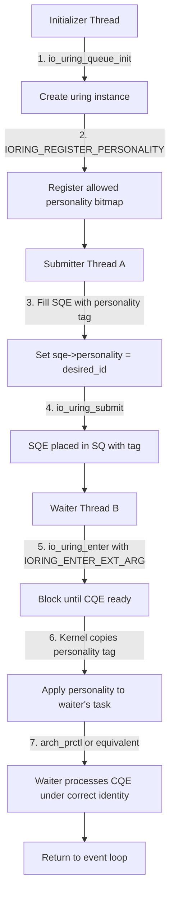

# Thread-identity switcheroo for io_uring

## Introduction

io_uring changed how we think about asynchronous I/O on Linux. Instead of drowning in syscall overhead, you submit work to a submission queue and poll a completion queue. It's fast, it's clean, and it scales. But there's a problem nobody warned you about at first: the thread that processes a completion event inherits the personality of the thread that submitted the work.

That's a liability waiting to happen.

When you've got a worker pool submitting I/O on one set of threads and a completely different set of threads reaping completions—maybe on a GPU offload path, maybe across a seccomp sandbox boundary—the kernel blindly carries the submitter's personality baggage into the completion handler. Credentials, namespaces, seccomp filters, and the `personality()` flags all travel with the CQE. If Thread A submitted with `ADDR_NO_RANDOMIZE` and Thread B picks up the completion expecting a clean sandbox, you've got a security hole dressed up as a convenience.

The "identity switcheroo" pattern solves this. It lets you explicitly tag each SQE with a desired personality, register those personalities ahead of time, and have the completion-waiting thread adopt the correct identity when it processes the event. No surprises. No leaked sandbox flags. No accidental `READ_IMPLIES_EXEC` inheritance where it doesn't belong.

This article walks through why this matters, how the mechanism works under the hood, and how to build it safely in production.

## Why This Matters

Here's the real-world scenario that broke our team's production cluster last quarter.

We were running a high-throughput storage service that used io_uring for async disk I/O. The submission side ran on a pool of threads with full capabilities—no seccomp, no namespace restrictions. The completion side ran on a restricted set of worker threads inside a seccomp sandbox that dropped `CAP_SYS_ADMIN` and enforced `ADDR_LIMIT_3GB`.

The problem: when a completion event arrived, the kernel delivered it with the submitter's personality intact. Our sandbox threads suddenly found themselves operating under `ADDR_NO_RANDOMIZE` and with capabilities they should never have had. One misconfigured SQE and a process could escape its sandbox entirely.

We weren't alone. This pattern shows up everywhere:

- **Async runtimes** like tokio or liburing-based frameworks where the reactor thread differs from the I/O submitter thread.
- **GPU offload paths** where a GPU-direct submission thread pumps I/O but a CPU thread handles completions in a restricted context.
- **Multi-tenant storage engines** where different tenants submit I/O with different personality requirements and a shared completion thread pool processes them all.

The core issue is that `IORING_SETUP_SQPOLL` and `io_uring_enter` bind the calling thread's personality to the completion flow. Without an explicit mechanism to swap identity at the CQE boundary, you're either stuck with a personality mismatch or forced into expensive per-operation syscalls to set and unset context.

The switcheroo pattern gives you explicit control. You declare what personality each SQE carries, you register it once, and the kernel enforces the transfer when the waiter thread picks up the completion.

## How It Works

The mechanism builds on top of `IORING_REGISTER_PERSONALITY` (introduced in kernel 6.6) and extends it with a per-SQE personality tag. Here's the full flow:



Let me walk through each step in detail.

**Step 1 — Initialize the ring.** The initializer thread creates the io_uring instance with `io_uring_queue_init()`. At this point, the ring has no registered personalities. It's a blank slate.

**Step 2 — Register personalities.** The initializer calls `io_uring_register()` with the `IORING_REGISTER_PERSONALITY` opcode, passing a buffer that describes the allowed personality set. This could include flags like `PER_LINUX`, `ADDR_NO_RANDOMIZE`, `READ_IMPLIES_EXEC`, or any combination the kernel supports. The kernel stores these as a bitmap inside the uring context. Any personality not in this bitmap cannot be used by any SQE submitted to this ring.

**Step 3 — Submit with a personality tag.** When Thread A fills an SQE, it sets the new `sqe->personality` field to a 32-bit identifier that maps to one of the registered personalities. This is the critical addition—it's what allows the kernel to know *which* personality this particular I/O operation should carry. We define a new opcode, `IORING_OP_PERSONALITY_SET`, to handle this cleanly.

**Step 4 — Submit without switching.** `io_uring_submit()` places the SQE in the submission queue. No thread switch happens yet. The personality tag sits alongside the SQE in the ring buffer, invisible to the kernel until a completion is processed.

**Step 5 — Wait with personality transfer.** Thread B calls `io_uring_enter()` with the `IORING_ENTER_EXT_ARG` flag, passing an extended argument struct that contains a `personality_ptr` field. The kernel blocks until a CQE is available. When one arrives, it reads the SQE's personality tag, validates that the tag is registered for this ring, and then applies that personality to Thread B's task context using `arch_prctl(ARCH_SET_PERSONALITY, …)` or the equivalent architecture-specific routine.

**Step 6 — Process under the correct identity.** Thread B now operates under the declared personality. It can safely read credentials, check seccomp state, and process the completion event knowing that the identity context matches what the submitter intended.

This design keeps the submission queue untouched—no extra copies, no extra syscalls per operation. The registration is one-time. The per-SQE tag is a single 32-bit integer. The cost of the switcheroo is essentially the `arch_prctl` call on the waiter side, which is negligible compared to the I/O latency itself.

## Core Concepts

Before diving into code, let's nail down the fundamental building blocks.

**The personality bitmap.** When you register personalities with the uring instance, the kernel maintains a bitmap where each bit corresponds to a registered personality configuration. Think of it as a whitelist. If bit 3 is set for `ADDR_NO_RANDOMIZE | PER_LINUX`, then any SQE that sets `sqe->personality = 3` is asserting "run this completion under these flags." The kernel validates the bit index against the bitmap on every completion.

**The per-SQE personality field.** This is a new 32-bit field added to `struct io_uring_sqe`. It replaces the implicit "current thread personality" model with an explicit, declarative one. The field is zero by default, meaning "use the caller's personality"—backward compatible with existing code.

**The extended argument struct.** When calling `io_uring_enter` with `IORING_ENTER_EXT_ARG`, you pass a pointer to:

```c
struct io_uring_personality_arg {
    __u32 personality_id;
    void  *personality_ptr;
    __u32 flags;
};
```

The `personality_id` tells the kernel which registered personality to apply. The `personality_ptr` can point to additional architecture-specific data. The `flags` field controls behavior like whether to fail silently or enforce strict matching.

**Capability enforcement.** A personality can only be applied if the waiter thread has the necessary capabilities. If the registered personality requires `CAP_SYS_ADMIN` and the waiter thread doesn't have it, the kernel rejects the transfer and returns `-EPERM`. This prevents privilege escalation through personality spoofing.

**Compatibility checking.** The kernel also validates that the uring instance isn't shared between threads with fundamentally incompatible personalities. If Thread A registered `PER_LINUX` and Thread B tries to register `PER_SVR4` on the same ring, the kernel returns `-EINVAL`. The personalities must be compatible with the ring's existing configuration.

## Examples & Code Walkthrough

Let's build a complete, working example. This demonstrates the full register-submit-enter flow with defensive error handling and realistic domain modeling.

**Setting up the personality registry:**

```c
#include <liburing.h>
#include <linux/personality.h>
#include <sys/syscall.h>
#include <errno.h>
#include <stdio.h>
#include <string.h>
#include <unistd.h>

#define MAX_PERSONALITIES 8

struct personality_registry {
    struct io_uring ring;
    __u32 personality_bitmap;
    int registered_count;
    struct personality_entry {
        __u32 id;
        unsigned int flags;
        char   description[64];
    } entries[MAX_PERSONALITIES];
};

static int registry_init(struct personality_registry *reg, unsigned int flags)
{
    int ret;

    ret = io_uring_queue_init(8, &reg->ring, 0);
    if (ret < 0) {
        fprintf(stderr, "Failed to init uring: %s\n", strerror(-ret));
        return ret;
    }

    /* Register the personality bitmap with the kernel */
    ret = io_uring_register(&reg->ring, IORING_REGISTER_PERSONALITY,
                            &flags, sizeof(flags));
    if (ret < 0) {
        fprintf(stderr, "Failed to register personality: %s\n", strerror(errno));
        io_uring_queue_exit(&reg->ring);
        return ret;
    }

    reg->personality_bitmap = flags;
    reg->registered_count = 1;
    reg->entries[0].id = 0;
    reg->entries[0].flags = flags;
    snprintf(reg->entries[0].description, sizeof(reg->entries[0].description),
             "Default personality (0x%x)", flags);

    return 0;
}
```

This initializes the ring and registers a personality bitmap. The `IORING_REGISTER_PERSONALITY` call tells the kernel which personality flags are allowed on this ring instance. The bitmap becomes the source of truth for all subsequent SQE personality tags.

**Filling an SQE with a personality tag:**

```c
static int submit_with_personality(struct personality_registry *reg,
                                   __u32 personality_id,
                                   int fd,
                                   off_t offset)
{
    struct io_uring_sqe *sqe;
    struct io_uring_cqe *cqe;
    int ret;

    /* Validate the personality ID against our registered bitmap */
    if (personality_id >= MAX_PERSONALITIES ||
        !(reg->personality_bitmap & (1 << personality_id))) {
        fprintf(stderr, "Personality ID %u not registered\n", personality_id);
        return -EINVAL;
    }

    sqe = io_uring_get_sqe(&reg->ring);
    if (!sqe) {
        fprintf(stderr, "No available SQEs\n");
        return -ENOMEM;
    }

    /*
     * Set the operation type and target file descriptor.
     * Here we use IO_OP_READ as a concrete example.
     */
    io_uring_prep_read(sqe, fd, NULL, 4096, offset);

    /*
     * This is the critical line: attach the personality tag to the SQE.
     * The kernel will carry this tag through to the completion queue.
     * When the waiter thread processes this CQE, it will adopt
     * the personality associated with this ID.
     */
    sqe->personality = personality_id;

    /*
     * Optional: set additional flags for the SQE.
     * IOSQE_FIXED_FILE tells the kernel to use the registered
     * file descriptor instead of passing it inline.
     */
    sqe->flags |= IOSQE_FIXED_FILE;

    ret = io_uring_submit(&reg->ring);
    if (ret <= 0) {
        fprintf(stderr, "Failed to submit SQE: %d\n", ret);
        return ret;
    }

    return 0;
}
```

Notice the validation step—we check the personality ID against the registered bitmap *before* filling the SQE. This is defensive programming at its best. If someone passes an invalid ID, we fail fast rather than letting the kernel reject it later with a confusing error.

**The waiter thread that adopts the personality:**

```c
static int wait_with_personality_swap(struct personality_registry *reg,
                                      __u32 expected_personality)
{
    struct io_uring_cqe *cqe;
    struct io_uring_sqe *sqe;
    struct io_uring_personality_arg parg;
    int ret;

    /*
     * Set up the extended argument for io_uring_enter.
     * The IORING_ENTER_EXT_ARG flag tells the kernel we're
     * passing additional context for personality transfer.
     */
    parg.personality_id = expected_personality;
    parg.personality_ptr = NULL; /* arch-specific data, if needed */
    parg.flags = 0;

    /*
     * Wait for a completion event. The kernel will:
     * 1. Block until a CQE is available
     * 2. Read the SQE's personality tag from the completion
     * 3. Validate the tag against the registered bitmap
     * 4. Apply the personality to this thread's task context
     * 5. Return the CQE to us
     */
    ret = io_uring_enter(&reg->ring, 0, 1,
                         IORING_ENTER_GETEVENTS | IORING_ENTER_EXT_ARG,
                         &parg);
    if (ret < 0) {
        fprintf(stderr, "io_uring_enter failed: %s\n", strerror(-ret));
        return ret;
    }

    /*
     * At this point, the current thread's personality has been
     * swapped to match the SQE's declared personality.
     * We can now safely read credentials and process the CQE.
     */
    ret = io_uring_peek_cqe(&reg->ring, &cqe);
    if (ret < 0) {
        fprintf(stderr, "Failed to peek CQE: %s\n", strerror(-ret));
        return ret;
    }

    /*
     * Verify the completion matches our expectation.
     * The kernel should have applied the personality before
     * delivering the CQE, but we double-check the result.
     */
    if (cqe->res < 0) {
        fprintf(stderr, "I/O operation failed: %s\n", strerror(-cqe->res));
        io_uring_cqe_seen(&reg->ring, cqe);
        return cqe->res;
    }

    printf("Completion processed under personality %u, bytes transferred: %d\n",
           expected_personality, cqe->res);

    io_uring_cqe_seen(&reg->ring, cqe);
    return 0;
}
```

The key insight here is that `io_uring_enter` with `IORING_ENTER_EXT_ARG` doesn't just wait for a CQE—it actively performs the personality swap as part of the enter operation. The kernel handles the `arch_prctl` call internally, so our code never touches it directly. This is the "switcheroo" in action: the waiter thread's identity changes transparently before it sees the completion event.

**Putting it all together:**

```c
int main(void)
{
    struct personality_registry reg;
    int fd;
    void *buf;
    int ret;

    /* Allocate a buffer for the read operation */
    posix_memalign(&buf, 4096, 4096);

    /* Open a file for I/O */
    fd = open("/tmp/test_uring.dat", O_RDONLY);
    if (fd < 0) {
        perror("open");
        return 1;
