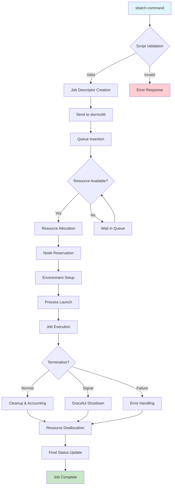

# What Actually Happens After You Run sbatch?

## Introduction
When you type `sbatch myjob.sh` the command returns almost instantly, giving the impression that the work is done. In reality, a complex chain of events is set in motion inside the SLURM workload manager. Understanding what happens behind the scenes helps you troubleshoot stalled jobs, tune resource requests, and design workflows that play nicely with the scheduler.

## Why This Matters
If you manage a shared HPC cluster or run large‑scale batch workloads, blind reliance on `sbatch` can lead to mysterious delays, over‑subscribed nodes, or unexpected preemptions. Knowing the internal steps—from script validation to final cleanup—lets you:
- Predict wait times more accurately by interpreting priority calculations.
- Design job scripts that avoid common pitfalls (e.g., missing `#SBATCH` directives).
- Communicate effectively with cluster administrators when something goes wrong.
- Optimize resource usage by aligning your requests with the scheduler’s reservation and backfilling policies.

## How It Works
Below is a step‑by‑step walkthrough of the lifecycle that begins the moment you press Enter.



### 1. Command Invocation and Initial Validation
The `sbatch` executable is a thin client that parses command‑line options, reads the supplied script, and performs a first pass of syntax checking. It expands environment variables, resolves any `#SBATCH` lines, and builds an internal representation of the job request. If something is malformed (e.g., an unknown flag or a missing executable path), the client aborts and prints an error to stderr—no network traffic is sent.

### 2. Talking to the Controller (`slurmctld`)
Assuming the script passes validation, the client opens a TCP connection to the `slurmctld` daemon (the central authority). Over this channel it serializes a **JobDesc** protobuf‑like structure that contains:
- User ID, group ID, and account string.
- Requested CPUs, memory, GPUs, and time limit.
- Working directory, environment variables, and stdout/stderr paths.
- Any dependency IDs or array indexes.
The daemon validates the request against its internal configuration (partition limits, QOS, etc.) and assigns a unique job ID.

### 3. Queue Insertion and Priority Calculation
The job is placed into the appropriate partition’s queue. SLURM employs a multi‑factor priority formula that weighs:
- **Age** – how long the job has waited.
- **Fair‑share** – recent usage of the user/account versus their allocated shares.
- **Partition priority** – administrative weight assigned to the queue.
- **Job size** – larger jobs may get a boost to reduce fragmentation.
The resulting numeric score determines the job’s position relative to other pending jobs.

### 4. Resource Allocation (Node Selection)
When the scheduler’s main loop evaluates the queue, it scans for the first job whose priority is high enough *and* whose resource request can be satisfied. The node selection heuristic considers:
- **CPU topology** – prefers sockets with free cores to minimize NUMA penalties.
- **Memory binding** – attempts to allocate memory on the same NUMA node as the assigned CPUs.
- **GPU affinity** – if GPUs are requested, the scheduler checks for available GPUs on the candidate node and may bind processes to specific GPUs.
- **Features/constraints** – matches user‑specified features (e.g., `features=intel_avx512`) against node attributes.
If no node fits, the job remains in the queue and the scheduler continues scanning.

### 5. Job Launch and Execution Environment
Once a node is reserved, `slurmd` (the daemon on the compute node) creates a clean execution context:
- Sets up the working directory (often a shared filesystem path).
- Propagates the environment variables captured at submission time, overlaying any `#SBATCH --export` directives.
- Places the job in a new process group so that signals can be delivered to all descendants.
- Applies CPU and memory cgroups (if enabled) to enforce limits.
Finally, `slurmd` execs the user’s script (typically a shell script that launches the actual application).

### 6. Monitoring, Accounting, and State Transitions
While the job runs, `slurmd` periodically sends usage snapshots (CPU time, memory, I/O) back to `slurmctld`. The controller updates the job’s state (RUNNING, SUSPENDED, COMPLETING, etc.) and writes records to the accounting database. If the job exceeds its wall time or memory limit, `slurmd` sends a SIGTERM followed by SIGKILL, and the transition to FAILED is recorded.

### 7. Termination and Cleanup
When the job exits—whether normally, via a signal, or due to an error—`slurmd`:
- Captures the exit code.
- Tears down any cgroups, removes temporary files, and releases reserved resources.
- Sends a final status update to `slurmctld`.
The controller then updates the job’s record, triggers any dependent jobs (if dependencies were specified), and makes the freed nodes available for the next scheduling cycle.

## Core Concepts
- **Job Descriptor**: The canonical data structure that travels from client to controller and persists in the scheduler’s internal queues.
- **Priority Function**: A weighted sum of age, fair‑share, partition weight, and job size; tunable via `scheduler.conf`.
- **Node Selection Heuristic**: A constraint‑satisfaction algorithm that balances topology awareness with feature matching.
- **Cgroup Enforcement**: Linux control groups used to enforce CPU, memory, and I/O limits at the kernel level.
- **State Machine**: The set of states (PENDING, RUNNING, SUSPENDED, COMPLETING, COMPLETED, FAILED, TIMEOUT, etc.) and the events that cause transitions.

## Examples & Code Walkthrough
Below are self‑contained Python snippets that illustrate key internal logic. They are **not** a replacement for the real SLURM source but demonstrate the same principles.

### 1. Job Descriptor Construction
```python
import time
import uuid
from dataclasses import dataclass, field
from typing import Dict, Optional

@dataclass
class JobDesc:
    job_id: str = field(default_factory=lambda: str(uuid.uuid4()))
    user: str = ""
    account: str = ""
    partition: str = ""
    num_cpus: int = 0
    num_gpus: int = 0
    mem_mb: int = 0
    time_limit_sec: int = 0
    work_dir: str = ""
    env: Dict[str, str] = field(default_factory=dict)
    stdout: str = ""
    stderr: str = ""
    submit_time: float = field(default_factory=time.time)
    dependency_ids: list = field(default_factory=list)

def build_job_desc(script_path: str, cli_args: Dict) -> JobDesc:
    """Parse #SBATCH directives and CLI options into a JobDesc."""
    desc = JobDesc()
    # Simulate reading the script for #SBATCH lines
    with open(script_path, "r") as f:
        for line in f:
            if line.startswith("#SBATCH"):
                # naive parsing for illustration
                parts = line.strip().split()
                if len(parts) < 3:
                    continue
                key, val = parts[1], " ".join(parts[2:])
                if key == "--account":
                    desc.account = val
                elif key == "--partition":
                    desc.partition = val
                elif key == "--cpus-per-task":
                    desc.num_cpus = int(val)
                elif key == "--mem":
                    # assume MB suffix
                    desc.mem_mb = int(val.rstrip("MB"))
                elif key == "--time":
                    h, m, s = map(int, val.split(":"))
                    desc.time_limit_sec = h * 3600 + m * 60 + s
                elif key == "--output":
                    desc.stdout = val
                elif key == "--error":
                    desc.stderr = val
                elif key == "--export":
                    for pair in val.split(","):
                        k, v = pair.split("=", 1)
                        desc.env[k] = v
    # Overlay any CLI-provided options
    desc.user = cli_args.get("user", desc.user)
    desc.account = cli_args.get("account", desc.account)
    desc.partition = cli_args.get("partition", desc.partition)
    desc.num_cpus = cli_args.get("cpus", desc.num_cpus)
    desc.num_gpus = cli_args.get("gpus", desc.num_gpus)
    desc.mem_mb = cli_args.get("mem", desc.mem_mb)
    desc.time_limit_sec = cli_args.get("time", desc.time_limit_sec)
    desc.work_dir = cli_args.get("workdir", desc.work_dir)
    return desc
```

### 2. Priority Calculation Function
```python
def calculate_priority(
    age_sec: float,
    fairshare_factor: float,
    partition_weight: float,
    job_size_factor: float,
    weights: Dict[str, float] = None
) -> float:
    """
    Return a priority score. Higher means earlier in the queue.
    Default weights mirror SLURM's default configuration.
    """
    if weights is None:
        weights = {"age": 1.0, "fairshare": 1.0, "partition": 1.0, "jobsize": 1.0}
    score = (
        weights["age"] * age_sec +
        weights["fairshare"] * fairshare_factor +
        weights["partition"] * partition_weight +
        weights["jobsize"] * job_size_factor
    )
    return score
```

### 3. Node Selection Algorithm (simplified)
```python
def select_node(job: JobDesc, nodes: list) -> Optional[Dict]:
    """
    Choose the first node that satisfies CPU, memory, GPU, and feature constraints.
    Returns the node dict or None if no fit.
    """
    for node in nodes:
        # Quick reject based on basic counts
        if node["free_cpus"] < job.num_cpus:
            continue
        if node["free_gpus"] < job.num_gpus:
            continue
        if node["free_mem_mb"] < job.mem_mb:
            continue
        # Feature match (e.g., avx512, infiniband)
        if job.env.get("FEATURES"):
            required = set(job.env["FEATURES"].split(","))
            if not required.issubset(set(node["features"])):
                continue
        # NUMA-aware CPU binding preference: pick node with largest contiguous free block
        # (placeholder logic)
        return node
    return None
```

### 4. State Machine Implementation
```python
from enum import Enum, auto

class JobState(Enum):
    PENDING = auto()
    RUNNING = auto()
    SUSPENDED = auto()
    COMPLETING = auto()
    COMPLETED = auto()
    FAILED = auto()
    TIMEOUT = auto()
    NODE_FAIL = auto()
    REQUEUED = auto()
    SPECIAL_EXIT = auto()

def transition(state: JobState, event: str) -> JobState:
    """Very small subset of possible transitions."""
    if state == JobState.PENDING and event == "resources_allocated":
        return JobState.RUNNING
    if state == JobState.RUNNING and event == "normal_exit":
        return JobState.COMPLETING
    if state == JobState.COMPLETING and event == "cleanup_done":
        return JobState.COMPLETED
    if state == JobState.RUNNING and event == "walltime_exceeded":
        return JobState.TIMEOUT
    if state == JobState.RUNNING and event == "mem_limit_exceeded":
        return JobState.FAILED
    # default: stay in same state
    return state
```

### 5. Environment Setup Script (bash)
```bash
#!/usr/bin/env bash
# slurmd launches this as the job's init process

# 1. Change to the working directory supplied by sbatch
cd "$SLURM_SUBMIT_DIR" || { echo "Cannot chdir to $SLURM_SUBMIT_DIR"; exit 1; }

# 2. Export variables that were captured at submission time
#    (SLURM already puts them in the environment, but we illustrate)
for var in SLURM_EXPORT_ENV; do
    export "$var"="${!var}"
done

# 3. Create a process group so that signals affect all children
set -m   # enable job control
# (the shell is already the process group leader)

# 4. Apply CPU affinity if requested
if [[ -n "$SLURM_CPU_BIND_LIST" ]]; then
    taskset -pc "$SLURM_CPU_BIND_LIST" $$ >/dev/null
fi

# 5. Finally exec the user's script
exec "$0"
```

### 6. Usage Collection Function (C‑like pseudocode)
```c
/* Called periodically by slurmd */
void collect_usage(job_t *job) {
    struct rusage ru;
    getrusage(RUSAGE_CHILDREN, &ru);
    job->cpu_time += ru.ru_utime + ru.ru_stime;
    job->max_rss = MAX(job->max_rss, ru.ru_maxrss);
    /* Read cgroup stats for memory and io if available */
    read_cgroup_memory(job->cgroup_path, &job->mem_usage);
    read_cgroup_io(job->cgroup_path, &job->io_bytes);
    /* Send update to slurmctld via RPC */
    send_usage_update(job->job_id, job);
}
```

### 7. Cleanup Handler (
