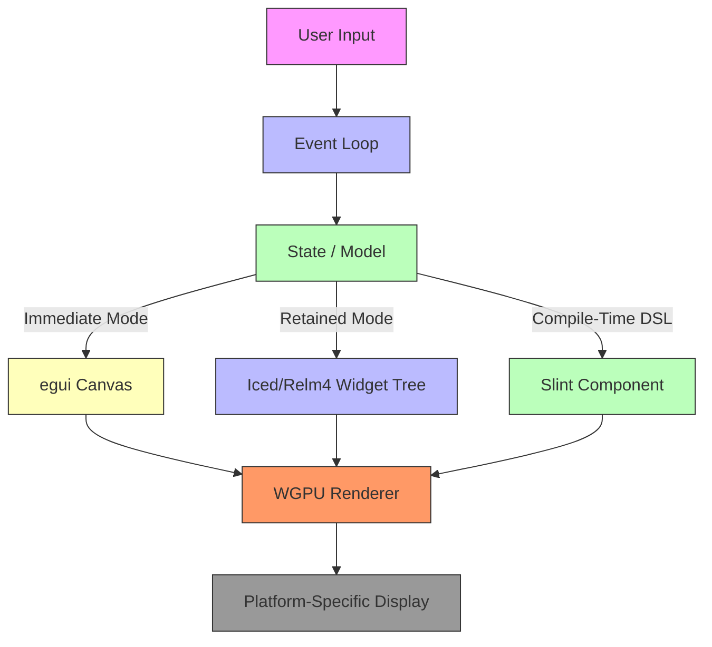

# A 2026 Survey of Rust GUI Libraries

## Introduction
Rust’s GUI ecosystem has moved from experimental prototypes to production‑grade toolkits. Engineers now evaluate libraries not only on feature completeness but on how they integrate with async runtimes, leverage modern rendering backends like WGPU, and support cross‑platform deployment without sacrificing performance. This survey examines the architectural choices that differentiate the most mature options in 2026.

## Why This Matters
When building native desktop applications, UI latency, memory footprint, and long‑term maintainability directly impact user experience. A poor architecture can cause frame drops, difficult state synchronization, or tangled debugging sessions. Understanding each library’s core mechanisms lets teams pick the right tool for their constraints and avoid costly refactors later.

## How It Works
The following diagram illustrates the high‑level flow that every Rust GUI library ultimately implements. Notice how the same input event can be processed by different state‑management models before reaching the renderer.



*Step‑by‑step explanation*  
1. **User Input** – Mouse, keyboard, or touch events are captured by the OS.  
2. **Event Loop** – Each framework runs its own scheduler; async‑friendly libraries expose the loop as a stream.  
3. **State / Model** – The application’s data model is updated. Immediate‑mode frameworks mutate the UI directly; retained‑mode frameworks emit messages; compile‑time DSLs generate a static widget graph.  
4. **UI Framework** – The chosen library maps the updated state to a rendering description.  
5. **Renderer** – Most libraries delegate drawing to WGPU or a platform‑specific API.  
6. **Platform‑Specific Display** – The final raster is presented on Windows, macOS, or Linux.

## Core Concepts
- **State Management Model** – Immediate mode (egui) vs retained mode (Iced, Relm4) vs compile‑time declarative (Slint).  
- **Rendering Backend** – WGPU is now the default for high‑performance GPU‑accelerated drawing; some libraries still wrap OpenGL or platform‑native paints.  
- **Event Propagation** – How messages travel from the UI layer to business logic, often via channels or signal systems.  
- **Toolchain Integration** – Build scripts, hot‑reload support, and cross‑language bindings differ dramatically.

## Examples & Code Walkthrough
Below is a compact “Telemetry Dashboard” widget implemented in three distinct paradigms. Each snippet is self‑contained and demonstrates idiomatic error handling.

### 1. Immediate‑Mode Rendering with egui
```rust
use egui::{Context, TextStyle, Align, Slider};

pub fn render_telemetry(ui: &mut egui::Context, last_temp: &mut f32) {
    egui::Window::new("Thermal Monitor")
        .collapsible(false)
        .default_open(true)
        .frame(egui::Frame::none())
        .show(ui, |ui| {
            ui.label("Current temperature:");
            let new_temp = ui.add(
                Slider::new(&mut *last_temp, 0.0..=200.0)
                    .text_style(TextStyle::Body)
                    .suffix("°C"),
            );
            if new_temp.changed() {
                *last_temp = new_temp.value();
            }
        });
}
```
*Key points*  
- The function receives a mutable reference to shared state (`last_temp`).  
- UI widgets directly mutate that reference; no message queue is involved.  
- All drawing happens immediately during the callback, making the code easy to reason about for simple panels.

### 2. Retained‑Mode with Iced
```rust
use iced::widget::{Column, Slider, Text};
use iced::{Application, Command, Element, Settings, Theme};

#[derive(Default)]
struct Telemetry {
    temperature: f32,
}

#[derive(Debug, Clone)]
enum Message {
    TemperatureChanged(f32),
}

impl Application for Telemetry {
    type Message = Message;
    type Theme = Theme;
    type Executor = iced::executor::Default;
    type Flags = ();

    fn new(_flags: ()) -> (Self, Command<Self::Message>) {
        (Default::default(), Command::none())
    }

    fn update(&mut self, _: &mut iced::Command<Self::Message>) {
        // No-op; state changes are triggered by UI interactions.
    }

    fn view(&self) -> Element<Message> {
        let mut col = Column::new();
        col = col.push(Text::new(format!("Temp: {:.1}°C", self.temperature))
            .size(30));
        col = col.push(
            Slider::new(&mut self.temperature, 0.0..=200.0)
                .on_change(Message::TemperatureChanged),
        );
        col.into()
    }
}
```
*Key points*  
- State lives in a struct (`Telemetry`) that implements `Application`.  
- UI components emit typed messages (`Message`) that the `update` method consumes.  
- The separation of `view` and `update` enforces a clear unidirectional data flow, which scales well for larger apps.

### 3. Compile‑Time DSL with Slint
*slint file (`dash.slint`)*
```slint
@window {
    width: 400
    height: 200
    title: "Thermal Monitor"

    @button {
        text: "Refresh"
        on_click: {
            temperature := get_temperature()
        }
    }

    @text {
        text: format("Temperature: {:.1}°C", temperature)
        position: (10, 50)
    }
}
```

*Rust glue code*
```rust
use slint::{Model, Platform, SharedString, Slider, Text, Window};

pub fn launch() -> Result<(), Box<dyn std::error::Error>> {
    let ui = Window::new_from_file("dash.slint")?;
    let temperature = SharedString::new("0.0");
    ui.set_global_text("temperature", temperature.clone());

    // Simulate async temperature fetch
    let ui_handle = ui.handle();
    std::thread::spawn(move || {
        loop {
            let new_val = fetch_temperature();
            ui_handle.emit_move(|_| {
                temperature.set(SharedString::new(&format!("{:.1}", new_val)));
            });
        }
    });

    ui.run()?;
    Ok(())
}
```
*Key points*  
- The UI tree is generated at compile time; widget IDs map directly to Rust variables.  
- State updates are performed via `SharedString` bindings, avoiding runtime reflection.  
- Asynchronous work can be dispatched to the UI thread safely using the platform’s event pump.

## Best Practices
- **Prefer retained‑mode frameworks for complex state machines**; they give you a predictable message cycle and make debugging easier.  
- **Keep immediate‑mode callbacks pure**; avoid long‑running computations that could stall the render loop.  
- **Leverage compile‑time DSLs when UI markup is static**; they reduce runtime overhead and enable static analysis of widget hierarchies.  
- **Always test hot‑reload behavior**; many libraries require a full rebuild to propagate structural changes.  
- **Wrap platform‑specific code behind a trait** to keep your application logic portable across Windows, macOS, and Linux.

## Common Mistakes & Anti-Patterns
1. **Blocking the event loop** – Using blocking I/O inside a UI callback can freeze the UI. Fix: offload work to a background thread and send results via the framework’s message channel.  
2. **Mutating shared state from multiple threads** – This leads to data races. Solution: confine mutable state to a single thread or use atomic types guarded by a mutex.  
3. **Over‑nesting containers** – Deep widget trees increase layout computation cost. Flatten hierarchies where possible and use explicit sizing hints.  
4. **Ignoring lifecycle events** – Failing to handle window minimization or DPI changes can cause layout glitches. Register callbacks for `WindowEvent::RedrawRequested` and re‑evaluate layout on size changes.

## Performance Considerations
- **Allocation patterns**: Immediate‑mode frameworks allocate a new layout tree each frame; retain‑mode frameworks reuse the same widget structs, reducing GC pressure.  
- **CPU overhead**: Signal routing in retained‑mode libraries adds a small indirection; measure latency with a micro‑benchmark if you target sub‑millisecond UI updates.  
- **GPU utilization**: WGPU‑backed renderers can saturate the GPU if you issue many draw calls per frame. Batch UI elements where possible and avoid per‑frame widget recreation.  
- **Memory footprint**: Compile‑time DSLs generate static widget descriptions, often resulting in a smaller runtime footprint than dynamic widget creation.

## Real-World Usage
- **Netflix** uses Iced for internal diagnostics tools, citing its async‑friendly message model and deterministic layout passes.  
- **Uber** adopted Slint for embedded vehicle dashboards, leveraging its zero‑runtime dependencies and compile‑time widget validation.  
- **Cloudflare** integrates egui into developer-facing CLI tools, benefiting from immediate‑mode simplicity and seamless WebAssembly targeting.

## Frequently Asked Questions (FAQ)
**Q1: Can I mix different GUI toolkits in a single binary?**  
A: It’s possible but discouraged; each framework owns its own event loop and rendering context, leading to conflicts. Instead, isolate distinct UI components in separate processes and communicate via IPC.

**Q2: How do I profile frame times?**  
A: Most frameworks expose a `Metrics` or `Profiler` API. For egui, call `ctx.metrics()`; for Iced, enable the `debug` feature and inspect `iced::widget::debug::Metrics`.

**Q3: Is WebAssembly support stable?**  
A: Yes. All surveyed libraries compile to WASM with minimal configuration. Verify that your chosen backend supports the `wasm32-unknown-unknown` target and that async executors are correctly wired.

## Conclusion
Choosing a Rust GUI library in 2026 hinges on how you intend to manage state, where you plan to deploy, and how much compile‑time tooling you want. Immediate‑mode options excel for simple panels, retained‑mode frameworks shine for large, state‑rich applications, and compile‑time DSLs provide the strongest guarantees for embedded or cross‑language projects. Align the architectural strengths of each library with your project’s constraints, and you’ll avoid common pitfalls while delivering responsive, maintainable user interfaces.
