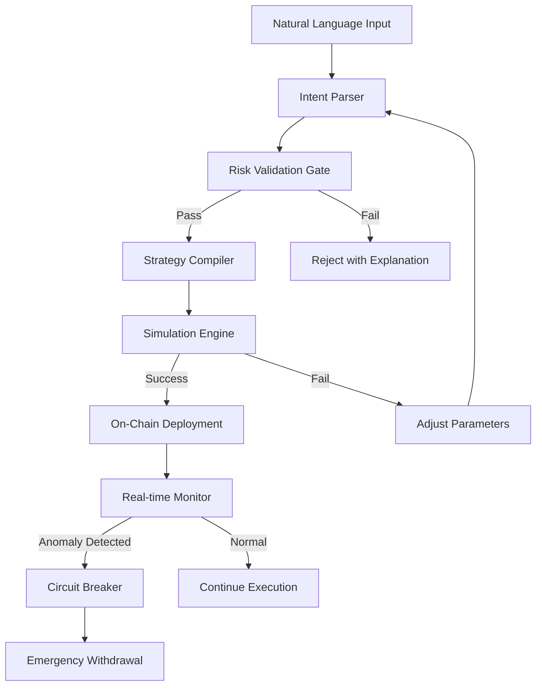

# Almanak Launches: Vibecode a Live On-Chain Quant Strategy With One Sentence - But What I Really Care About Is How It Keeps Your Money From Blowing Up

## Introduction

Almanak just shipped a feature called Vibecode. The pitch is simple: type a sentence in plain English, get a live on-chain quant strategy deployed to mainnet. Something like *"Sell ETH if volatility spikes 20% in 5 minutes"* and you get a compiled, deployed, actively monitored smart contract strategy.

That's the demo. That's the screenshot that goes viral on Crypto Twitter.

But I've spent enough time auditing on-chain execution systems to know that the sentence-to-strategy pipeline is the least interesting part. The interesting part—the part that determines whether this product survives contact with real capital—is the 400 lines of safety infrastructure sitting between your sentence and the mempool. The risk firewall. The circuit breakers. The simulation layer that says "no" when your vibe would otherwise drain your wallet.

This article is about that infrastructure.

## Why This Matters

Natural language interfaces to financial systems are a paradox. Human language is ambiguous, context-dependent, and frequently self-contradictory. On-chain execution is deterministic, irreversible, and unforgiving. Bridging those two worlds isn't a UX problem—it's a compiler design problem with life-safety implications.

Engineers building in this space need to care because the pattern Almanak is pioneering—intent-based declarative interfaces over adversarial execution environments—is coming everywhere. We're seeing it in MEV searchers, in DeFi vault composition tools, in cross-chain bridge orchestration. The fundamental challenge is always the same: how do you translate fuzzy human intent into constrained, validated, fail-safe machine execution?

If you get the translation layer right but the safety layer wrong, you've built a very fast way to lose money. If you get the safety layer right but the translation layer wrong, nobody uses your product. Almanak is attempting both simultaneously, and the engineering choices they've made are worth studying.

## How It Works

The system operates as a pipeline with hard rejection gates at every stage. Nothing reaches the blockchain without passing through validation, simulation, and risk-parameter enforcement.



Here's the step-by-step flow:

1. **Natural Language Input** arrives as a raw string. No assumptions about structure, grammar, or financial literacy.

2. **Intent Parser** tokenizes the input using a custom financial dialect lexer. It recognizes asset tickers, condition operators, temporal clauses, and action verbs. The output is an intermediate representation (IR), not a direct contract.

3. **Risk Validation Gate** inspects the IR for dangerous patterns before compilation even begins. If the parsed intent implies unbounded gas spend, zero slippage tolerance, or exposure to a single illiquid pool, the gate rejects it with a human-readable explanation. This is the first hard stop.

4. **Strategy Compiler** converts validated IR into a concrete execution plan: contract bytecode, oracle subscriptions, trigger conditions, and parameter bounds.

5. **Simulation Engine** runs the compiled strategy against a forked mainnet state using historical block data. It replays the last 1,000 blocks and measures hypothetical P&L, gas consumption, and slippage exposure. If the strategy would have blown past risk thresholds during any historical window, it fails.

6. **On-Chain Deployment** only happens after simulation passes. The strategy contract is deployed with immutable risk parameters baked into the bytecode—max drawdown, gas ceiling, slippage tolerance, and a kill switch address.

7. **Real-time Monitor** watches oracle feeds, gas prices, and position health post-deployment. If any metric crosses a threshold, the circuit breaker fires and triggers an emergency withdrawal to a safe address.

The critical design decision here is that risk parameters are not configurable at runtime by the strategy itself. They're compiled into the contract. The strategy cannot relax its own guardrails.

## Core Concepts

### Intent as a First-Class Type

The core data structure is `QuantIntent`—a strongly typed intermediate representation that sits between human language and executable code. Every parsed sentence becomes one of these. If a sentence can't produce a valid `QuantIntent`, it doesn't compile. Period.

```rust
/// Intermediate representation of a parsed trading intent.
/// This is the boundary between fuzzy human language and deterministic execution.
#[derive(Debug, Clone)]
pub struct QuantIntent {
    pub asset: AssetPair,
    pub trigger: TriggerCondition,
    pub action: ExecutionAction,
    pub risk_params: RiskLimits,
    pub time_window: TimeWindow,
}

#[derive(Debug, Clone)]
pub struct AssetPair {
    pub base: Asset,      // e.g., ETH
    pub quote: Asset,     // e.g., USDC
    pub venue: Venue,     // e.g., UniswapV3, Curve, 1inch
}

#[derive(Debug, Clone)]
pub enum TriggerCondition {
    VolatilitySpike { threshold_pct: u8, window_seconds: u32 },
    PriceThreshold { direction: Direction, target: Decimal },
    OracleDeviation { max_bps: u16 },
    GasPriceThreshold { gwei: u64 },
}

#[derive(Debug, Clone)]
pub struct RiskLimits {
    pub max_drawdown_bps: u16,       // 100 bps = 1%
    pub gas_ceiling_wei: U256,
    pub slippage_tolerance_bps: u16,
    pub max_position_size: U256,
}
```

### The Safety Wrapper as a Separate Concern

Execution and safety are decoupled. The `SafeExecutor` wraps any strategy with guardrails that the strategy itself cannot bypass. This is the architectural equivalent of a hardware interlock—you can't disable the safety from inside the machine.

### Circuit Breakers as First-Class Citizens

The monitoring layer doesn't just alert. It acts. When an anomaly is detected, the circuit breaker signs and broadcasts an emergency withdrawal transaction from a pre-funded relay wallet. The strategy contract is designed to accept withdrawal calls from the breaker address without additional authentication. The breaker is a separate key, held by a separate service, running in a separate process.

## Examples & Code Walkthrough

### Example A: Intent-to-IR Compiler

This is the entry point. It takes a raw string, tokenizes it against a financial dialect, validates risk bounds, and produces a `QuantIntent`. If anything looks dangerous at the parse stage, it rejects before compilation.

```rust
use rust_decimal::Decimal;
use ethers::types::U256;

/// Errors that can occur during vibe compilation.
/// We distinguish between parse failures and risk violations
/// because the user feedback for each is fundamentally different.
#[derive(Debug, thiserror::Error)]
pub enum RiskError {
    #[error("Parse failure: {0}")]
    ParseFailure(String),
    #[error("Risk violation: {0}")]
    RiskViolation(String),
    #[error("Ambiguous intent: {0}")]
    Ambiguous(String),
}

/// Token types for our financial dialect lexer.
/// We deliberately keep this small—overloading the lexer with
/// every possible financial term makes ambiguity worse, not better.
#[derive(Debug, Clone, PartialEq)]
enum FinanceToken {
    Asset(String),
    Number(f64),
    Percentage(u8),
    TimeUnit(u32),           // seconds
    Operator(CondOp),
    Action(ActionVerb),
    Venue(String),
    Comma,
    LParen,
    RParen,
}

#[derive(Debug, Clone, PartialEq)]
enum CondOp {
    Spikes,
    Drops,
    Above,
    Below,
    Within,
}

#[derive(Debug, Clone, PartialEq)]
enum ActionVerb {
    Sell,
    Buy,
    Withdraw,
    Rebalance,
    Harvest,
}

/// Tokenize raw input into our financial dialect.
/// This is intentionally a hand-written lexer rather than a regex
/// engine—financial slang has enough structural variety that regex
/// produces false positives on edge cases like "5min" vs "5 min".
fn tokenize_finance_dialect(input: &str) -> Result<Vec<FinanceToken>, RiskError> {
    let mut tokens = Vec::new();
    let words = input.split_whitespace().collect::<Vec<_>>();
    let mut i = 0;

    while i < words.len() {
        let w = words[i].to_lowercase().trim_end_matches(',');

        match w {
            "eth" | "btc" | "weth" | "usdc" | "dai" | "wbtc" => {
                tokens.push(FinanceToken::Asset(w.to_uppercase()));
            }
            "uniswap" | "curve" | "1inch" | "balancer" => {
                tokens.push(FinanceToken::Venue(w.to_string()));
            }
            "sell" => tokens.push(FinanceToken::Action(ActionVerb::Sell)),
            "buy" => tokens.push(FinanceToken::Action(ActionVerb::Buy)),
            "withdraw" => tokens.push(FinanceToken::Action(ActionVerb::Withdraw)),
            "spikes" | "spike" => tokens.push(FinanceToken::Operator(CondOp::Spikes)),
            "drops" | "drop" => tokens.push(FinanceToken::Operator(CondOp::Drops)),
            "above" => tokens.push(FinanceToken::Operator(CondOp::Above)),
            "below" => tokens.push(FinanceToken::Operator(CondOp::Below)),
            "volatility" | "vol" => {
                // Look ahead for a percentage
                if i + 2 < words.len() {
                    if let Ok(pct) = words[i + 1].trim_end_matches('%').parse::<u8>() {
                        tokens.push(FinanceToken::Percentage(pct));
                        i += 1;
                        // Check for time window: "in 5min" or "in 5 min"
                        if words.get(i + 1).map(|s| *s == "in").unwrap_or(false) {
                            if let Some(time_str) = words.get(i + 2) {
                                let secs = parse_time_window(time_str)?;
                                tokens.push(FinanceToken::TimeUnit(secs));
                                i += 2;
                            }
                        }
                    }
                }
            }
            _ => {
                // Try parsing as a number
                if let Ok(n) = w.parse::<f64>() {
                    tokens.push(FinanceToken::Number(n));
                }
                // Unknown tokens are silently skipped rather than erroring.
                // This is a deliberate trade-off: we'd rather under-parse
                // than mis-parse. Ambiguity is caught downstream.
            }
        }
        i += 1;
    }

    if tokens.is_empty() {
        return Err(RiskError::ParseFailure(
            "No recognizable financial tokens in input".into(),
        ));
    }

    Ok(tokens)
}

fn parse_time_window(s: &str) -> Result<u32, RiskError> {
    let s = s.to_lowercase();
    if let Some(n) = s.strip_suffix("min") {
        n.parse::<u32>()
            .map(|m| m * 60)
            .map_err(|_| RiskError::ParseFailure(format!("Invalid time window: {s}")))
    } else if let Some(n) = s.strip_suffix("s") {
        n.parse::<u32>()
            .map_err(|_| RiskError::ParseFailure(format!("Invalid time window: {s}")))
    } else if let Some(n) = s.strip_suffix("h") {
        n.parse::<u32>()
            .map(|m| m * 3600)
            .map_err(|_| RiskError::ParseFailure(format!("Invalid time window: {s}")))
    } else {
        Err(RiskError::ParseFailure(format!("Unrecognized time unit: {s}")))
    }
}

/// Hard validation of risk bounds before we even build the IR.
/// This is the first line of defense—rejecting dangerous intents
/// at parse time is cheaper and safer than catching them at simulation.
fn validate_risk_bounds(tokens: &[FinanceToken]) -> Result<(), RiskError> {
    // Check for unbounded position sizes
    let has_position_limit = tokens.iter().any(|t| {
        matches!(t, FinanceToken::Number(n) if *n > 0.0 && *n < 1_000_000.0)
    });

    // Reject intents with extreme volatility thresholds that would
    // trigger on virtually any market movement
    for token in tokens {
        if let FinanceToken::Percentage(pct) = token {
            if *pct > 80 {
                return Err(RiskError::RiskViolation(format!(
                    "Volatility threshold of {pct}% is effectively unbounded. \
                     Maximum allowed is 80%."
                )));
            }
            if *pct < 1 {
                return Err(RiskError::RiskViolation(
                    "Volatility threshold below 1% will trigger on normal \
                     market noise. Minimum is 1%.".into(),
                )));
            }
        }
    }

    // Ensure at least one action verb is present
    let has_action = tokens.iter().any(|t| {
        matches!(t, FinanceToken::Action(_))
    });
    if !has_action {
        return Err(RiskError::ParseFailure(
            "Intent contains no executable action".into(),
        ));
    }

    Ok(())
}

/// Main entry point: compile a vibe string into a validated QuantIntent.
pub fn compile_vibe(input: &str) -> Result<QuantIntent, RiskError> {
    let tokens = tokenize_finance_dialect(input)?;

    // Hard stops before compilation—these are non-negotiable.
    validate_risk_bounds(&tokens)?;

    // Build the IR from tokens. This is where ambiguity resolution happens.
    let intent = QuantIntent::from_tokens(&tokens)?;

    // Final cross-field validation: e.g., if the action is "withdraw"
    // but no venue is specified, that's a semantic error, not a parse error.
    intent.semantic_check()?;

    Ok(intent)
}
```

### Example B: The Safety Wrapper

This is the execution boundary. Every strategy, regardless of how it was compiled, runs through this wrapper. The wrapper enforces immutable risk parameters that the strategy cannot override.

```rust
use ethers::{
    providers::{Provider, Http},
    types::{U256, H256, TransactionReceipt},
    signers::{LocalWallet, Signer},
};
use std::sync::Arc;
use thiserror::Error;

#[derive(Debug, Error)]
pub enum SafetyViolation {
    #[error("Drawdown exceeded: expected {expected} bps, max allowed {max} bps")]
    DrawdownExceeded { expected: u16, max: u16 },
    #[error("Gas estimate {gas} wei exceeds ceiling {ceiling} wei")]
    GasCeilingExceeded { gas: U256, ceiling: U256 },
    #[error("Slippage {slippage} bps exceeds tolerance {tolerance} bps")]
    SlippageExceeded { slippage: u16, tolerance: u16 },
    #[error("Simulation failed: {reason}")]
    SimulationFailed { reason: String },
    #[error("Broadcast failed: {0}")]
    BroadcastFailed(String),
    #[error("Circuit breaker already tripped for strategy {0}")]
    BreakerTripped(String),
}

/// The safety wrapper. This struct is constructed once at deployment
/// time and its parameters are immutable for the lifetime of the strategy.
/// The strategy contract on-chain mirrors these exact values.
pub struct SafeExecutor {
    pub max_drawdown_bps: u16,
    pub gas_ceiling_wei: U256,
    pub slippage_tolerance_bps: u16,
    pub max_position_size: U256,
    pub provider: Arc<Provider<Http>>,
    pub signer: LocalWallet,
    /// Once this is true, no further executions are allowed.
    /// This flag is checked before every single transaction.
    breaker_tripped: std::sync::atomic::AtomicBool,
}

impl SafeExecutor {
    pub fn new(
        max_drawdown_bps: u16,
        gas_ceiling_wei: U256,
        slippage_tolerance_bps: u16,
        max_position_size: U256,
        provider: Arc<Provider<Http>>,
        signer: LocalWallet,
    ) -> Self {
        Self {
            max_drawdown_bps,
            gas_ceiling_wei,
            slippage_tolerance_bps,
            max_position_size,
            provider,
            signer,
            breaker_tripped: std::sync::atomic::AtomicBool::new(false),
        }
    }

    /// Trip the circuit breaker. This is irreversible for the lifetime
    /// of this executor instance. Called by the monitoring layer when
    /// an anomaly is detected.
    pub fn trip_breaker(&self) {
        self.breaker_tripped
            .store(true, std::sync::atomic::Ordering::SeqCst);
        tracing::error!("Circuit breaker tripped. All future executions blocked.");
    }

    /// Check if the breaker has been tripped. This is called at the
    /// top of every execution path—no exceptions.
    fn check_breaker(&self) -> Result<(), SafetyViolation> {
        if self.breaker_tripped.load(std::sync::atomic::Ordering::SeqCst) {
            return Err(SafetyViolation::BreakerTripped("unknown".into()));
        }
        Ok(())
    }

    /// Execute a strategy with all guardrails enforced.
    /// The order of checks is deliberate:
    ///   1. Breaker check (cheapest, most critical)
    ///   2. Risk parameter validation (local computation)
    ///   3. Gas estimation (requires network call)
    ///   4. Dry-run simulation (most expensive, forked state)
    ///   5. Broadcast (irreversible)
    pub async fn execute_with_guards(
        &self,
        strategy: &Strategy,
    ) -> Result<H256, SafetyViolation> {
        // 1. Circuit breaker—always first, always cheap.
        self.check_breaker()?;
