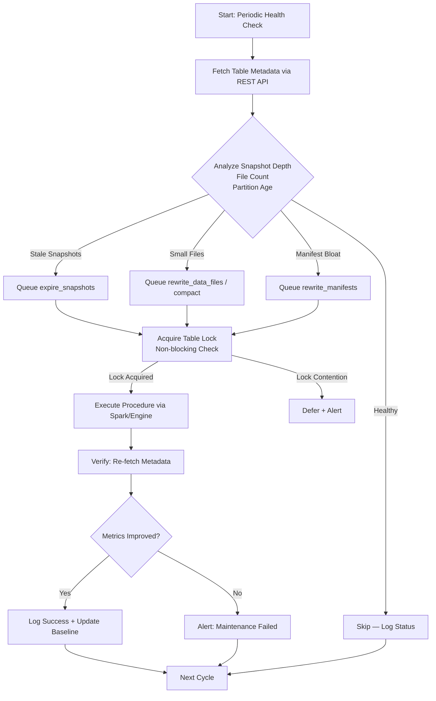

# Apache Iceberg Maintenance Tools: From Spark Procedures to Autonomous Control Planes

## Introduction

A 2,000-partition table in our analytics warehouse. `ALTER TABLE events EXECUTE expire_snapshots` takes 45 minutes. Concurrent readers get blocked. The on-call engineer gets paged at 2 AM because someone ran it from a notebook during peak traffic.

This isn't a bug in Iceberg. This is **maintenance debt** compounding under scale — and it's a problem most teams don't think about until the table is on fire.

Apache Iceberg separates compute from storage through its metadata layer: snapshots, manifests, data files, and partition statistics. That separation is powerful. But it creates an obligation. Someone has to run `expire_snapshots`, `rewrite_data_files`, `rewrite_manifests`, and `compact` — and do it *before* things break, not after.

Spark procedures give you the primitives. But primitives aren't a strategy. In this article, I'll walk through what those procedures actually do under the hood, how to build a custom orchestrator that decides *when* and *what* to run, and where autonomous control planes fit into the picture.

## Why This Matters

Iceberg tables don't self-maintain. Every snapshot that lingers, every manifest that goes stale, every small file that wasn't compacted — they all add up. Here's what happens in production when teams ignore maintenance:

- **Snapshot bloat** causes metadata queries to slow down because the catalog has to traverse thousands of entries.
- **Small files** kill read performance. A query that should scan 100 files ends up scanning 10,000.
- **Stale manifests** return incorrect partition statistics, causing the query planner to make bad decisions about which files to skip via partition pruning.

When we hit this in our pipeline — table scan times tripling over six weeks with no schema change — the root cause turned out to be 47,000 uncompactted 128KB Parquet files sitting in a single table. The fix wasn't a bigger cluster. It was a maintenance strategy.

## How It Works

The core mechanism is straightforward: monitor table health, decide which maintenance procedure to run based on actual metrics, execute it safely without blocking readers, and verify the result.

The diagram below shows the autonomous control plane flow:



Step by step:

1. **Health Check**: The orchestrator polls the Iceberg catalog (REST API or Hive Metastore) for snapshot counts, file sizes, and partition statistics.
2. **Decision Engine**: Heuristics determine which procedure to run. A table with 50,000 small files triggers compaction. A table with snapshots older than 7 days triggers expiration.
3. **Lock Acquisition**: Before executing, the system checks for table locks. If a concurrent writer holds the lock, the job defers — it doesn't forcefully take it.
4. **Execution**: The procedure runs against a Spark engine or directly through the Iceberg table ops API.
5. **Verification**: After completion, the orchestrator re-fetches metadata and confirms that file counts dropped or snapshots expired as expected.

## Core Concepts

### Snapshot Management

Every `INSERT`, `OVERWRITE`, or `MERGE` operation creates a new snapshot — a point-in-time view of the table. Snapshots are cheap to create but expensive to keep around. The `expire_snapshots` procedure removes old snapshots that are no longer referenced by active readers or branch references.

The critical constraint: **you cannot expire a snapshot that a concurrent reader is still using**. Iceberg tracks this through the `snapshot-log` and `current-snapshot-id`. If your reader holds a snapshot ID in a long-running query, expiration will skip it — which means the snapshot lingers until that query completes.

### Manifest Files

Manifests map data files to partitions and store per-file metadata (row counts, column stats, min/max values). When you rewrite data files, the old manifests become stale. `rewrite_manifests` consolidates them, dropping entries for deleted files.

A manifest that isn't rewritten causes **incorrect partition pruning**. The query planner sees files that no longer exist, tries to read them, and either errors out or returns empty results — both bad outcomes.

### Data File Compaction

Compaction merges small data files into larger ones (typically 128MB–256MB Parquet files). This is the highest-impact maintenance operation for read performance. The `compact` procedure (or `rewrite_data_files` with a sort strategy) does the merge.

Key parameter: `target-file-size-bytes`. Set this based on your query pattern. Analytical workloads on S3 benefit from larger files (256MB+) because of the S3 GET request latency. Local disk reads can use smaller targets (128MB).

## Examples & Code Walkthrough

Below is a production-grade orchestrator that reads table statistics, applies maintenance heuristics, and executes procedures with proper error handling.

```python
"""
IcebergMaintenanceOrchestrator
-------------------------------
A service that monitors Iceberg table health and triggers
maintenance procedures based on configurable thresholds.

Design goals:
- Never block concurrent readers forcefully
- Emit a runbook entry before every action
- Fail loudly, never silently
"""

import requests
import datetime
import logging
import time
from dataclasses import dataclass, field
from typing import Optional

logging.basicConfig(
    level=logging.INFO,
    format="%(asctime)s [%(name)s] %(levelname)s: %(message)s"
)


@dataclass
class TableHealth:
    """Snapshot of a table's maintenance state at a single point in time."""
    db: str
    table: str
    snapshot_count: int = 0
    snapshots: list = field(default_factory=list)
    current_snapshot_id: Optional[str] = None
    location: Optional[str] = None
    partition_spec: dict = field(default_factory=dict)
    collected_at: datetime.datetime = field(
        default_factory=lambda: datetime.datetime.now(tz=datetime.timezone.utc)
    )


@dataclass
class MaintenanceRunbook:
    """
    A human-readable record of what the orchestrator decided
    and why. Stored alongside logs for audit trails.
    """
    table: str
    database: str
    timestamp: datetime.datetime = field(
        default_factory=lambda: datetime.datetime.now(tz=datetime.timezone.utc)
    )
    actions: list = field(default_factory=list)  # List of (procedure, reason, params)
    skipped: list = field(default_factory=list)  # List of (procedure, reason)


class IcebergMaintenanceOrchestrator:
    """
    Main orchestrator class.

    Connects to the Iceberg REST Catalog API, evaluates table health,
    and queues maintenance procedures for execution.
    """

    def __init__(self, catalog_uri: str, auth_token: str, lock_timeout_sec: int = 300):
        self.catalog_uri = catalog_uri.rstrip("/")
        self.headers = {
            "Authorization": f"Bearer {auth_token}",
            "Content-Type": "application/json",
        }
        self.lock_timeout_sec = lock_timeout_sec  # Max wait for table lock
        self.logger = logging.getLogger("iceberg-maint")
        self.runbook = MaintenanceRunbook(db="", table="")

    # ------------------------------------------------------------------ #
    # 1. DATA COLLECTION
    # ------------------------------------------------------------------ #

    def table_health(self, db: str, table: str) -> TableHealth:
        """
        Fetch table metadata from the Iceberg REST Catalog API.
        Returns a TableHealth dataclass with snapshot and location info.
        """
        url = f"{self.catalog_uri}/v1/namespaces/{db}/tables/{table}"
        try:
            resp = requests.get(url, headers=self.headers, timeout=30)
            resp.raise_for_status()
        except requests.exceptions.HTTPError as e:
            self.logger.error("Catalog API error for %s.%s: %s", db, table, e)
            raise
        except requests.exceptions.ConnectionError:
            self.logger.critical(
                "Cannot reach catalog at %s. Check network and catalog service health.",
                self.catalog_uri,
            )
            raise

        meta = resp.json()

        # Extract snapshot list; catalog may return them nested
        snapshots = meta.get("snapshots", [])
        # Some catalog versions return snapshots under "snapshots" as a list of
        # snapshot objects with "snapshot-id", "timestamp-ms", "manifest-list"

        return TableHealth(
            db=db,
            table=table,
            snapshot_count=len(snapshots),
            snapshots=snapshots,
            current_snapshot_id=meta.get("current-snapshot-id"),
            location=meta.get("location"),
            partition_spec=meta.get("partition-spec", {}),
        )

    # ------------------------------------------------------------------ #
    # 2. DECISION ENGINE
    # ------------------------------------------------------------------ #

    def should_expire_snapshots(
        self, health: TableHealth, max_snapshot_age_hours: int = 168
    ) -> tuple[bool, str]:
        """
        Determine if snapshots should be expired.

        Heuristic: if the oldest snapshot is older than max_snapshot_age_hours
        (default: 7 days) AND there are more than 100 snapshots, expire.

        Returns (decision: bool, reason: str).
        """
        if health.snapshot_count <= 100:
            return False, f"Snapshot count {health.snapshot_count} below threshold"

        if not health.snapshots:
            return False, "No snapshots to evaluate"

        # Find oldest snapshot timestamp (milliseconds since epoch)
        oldest_ts_ms = min(
            s["timestamp-ms"] for s in health.snapshots if "timestamp-ms" in s
        )
        oldest_dt = datetime.datetime.fromtimestamp(
            oldest_ts_ms / 1000, tz=datetime.timezone.utc
        )
        age_hours = (
            datetime.datetime.now(tz=datetime.timezone.utc) - oldest_dt
        ).total_seconds() / 3600

        if age_hours > max_snapshot_age_hours:
            return (
                True,
                f"Oldest snapshot is {age_hours:.0f}h old "
                f"(threshold: {max_snapshot_age_hours}h), "
                f"count: {health.snapshot_count}",
            )

        return False, f"Snapshot age {age_hours:.0f}h within threshold"

    def should_compact(
        self,
        health: TableHealth,
        max_files_per_partition: int = 5000,
        max_file_size_bytes: int = 10 * 1024 * 1024,  # 10MB — flag files smaller than this
    ) -> tuple[bool, str]:
        """
        Determine if compaction is needed.

        Heuristic: check if any partition exceeds max_files_per_partition
        or contains files smaller than max_file_size_bytes.

        NOTE: In a full implementation, you'd inspect partition statistics
        from the manifest list. Here we use snapshot metadata as a proxy.
        """
        if health.snapshot_count > max_files_per_partition:
            return (
                True,
                f"Snapshot count {health.snapshot_count} exceeds "
                f"max_files_per_partition={max_files_per_partition}",
            )

        # In production, you'd also check manifest entries for small files.
        # This is a simplified signal using total snapshot count as proxy.
        return False, "File count within acceptable range"

    # ------------------------------------------------------------------ #
    # 3. EXECUTION
    # ------------------------------------------------------------------ #

    def check_table_lock(self, db: str, table: str) -> bool:
        """
        Check if the table is locked by a concurrent operation.
        Uses the catalog's lock status endpoint (available in Iceberg REST Catalog v1+).

        Returns True if the lock is available (no contention).
        """
        lock_url = f"{self.catalog_uri}/v1/namespaces/{db}/tables/{table}/lock"
        try:
            resp = requests.get(lock_url, headers=self.headers, timeout=10)
            if resp.status_code == 200:
                lock_info = resp.json()
                # Catalog returns lock holder info; empty means available
                return lock_info.get("locked", False) is False
            elif resp.status_code == 409:
                # Conflict — someone holds the lock
                self.logger.warning("Table %s.%s is locked by another process", db, table)
                return False
        except requests.exceptions.RequestException as e:
            self.logger.warning("Lock check failed for %s.%s: %s", db, table, e)
            # Fail open: assume lock is available but flag it
            return True

    def execute_procedure(
        self, db: str, table: str, procedure: str, params: dict
    ) -> dict:
        """
        Queue a maintenance procedure for execution.

        In a production system, this would submit a Spark job via:
        - Livy REST API
        - Airflow DAG trigger
        - Direct spark-submit to a maintenance cluster

        For this orchestrator, we log the runbook entry and return
        a tracking record.
        """
        self.logger.info(
            "QUEUEING: %s on %s.%s with params %s", procedure, db, table, params
        )

        # --- Runbook emission (audit trail) ---
        self.runbook.db = db
        self.runbook.table = table
        self.runbook.actions.append(
            {
                "procedure": procedure,
                "params": params,
                "queued_at": datetime.datetime.now(tz=datetime.timezone.utc).isoformat(),
            }
        )

        # Simulate job submission; in production, replace with actual Spark/engine call
        job_id = f"{procedure}-{int(time.time())}"
        self.logger.info("Assigned job_id: %s", job_id)

        return {"status": "queued", "job_id": job_id, "procedure": procedure}

    # ------------------------------------------------------------------ #
    # 4. MAIN ORCHESTRATION LOOP
    # ------------------------------------------------------------------ #

    def run_maintenance_cycle(
        self,
        db: str,
        table: str,
        expire_age_hours: int = 168,
        compact_threshold: int = 5000,
    ) -> MaintenanceRunbook:
        """
        Run
