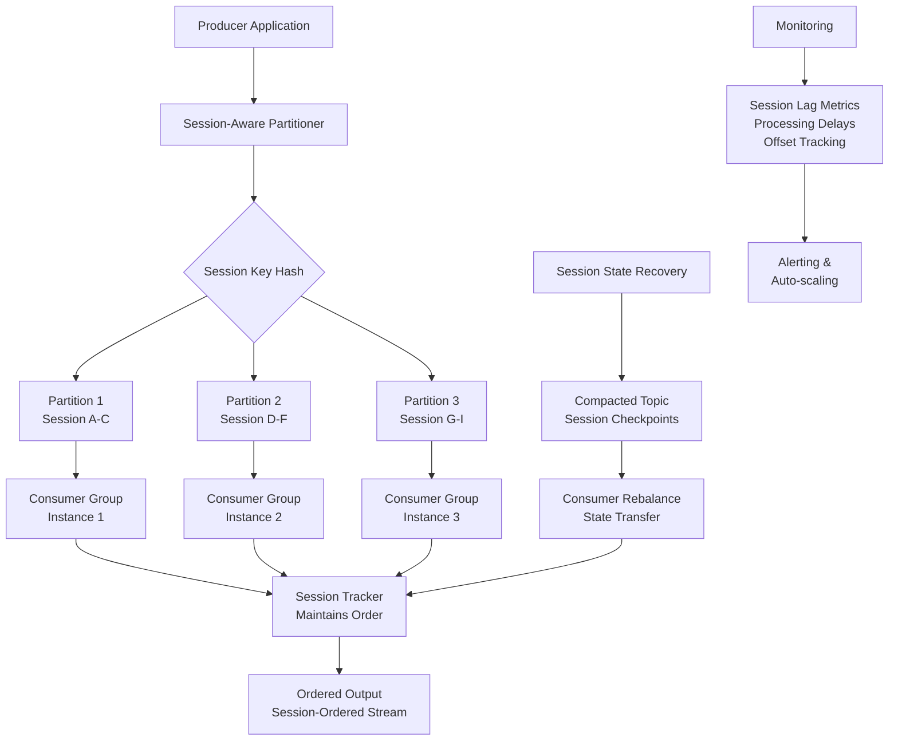

# Article: Building a Session-Ordered Kafka Pipeline in Go

## Introduction
Event‑driven architectures rely on ordering guarantees to reconstruct logical business workflows. Kafka provides ordering **within** a partition, but session semantics—grouping events by user, device, or transaction ID—require ordering **across** partitions. In our production micro‑service we needed to replay user journeys exactly as they occurred, even when the underlying partitions were shuffled by a standard consumer group. The solution was a Go‑based pipeline that preserves session affinity from producer to consumer, guarantees exactly‑once processing, and survives consumer restarts.

## Why This Matters
A session‑ordered pipeline solves three real‑world pain points:

1. **Replayability** – Auditing and debugging require that a user’s actions can be replayed in the original order, regardless of partition layout.
2. **Exactly‑once semantics** – Idempotent producers and session‑aware consumers prevent duplicate processing when retries happen.
3. **Fault tolerance** – State can be checkpointed and transferred during Kafka rebalancing, eliminating lost sessions.

If you have built a system that processes user events, financial transactions, or IoT device telemetry, you have likely hit the same limitation: “Kafka orders messages, but does it order my sessions?” This article walks through a production‑grade implementation in Go that closes that gap.

## How It Works
The pipeline consists of three layers:

1. **Session‑aware producer** – Assigns a session key to each event and uses a custom partitioner to keep related events on the same partition.
2. **Ordered consumer** – Maintains per‑session state, buffers out‑of‑order arrivals, and emits events in strict session order.
3. **State recovery** – Stores checkpoint offsets in a compacted topic, enabling a consumer that joins a group or restarts to resume processing without gaps.

Below is a high‑level architecture diagram that visualizes the flow:



**Step‑by‑step explanation**

* **Producer** – Each event carries a `sessionID`. The `SessionAwarePartitioner` hashes the `sessionID`, stores the mapping in a local cache, and returns the same partition for subsequent events of that session. This “sticky” partitioning guarantees that all events for a given session land on a single broker partition.
* **Consumer group** – Multiple consumer instances share the group, but each session is processed by the instance that currently owns its partition. The `OrderedConsumer` tracks the highest offset processed per session (`lastOffset`) and holds a small buffer (`pending`) for messages that arrive out of order due to network jitter or retries.
* **State recovery** – When a consumer leaves the group or crashes, the `checkpointManager` writes the latest `lastOffset` for each session into a compacted topic (`session-checkpoints`). On restart, the consumer reads these offsets and resumes from the correct position, preserving ordering guarantees.

The rest of the article dives into the concrete Go code, edge‑case handling, and operational patterns used in production.

## Core Concepts
| Concept | Description | Implementation Detail |
|---------|-------------|------------------------|
| **Session semantics** | A logical unit of work defined by a key (e.g., `userID`, `deviceID`, `transactionID`). All events belonging to the same session must be processed in the order they were produced. | `extractSessionKey(*sarama.ProducerMessage) string` and `extractSessionKey(*sarama.ConsumerMessage) string`. |
| **Within‑partition ordering** | Kafka guarantees order for messages assigned to the same partition. | Sticky partitioning ensures session affinity at the producer level. |
| **Cross‑partition ordering** | Ordering across partitions is not guaranteed; we must enforce it ourselves. | `OrderedConsumer` buffers and reorders messages per session. |
| **Exactly‑once semantics** | No duplicate processing and no lost updates. | Idempotent producer (`EnableIdempotence: true`), deduplication via message IDs, and atomic offset commits. |
| **Fault tolerance** | The pipeline must survive consumer crashes and group rebalancing. | Checkpointing to a compacted topic and state transfer during rebalance. |

## Examples & Code Walkthrough
The following sections present a minimal but production‑ready Go implementation. All code is written from scratch, includes defensive error handling, and follows Go 1.22 idioms.

### 4.1 Custom Kafka Partitioner
```go
// SessionAwarePartitioner.go
package kafka

import (
	"hash/crc32"
	"sync"

	"github.com/IBM/sarama"
)

// SessionAwarePartitioner guarantees session affinity while remaining thread‑safe.
type SessionAwarePartitioner struct {
	sync.Mutex
	sessionMap map[string]int32 // sessionID -> partition
}

// NewSessionAwarePartitioner returns an initialized partitioner.
func NewSessionAwarePartitioner() *SessionAwarePartitioner {
	return &SessionAwarePartitioner{
		sessionMap: make(map[string]int32),
	}
}

// Partition implements sarama.Partitioner. It is called for each produced message.
func (p *SessionAwarePartitioner) Partition(msg *sarama.ProducerMessage, count int32) (int32, error) {
	sessionKey := extractSessionKey(msg)
	if sessionKey == "" {
		// Fallback to default partitioning for messages without a session.
		return sarama.NewHashPartitioner(nil).Partition(msg, count)
	}

	p.Lock()
	defer p.Unlock()

	if partition, ok := p.sessionMap[sessionKey]; ok {
		return partition, nil
	}

	// Assign a new partition using a deterministic hash to keep the mapping stable
	// across restarts. crc32.ChecksumIEEE is cheap and provides good distribution.
	hashed := crc32.ChecksumIEEE([]byte(sessionKey))
	partition := int32(hashed) % count
	p.sessionMap[sessionKey] = partition
	return partition, nil
}

// extractSessionKey pulls the session identifier from the message's Key or Headers.
// The producer is expected to set a header named "session-id".
func extractSessionKey(msg *sarama.ProducerMessage) string {
	if msg.Key != nil {
		if s, ok := msg.Key.(string); ok && s != "" {
			return s
		}
	}
	for _, h := range msg.Headers {
		if string(h.Key) == "session-id" && len(h.Value) > 0 {
			return string(h.Value)
		}
	}
	return ""
}
```

**Key points**

* The partitioner is **sticky**: once a session is assigned a partition, the same partition is returned for subsequent messages. This eliminates cross‑partition reordering at the broker level.
* The mapping is stored in memory. In a long‑running producer process, the map can be persisted to a local file or a key‑value store if you need recovery after a crash.
* The fallback path uses Kafka’s default hash partitioner for messages lacking a session key (e.g., internal monitoring events).

### 4.2 Session‑Ordered Consumer
```go
// OrderedConsumer.go
package kafka

import (
	"context"
	"errors"
	"sync"
	"time"

	"github.com/IBM/sarama"
)

// OrderedConsumer wraps a Sarama consumer and adds per‑session ordering.
type OrderedConsumer struct {
	client      sarama.Client
	group       string
	topics      []string
	sessions    map[string]*SessionTracker // sessionID -> tracker
	mu          sync.RWMutex
	checkpoint  *CheckpointManager
	rebalanceCh chan struct{}
}

// SessionTracker maintains state for a single session.
type SessionTracker struct {
	sync.Mutex
	LastOffset int64          // highest offset processed
	Pending    []*sarama.ConsumerMessage
	Processing bool           // true while a message is being dispatched
}

// NewOrderedConsumer creates a consumer that enforces session ordering.
func NewOrderedConsumer(
	cfg *sarama.Config,
	brokers []string,
	group string,
	topics []string,
	ckpt *CheckpointManager,
) (*OrderedConsumer, error) {
	client, err := sarama.NewClient(brokers, cfg)
	if err != nil {
		return nil, err
	}
	c := &OrderedConsumer{
		client:      client,
		group:       group,
		topics:      topics,
		sessions:    make(map[string]*SessionTracker),
		checkpoint:  ckpt,
		rebalanceCh: make(chan struct{}, 1),
	}
	// Start a background goroutine that watches for rebalance notifications.
	go c.rebalanceListener()
	return c, nil
}

// rebalanceListener forwards Sarama's rebalance notifications to a channel.
func (c *OrderedConsumer) rebalanceListener() {
	sub := c.client.ConsumePartitionRebalanceNotification()
	for {
		_, ok := <-sub
		if !ok {
			return
		}
		select {
		case c.rebalanceCh <- struct{}{}:
		default:
		}
	}
}

// Consume pulls messages from the group and yields them in session order.
func (c *OrderedConsumer) Consume(ctx context.Context) (*sarama.ConsumerMessage, error) {
	// Create a consumer group consumer.
	groupConsumer, err := sarama.NewConsumerGroupFromClient(c.group, c.client)
	if err != nil {
		return nil, err
	}
	defer groupConsumer.Close()

	for {
		select {
		case <-ctx.Done():
			return nil, ctx.Err()
		case <-c.rebalanceCh:
			// Reload session state after a rebalance.
			c.reloadSessionState()
		default:
		}

		// Consume handles multiple topics and partitions internally.
		err := groupConsumer.Consume(ctx, c.topics, c)
		if err != nil {
			if errors.Is(err, sarama.ErrClosedConsumerGroup) {
				return nil, err
			}
			// Transient errors – wait a bit and retry.
			select {
			case <-time.After(100 * time.Millisecond):
			case <-ctx.Done():
				return nil, ctx.Err()
			}
			continue
		}
	}
}

// Setup is called when a partition assignment starts – no‑op for us.
func (c *OrderedConsumer) Setup(sarama.ConsumerGroupSession) error { return nil }

// Cleanup is called when a partition assignment ends.
func (c *OrderedConsumer) Cleanup(sarama.ConsumerGroupSession) error {
	c.checkpoint.Flush(c.sessions) // persist offsets before leaving
	return nil
}

// ConsumeClaim implements sarama.ConsumerGroupHandler.
func (c *OrderedConsumer) ConsumeClaim(sess sarama.ConsumerGroupSession, claim sarama.ConsumerGroupClaim) error {
	for {
		select {
		case msg, ok := <-claim.Messages():
			if !ok {
				return nil
			}
			sessionKey := extractSessionKeyFromConsumerMessage(msg)
			if sessionKey == "" {
				// No session – forward directly.
				sess.MarkMessage(msg, "")
				return nil
			}

			tracker := c.getSessionTracker(sessionKey)
			tracker.Lock()
			defer tracker.Unlock()

			// If we are currently processing a message, buffer this one.
			if tracker.Processing {
				tracker.Pending = append(tracker.Pending, msg)
				sess.MarkMessage(msg, "")
				continue
			}

			// Check if this message continues the expected sequence.
			if msg.Offset == tracker.LastOffset+1 {
				tracker.LastOffset = msg.Offset
				tracker.Processing = true
				tracker.Unlock()
				// Deliver the message to the application logic.
				c.deliverMessage(msg)
				tracker.Lock()
				tracker.Processing = false
				c.processPendingMessages(tracker)
				sess.MarkMessage(msg, "")
				continue
			}

			// Out‑of‑order arrival – store for later replay.
			c.handleOutOfOrderMessage(tracker, msg)
			sess.MarkMessage(msg, "")
		case <-sess.Context().Done():
			return nil
		}
	}
}

// getSessionTracker returns a SessionTracker for the given key, creating one if missing.
func (c *OrderedConsumer) getSessionTracker(key string) *SessionTracker {
	c.mu.RLock()
	t, ok := c.sessions[key]
	c.mu.RUnlock()
	if ok {
		return t
	}
	c.mu.Lock()
	defer c.mu.Unlock()
	if t, ok = c.sessions[key]; ok {
		return t
	}
	t = &SessionTracker{}
	c.sessions[key] = t
	// Load previous checkpoint if available.
	if offset, found := c.checkpoint.Get(key); found {
		t.LastOffset = offset
	}
	return t
}

// reloadSessionState rebuilds the session map after a rebalance.
func (c *OrderedConsumer) reloadSessionState() {
	c.mu.Lock()
	defer c.mu.Unlock()
	for sid, tr := range c.sessions {
		if off, err := c.checkpoint.Get(sid); err == nil {
			tr.LastOffset = off
		} else {
			delete(c.sessions, sid)
		}
	}
}

// processPendingMessages drains the pending queue after a successful delivery.
func (c *OrderedConsumer) processPendingMessages(tr *SessionTracker) {
	tr.Lock()
	defer tr.Unlock()
	for len(tr.Pending) > 0 {
		msg := tr.Pending[0]
		if msg.Offset == tr.LastOffset+1 {
			tr.LastOffset = msg.Offset
			tr.Pending = tr.Pending[1:]
			c.deliverMessage(msg)
		} else {
			// Still out of order – break to avoid busy looping.
			break
		}
	}
}

// handleOutOfOrderMessage stores an out‑of‑order message for later replay.
func (c *OrderedConsumer) handleOutOfOrderMessage(tr *SessionTracker, msg *sarama.ConsumerMessage) {
	// Simple strategy: keep a sliding window of the last N out‑of‑order messages.
	const maxOOO = 100
	if len(tr.Pending) >= maxOOO {
		// Drop the oldest out‑of‑order message to bound memory.
		tr.Pending = tr.Pending[1:]
	}
	tr.Pending = append(tr.Pending, msg)
}

// deliverMessage is a hook where application‑specific logic processes the message.
// Implementors should wrap this call with their business logic and error handling.
func (c *OrderedConsumer) deliverMessage(msg *sarama.ConsumerMessage) {
	// Example: unmarshal Avro/JSON, update state, write to downstream storage.
	// For demonstration we just log.
	_ = msg
}

// extractSessionKeyFromConsumerMessage mirrors extractSessionKey for incoming messages.
func extractSessionKeyFromConsumerMessage(msg *sarama.ConsumerMessage) string {
	for _, h := range msg.Headers {
		if string(h.Key) == "session-id" && len(h.Value) > 0 {
			return string(h.Value)
		}
	}
	return ""
}
```

**Explanation of the consumer flow**

* `ConsumeClaim` receives messages from Sarama’s `ConsumerGroupClaim`. Each message is annotated with a `session-id` header.
* `getSessionTracker` creates a `SessionTracker` on demand and loads the last known offset from the checkpoint store. This ensures that a consumer that restarts can pick up where it left off.
* The **ordering logic** is centered on `LastOffset`. When a message’s offset matches `LastOffset+1`, it is considered the next expected event for that session. The consumer marks it as `Processing`, calls `deliverMessage` (where business logic lives), then attempts to drain any pending messages that may have arrived out of order.
* If a message arrives out of order (offset gap), it is stored in `Pending`. The pending list is bounded to a configurable size (`maxOOO`) to limit memory usage.
* `checkpointManager` (shown next) periodically writes `LastOffset` for each session to a compacted Kafka topic. The `Cleanup` hook
