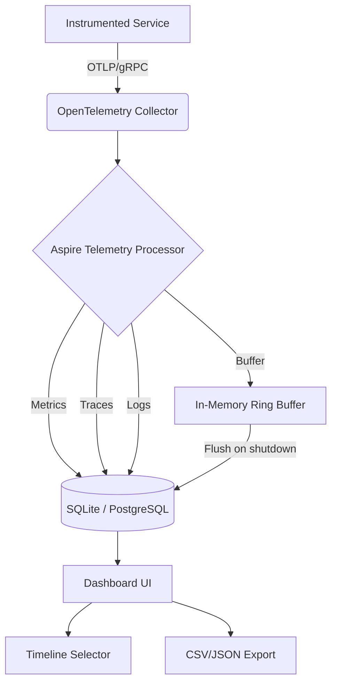

# Aspire 13.6 Adds Persistent Dashboard Telemetry and First-Party Java and Rust Hosting

## Introduction

.NET Aspire started as a thin orchestration layer for .NET microservices. It gave teams a way to spin up containers, wire up Redis and PostgreSQL, and get a local dashboard with minimal YAML. That was useful, but it left a gap: what happens when your stack isn't .NET-only? And what happens to your telemetry when the process exits and the in-memory buffer flushes?

Version 13.6 answers both questions. Persistent dashboard telemetry means metrics, traces, and logs survive process restarts. First-party Java and Rust hosting means you no longer need shell scripts and `java -jar` hacks to bring JVM or native binaries into the Aspire lifecycle.

This article walks through the architecture, configuration, and real-world trade-offs you'll hit when adopting these features.

## Why This Matters

Most observability platforms lose data between runs. You debug a production incident at 2 PM, check the dashboard, and the traces from last night's batch job are gone because they lived in memory. That's a real operational cost: you either run longer retention windows (expensive) or accept blind spots.

Persistent telemetry solves this directly. Store traces in SQLite or PostgreSQL, query them weeks later, correlate across service boundaries. That's not a nice-to-have—it's what separates a debugging tool from an audit-grade platform.

The Java and Rust hosting additions matter because polyglot stacks don't wait for you to standardize on one language. If your team has a Rust high-throughput gateway and a Java Spring Boot order service, both need to participate in the same distributed trace context. First-party hosting makes that integration declarative instead of manual.

## How It Works

The telemetry pipeline has four stages: instrumentation collection, OpenTelemetry SDK processing, Aspire's telemetry processor, and the persistent store. The dashboard reads from the store rather than subscribing to a live stream.



Here's the step-by-step flow:

1. **Instrumentation.** Each service emits OpenTelemetry spans and metrics via the standard SDK. Java services use the OTLP gRPC exporter; Rust uses the opentelemetry-otlp crate; .NET uses `OpenTelemetry.Extensions.Hosting`.

2. **Collector ingestion.** Aspire's built-in collector receives OTLP on port 4317. It normalizes resource attributes and adds the `aspire.run.id` label for cross-run correlation.

3. **Processor + persistence.** The telemetry processor batches incoming data and writes to the configured store. SQLite is the default for local dev; PostgreSQL is recommended for production clusters. A ring buffer in memory catches data during write pauses so nothing drops on a transient DB hiccup.

4. **Dashboard query.** The UI queries the persistent store directly. The timeline selector lets you pick a run window. Export to CSV/JSON is available for offline analysis or SIEM ingestion.

## Core Concepts

**TelemetryStore enum.** The persistence layer supports two backends: `Sqlite` (file-based, zero-config) and `PostgreSql` (connection-string driven). The store type is set at builder time and can't be changed without recreating the database schema.

**Run-scoped correlation.** Each `aspire run` invocation gets a unique `run.id`. All telemetry emitted during that run carries this label. The dashboard groups by `run.id` so you can compare two deployments side by side.

**Java host builder.** `Aspire.Hosting.Java` wraps the JVM lifecycle. It reads `aspire-host.json`, resolves the JAR path relative to the project root, injects environment variables from the Aspire manifest, and wires up a health check endpoint. The host builder also propagates the `OTEL_EXPORTER_OTLP_ENDPOINT` automatically so your service doesn't need hardcoded collector URLs.

**Rust crate integration.** `Aspire.Hosting.Rust` invokes `cargo build --release` as part of the host startup. It parses `Cargo.toml` to determine the binary name and entry point. The crate also patches the binary's environment with `OTEL_EXPORTER_OTLP_ENDPOINT` and `OTEL_SERVICE_NAME` before exec.

## Examples & Code Walkthrough

### Enabling persistent telemetry in a .NET host

```csharp
using Aspire.Hosting;
using Aspire.Hosting.Telemetry;

var builder = DistributedApplication.CreateBuilder(args);

// Configure persistent telemetry store
builder.AddTelemetryPersistence(options =>
{
    options.StoreType = TelemetryStore.PostgreSql;
    options.ConnectionString = "Host=localhost;Database=aspire_traces;Username=aspire;Password=changeme";
    options.RetentionDays = 30; // purge traces older than 30 days
    options.BatchSize = 500;    // flush every 500 spans or 5s, whichever comes first
});

// Add a Java service using first-party hosting
builder.AddJava("order-service")
    .WithJar("target/order-service.jar")
    .WithEnvironment("JAVA_OPTS", "-Xmx512m -XX:+UseG1GC")
    .WithHttpEndpoint(port: 8080, env: "PORT")
    .WithHealthCheck("http://localhost:8080/actuator/health", TimeSpan.FromSeconds(5));

// Add a Rust service
builder.AddRust("gateway")
    .WithCargoManifest("./gateway/Cargo.toml")
    .WithEnvironment("RUST_LOG", "info")
    .WithHttpEndpoint(port: 3000, env: "LISTEN_ADDR");

var app = builder.Build();
app.Run();
```

**Key details:**
- `RetentionDays` controls automatic purge. Without it, SQLite grows unbounded in long-running dev environments.
- `BatchSize` balances write throughput against latency. For high-cardinality traces, increase to 1000+.
- `WithHealthCheck` takes a URL and a `TimeSpan`. The dashboard marks the service unhealthy if the endpoint doesn't return 200 within the interval.

### Java service with OpenTelemetry

```java
package com.example.orderservice;

import io.opentelemetry.api.GlobalOpenTelemetry;
import io.opentelemetry.api.trace.Tracer;
import io.opentelemetry.sdk.OpenTelemetrySdk;
import io.opentelemetry.sdk.trace.SdkTracerProvider;
import io.opentelemetry.sdk.trace.export.BatchSpanProcessor;
import io.opentelemetry.exporter.otlp.trace.OtlpGrpcSpanExporter;
import io.opentelemetry.sdk.resources.Resource;
import io.opentelemetry.semconv.resource.attributes.ResourceAttributes;
import org.springframework.boot.SpringApplication;
import org.springframework.boot.autoconfigure.SpringBootApplication;
import jakarta.annotation.PostConstruct;
import java.time.Duration;
import java.util.Map;

@SpringBootApplication
public class OrderServiceApplication {

    private static final String COLLECTOR_ENDPOINT =
        System.getenv().getOrDefault("OTEL_EXPORTER_OTLP_ENDPOINT", "http://localhost:4317");

    public static void main(String[] args) {
        SpringApplication.run(OrderServiceApplication.class, args);
    }

    @PostConstruct
    void configureTracing() {
        // Build OTLP exporter with timeout to avoid hanging startup
        var exporter = OtlpGrpcSpanExporter.builder()
            .setEndpoint(COLLECTOR_ENDPOINT)
            .setTimeout(Duration.ofSeconds(10))
            .build();

        // Resource attributes auto-correlate with .NET and Rust services
        var resource = Resource.create(Map.of(
            ResourceAttributes.SERVICE_NAME, "java-order-service",
            ResourceAttributes.SERVICE_VERSION, "1.3.6"
        ));

        var tracerProvider = SdkTracerProvider.builder()
            .addSpanProcessor(BatchSpanProcessor.builder(exporter)
                .setScheduleDelay(Duration.ofSeconds(5))
                .setMaxExportBatchSize(200)
                .build())
            .setResource(resource)
            .build();

        var sdk = OpenTelemetrySdk.builder()
            .setTracerProvider(tracerProvider)
            .buildAndRegisterGlobal();

        // Verify exporter connectivity at startup (fail-fast)
        try {
            sdk.getTracer("startup-check").spanBuilder("init").startSpan().end();
        } catch (Exception e) {
            throw new RuntimeException("OTLP exporter unavailable at " + COLLECTOR_ENDPOINT, e);
        }
    }
}
```

**What this does:** The `@PostConstruct` block sets up the OTLP exporter before any HTTP traffic arrives. The `startup-check` span validates the collector is reachable—if not, the service fails fast rather than silently dropping traces. The `ResourceAttributes.SERVICE_NAME` ensures the dashboard groups spans correctly alongside .NET and Rust services.

### Rust service with OpenTelemetry

```rust
use opentelemetry::global;
use opentelemetry_otlp::WithExportConfig;
use opentelemetry_sdk::trace::{TracerProvider, BatchConfig, Sampler};
use opentelemetry_sdk::Resource;
use opentelemetry_semantic_conventions::resource;
use std::time::Duration;
use tonic::transport::Channel;

fn init_tracer() -> Result<(), Box<dyn std::error::Error + Send + Sync>> {
    let collector_endpoint = std::env::var("OTEL_EXPORTER_OTLP_ENDPOINT")
        .unwrap_or_else(|_| "http://localhost:4317".into());

    let tracer_provider = TracerProvider::builder()
        .with_batch_config(BatchConfig {
            scheduled_delay: Duration::from_secs(5),
            max_export_batch_size: 2048,
            ..Default::default()
        })
        .with_resource(Resource::new(vec![
            (resource::SERVICE_NAME, "rust-gateway".into()),
            (resource::SERVICE_VERSION, "1.3.6".into()),
        ]))
        .with_tonic_exporter(
            opentelemetry_otlp::new_exporter().tonic().with_endpoint(collector_endpoint),
        )?
        .with_simple_exporter(
            opentelemetry_otlp::new_exporter().tonic().with_endpoint(collector_endpoint),
        )?
        .build();

    global::set_tracer_provider(tracer_provider);
    Ok(())
}

fn main() -> Result<(), Box<dyn std::error::Error + Send + Sync>> {
    init_tracer()?;

    let tracer = global::tracer("rust-gateway");
    let span = tracer.start("gateway-startup");

    // Simulate startup work
    std::thread::sleep(Duration::from_millis(100));

    span.end();
    println!("Gateway started with OpenTelemetry tracing enabled");

    // Your actual server logic here
    Ok(())
}
```

## Best Practices

**1. Always set a retention policy.** SQLite files grow fast under load. In production, use PostgreSQL and configure `RETENTION_DAYS` to match your compliance requirements. A 30-day default is reasonable for most teams; financial services may need 90+.

**2. Use the ring buffer as a safety net, not a primary store.** The in-memory buffer catches transient DB failures, but it holds at most a few thousand spans. If your collector goes down for more than a minute, you'll lose data. Monitor the buffer fill rate and alert when it exceeds 80%.

**3. Standardize service naming across languages.** The `service.name` attribute must match across Java, Rust, and .NET services for trace correlation to work. Use a shared naming convention like `<team>-<service>-<env>`.

**4. Test the export pipeline end-to-end.** Run a load test that generates 10k+ spans, then query the dashboard for historical data. Verify the CSV export includes all expected columns before you rely on it for incident postmortems.

**5. Don't hardcode collector endpoints.** The first-party Java and Rust hosts inject `OTEL_EXPORTER_OTLP_ENDPOINT` from the Aspire manifest. Override it only in local dev with an `.env` file.

## Common Mistakes & Anti-Patterns

**1. Hardcoding the OTLP endpoint in Java.**
```java
// BAD - breaks when collector moves
var exporter = OtlpGrpcSpanExporter.builder()
    .setEndpoint("http://collector:4317")
    .build();
```
Fix: Read from environment variable with a fallback, as shown in the Java example above.

**2. Ignoring batch size tuning.**
Default batch sizes work for low-throughput services. Under load (10k+ RPS), the default 512-span batch causes collector backpressure. Increase `maxExportBatchSize` in Java/Rust or `BatchSize` in the .NET config.

**3. No health check on the Rust binary.**
```rust
// BAD - Aspire can't detect if the gateway is stuck
fn main() {
    start_server(); // blocks forever, no health signal
}
```
Fix: Expose a `/health` endpoint and register it in `aspire-host.json` so Aspire can restart the process on failure.

**4. Forgetting to purge old telemetry.**
SQLite databases with 6+ months of traces become slow to query. Set `RetentionDays` or schedule a cron job to `DELETE FROM traces WHERE timestamp < now() - interval '30 days'`.

## Performance Considerations

**Memory.** The in-memory ring buffer defaults to 10,000 spans. Each span is roughly 2-4 KB serialized, so the buffer uses 20-40 MB at capacity. For services emitting >100k spans/sec, increase the buffer or lower the batch flush interval.

**CPU.** OTLP serialization adds ~2-5% CPU overhead per service. The Rust host's `cargo build --release` step is the heaviest operation—expect 30-60 seconds on first build, then incremental rebuilds under 5 seconds.

**Network.**
