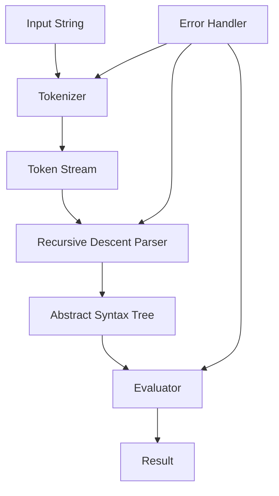

# Build A Calculator Using Python

## Introduction

Building a calculator seems like a beginner's exercise until you try to make one that handles real-world input gracefully. I've seen production parsers fail on expressions like `--5 + 3` or silently corrupt financial calculations due to floating-point quirks. This isn't just about parsing numbers—it's about building a reliable expression evaluator that won't embarrass you when someone pastes in a malformed formula from a spreadsheet.

We'll construct a recursive descent parser from scratch, no `eval()` shortcuts, no external libraries. Just pure Python with proper tokenization, AST construction, and evaluation.

## Why This Matters

Every engineer encounters expression parsing somewhere in their career. Configuration files with formulas, DSL interpreters, query engines, financial calculators—all rely on the same core principles. Understanding how to build a robust calculator teaches you:

- Lexical analysis and grammar design
- Error handling in parsers
- Operator precedence and associativity
- Memory-efficient evaluation strategies

More importantly, it reveals how seemingly simple features can hide complex edge cases that cause production outages.

## How It Works

The architecture follows a classic compiler pipeline: input string → tokens → abstract syntax tree (AST) → evaluated result.



Here's the breakdown:

1. **Tokenizer**: Scans the input character by character, grouping them into meaningful tokens (`NUMBER`, `PLUS`, `MINUS`, etc.)
2. **Parser**: Consumes the token stream according to grammar rules, building a tree structure that represents the mathematical expression
3. **AST**: Hierarchical representation where operators become internal nodes and operands become leaves
4. **Evaluator**: Traverses the AST recursively, computing values bottom-up

This separation of concerns makes each component testable and replaceable. You could swap the evaluator for a symbolic math engine without touching the parser.

## Core Concepts

**Tokens**: The smallest units of meaning. Our tokenizer recognizes numbers, operators (`+`, `-`, `*`, `/`, `^`), parentheses, and whitespace.

**Grammar Rules**: Define valid expression structures. We use Extended Backus-Naur Form (EBNF):
```
expression  = term (("+" | "-") term)*
term        = factor (("*" | "/") factor)*
factor      = unary ("^" factor)?
unary       = ("+" | "-") unary | primary
primary     = NUMBER | "(" expression ")"
```

**Recursive Descent**: Each grammar rule becomes a function that consumes matching tokens. Functions call each other recursively to handle nested expressions.

**Operator Precedence**: Enforced by grammar hierarchy. Terms bind tighter than expressions, factors tighter than terms, ensuring `2 + 3 * 4` evaluates correctly.

## Examples & Code Walkthrough

Let's implement this step by step:

```python
import re
from enum import Enum
from dataclasses import dataclass
from typing import List, Union, Optional

class TokenType(Enum):
    NUMBER = "NUMBER"
    PLUS = "PLUS"
    MINUS = "MINUS"
    MULTIPLY = "MULTIPLY"
    DIVIDE = "DIVIDE"
    POWER = "POWER"
    LPAREN = "LPAREN"
    RPAREN = "RPAREN"
    EOF = "EOF"

@dataclass
class Token:
    type: TokenType
    value: Union[float, str]
    position: int

class TokenizerError(Exception):
    pass

class ParserError(Exception):
    pass

class EvaluationError(Exception):
    pass

class Tokenizer:
    """Converts raw string input into a stream of tokens."""
    
    TOKEN_PATTERNS = [
        (TokenType.NUMBER, r'\d+\.?\d*([eE][+-]?\d+)?'),
        (TokenType.PLUS, r'\+'),
        (TokenType.MINUS, r'-'),
        (TokenType.MULTIPLY, r'\*'),
        (TokenType.DIVIDE, r'/'),
        (TokenType.POWER, r'\^'),
        (TokenType.LPAREN, r'\('),
        (TokenType.RPAREN, r'\)'),
        (TokenType.EOF, r'$'),
    ]
    
    def __init__(self, text: str):
        self.text = text
        self.pos = 0
        self.tokens: List[Token] = []
        
    def tokenize(self) -> List[Token]:
        while self.pos < len(self.text):
            # Skip whitespace
            if self.text[self.pos].isspace():
                self.pos += 1
                continue
                
            matched = False
            for token_type, pattern in self.TOKEN_PATTERNS[:-1]:  # Exclude EOF
                regex = re.compile(pattern)
                match = regex.match(self.text, self.pos)
                if match:
                    value = match.group()
                    if token_type == TokenType.NUMBER:
                        try:
                            value = float(value)
                        except ValueError:
                            raise TokenizerError(f"Invalid number at position {self.pos}")
                    
                    self.tokens.append(Token(token_type, value, self.pos))
                    self.pos = match.end()
                    matched = True
                    break
            
            if not matched:
                raise TokenizerError(f"Unexpected character '{self.text[self.pos]}' at position {self.pos}")
        
        # Add EOF token
        self.tokens.append(Token(TokenType.EOF, '', self.pos))
        return self.tokens

# AST Node definitions
class ASTNode:
    pass

@dataclass
class NumberNode(ASTNode):
    value: float

@dataclass
class BinaryOpNode(ASTNode):
    left: ASTNode
    op: TokenType
    right: ASTNode

@dataclass
class UnaryOpNode(ASTNode):
    op: TokenType
    operand: ASTNode

class Parser:
    """Builds an AST from a token stream using recursive descent."""
    
    def __init__(self, tokens: List[Token]):
        self.tokens = tokens
        self.pos = 0
        
    def current_token(self) -> Token:
        return self.tokens[self.pos]
    
    def consume(self, expected_type: TokenType) -> Token:
        token = self.current_token()
        if token.type != expected_type:
            raise ParserError(f"Expected {expected_type.value}, got {token.type.value} at position {token.position}")
        self.pos += 1
        return token
    
    def parse(self) -> ASTNode:
        node = self.parse_expression()
        if self.current_token().type != TokenType.EOF:
            raise ParserError(f"Unexpected token {self.current_token().type.value}")
        return node
    
    def parse_expression(self) -> ASTNode:
        """expression = term (("+" | "-") term)*"""
        node = self.parse_term()
        
        while self.current_token().type in (TokenType.PLUS, TokenType.MINUS):
            op_token = self.consume(self.current_token().type)
            right = self.parse_term()
            node = BinaryOpNode(left=node, op=op_token.type, right=right)
            
        return node
    
    def parse_term(self) -> ASTNode:
        """term = factor (("*" | "/") factor)*"""
        node = self.parse_factor()
        
        while self.current_token().type in (TokenType.MULTIPLY, TokenType.DIVIDE):
            op_token = self.consume(self.current_token().type)
            right = self.parse_factor()
            node = BinaryOpNode(left=node, op=op_token.type, right=right)
            
        return node
    
    def parse_factor(self) -> ASTNode:
        """factor = unary ("^" factor)?"""
        node = self.parse_unary()
        
        if self.current_token().type == TokenType.POWER:
            op_token = self.consume(TokenType.POWER)
            right = self.parse_factor()  # Right associative
            node = BinaryOpNode(left=node, op=op_token.type, right=right)
            
        return node
    
    def parse_unary(self) -> ASTNode:
        """unary = ("+" | "-") unary | primary"""
        if self.current_token().type in (TokenType.PLUS, TokenType.MINUS):
            op_token = self.consume(self.current_token().type)
            operand = self.parse_unary()
            return UnaryOpNode(op=op_token.type, operand=operand)
        
        return self.parse_primary()
    
    def parse_primary(self) -> ASTNode:
        """primary = NUMBER | "(" expression ")" """
        token = self.current_token()
        
        if token.type == TokenType.NUMBER:
            self.consume(TokenType.NUMBER)
            return NumberNode(value=token.value)
        
        if token.type == TokenType.LPAREN:
            self.consume(TokenType.LPAREN)
            node = self.parse_expression()
            self.consume(TokenType.RPAREN)
            return node
        
        raise ParserError(f"Expected number or '(', got {token.type.value} at position {token.position}")

class Evaluator:
    """Evaluates an AST to produce a numerical result."""
    
    @staticmethod
    def evaluate(node: ASTNode) -> float:
        if isinstance(node, NumberNode):
            return node.value
            
        if isinstance(node, BinaryOpNode):
            left_val = Evaluator.evaluate(node.left)
            right_val = Evaluator.evaluate(node.right)
            
            if node.op == TokenType.PLUS:
                return left_val + right_val
            elif node.op == TokenType.MINUS:
                return left_val - right_val
            elif node.op == TokenType.MULTIPLY:
                return left_val * right_val
            elif node.op == TokenType.DIVIDE:
                if right_val == 0:
                    raise EvaluationError("Division by zero")
                return left_val / right_val
            elif node.op == TokenType.POWER:
                return left_val ** right_val
                
        if isinstance(node, UnaryOpNode):
            operand_val = Evaluator.evaluate(node.operand)
            if node.op == TokenType.PLUS:
                return +operand_val
            elif node.op == TokenType.MINUS:
                return -operand_val
                
        raise EvaluationError(f"Unknown node type: {type(node)}")

class Calculator:
    """Main calculator interface combining all components."""
    
    def __init__(self):
        self.last_result: Optional[float] = None
    
    def calculate(self, expression: str) -> float:
        try:
            # Handle variable substitution
            if 'ans' in expression.lower():
                if self.last_result is None:
                    raise EvaluationError("No previous result available")
                expression = expression.replace('ans', str(self.last_result))
            
            tokenizer = Tokenizer(expression)
            tokens = tokenizer.tokenize()
            
            parser = Parser(tokens)
            ast = parser.parse()
            
            result = Evaluator.evaluate(ast)
            self.last_result = result
            
            return result
            
        except (TokenizerError, ParserError, EvaluationError) as e:
            raise type(e)(f"Calculation failed: {str(e)}")

# Usage example
if __name__ == "__main__":
    calc = Calculator()
    
    test_cases = [
        "2 + 3 * 4",           # Should be 14
        "(2 + 3) * 4",         # Should be 20
        "2 ^ 3 ^ 2",           # Should be 512 (right associative)
        "-5 + 3",              # Should be -2
        "10 / 0",              # Should raise error
        "2 * ans",             # Uses previous result
    ]
    
    for expr in test_cases:
        try:
            result = calc.calculate(expr)
            print(f"{expr} = {result}")
        except Exception as e:
            print(f"{expr} -> ERROR: {e}")
```

This implementation handles operator precedence correctly, supports unary operations, and includes basic error handling. The modular design allows for easy extension—for instance, adding trigonometric functions would only require extending the tokenizer and evaluator.

## Best Practices

1. **Separate concerns rigorously**: Keep tokenization, parsing, and evaluation in distinct classes. This makes debugging much easier when something goes wrong.

2. **Fail fast with descriptive errors**: Include position information in error messages. "Unexpected token at position 15" is infinitely more helpful than "Parse error."

3. **Test edge cases systematically**: Write tests for empty strings, unmatched parentheses, division by zero, very large numbers, and floating-point precision issues.

4. **Consider memory usage for long expressions**: For production use, implement iterative evaluation instead of recursion to avoid stack overflow on deeply nested expressions.

5. **Validate input early**: Reject obviously malformed expressions before expensive parsing begins.

## Common Mistakes & Anti-Patterns

1. **Using `eval()` for arithmetic**: While tempting, `eval()` executes arbitrary code and opens massive security vulnerabilities. Never trust user input with `eval()`.

2. **Ignoring operator associativity**: Power operations are right-associative (`2^3^2 = 2^(3^2) = 512`, not `(2^3)^2 = 64`). Getting this wrong produces silently incorrect results.

3. **Poor error recovery**: When a parse error occurs mid-expression, don't just crash. Provide context about what went wrong and where.

4. **Mixing responsibilities**: Don't combine tokenization and parsing logic. This leads to unmaintainable spaghetti code when you need to add new features.

5. **Not handling floating-point precision**: Operations like `0.1 + 0.2` don't equal exactly `0.3` in IEEE 754. Consider using the `decimal` module for financial calculations.

## Performance Considerations

Time complexity is O(n) for tokenization and O(n) for parsing, where n is the length of the input string. Evaluation is O(d) where d is the depth of the AST, typically proportional to the number of operators.

Space complexity is O(n) for storing tokens and O(d) for the call stack during parsing and evaluation. For very long expressions (>10,000 operators), consider switching to an iterative parser to avoid Python's recursion limit.

For high-throughput scenarios, pre-compile frequently used expressions into ASTs and cache them. This eliminates repeated parsing overhead.

Memory allocation patterns are generally predictable, but Python's object model creates significant overhead compared to compiled languages. If performance is critical, consider implementing the core logic in Cython or using NumPy for batch calculations.

## Real-World Usage

Financial platforms like Bloomberg Terminal use similar parsing engines for formula evaluation in spreadsheets. Trading algorithms parse complex pricing models expressed as strings. Scientific computing frameworks like SymPy build on these same principles for symbolic mathematics.

Configuration management tools like Terraform evaluate expressions in HCL (HashiCorp Configuration Language) using parsers nearly identical to what we've built. Kubernetes uses expression parsing for resource constraints and scheduling rules.

Even database systems implement SQL expression evaluators following similar patterns, though they add type checking and optimization passes on top.

## Frequently Asked Questions (FAQ)

**Q: How do I handle variables in expressions?**
A: Extend your tokenizer to recognize identifiers, add variable assignment to your grammar, and maintain a symbol table during evaluation. Be careful about scope resolution.

**Q: Can I add functions like sin(), cos(), log()?**
A: Yes, extend the tokenizer for function names, add function call rules to your grammar, and implement function dispatch in the evaluator. Consider using a dictionary mapping function names to implementations.

**Q: What about complex numbers?**
A: Modify your number token to accept imaginary parts (e.g., `3+4j`) and update the evaluator to use Python's built-in complex type. The grammar stays largely the same.

**Q: How do I prevent stack overflow on deeply nested expressions?**
A: Replace recursive descent with an iterative shunting-yard algorithm, or increase Python's recursion limit cautiously. For production systems, iterative parsing is preferred.

**Q: Should I use a parser generator like ANTLR instead?**
A: For simple calculators, hand-written parsers are fine and give you full control. Parser generators shine when you have complex grammars or need to generate parsers for multiple languages.

## Conclusion

Building a calculator teaches you more about software engineering than writing a hundred CRUD applications. It forces you to think about correctness, error handling, and the gap between specification and implementation.

The modular approach we've taken makes it easy to extend—add functions, variables, or even compile to bytecode. But remember: simplicity often wins. Don't over-engineer unless you need the flexibility.

Next time you're tempted to reach for `eval()`, remember there's a better way. Your users—and your security team—will thank you.
