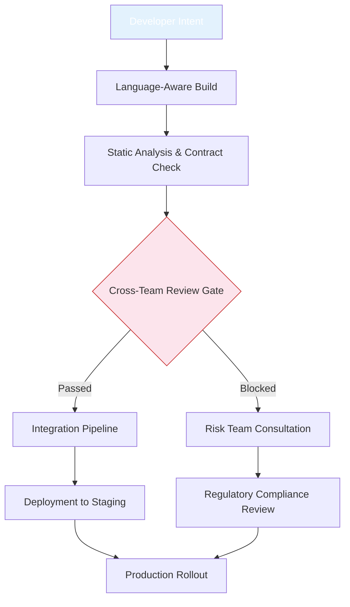

# Building a Collaborative Platform Culture in a Bank

## Introduction

Thousands of engineers sit in conference rooms, each buried in their own ecosystem of libraries, frameworks, and conventions. In many financial institutions, this silo mentality translates directly into slow delivery cycles, duplicated effort, and fragile integration points. The paradox is simple: organizations can hire hundreds of developers while shipping features at a pace that leaves competitors ahead. The root cause rarely lies in talent shortage—it resides in how programming language choices crystallize into divergent development cultures. When Ruby, Java, Python, and C++ teams operate in isolation, they speak different languages beyond syntax. Our experience shows that the most resilient banks do not rely on monolithic toolchains but rather on a deliberate, language-strategic approach that turns collaboration from an optional activity into the default operating mode.

## Why This Matters

Modern banking applications face increasingly complex regulatory requirements, legacy system integrations, and distributed microservice architectures. Each language family—whether JVM-based virtual machines, interpreted scripting environments, or compiled systems programming languages—imposes its own set of constraints and idioms. Without a common foundation, teams make decisions based on historical precedent rather than current business needs. For instance, a risk analytics group might prefer Python for its rapid prototyping capabilities, while the settlement processing group insists on Rust for memory safety guarantees. When these groups operate independently, their APIs diverge, their monitoring strategies drift apart, and the cost of integration grows exponentially. Establishing a coherent platform strategy that acknowledges these linguistic realities enables teams to collaborate more effectively while still respecting the special properties of each language. The payoff is measurable: reduced merge conflicts, faster onboarding for new hires, and a unified observability stack that spans the entire financial services lifecycle.

## How It Works

The architecture centers on three interlocking pillars: a language-aware platform infrastructure, shared contracts that transcend implementation details, and CI/CD gates that enforce cross-team visibility. Below is the workflow visualization that captures the flow of change requests through our collaborative pipeline.



At the heart of this system is a shared contract layer implemented as lightweight interfaces that any language can consume or produce. These contracts serve as the lingua franca between service teams, enabling seamless interaction regardless of the underlying runtime environment. The following code demonstrates the core validation logic embedded in our collaborative guard component, which enforces breaking change detection against stakeholder assignments derived from contract metadata.

```kotlin
// CollaborativeGuard.kt — language-agnostic validation layer
package com.bank.infra.platform

import java.time.LocalDateTime
import java.util.*

/**
 * Centralized gatekeeper that evaluates proposed changes against
 * pre-defined contract boundaries.
 *
 * @param team The team submitting the change
 * @param contract The formal API contract defining allowed modifications
 */
class CollaborativeGuard(private val team: String, private val contract: ApiContract) {

    /**
     * Evaluates whether a proposed change introduces breaking alterations
     * to any affected service.
     */
    fun validateChange(proposed: CodeChange): ValidationResult {
        // Detect semantic breaking changes within the diff
        val breaking = contract.detectBreakingChanges(proposed.diff)
        
        // Identify external stakeholders who would be impacted
        val owners = contract.getStakeholders(proposed.affectedServices)

        val isSafe =
            breaking.isEmpty()

        val requiredApprovals = owners
            .filter { it.team != team }
            .toSet()
            
        // Suggest reviewers from outside the originating team to ensure
        // diverse perspectives on potential impact
        val suggestedReviewers = owners.shuffled().take(2)

        return ValidationResult(
            isSafe = isSafe,
            requiredApprovals = requiredApprovals.toList(),
            suggestedReviewers = suggestedReviewers,
            message = when (isSafe) {
                isBreaking -> {
                    val breakingDesc = breaking.join(
                        { it.description.replaceFirstRegex(".*\n|", "\n- ") }
                    ).trim()
                    "Breaking changes detected with ${requiredApprovals.size()} external stakeholders.\n\n" +
                    breakingDesc
                } else {
                    "Change is backward-compatible. Notify stakeholders:\n" +
                    requiredApprovals.map { it.name.value }.join(", ")
                }
            }
        )
    }

    companion object {
        /** Standard contract schema for all inter-service interactions */
        sealed class ApiContract {
            enum class BreakingChange { description: String }
            data class DetectionResult(
                val breaking: List<BreakingChange>,
                val affectedServices: Set<String>
            ) : Presentable
            sealed class Stakeholder {
                val name: String
                val team: String
                val version: String
            }
            data class Change(val diff: String, val affectedServices: Set<String>) : Presented
        }
    }
}
```

This component operates as part of the broader platform SDK, providing immediate feedback during pull request reviews. By surfacing potential conflicts early, it reduces the cognitive load on reviewers who must mentally translate between different language ecosystems. Additionally, the contract definitions themselves become living documentation that bridges gaps between backend, frontend, and compliance domains.

## Core Concepts

The platform rests on several foundational concepts that work together to create a self-correcting development environment. First, the concept of **language-aware pipelines** ensures that builds and tests automatically account for idiomatic constructs unique to each ecosystem. A Kotlin service will trigger different linting rules than a JavaScript application, and the same applies to static analysis tools like SonarQube versus Coverity. Second, **shared contracts** replace the tendency to duplicate implementation logic across services. Instead of re-implementing authentication tokens or pricing algorithms in multiple languages, teams agree on canonical representations and verify adherence through automated contract testing. Third, **cross-team review mechanisms** enforce social collaboration by requiring at least two external stakeholders to approve any modification that could affect critical subsystems. Finally, **observability alignment** mandates that every service emits structured telemetry in a common format, enabling unified dashboards regardless of the programming language used.

These concepts manifest in concrete artifacts such as the OpenAPI specification combined with Protocol Buffer schemas, both serving as contract anchors. The OpenAPI document defines endpoints and response shapes in a way that is easily consumable by clients written in any language, while the Protocol Buffer definitions provide strong typing and schema evolution capabilities that survive language transitions. The contract type below illustrates how we unify these worlds across Kotlin, Java, and TypeScript:

```typescript
// collaboration-contract.ts — shared contract definition
export interface SettlementEvent {
    correlationId: string;
    originatedBy: ServiceIdentity;
    payload: MoneyTransfer;
    metadata: {
        idempotencyKey: string;
        culturalContext: 'risk-review' | 'auto-approve' | 'manual-override';
    };
}

/**
 * Identifies the originator of a transaction event and provides
 * contextual information needed for audit and risk assessment.
 */
export interface ServiceIdentity {
    team: string;           // Name of the engineering team
    language: string;       // Primary programming language (e.g., "Kotlin", "Java", "TypeScript")
    version: SemanticVersion; // Software release identifier
}

/**
 * Represents the source of truth for external references within a settlement event.
 */
export interface EventMetadata {
    idempotencyKey: string;
    culturalContext: 'risk-review' | 'auto-approve' | 'manual-override';
}

/**
 * Compile-time enforced union type ensuring only valid combinations appear
 * in generated client libraries.
 */
export type TransactionContext = 
    | { role: 'risk-review'; context: RiskReviewMode }
    | { role: 'auto-approve'; context: AutoApproveMode }
    | { role: 'manual-override'; context: ManualOverrideState };

enum RiskReviewMode {
    PENDING,
    APPROVED,
    REJECTED,
    ESCALATED
}

enum AutoApproveMode {
    STANDDARD,
    EXEMPTION_REQUIRED,
    MANUAL_REVIEW
}

enum ManualOverrideState {
    PENDING,
    COMPLETED,
    OVERRIDDEN
}
```

## Examples & Code Walkthrough

Below is a comprehensive walkthrough of three key implementation scenarios that illustrate how the architecture integrates across language boundaries. Each example includes detailed inline comments explaining the reasoning behind specific design decisions.

### 1. Cross-Service Change Validation

When a developer proposes a modification that could affect settlement logic, the platform invokes the `CollaborativeGuard` singleton to evaluate potential impacts. The method examines the proposed diff against the pre-validated contract, identifying any breaking changes and determining which external teams must participate in the approval process.

```kotlin
// Example usage of CollaborativeGuard in a feature branch
fun applySettlementAdjustment(changeProposal: CodeChange, teamName: String) {
    val guardian = CollaborativeGuard(teamName, contract)
    
    val result = guardian.validateChange(changeProposal)
    
    if (!result.isSafe) {
        println("⚠️ Critical conflict detected:")
        result.message
        alertComplianceTeam(result.requiredApprovals)
    } else {
        println("✅ Change passes preliminary validation.")
        proceedWithDeployment(result)
    }
}

// Simulated code change representing a new fee calculation rule
data class NewFeeRuleChanged(
    val diff: String = "Added conditional fee tier for high-value transfers",
    val affectedServices: Set<String> = Setof("settlement-processor", "pricing-engine")
)
```

In this scenario, the `diff` string describes the semantics of the change, while `affectedServices` enumerates the microservices that must remain synchronized. If any of those services belong to a different team, the guard extracts the list of external stakeholders and suggests reviewers drawn from other teams. This automatic escalation prevents silent regressions that often occur when teams evolve specifications independently.

### 2. Schema Generation Across Languages

The protocol buffer definitions imported from `collaboration-contract.ts` automatically generate ready-to-use structs in Kotlin and equivalent types in TypeScript. The compilation process ensures that fields declared in the contract match exactly what each language expects, eliminating ambiguity during implementation.

```kotlin
// Generated-like representation using reflection
class SettlementEventMapper {
    init {
        val protoType = "com.bank.settlement.SettlementEvent"
        super.init(protoType)
    }

    fun toDomainObject(event: SettlementEvent): DomainModel {
        return DomainModel.builder()
            .correlationId(event.correlationId)
            .originatedBy(ServiceIdentity(team = "settlement-processor", language = "Kotlin", version = "2.4.1"))
            .payload(MoneyTransfer(paymentMethod = PaymentMethod.CREDIT_CARD))
            .metadata(
                IdempotencyKey = event.metadata.idempotencyKey,
                CulturalContext = event.metadata.culturalContext
            )
            .build()
    }
}
```

On the other side, the TypeScript service implements the same mapping logic using the generated `ServiceDefinition`:

```typescript
// Generated from the same protobuf schema
export class SettlementEventMapper {
    constructor() {}

    toDomainObject(event: SettlementEvent): DomainModel {
        return new DomainModel({
            correlationId: event.correlationId,
            originatedBy: {
                team: "settlement-processor",
                language: "Kotlin",
                version: "2.4.1"
            },
            payload: {
                paymentMethod: "CREDIT_CARD"
            },
            metadata: {
                idempotencyKey: event.metadata.idempotencyKey,
                culturalContext: event.metadata.culturalContext
            }
        });
    }
}
```

Both teams share identical logical models despite being written in different languages—a direct consequence of the contract-first approach.

### 3. Continuous Integration Gateway Configuration

The CI pipeline enforces collaboration gates through a declarative configuration file that specifies minimum thresholds for cross-team involvement and mandatory contract verification. This setup ensures that no change can silently bypass review processes even if individual team leads disagree.

```yaml
# .collaboration-pipeline.yml
name: CollaborationGate
branches: [main]

collaboration_gates:
  # Minimum number of distinct teams that must review any change
  min_cross_team_reviewers: 2
  
  # All changes touching the settlement module require risk team input
  required_contract_test: true
  
  # Block deployment if a change modifies critical business logic
  block_on_cultural_conflict:
    - condition: "changed_files contains **/settlement/**"
      action: "require_risk_team_review"
    - condition: "changed_files contains **/payroll/**"
      action: "notify_compliance"

# Quality thresholds
quality_thresholds:
  max_static_error_rate: 0.05
  code_coverage_minimum: 85
  cycle_time_max_minutes: 120

# Monitoring
metrics:
  collaboration_score: "weighted average of cross-team reviews per PR"
  mean_resolution_time_days: "target < 5 days"
```

The pipeline triggers contract test suites for every pull request that modifies settlement-related files. If a developer attempts to remove a risk review step, the job fails and notifies the responsible team lead. This mechanical enforcement replaces ad-hoc discussions that often get lost amidst feature prioritization.

## Best Practices

Successful deployment of a collaborative platform requires disciplined execution across multiple dimensions. First, establish a **governance board** composed of representatives from each major language family and domain area (risk, operations, product). This board defines the official contract versions and resolves disputes when teams propose incompatible interpretations. Second, invest in **tooling maturity** by integrating linters, formatters, and security scanners into the IDE experience for each language, not just as optional plugins but as mandatory part of the coding standard. Third, maintain **version compatibility strategies** that allow teams to upgrade dependencies without requiring full rewrites—use semantic versioning and deprecation periods documented in the shared contract repository. Fourth, normalize **onboarding experiences** by requiring every new team member to contribute to the contract suite before accessing production branches, ensuring that everyone understands the implicit agreements governing cross-team interactions. Finally, treat **performance and reliability as non-negotiable** aspects of the contract—every change must pass through the same quality gates regardless of the author's background.

## Common Mistakes & Anti-Patterns

Several recurring pitfalls can undermine even the most well-intentioned platform initiatives. The first mistake involves treating contracts as optional documentation rather than hard barriers. Teams sometimes implement them in README files but fail to integrate them into the build process, allowing violations to slip through undetected. To prevent this, embed contract validation steps directly in the compiler or package manager—instead of relying on manual checks, make it impossible to commit code that breaks existing contracts. The second anti-pattern manifests as "language segregation," where different teams deliberately avoid communicating because they believe their domain is independent. Counter this by automating cross-team interactions through shared libraries and consistent naming conventions, making integration frictionless and expected. A third trap is over-standardization, where consensus paralysis emerges because every minor decision requires unanimous input. Adopt bounded contexts instead of global committees—define clear ownership zones where each team has final authority within their sphere while coordinating externally through well-defined interfaces. Finally, neglecting observability creates blind spots; without unified logging and tracing formats, debugging distributed failures becomes a guessing game. Always mandate structured log aggregation and trace propagation as part of the contract suite.

## Performance Considerations

From a systems perspective, the collaborative platform introduces additional computational overhead compared to isolated development flows. Each code change triggers a series of static analyses, contract validations, and potentially distributed lock acquisitions to resolve cross-team conflicts. In the worst case, the guard function performs diff analysis and stakeholder lookup for every submitted change, resulting in O(n) complexity relative to the number of affected services. However, this cost remains manageable because the validation logic is optimized to run locally on each codebase before submission, minimizing server-side processing. Memory consumption stays low since contracts are serialized as compact binary formats (Protocol Buffers) rather than large JSON documents, and reference counting eliminates stale state accumulation. At scale—thousands of repositories and millions of daily changes
