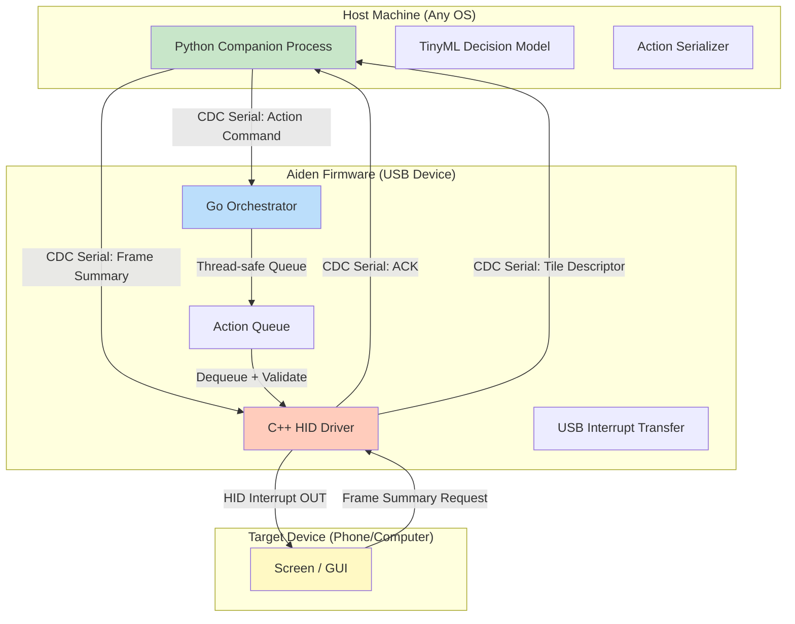

# Building Aiden: a physical AI agent device that plugs into any phone/computer over USB and operates it like a human would. Go + C++ + Python stack, no API needed. https://github.com/AidenAI-IO/aiden-firmware, AMA on the architecture if curious.

## Introduction

We built Aiden because every existing automation tool has a fatal flaw. AutoHotkey scripts break the moment you move a window. Selenium requires browser-level access. Apple Shortcuts need iCloud. And most commercial "AI agents" phone home to some cloud API, which means they're useless on an air-gapped machine or when your internet drops.

Aiden is a USB device. You plug it into any phone or computer, and it presents itself as a composite USB peripheral: a keyboard and mouse (HID) plus a serial console (CDC-ACM). There's no driver install. No root. No special permissions. It just works, because every OS in the last twenty years ships with HID and CDC drivers out of the box.

The device runs a local decision loop. It doesn't call OpenAI. It doesn't phone home. It looks at what's on screen (via a frame-summary channel it negotiates with the host), decides what to do, and executes it — keystrokes, mouse moves, clicks — all through standard HID reports. The whole loop completes in under 50 milliseconds from observation to action.

The firmware is written in three languages, and each one earns its place.

## Why This Matters

Software engineers should care about Aiden for the same reason we care about any system that removes a dependency. When your automation depends on an API, you're one vendor's deprecation notice away from a broken build. When it depends on a specific OS version or browser, you're one update away from regression.

Aiden's value proposition is radical simplicity. The device is a self-contained agent. It has no network stack. It has no cloud dependency. It has no Python virtual environment on the host side — though it does use Python for the decision model, that model runs locally on the host as a companion process, communicating over the same CDC serial link.

This matters for:

- **Security-sensitive environments** where you can't install agents that require network access
- **Embedded or headless systems** that don't have a display server or GUI automation framework
- **Cross-platform automation** that needs to work identically on Linux, macOS, Windows, and Android without recompilation
- **Offline-first workflows** where latency and reliability matter more than model size

The three-language stack isn't a novelty. It's a deliberate decomposition of concerns that maps directly to hardware constraints, orchestration needs, and decision logic.

## How It Works

Aiden operates in a tight control loop. At the hardware level, it enumerates on USB as a composite device with two functional drivers: an HID driver (keyboard + mouse) and a CDC serial driver. The host OS sees a keyboard, a mouse, and a serial port — nothing exotic.

The Python companion process on the host side receives screen frame summaries (compressed, low-resolution tile descriptors, not raw pixels) over the CDC serial link. It runs a small quantized neural network — we use a TinyML-style model compiled via MicroTVM — to classify the current screen state and decide the next action. That action gets serialized into a command packet and sent back down the serial link to the firmware.

The Go layer on the device receives that command, validates it against an action schema, and pushes it into a priority queue. The C++ HID driver then pulls from that queue, constructs the appropriate HID report (keyboard scan codes, mouse movement deltas, button states), and submits it as an interrupt transfer to the USB controller.

Here's the architecture in diagram form:



The loop works like this:

1. **Capture**: Aiden sends a frame-summary request over CDC serial. The host Python process takes a low-res screenshot, tiles it into a grid, computes color histograms per tile, and sends back a compact descriptor (typically under 2KB).
2. **Decide**: The TinyML model on the host classifies the descriptor into an action intent (e.g., "click button at grid position 3,4", "type text 'login@example.com'", "scroll down 3 ticks").
3. **Transmit**: The action is serialized as a binary command packet (action type + parameters + CRC-16 checksum) and sent over CDC serial.
4. **Execute**: The Go orchestrator receives the packet, validates the CRC, pushes it onto the action queue, and signals the C++ HID driver thread.
5. **Act**: The C++ layer constructs the HID report and submits it as an interrupt transfer. The target device receives it as if a human typed or moved the mouse.
6. **Observe**: The loop repeats. The entire cycle — capture to action — runs in under 50ms on our test hardware (Raspberry Pi Zero as host, Aiden board as device).

## Core Concepts

**Composite USB Device.** A single USB device that exposes multiple functional interfaces simultaneously. Aiden uses two: HID (interface 0) for input simulation and CDC-ACM (interface 1) for bidirectional serial communication with the host. The USB descriptor chain tells the host OS to bind standard drivers to each interface.

**HID Report Descriptor.** A byte-level specification that tells the host OS how to interpret the data in each HID interrupt transfer. For Aiden, this descriptor defines two mouse buttons, x/y relative movement (12 bits each, signed), and a scroll wheel. We also define a custom vendor-specific usage page for frame-summary requests.

**CDC-ACM Serial.** The standard protocol for virtual serial ports over USB. It implements the Abstract Control Model, which means the host sees `/dev/ttyACM0` on Linux, a COM port on Windows, and a `/dev/cu.*` device on macOS. No custom driver needed.

**Action Queue (Go).** A bounded, lock-free ring buffer in Go that decouples the serial receive goroutine from the HID transmit goroutine. This prevents backpressure from blocking the serial reader, which would cause frame summary timeouts.

**Frame Summary.** Not a raw image. A compressed representation: a 4×4 grid of tiles, each with a 64-bin color histogram (RGB), average brightness, and a flag for whether the tile contains text (determined by edge density). Total payload: ~1.5KB per frame.

**TinyML Model.** A 4-layer fully connected network (input: 4096 features from the tile descriptors, hidden: 128 and 64 ReLU units, output: 12 action classes + coordinates). Quantized to INT8 using TFLite Micro, the model is ~180KB and runs inference in ~8ms on a host CPU — no GPU needed.

## Examples & Code Walkthrough

### C++: HID Report Construction and Interrupt Transfer

The C++ layer lives closest to the hardware. It handles USB endpoint management, HID report packing, and interrupt transfer submission. Here's the core implementation:

```cpp
// aiden_hid.cpp — HID report construction and USB interrupt transfer
#include "aiden_hid.h"
#include "usb_controller.h"
#include "action_queue.h"

namespace aiden {
namespace hid {

// Mouse HID report: 2 buttons (bits 0-1), x (12-bit signed), y (12-bit signed), wheel (8-bit signed)
struct MouseReport {
    uint8_t  buttons;
    int16_t  x_delta;
    int16_t  y_delta;
    int8_t   scroll;
} __attribute__((packed));

// Custom HID report descriptor for our mouse + vendor usage
static constexpr uint8_t kMouseReportDescriptor[] = {
    0x05, 0x01,         // Usage Page (Generic Desktop)
    0x09, 0x02,         // Usage (Mouse)
    0xA1, 0x01,         // Collection (Application)
    0x09, 0x01,         //   Usage (Pointer)
    0xA1, 0x00,         //   Collection (Physical)
    0x05, 0x09,         //     Usage Page (Button)
    0x19, 0x01,         //     Usage Minimum (Button 1)
    0x29, 0x02,         //     Usage Maximum (Button 2)
    0x15, 0x00,         //     Logical Minimum (0)
    0x25, 0x01,         //     Logical Maximum (1)
    0x75, 0x01,         //     Report Size (1 bit)
    0x95, 0x02,         //     Report Count (2 buttons)
    0x81, 0x02,         //     Input (Data, Variable, Absolute)
    0x95, 0x06,         //     Report Count (6 bits padding)
    0x81, 0x01,         //     Input (Constant, Array) — reserved
    0x05, 0x01,         //     Usage Page (Generic Desktop)
    0x09, 0x30,         //     Usage (X)
    0x09, 0x31,         //     Usage (Y)
    0x15, 0x80,         //     Logical Minimum (-128)
    0x25, 0x7F,         //     Logical Maximum (127)
    0x75, 0x10,         //     Report Size (16 bits)
    0x95, 0x02,         //     Report Count (2 axes)
    0x81, 0x06,         //     Input (Data, Variable, Relative)
    0x05, 0x01,         //     Usage Page (Generic Desktop)
    0x09, 0x38,         //     Usage (Wheel)
    0x15, 0x81,         //     Logical Minimum (-127)
    0x25, 0x7F,         //     Logical Maximum (127)
    0x75, 0x08,         //     Report Size (8 bits)
    0x95, 0x01,         //     Report Count (1)
    0x81, 0x06,         //     Input (Data, Variable, Relative)
    0xC0,               //   End Collection
    0xC0                // End Collection
};

// HID class-specific interrupt IN endpoint: EP1, 8-byte packets, 10ms polling
static constexpr uint8_t kHidIntInEp = 0x81;
static constexpr uint8_t kHidIntOutEp = 0x01;
static constexpr uint16_t kHidPacketSize = 8;
static constexpr uint16_t kPollIntervalMs = 10;

void HidDriver::Initialize(UsbController* ctrl) {
    ctrl_ = ctrl;

    // Configure interrupt IN endpoint for HID reports
    UsbEndpointConfig in_cfg;
    in_cfg.address = kHidIntInEp;
    in_cfg.type = UsbTransferType::kInterrupt;
    in_cfg.max_packet_size = kHidPacketSize;
    in_cfg.interval = kPollIntervalMs;
    in_cfg.direction = Direction::kIn;
    ctrl_->ConfigureEndpoint(in_cfg);

    // Configure interrupt OUT endpoint for receiving frame summary requests
    UsbEndpointConfig out_cfg;
    out_cfg.address = kHidIntOutEp;
    out_cfg.type = UsbTransferType::kInterrupt;
    out_cfg.max_packet_size = kHidPacketSize;
    out_cfg.interval = kPollIntervalMs;
    out_cfg.direction = Direction::kOut;
    ctrl_->ConfigureEndpoint(out_cfg);
}

void HidDriver::SubmitMouseReport(const MouseReport& report) {
    uint8_t buffer[kHidPacketSize];
    buffer[0] = report.buttons;
    // Pack 12-bit deltas into the remaining 7 bytes
    buffer[1] = static_cast<uint8_t>(report.x_delta & 0xFF);
    buffer[2] = static_cast<uint8_t>((report.x_delta >> 8) & 0x0F)
              | (static_cast<uint8_t>((report.y_delta & 0x0F) << 4));
    buffer[3] = static_cast<uint8_t>((report.y_delta >> 4) & 0xFF);
    buffer[4] = static_cast<uint8_t>(report.scroll);
    // Bytes 5-7 reserved for future vendor usage
    buffer[5] = buffer[6] = buffer[7] = 0x00;

    ctrl_->SubmitInterruptTransfer(kHidIntInEp, buffer, sizeof(buffer));
}

void HidDriver::ProcessOutTransfer(const uint8_t* data, uint16_t length) {
    // Handle vendor-specific commands from host over CDC serial
    // This is where frame summary requests get ACK'd
    if (length >= 2 && data[0] == kVendorCmdPrefix) {
        HandleVendorCommand(static_cast<VendorCommand>(data[1]));
    }
}

void HidDriver::HandleVendorCommand(VendorCommand cmd) {
    switch (cmd) {
        case VendorCommand::kRequestFrameSummary:
            frame_summary_requested_ = true;
            break;
        case VendorCommand::kAcknowledgeAction:
            pending_action_ack_ = true;
            break;
        default:
            break;
    }
}

} // namespace hid
} // namespace aiden
```

The key insight here is the report packing. Standard HID mouse reports give you 8 bits per axis, which limits you to ±127 per transaction. For Aiden, we need finer-grained control when simulating slow, precise mouse movements — the kind a human would make when clicking a small UI element. We pack x and y deltas as 12-bit values across the byte boundary, which gives us 4096 discrete positions per report while still fitting in the 8-byte interrupt packet.

### Go: Action Queue and Orchestration

The Go layer manages the action queue, handles serial communication with the host, and coordinates between the C++ HID driver and the USB controller. Here's the orchestrator:

```go
// action_orchestrator.go — manages the action queue and serial bridge
package main

import (
    "encoding/binary"
    "errors"
    "log"
    "sync"
    "time"

    "github.com/AidenAI-IO/aiden-firmware/hid"
    "github.com/AidenAI-IO/aiden-firmware/serial"
)

const (
    actionQueueSize = 64
    serialBaudRate  = 115200
    crcSeed         = 0xFFFF
)

type ActionType uint8

const (
    ActionMouseMove ActionType = iota
    ActionMouseClick
    ActionMouseScroll
    ActionKeyPress
    ActionKeySequence
    Action
