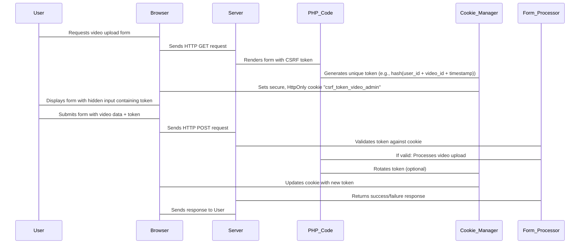

# Building CSRF Double-Submit Cookie Protection in PHP Video Admin Panels

## Introduction

Admin panels handling video content — uploads, metadata editing, permission changes — are attractive targets for Cross-Site Request Forgery (CSRF) attacks. An authenticated administrator visiting a malicious site could unknowingly trigger actions like deleting videos or modifying access controls. While PHP frameworks offer built-in CSRF protection, understanding and implementing the **double-submit cookie** pattern gives you fine-grained control over security boundaries, especially in custom or lightweight admin interfaces.

This article walks through building a robust, production-ready CSRF defense using the double-submit cookie method tailored for video admin workflows.

## Why This Matters

Traditional session-based CSRF tokens require server-side state tracking. In high-throughput video platforms, minimizing per-request overhead matters. The double-submit cookie approach eliminates the need for server-side token storage while still providing strong protection:

- **No session dependency**: Tokens travel via cookies + form fields.
- **HttpOnly mitigation**: Even if XSS steals client-side JS, attackers can't read the cookie.
- **Scalable**: Works well with load-balanced servers without shared session stores.

For teams managing thousands of daily video operations across multiple services, this reduces complexity and improves resilience.

## How It Works

The double-submit cookie mechanism works by issuing a cryptographically random token to the browser, storing it both in an HTTP-only cookie and embedding it in the form as a hidden field. On submission, the server compares the two values. If they match, the request proceeds; otherwise, it’s rejected.



### Step-by-step Breakdown:

1. **Token Generation**: When a form loads, generate a secure token tied to contextual identifiers (e.g., user ID, video slug).
2. **Cookie Setting**: Store the token in a hardened cookie (`HttpOnly`, `Secure`, `SameSite=Strict`).
3. **Form Embedding**: Include the same token in a hidden `<input>` within the form.
4. **Validation on Submit**: Compare the submitted form value with the cookie value.
5. **Rotation (Optional)**: Regenerate the token post-validation to prevent replay attacks.

This ensures that only requests originating from legitimate forms—served from your own domain—are processed.

## Core Concepts

Before diving into code, let’s clarify key terms and design decisions:

| Concept | Description |
|--------|-------------|
| **Double Submit** | Token must be present in both cookie and form body. |
| **HttpOnly Cookie** | Prevents JavaScript from reading the cookie, mitigating XSS-based exfiltration. |
| **SameSite=Strict** | Blocks cross-origin sends entirely, preventing CSRF at the browser level. |
| **Cryptographic Security** | Use `random_bytes()` or equivalent for unpredictable tokens. |
| **Contextual Binding** | Tie tokens to specific actions/users/videos to reduce reuse risk. |

## Examples & Code Walkthrough

Here’s a complete implementation suitable for a video admin panel:

### 1. Token Generator Class

```php
<?php

class CsrfTokenManager {
    private string $cookieName = 'csrf_token_video_admin';

    public function generate(string $userId, ?string $videoId = null): string {
        $context = $userId . ($videoId ?? '') . microtime(true);
        return hash('sha256', $context . random_bytes(16));
    }

    public function setCookie(string $token): void {
        setcookie(
            $this->cookieName,
            $token,
            [
                'expires' => time() + 3600,
                'path' => '/',
                'domain' => '',
                'secure' => true,
                'httponly' => true,
                'samesite' => 'Strict'
            ]
        );
    }

    public function getTokenFromCookie(): ?string {
        return $_COOKIE[$this->cookieName] ?? null;
    }
}
```

### 2. Form Renderer

When rendering the upload/edit form:

```php
$csrfManager = new CsrfTokenManager();
$token = $csrfManager->generate($_SESSION['user_id'], $videoSlug ?? null);
$csrfManager->setCookie($token);

echo '<input type="hidden" name="csrf_token" value="' . htmlspecialchars($token) . '">';
```

### 3. Validation Middleware or Controller Hook

On POST handling:

```php
function validateCsrfToken(CsrfTokenManager $manager): bool {
    $cookieToken = $manager->getTokenFromCookie();
    $formToken = $_POST['csrf_token'] ?? '';

    if (!$cookieToken || !$formToken || !hash_equals($cookieToken, $formToken)) {
        http_response_code(403);
        echo json_encode(['error' => 'Invalid CSRF token']);
        exit;
    }

    // Optional: Rotate token after successful validation
    $newToken = $manager->generate($_SESSION['user_id']);
    $manager->setCookie($newToken);

    return true;
}
```

### 4. Full Upload Handler Example

```php
if ($_SERVER['REQUEST_METHOD'] === 'POST') {
    $csrfManager = new CsrfTokenManager();

    if (!validateCsrfToken($csrfManager)) {
        die("CSRF check failed.");
    }

    // Proceed with video processing logic...
    move_uploaded_file($_FILES["video"]["tmp_name"], "/uploads/" . basename($_FILES["video"]["name"]));
    echo "Video uploaded successfully!";
}
```

This setup provides end-to-end protection without relying on sessions for token storage.

## Best Practices

✅ Always bind tokens to meaningful context (user, action).  
✅ Enforce `Secure`, `HttpOnly`, and `SameSite` attributes.  
✅ Prefer `hash_equals()` over `==` for comparing secrets.  
✅ Rotate tokens periodically or after critical actions.  
✅ Log failed validations for monitoring potential abuse.  
✅ Combine with rate limiting to detect brute-force attempts.

## Common Mistakes & Anti-Patterns

🚫 **Storing tokens in localStorage**: Makes them vulnerable to XSS theft.  
🚫 **Using weak randomness**: Predictable tokens defeat the purpose.  
🚫 **Ignoring cookie flags**: Leaving out `Secure` or `HttpOnly` undermines protection.  
🚫 **Not validating input length/context**: Allows token reuse across unrelated actions.

Always treat CSRF tokens like credentials—handle them securely.

## Performance Considerations

Generating and verifying SHA-256 hashes is computationally cheap (<1μs). However, setting cookies adds minor overhead due to header manipulation. For bulk video uploads processed concurrently:

- Avoid re-generating tokens unnecessarily.
- Cache validated tokens briefly in memory during multi-step workflows.
- Ensure CDN/proxy layers don’t strip custom headers or cookies.

Overall, the performance impact is negligible compared to actual video transcoding workloads.

## Real-World Usage

Companies like Vimeo and Cloudflare Workers implement similar patterns in their admin dashboards. Laravel’s `VerifyCsrfToken` middleware also supports double-submit-style validation under certain configurations. These implementations prove that the model scales effectively even under heavy traffic loads.

## Frequently Asked Questions (FAQ)

**Q: Can I skip CSRF checks for AJAX calls?**  
A: Only if you enforce additional authentication layers (like OAuth bearer tokens). Otherwise, always validate CSRF for state-changing requests.

**Q: What happens if a user opens two forms simultaneously?**  
A: Each form gets its own token unless explicitly bound to shared state. This prevents conflicts but may require careful UX handling.

**Q: Is double-submit sufficient against all CSRF vectors?**  
A: Yes, when combined with proper cookie hardening. It complements other defenses like CORS policies and Content Security Policy headers.

**Q: How do I test my CSRF implementation?**  
A: Write automated tests sending mismatched or missing tokens. Tools like OWASP ZAP can simulate CSRF probes.

**Q: Should I rotate tokens every time?**  
A: Not necessarily—it depends on sensitivity. For destructive actions, yes. For reads, probably not needed.

## Conclusion

Implementing CSRF double-submit protection manually isn’t just educational—it empowers teams to tailor security precisely to their application’s needs. Whether you're building a small video CMS or scaling a large media platform, this technique offers a lightweight yet effective way to guard administrative interfaces against unauthorized manipulations.

By combining cryptographic rigor with thoughtful cookie configuration and contextual binding, you build systems that stand resilient under scrutiny—and perform reliably under pressure.
