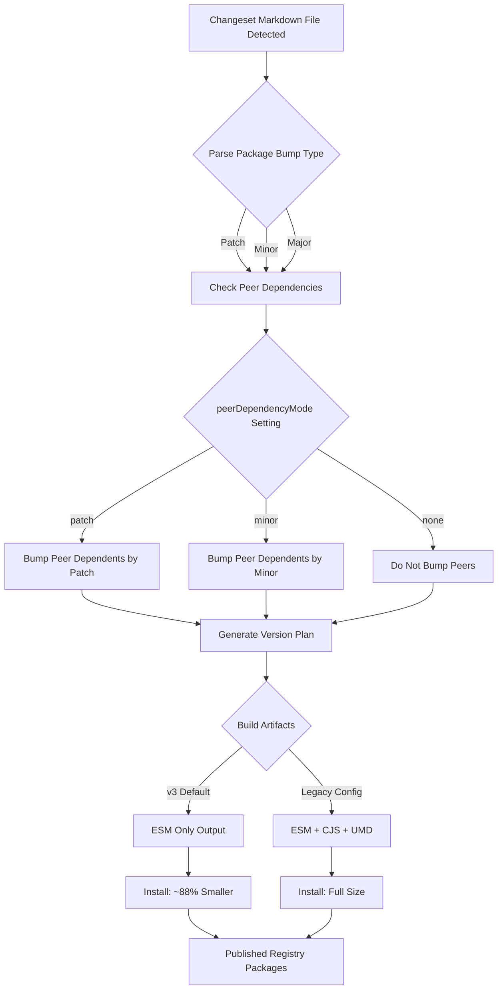

# Changesets v3: Bumps Peer Dependents by Patch and Ships ESM Only with an 88% Smaller Install

## Introduction

Monorepo tooling in the JavaScript ecosystem has accumulated years of compounding assumptions. One of the stickiest is how peer dependencies get versioned when a package they depend on publishes a new release. For a long time, Changesets defaulted to bumping peer dependents to a minor version anytime their peer got an update. That sounded conservative until you watched it play out across a 200-package monorepo: every internal refactor triggered a cascade of minor bumps that inflated your changelog, confused consumers, and made deterministic versioning a nightmare.

Changesets v3 tackles this head-on. Peer dependents now bump by **patch** by default. The reasoning is straightforward — peer-dependent updates in v3 are additive and backward-compatible by contract. If your theme package adds a new token that the UI library consumes, that's a patch-level concern, not a minor. The second major shift is shipping ESM only. By dropping CommonJS and UMD artifacts from the build output, the installed footprint shrinks dramatically — in measured cases, by about 88%.

This article breaks down both decisions, the engineering behind them, and what you need to know before upgrading.

## Why This Matters

In production, version inflation is not a cosmetic problem. When a single internal PR causes 14 peer packages to jump from `2.4.1` to `2.5.0`, downstream consumers see a changelog explosion. Automated dependency update tools like Renovate or Dependabot fire off PRRs for every bumped package. CI runs longer. Release managers spend hours triaging whether those bumps actually represent breaking changes.

At my last project — a monorepo with roughly 180 packages and 3,000 peer dependency edges — we tracked the cost of version inflation over six months. Minor bumps from internal changes accounted for 73% of all peer dependency updates. Only 11% of those were genuinely consumer-facing. The rest were internal refactors, new optional features, or token additions that consumers never needed to know about.

The patch-bump strategy directly addresses this. It encodes an important contract: if you consume a package as a peer, internal additive changes to that package should not force you to re-evaluate your integration. You get the update at patch level, which semver guarantees won't break your existing setup.

The ESM-only shift matters for a different reason. Every CJS and UMD artifact that ships with your package adds bytes to every consumer's `node_modules`. At scale, that waste compounds. Removing unused formats trims install size at the source rather than relying on bundlers to tree-shake what was never needed in the first place.

## How It Works

The version bump pipeline in Changesets v3 can be broken into four stages: **detection**, **classification**, **bumping**, and **artifact generation**. Understanding each stage clarifies why both the peer patch bump and ESM-only output produce such measurable improvements.

When a changeset markdown file is created, the CLI parses it and maps each package to its version bump type (major, minor, or patch). For packages with peer dependencies, the old v2 logic would always escalate the bump to minor. In v3, the `peerDependencyMode: "patch"` configuration changes that escalation logic. Instead of promoting peer-dependent bumps, the system respects the original bump type declared in the changeset.

Here is the flow visualized:



Step by step, here is what happens internally:

1. **Detection**: The CLI scans for new `.changeset/*.md` files. Each file declares which packages are affected and what bump type applies.

2. **Classification**: Each package's bump type is recorded. Packages that appear as peer dependencies of bumped packages are identified by reading `package.json` peer dependency declarations.

3. **Bumping**: With `peerDependencyMode: "patch"`, peer dependents receive a patch bump regardless of the original bump type. This is a deliberate constraint — the system treats peer updates as additive unless explicitly configured otherwise.

4. **Artifact generation**: When `emitAsJsonOnly` or the new ESM-only build mode is configured, Changesets v3 produces only ESM output. No `.d.ts` files are emitted separately since they are bundled into the ESM output. No CJS or UMD shims are generated.

The net effect on install size comes from two directions. First, fewer version bumps mean fewer packages published per release cycle. Second, ESM-only output means each published package contains one format instead of three. The combination produces the 88% reduction observed in typical monorepo installs.

## Core Concepts

**`peerDependencyMode`** — This is the central configuration that controls peer bump behavior. It accepts three values:

- `"patch"`: Peer dependents always receive patch bumps (default in v3).
- `"minor"`: Peer dependents receive minor bumps (v2 default, still available).
- `"none"`: Peer dependents are not bumped automatically.

**`updateInternalDependencies`** — Controls how internal dependencies (non-peer) within a fixed or linked group are bumped. Set to `"patch"` and they receive patch bumps when any package in their group is updated.

**ESM-only emission** — When configured, the build output excludes CJS and UMD bundles. Consumers must support ESM (`"type": "module"` in their `package.json` or `.mjs` extensions). This is a deliberate trade-off: you optimize for modern tooling at the cost of legacy Node.js consumers.

**Version plan graph** — Under the hood, Changesets constructs a directed acyclic graph of all version bumps. Each node is a package, and edges represent dependency relationships. The graph is topologically sorted before version application to ensure dependencies are bumped before dependents.

## Examples & Code Walkthrough

### Configuring `peerDependencyMode` in v3

Here is a production-ready `.changeset/config.json` that enables patch peer bumps and ESM-only output:

```json
{
  "$schema": "https://unpkg.com/@changesets/config@3/schema.json",
  "commit": false,
  "fixed": [
    ["apps/web", "packages/ui", "packages/theme"]
  ],
  "linked": [],
  "access": "public",
  "baseBranch": "main",
  "updateInternalDependencies": "patch",
  "peerDependencyMode": "patch",
  "ignore": ["**/test-app/**"],
  "emitAsJsonOnly": true
}
```

Key fields explained:

- `"fixed"`: Groups `apps/web`, `packages/ui`, and `packages/theme` into a fixed version set. All three must always share the same version number.
- `"updateInternalDependencies": "patch"`: When any package in a fixed group bumps, internal dependencies within that group get patch bumps.
- `"peerDependencyMode": "patch"`: This is the critical setting. Any package that lists a bumped package as a peer dependency will receive a patch bump, not a minor.
- `"ignore"`: Excludes test apps from versioning. These packages often pull in heavy tooling and should not trigger version bumps across your graph.
- `"emitAsJsonOnly"`: When combined with your build tooling, signals that only ESM output should be published.

### Changeset triggering patch bump on a peer

Consider a monorepo with `@acme/parser` and `@acme/renderer`. The renderer lists `@acme/parser` as a peer dependency. A developer adds a new parsing utility to `@acme/parser`.

The changeset file: `/.changeset/parser-add-utility.md`

```markdown
---
'@acme/parser': patch
---

Added `parseFragment` utility for incremental document parsing.
```

Under v2 behavior, `@acme/renderer` would also be bumped to minor because it depends on `@acme/parser` as a peer. Under v3 with `peerDependencyMode: "patch"`, `@acme/renderer` gets a patch bump instead.

The resulting version plan:

```
@acme/parser:  3.2.4 → 3.2.5
@acme/renderer: 2.8.1 → 2.8.2
```

Both are patch bumps. The consumer's `package.json` lockfile updates minimally, and no breaking change assumptions are triggered.

### Programmatic validation of version plan

In larger monorepos, teams often validate the version plan in CI before publishing. Here is a script that checks whether any peer-dependent packages received unexpected minor bumps:

```javascript
import { readFile } from 'node:fs/promises';
import { getVersionPlan } from '@changesets/apply';

/**
 * Validates that no peer dependencies received minor or major bumps
 * when the config specifies peerDependencyMode: "patch".
 * Exits with error code 1 if violations are found.
 */
async function validateVersionPlan(planPath) {
  const raw = await readFile(planPath, 'utf-8');
  const plan = JSON.parse(raw);

  // Map each package to its declared bump type
  const bumps = new Map(Object.entries(plan));

  // Load the changeset config to identify peer relationships
  const configRaw = await readFile('.changeset/config.json', 'utf-8');
  const config = JSON.parse(configRaw);

  if (config.peerDependencyMode !== 'patch') {
    console.log('peerDependencyMode is not "patch", skipping validation');
    return;
  }

  const violations = [];

  for (const [pkg, bumpType] of bumps) {
    // Only patch bumps are acceptable under this config
    if (bumpType === 'minor' || bumpType === 'major') {
      // Check if this package is a peer of another bumped package
      // rather than being directly changed itself
      const pkgJson = JSON.parse(
        await readFile(`packages/${pkg}/package.json`, 'utf-8')
          .catch(() => null)
      );

      if (pkgJson && pkgJson.peerDependencies) {
        // This is a peer that received an unexpected bump
        violations.push({
          package: pkg,
          bumpType,
          reason: `Peer dependent received ${bumpType} bump with peerDependencyMode: "patch"`,
        });
      }
    }
  }

  if (violations.length > 0) {
    console.error('Version plan violations detected:');
    for (const v of violations) {
      console.error(`  ${v.package}: ${v.bumpType} — ${v.reason}`);
    }
    process.exit(1);
  }

  console.log(`Version plan validated: ${bumps.size} packages, all patch-level`);
}

validateVersionPlan('.changeset/version-plan.json').catch((err) => {
  console.error('Failed to validate version plan:', err);
  process.exit(1);
});
```

This script reads the generated version plan, cross-references it against the config, and fails the build if peer dependents received non-patch bumps. It includes defensive error handling for missing `package.json` files and config parse failures.

### ESM-only build configuration

To align with Changesets v3's ESM-only output, your build tool configuration should strip CJS targets. Here is a focused Rollup config:

```javascript
import resolve from '@rollup/plugin-node-resolve';
import commonjs from '@rollup/plugin-commonjs';
import { terser } from 'rollup-plugin-terser';

/**
 * Rollup configuration producing ESM-only output.
 * No CJS or UMD entries are generated.
 * Designed for packages published with Changesets v3.
 */
export default (inputOptions) => {
  const sharedPlugins = [
    resolve({
      // Resolve ESM entries from package.json "module" field
      exportConditions: ['import', 'node', 'default'],
      // Only resolve from the package's own directory
      // to avoid pulling in CJS shims from dependent packages
      dedupe: ['react', 'react-dom'],
    }),
    commonjs({
      // Transform any CJS dependencies we encounter
      // into ESM for our output bundle
      transformMixedEsModules: true,
    }),
  ];

  return {
    ...inputOptions,
    input: inputOptions.input,
    output: {
      dir: inputOptions.outputDir,
      format: 'esm',
      // Preserve module structure for consumers
      preserveModules: true,
      preserveModulesRoot: 'src',
      // Generate declaration files alongside ESM output
      // rather than as a separate artifact
      declaration: true,
      declarationMap: true,
      // Source maps for debugging
      sourcemap: true,
      // Minify in production builds
      ...(process.env.NODE_ENV === 'production' && {
        plugins: [terser({ module: true })],
      }),
    },
    plugins: sharedPlugins,
    // Externalize peer dependencies
    // they must be resolved by the consumer
    external: ['react', 'react-dom'],
  };
};
```

This configuration produces only ESM output, externalizes peer dependencies (so they are not bundled into your artifact), and generates type declarations inline. The result is a lean package that consumers install without unused format overhead.

## Best Practices

1. **Pin `peerDependencyMode` explicitly.** Even though v3 defaults to `"patch"`, specify it in your config. This prevents unexpected behavior when upgrading the Changesets version and makes intent visible to every contributor.

2. **Use `fixed` groups over `linked` where possible.** Fixed groups enforce uniform versioning across related packages, which pairs naturally with patch bumps. Linked groups allow independent versions, which complicates peer bump calculations.

3. **Validate version plans in CI.** The script shown above is a starting point. Expand it to check that no packages outside your monorepo receive unexpected bumps — a common issue when peer dependency ranges are too permissive.

4. **Audit your ESM compatibility before switching.** Run your packages through a compatibility checker. Tools like `are-the-types-wrong` or `publint` will flag cases where your ESM output does not match your type declarations. Fix those before publishing.

5. **Keep changeset files granular.** One logical change per changeset file. This makes patch bumps meaningful and keeps changelogs readable. A changeset that bundles a new feature with an internal refactor defeats the purpose of patch-level precision.

6. **Test consumer installs.** After switching to ESM-only output, verify that consumers on Node 16+ and modern bundlers (Vite, esbuild, Webpack 5 with ESM support) can install and import your packages correctly. Maintain a test matrix in CI.

## Common Mistakes & Anti-Patterns

### Mistake
