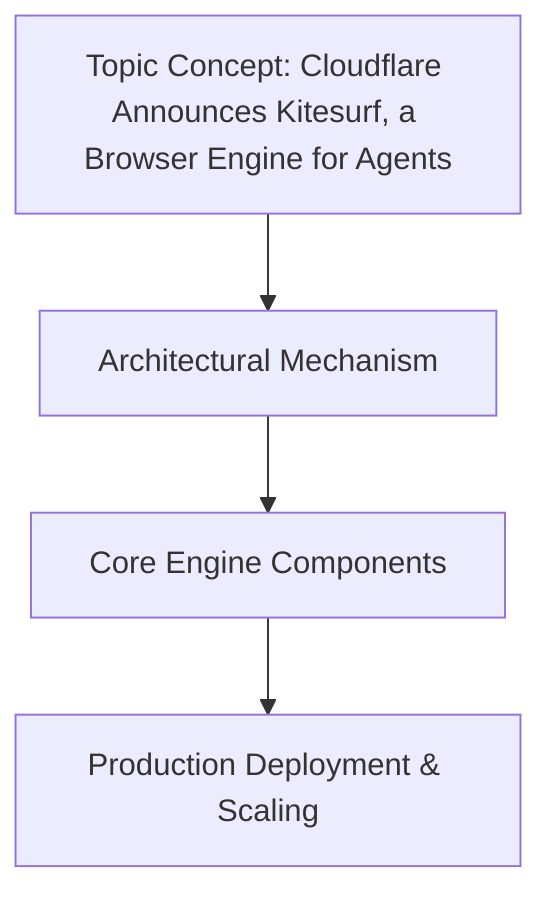

# Cloudflare Announces Kitesurf, a Browser Engine for Agents

## Introduction
Traditional browser engines are fundamentally built for rendering pixels and simulating human UI interactions. When we try to run autonomous AI agents on top of standard browsers like Chromium, we force them to navigate a heavy, visual DOM environment that was

## How It Works

