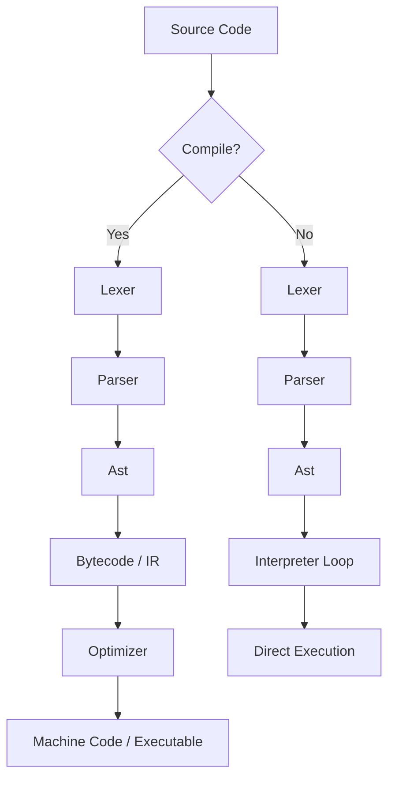

# Compilation vs Interpretation

## Introduction

Every developer eventually hits that moment: a script runs fine locally but crawls in production, or a compiled binary refuses to deploy across environments. The root cause often isn’t the algorithm or the infrastructure—it’s how the code itself gets executed. Understanding whether a language compiles or interprets isn’t academic trivia; it’s the difference between a service that scales smoothly and one that grinds to a halt under load.

## Why This Matters

Modern engineering teams juggle performance-critical backends, dynamic scripting layers, and everything in between. Choosing between compilation and interpretation affects startup time, memory usage, debugging workflows, and even deployment strategies. Misjudging these trade-offs leads to bloated containers, mysterious latency spikes, and toolchains that fight rather than support development velocity.

## How It Works

At its core, compilation transforms source code into another form—usually machine code or an intermediate representation—before execution. Interpretation executes source code directly, statement by statement, typically through a virtual machine or runtime engine.

Here’s a simplified view of both pipelines:



In compiled languages like Rust or C++, the entire program is translated ahead-of-time into native instructions. Interpreted languages like Python or JavaScript parse and evaluate expressions on the fly, often caching intermediate results for reuse.

## Core Concepts

### Compilation Pipeline
1. **Lexical Analysis**: Converts characters into tokens.
2. **Parsing**: Builds a tree structure (AST) from token sequences.
3. **Semantic Analysis**: Ensures type safety and resolves symbols.
4. **Code Generation**: Emits target-specific instructions.
5. **Optimization**: Improves performance without changing behavior.

### Interpretation Pipeline
1. **Parsing**: Same as compilation, but stops at AST.
2. **Evaluation**: Walks the AST recursively, computing values.
3. **Runtime Management**: Handles memory allocation, garbage collection, etc.

Both approaches share early stages—lexing and parsing—but diverge in execution strategy.

## Examples & Code Walkthrough

To illustrate the contrast, let’s build a tiny expression evaluator that supports integers and addition. We'll implement both a compiler and an interpreter side-by-side.

#### Example 1 – Mini Compiler (AST → Bytecode)

```python
# mini_compiler.py
class Instruction:
    """Represents a single bytecode instruction."""
    def __init__(self, opcode, operand=None):
        self.opcode = opcode
        self.operand = operand

    def __repr__(self):
        return f"{self.opcode} {self.operand}" if self.operand else self.opcode


def compile_ast(node):
    """
    Compiles an AST node into a list of bytecode instructions.
    Supports only integer literals and binary addition.
    """
    if isinstance(node, int):
        return [Instruction("LOAD_CONST", node)]
    elif isinstance(node, tuple) and node[0] == "+":
        left_code = compile_ast(node[1])
        right_code = compile_ast(node[2])
        return left_code + right_code + [Instruction("BINARY_ADD")]
    else:
        raise ValueError(f"Unsupported AST node: {node}")


# Sample AST: (3 + 4)
sample_ast = ("+", 3, 4)
compiled_bytecode = compile_ast(sample_ast)
for instr in compiled_bytecode:
    print(instr)
```

Output:
```
LOAD_CONST 3
LOAD_CONST 4
BINARY_ADD
```

This example mimics what real compilers do internally: walk the AST and emit low-level operations.

#### Example 2 – Mini Interpreter (AST → Direct Evaluation)

```python
# mini_interpreter.py
def interpret_ast(node):
    """
    Evaluates an AST directly without generating bytecode.
    Supports only integer literals and binary addition.
    """
    if isinstance(node, int):
        return node
    elif isinstance(node, tuple) and node[0] == "+":
        left_val = interpret_ast(node[1])
        right_val = interpret_ast(node[2])
        return left_val + right_val
    else:
        raise ValueError(f"Unsupported AST node: {node}")


# Sample AST: (3 + 4)
sample_ast = ("+", 3, 4)
result = interpret_ast(sample_ast)
print(result)  # Output: 7
```

While functionally equivalent, the interpreter avoids emitting any intermediate representation—it computes values immediately during traversal.

## Best Practices

- **Profile Before Optimizing**: Don’t assume compilation always wins. Measure actual bottlenecks in your workload.
- **Hybrid Approaches Work**: Many modern runtimes combine interpretation with JIT compilation for flexibility and speed.
- **Consider Deployment Constraints**: Static binaries simplify deployment but may increase size; interpreted scripts offer agility but require compatible runtimes.
- **Leverage Caching**: Even interpreters benefit from caching parsed structures or compiled artifacts (`.pyc`, `.class`).

## Common Mistakes & Anti-Patterns

1. **Ignoring Warm-Up Costs**: JIT-based systems need time to optimize hot paths. Measuring performance too early skews results.
2. **Over-Compiling Everything**: Not every module needs ahead-of-time compilation. Dynamic features sometimes demand interpretive execution.
3. **Neglecting Debuggability**: Compiled code can be harder to trace. Ensure tooling supports source maps or debug symbols.
4. **Mismatched Expectations**: Assuming interpreted equals slow or compiled equals fast ignores optimizations present in both camps.

## Performance Considerations

| Aspect              | Compiled                     | Interpreted                  |
|---------------------|------------------------------|------------------------------|
| Startup Time        | Slower due to preprocessing  | Faster initial launch        |
| Peak Throughput     | Higher                       | Lower unless optimized       |
| Memory Footprint    | Smaller post-link            | Larger due to metadata       |
| Cache Behavior      | Better locality              | More indirection overhead    |
| Branch Prediction   | Predictable                  | Less predictable             |

For compute-heavy tasks, compilation usually outperforms interpretation. For rapid prototyping or event-driven logic, interpretation offers faster iteration cycles.

## Real-World Usage

Industry leaders tailor their toolchains based on use case:

- **Google V8 (JavaScript)**: Uses Ignition interpreter for fast startup and TurboFan JIT for optimized hot paths.
- **Facebook HHVM (PHP)**: Combines static analysis with dynamic translation to boost web application throughput.
- **Mozilla SpiderMonkey (JavaScript)**: Employs baseline interpreter followed by optimizing compiler tiers.
- **Oracle HotSpot JVM (Java)**: Starts with interpreter, then applies C2 compiler to critical methods after profiling.

Each balances responsiveness with efficiency differently depending on typical workloads.

## Frequently Asked Questions (FAQ)

**Q: Is compiled code always faster than interpreted code?**  
A: Not necessarily. Modern JIT compilers can match or exceed AOT performance by specializing code at runtime. However, pure interpreters generally lag behind due to interpretation overhead.

**Q: Can I mix compilation and interpretation in the same project?**  
A: Absolutely. Tools like GraalVM allow mixing languages and execution models within one process. Python also supports compiling modules to bytecode (`*.pyc`) while retaining interpretive semantics.

**Q: When should I choose an interpreted language for a system component?**  
A: Prefer interpretation for plugins, configuration scripts, or glue logic where runtime adaptability outweighs raw speed.

**Q: Do compiled programs consume less memory than interpreted ones?**  
A: Generally yes, especially once linked. Interpreted environments carry additional overhead from VMs, symbol tables, and dynamic dispatch mechanisms.

**Q: How does WebAssembly fit into this dichotomy?**  
A: WASM blurs the line—it compiles to portable bytecode executed in a sandboxed environment, offering near-native speeds with interpretive safety guarantees.

## Conclusion

Compilation and interpretation aren’t opposing philosophies—they’re complementary tools shaped by evolving hardware constraints and developer needs. Today’s most successful platforms blend both techniques intelligently. Whether designing a new DSL or tuning an existing stack, understanding these fundamentals empowers better architectural decisions.

Choose wisely—not just based on tradition or hype, but on measured impact to your users’ experience.
