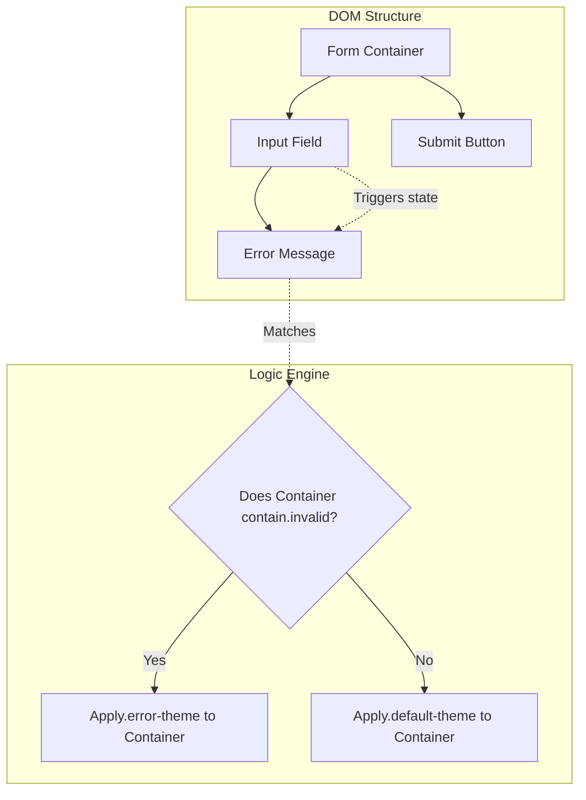

# CSS Just Got a Parent Selector. Your Forms Will Never Look Same

## Introduction
For nearly two decades, CSS has been a one-way street. We've been able to style children based on their parents, but the reverse—styling a parent based on the state or existence of its children—was a notorious technical debt generator. If you wanted to change a form container's border color when an input inside it became invalid, you couldn't do it with pure CSS. You had to reach for JavaScript, toggle a class, and manage state manually. 

That era is ending. The introduction of the `:has()` pseudo-class has fundamentally rewritten the rules of the cascade.

## Why This Matters
In complex web applications, state management is the primary source of UI bugs. When we rely on JavaScript to sync the visual state of a container with the internal state of its inputs, we introduce a "split brain" problem. The DOM has one state, and your React/Vue/Svelte state might have another.

By moving "parental" logic back into the CSS engine, we reduce our JS footprint, minimize layout thrashing caused by manual DOM manipulation, and create much more robust, declarative UI components. This isn't just about making forms look pretty; it's about reducing the complexity of the component lifecycle.

## How It Works
The `:has()` selector works by looking "ahead" or "down" the DOM tree from the element it is attached to. It essentially asks: *"Does this element contain a descendant that matches this specific selector?"*

Unlike previous selectors that only looked at the current node, `:has()` allows the engine to evaluate the subtree and then apply styles to the current node if the condition is met.



## Core Concepts
To use `:has()` effectively, you need to understand three main pillars:

1.  **The Predicate:** The selector inside the parentheses. This is the condition that must be met (e.g., `:invalid`, `:checked`, or a specific class).
2.  **The Target:** The element the selector is actually attached to. This is the element that will receive the styling.
3.  **The Relationship:** The logic that bridges the two. `:has()` acts as a conditional filter for the target based on the presence of the predicate.

## Examples & Code Walkthrough

Let's look at a real-world scenario: a high-fidelity registration form where the entire card needs to change its visual weight when a user interacts with it.

### The "Old Way" (JavaScript required)
```javascript
// We used to have to do this:
const input = document.querySelector('#email-input');
const form = document.querySelector('.registration-card');

input.addEventListener('input', (e) => {
  if (e.target.validity.valid) {
    form.classList.remove('is-invalid');
  } else {
    form.classList.add('is-invalid');
  }
});
```

### The "New Way" (Pure CSS)
Here is how we handle a complex form validation state without a single line of imperative JavaScript.

```css
/* The container defaults to a neutral state */
.registration-card {
  padding: 2rem;
  border: 2px solid #e2e8f0;
  transition: all 0.3s ease;
  display: flex;
  flex-direction: column;
  gap: 1.5rem;
}

/* 
  If the container contains an input that is currently invalid, 
  change the container's border and background.
*/
.registration-card:has(input:invalid) {
  border-color: #ef4444;
  background-color: #fef2f2;
}

/* 
  If the container has a checked checkbox (e.g., Terms of Service),
  we can style the submit button differently.
*/
.registration-card:has(input[type="checkbox"]:checked) ~.submit-btn {
  background-color: #2563eb;
  cursor: pointer;
}

.registration-card:has(input[type="checkbox"]:not(:checked)) ~.submit-btn {
  background-color: #cbd5e1;
  cursor: not-allowed;
}
```

## Best Practices
*   **Keep Selectors Shallow:** Avoid deeply nested `:has()` selectors like `.container:has(.child:has(.grandchild))`. This can lead to performance degradation.
*   **Use for State, Not Structure:** Use `:has()` to react to *states* (like `:invalid`, `:checked`, or `:focus-within`) rather than using it to build complex layout logic that should probably be handled by Grid or Flexbox.
*   **Combine with Transitions:** Since `:has()` triggers state changes, always pair your styles with `transition` properties to prevent jarring visual jumps when a user types.

## Common Mistakes & Anti-Patterns
1.  **The Infinite Loop (Logical Error):** Trying to use `:has()` to style an element based on its own state in a way that creates a circular dependency. While the browser handles this, it's a sign of poor architectural thinking.
2.  **Over-reliance on Specificity:** Because `:has()` can be applied to any element, it's easy to accidentally create highly specific selectors that are impossible to override later. Always keep your `:has()` selectors as generic as possible.
3.  **The "JavaScript Replacement" Fallacy:** Don't use `:has()` to replace logic that *actually* requires JS (like calculating a complex mathematical value based on input). Use it for visual synchronization, not business logic.

## Performance Considerations
Historically, the concern with `:has()` was the computational cost of the browser having to "re-scan" the DOM tree upwards. However, modern browser engines (Chromium, WebKit, Gecko) have optimized this heavily. 

In terms of complexity, `:has()` is roughly $O(n)$ where $n$ is the number of descendants. In a standard form with 10-20 inputs, the impact is negligible. However, if you use `:has()` on a massive table with thousands of rows, you might see some frame drops during input events. For most UI components, the performance gain from removing JS event listeners outweighs the CSS engine cost.

## Real-World Usage
We are seeing this pattern emerge in design systems like Shadcn/ui and Tailwind's experimental utility classes. Large-scale platforms (like Stripe or Airbnb) use these patterns to create "smart" input groups where the label moves, changes color, or shows an icon based on whether the input below it is focused or contains an error.

## Frequently Asked Questions (FAQ)

**Q: Does `:has()` work in older browsers?**
A: As of 2024, it has excellent support in all modern evergreen browsers (Chrome, Firefox, Safari). If you need to support legacy browsers, you'll still need a JS fallback.

**Q: Can I use `:has()` with custom elements?**
A: Yes, as long as the custom element is part of the DOM tree, `:has()` can inspect its internal state or its children.

**Q: Is `:has()` slower than a standard class toggle in JS?**
A: For a single input, the difference is micro-optimization. For a massive list, JS might be more performant, but for 99% of web forms, `:has()` is faster and cleaner.

## Conclusion
The `:has()` selector is a massive win for web development. It allows us to write more declarative, less imperative code. By treating the relationship between elements as a first-class citizen in CSS, we reduce the complexity of our frontend state machines and create more resilient user interfaces. Start using it for your forms, and you'll never want to write a `document.querySelector` for a simple error state ever again.
