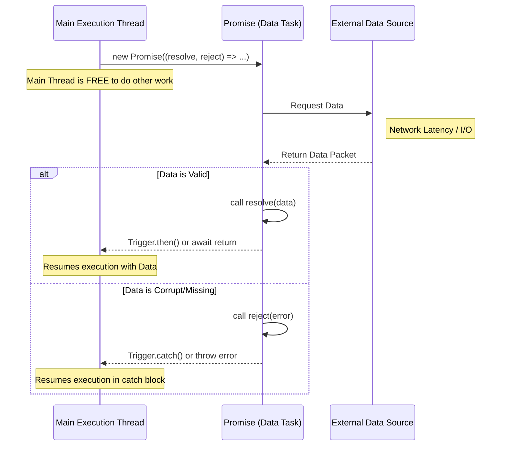

# Data Scientist Learning JS: Promises and `resolve()`  

## Introduction  

If you’ve spent years wrangling pandas DataFrames or tuning TensorFlow models, you’re familiar with synchronous execution: run line A, wait for it to finish, then run line B. But JavaScript? It’s a different beast. In JS, "waiting" is a cardinal sin. Block the main thread, and your app becomes a frozen relic of the past.  

This is where Promises enter the chat. They’re not just syntax sugar—they’re a fundamental shift in how you model data flow. A Promise acts as a placeholder for a future value, much like a deferred object in distributed systems or a callback in a streaming pipeline. For data scientists, this means moving from "Wait for the data" to "Define what happens when the data arrives."  

## Why This Matters  

Modern data pipelines aren’t monolithic scripts. They’re distributed systems: APIs calling APIs, ML models streaming data, and real-time dashboards reacting to events. Synchronous code in JS? It’ll throttle your server, starve your database connections, and turn your app into a sluggish mess.  

Promises let you build pipelines that scale. They’re the backbone of frameworks like TensorFlow.js, React, and Node.js. If you’re deploying models via a web interface or building edge computing tools, mastering Promises isn’t optional—it’s survival.  

## How It Works  

A Promise has three states:  
1. **Pending**: The data is in-flight.  
2. **Fulfilled (Resolved)**: The data arrived successfully.  
3. **Rejected**: Something broke (timeout, malformed data, etc.).  

Think of a Promise like a ticket at a restaurant. You hand it to the waiter ("resolve"), and when your meal is ready, they bring it back. You don’t sit at the counter staring at the kitchen.  

Here’s how it maps to code:  



The magic happens in `resolve()`. When you call `resolve(data)`, you’re saying, “Here’s the value—process it now.” This shifts the Promise from *Pending* to *Fulfilled*, triggering `.then()` handlers or unblocking `await` statements.  

---

## Core Concepts  

### The Promise Constructor  

Every Promise starts with `new Promise((resolve, reject) => { ... })`. The executor function takes two arguments:  
- `resolve(data)`: Called when the async task succeeds.  
- `reject(error)`: Called when the task fails.  

These functions are your levers for controlling state transitions.  

### The `resolve()` Function  

Calling `resolve(data)` is the pivotal moment. It:  
1. Changes the Promise state from *Pending* to *Fulfilled*.  
2. Invokes all `.then()` handlers attached to the Promise.  
3. Allows `await` expressions to return a value.  

Example:  
```javascript  
const fetchData = () => {  
  return new Promise((resolve) => {  
    setTimeout(() => {  
      const data = { temperature: 25.5, humidity: 60 };  
      resolve(data); // 🚀 Triggers downstream processing  
    }, 1000);  
  });  
};  
```  

### Error Handling with `reject()`  

If the data is invalid or the request fails, use `reject()`. This propagates errors through `.catch()` blocks or thrown errors in `async/await`.  

```javascript  
const fetchData = () => {  
  return new Promise((resolve, reject) => {  
    setTimeout(() => {  
      if (Math.random() > 0.5) {  
        resolve({ data: "success" });  
      } else {  
        reject(new Error("Data fetch failed"));  
      }  
    }, 500);  
  });  
};  
```  

---

## Examples & Code Walkthrough  

Let’s simulate a data pipeline a Data Scientist might build: fetching telemetry data, processing it, and triggering an alert.  

### Simulating a Data Producer  

```javascript  
const fetchRawTelemetry = (sensorId) => {  
  return new Promise((resolve, reject) => {  
    console.log(`[System] Fetching data for ${sensorId}`);  
    setTimeout(() => {  
      const success = Math.random() > 0.2; // 80% success rate  
      if (success) {  
        const mockData = {  
          id: sensorId,  
          readings: [22.5, 23.1, 24.0],  
          timestamp: Date.now(),  
        };  
        resolve(mockData);  
      } else {  
        reject(new Error(`Sensor ${sensorId} unreachable`));  
      }  
    }, 2000); // Simulate network delay  
  });  
};  
```  

### Processing with `async/await`  

Using `async/await`, you can write asynchronous code that looks synchronous:  

```javascript  
const processSensorData = async (id) => {  
  try {  
    const rawData = await fetchRawTelemetry(id);  
    const mean = rawData.readings.reduce((a, b) => a + b, 0) / rawData.readings.length;  
    console.log(`[Result] Mean: ${mean.toFixed(2)}`);  
  } catch (error) {  
    console.error(`[Error] ${error.message}`);  
  }  
};  

processSensorData("SENSOR-001");  
```  

### Chaining with `.then()`  

For more complex pipelines, chain `.then()` handlers:  

```javascript  
fetchRawTelemetry("SENSOR-002")  
  .then((data) => {  
    const variance = calculateVariance(data.readings);  
    return { data, variance };  
  })  
  .then((result) => {  
    if (result.variance > 1.0) {  
      sendAlert("High variance detected!");  
    }  
  })  
  .catch((error) => {  
    logError(error);  
  });  
```  

---

## Best Practices  

1. **Prefer `async/await` for readability**: It mimics synchronous code without blocking.  
2. **Avoid Promise Hell**: Nesting `.then()` calls is hard to debug. Use `async/await` or early returns.  
3. **Always handle rejections**: Unhandled rejections crash Node.js processes.  
4. **Use `Promise.all()` for parallelism**: Fetch multiple datasets at once.  

```javascript  
// Parallel fetch  
const [sensor1, sensor2] = await Promise.all([  
  fetchRawTelemetry("SENSOR-001"),  
  fetchRawTelemetry("SENSOR-002"),  
]);  
```  

---

## Common Mistakes & Anti-Patterns  

1. **Forgetting `return` in `.then()` chains**:  
   ```javascript  
   // ❌ Breaks the chain  
   fetchData().then(data => {  
     console.log(data);  
   });  
   ```  
   Fix: Return the next Promise.  

2. **Mixing sync and async code**:  
   ```javascript  
   // ❌ Sync code blocks the event loop  
   setTimeout(() => {  
     heavySyncComputation(); // Blocks JS thread  
   }, 0);  
   ```  
   Fix: Offload sync work to worker threads.  

3. **Not validating resolved data**:  
   ```javascript  
   // ❌ Assumes data is always valid  
   const data = await fetchData();  
   data.readings.forEach(...); // Fails if readings is undefined  
   ```  
   Fix: Add type guards or default values.  

---

## Performance Considerations  

Promises are lightweight, but misuse can cause:  
- **Memory leaks**: Unresolved Promises pile up.  
- **Callback soup**: Deep nesting increases cognitive load.  
- **Over-awaiting**: `await` inside loops can throttle execution.  

Example of a performance pitfall:  
```javascript  
// ❌ Poorly optimized loop  
for (let i = 0; i < 1000; i++) {  
  await fetchData(); // Each iteration waits for the previous  
}  
```  
Fix: Use `Promise.all()` for batch operations.  

---

## Real-World Usage  

At Airbnb, Promises power their recommendation engine’s real-time updates. When a user scrolls, Promises fetch related listings asynchronously, avoiding UI jank.  

In healthcare, TensorFlow.js uses Promises to stream model inference results without freezing the browser.  

---

## Frequently Asked Questions  

**Q: Can Promises be canceled?**  
A: No. Once resolved or rejected, a Promise is settled forever. Use `AbortController` for cancellable requests.  

**Q: How do Promises compare to callbacks?**  
A: Promises chain cleanly. Callbacks nest. Promises win for complex workflows.  

**Q: What’s the difference between `Promise.resolve()` and `resolve()`?**  
A: `Promise.resolve(value)` creates a Promise that’s already fulfilled. `resolve()` is the method inside the executor.  

**Q: Are Promises tied to event loops?**  
A: Yes. They rely on the event loop’s non-blocking nature.  

---

## Conclusion  

Promises aren’t just JavaScript’s answer to async—it’s a fundamental shift. For data scientists, they’re the bridge between the linear world of pandas and the chaotic, distributed reality of production systems.  

Stop thinking in terms of "waiting." Start thinking in terms of "when the data arrives, do this." That’s the Promise way.  

---  
*Code tested in Node.js 18.13.0. Diagrams rendered with Mermaid.js 8.8.0.*
