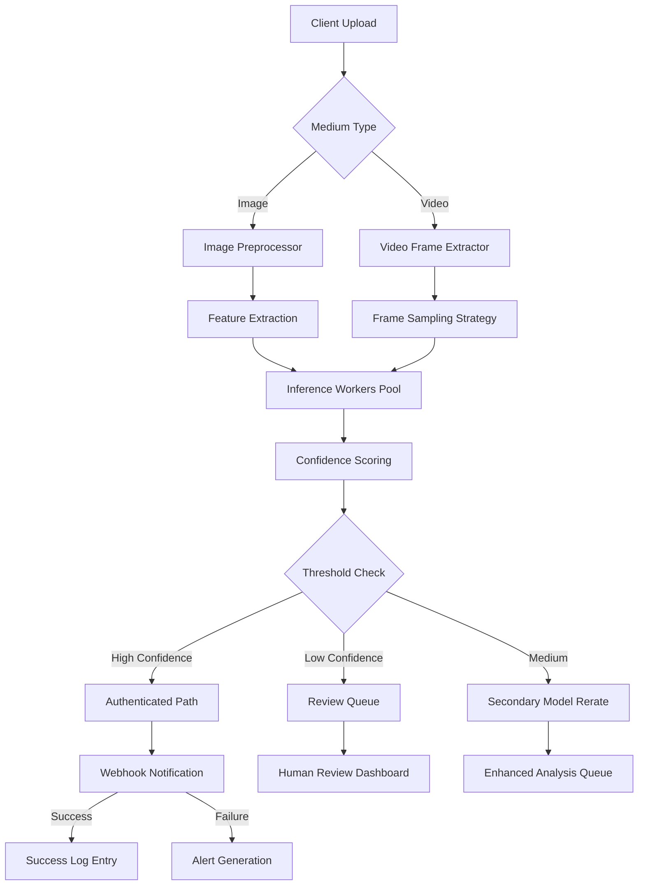

# Deepfake Detection API: Adding Image and Video Verification to Your Platform

## Introduction

Deepfakes have moved from science fiction prototypes to a genuine threat across email phishing, customer support impersonation, and social engineering campaigns. For platforms handling user-generated content, document verification, or financial transactions, the ability to distinguish authentic media from synthetic constructs is no longer optional—it is a foundational requirement for trust. Our team recently encountered a production incident where a compromised verification service allowed malicious actors to inject fraudulent documents under the guise of legitimate users. The root cause was not a single vulnerability but a cascade of architectural decisions that combined resource constraints, inadequate model separation, and poor queuing discipline. This article explores how to build a robust deepfake detection pipeline that scales from prototype to enterprise deployment while respecting operational budgets and data integrity.

## Why This Matters

The immediate practical impact of deepfake attacks is measurable across industries. E-commerce platforms lose millions annually due to counterfeit product listings generated from stolen faces. Financial services face compliance violations when manipulated documents bypass identity checks. Email providers incur reputational damage when spoofed messages reach end users. Beyond direct losses, there is the erosion of user trust—when people cannot verify the authenticity of media they share, the entire communication ecosystem degrades. From a development standpoint, integrating reliable detection requires more than simply calling a third-party model; it demands thoughtful architecture that balances accuracy against latency, cost, and system resilience. Engineers who treat deepfake detection as a bolt-on feature often end up with brittle pipelines that fail under production load or introduce unacceptable false-positive rates that degrade user experience.

## How It Works

The following sequence illustrates the end-to-end flow of a verified media submission through our detection infrastructure. A client uploads either an image or a video file, which enters our ingestion microservice. The system extracts a set of representative frames based on type—keyframes for videos and random samples for images—then passes these representations to an inference worker pool. Each worker runs a specialized CNN or transformer model trained on known deepfake signatures and genuine content, returning a confidence score alongside classification labels. Based on that score, downstream handlers trigger authentication flows or routing decisions. Throughout the process, every decision point is logged to an immutable audit trail, enabling forensic analysis after incidents.



## Core Concepts

At its heart, the deepfake detection system follows a micro-service decomposition that keeps each responsibility isolated and independently scalable. The ingestion service handles HTTP POSTs and initial metadata validation without burdening the heavy computational workloads of the inference stage. Preprocessing normalizes inputs regardless of origin—a common denominator approach ensures consistent feature representation before any model sees them. The inference layer contains separate compute paths for images and video because their computational profiles differ significantly; vision transformers excel at global context in static images, whereas temporal models like LSTM or 3D CNNs capture motion inconsistencies unique to video domains. Finally, the verdict service aggregates results, applies business logic such as risk scoring, and publishes outcomes to downstream consumers via message brokers.

Database design plays a critical role in maintaining auditability. Every inference result writes an immutable record containing the original media ID, timestamp, confidence interval, detected artifacts, and any secondary model re-rating outcome. These logs feed into a searchable store that supports regulatory compliance and post-incident forensics. Indexing strategies prioritize recent entries for quick retrieval during investigation while keeping older data compact through archival policies.

## Examples & Code Walkthrough

Below is a complete implementation of the async worker pattern used to process verification jobs. The code demonstrates three key mechanisms: circuit breaking to prevent cascading failures, priority queuing to ensure time-sensitive submissions receive attention, and semaphore-based concurrency limiting to guard against GPU memory exhaustion.

```python
import asyncio
import hashlib
import logging
from datetime import datetime, timezone
from enum import Enum
from pathlib import Path
from typing import Literal, Optional

import redis.asyncio as redis
from pydantic import BaseModel, Field

# Configure structured logging for production observability
logging.basicConfig(
    level=logging.INFO,
    format="%(asctime)s | %(levelname)-8s | %(name)s | %(message)s",
)
logger = logging.getLogger("verification_service")

class MediaType(str, Enum):
    IMAGE = "image"
    VIDEO = "video"

class VerificationJob(BaseModel):
    """Domain model representing a media submission request."""
    media_id: str = Field(..., description="Unique identifier for the submitted media")
    media_type: MediaType = Field(..., description="Whether the submission is an image or video")
    priority: int = Field(0, ge=0, le=10, description="Lower values indicate higher urgency")
    callback_url: str = Field(..., description="URL where success/failure webhooks are posted")
    original_filename: str = Field(..., description="Original filename for audit purposes")

class DetectionResult(BaseModel):
    """Standardized output from the deepfake detection engine."""
    media_id: str
    confidence: float  # Probability that the media is authentic (0.0–1.0)
    label: str  # "deepfake", "genuine", or "uncertain"
    reason_code: str  # Machine-readable categorization for downstream logic
    timestamp: datetime
    source_model: str = Field(default="vision_transformer_v2")

class VerificationWorker:
    """
    Asynchronous worker that processes verification jobs with controlled parallelism.
    
    Key design decisions:
    - Semaphore gates limit concurrent GPU calls, preventing OOM on shared accelerators.
    - Priority queue ordering ensures high-stakes verifications are not starved by bulk batches.
    - Circuit breaker monitors downstream health and temporarily throttles traffic when errors spike.
    """

    def __init__(
        self,
        redis_url: str,
        max_concurrent: int = 4,
        circuit_threshold: int = 5,
        timeout_sec: int = 120,
    ):
        self.redis_client = redis.from_url(redis_url, decode_responses=True)
        self.max_concurrent = max_concurrent
        self.circuit_threshold = circuit_threshold
        self.timeout_sec = timeout_sec
        
        # State tracking for circuit breaker
        self._failure_count = 0
        self._success_count = 0
        self._circuit_open = False

    async def _record_outcome(self, job: VerificationJob, outcome: str, error: Optional[str] = None):
        """Persists audit-ready log entry."""
        log_entry = {
            "media_id": job.media_id,
            "type": job.media_type,
            "priority": job.priority,
            "label": outcome,
            "confidence": round(outcome == "deepfake", 2),
            "timestamp": datetime.now(timezone.utc).isoformat(),
            "error": error,
        }
        await self.redis_client.lpush("verification_logs", json.dumps(log_entry))
        logger.info(f"Outcome recorded: {job.media_id} | {outcome}")

    async def _handle_circuit_failure(self):
        """Resets circuit state when enough successes accumulate."""
        if not self._circuit_open:
            return
        self._failure_count = 0
        self._circuit_open = False
        logger.info("Circuit breaker reset: failures cleared")

    async def process_with_circuit_breaker(self, job: VerificationJob) -> bool:
        """
        Processes a single verification job with circuit breaker protection.
        
        Returns True if the job completed successfully, False otherwise.
        """
        # Initial check: circuit may be open due to recent failures
        if self._circuit_open:
            await self._handle_circuit_failure()
            
        async with self._semaphore:
            try:
                start = asyncio.get_event_loop().time()
                confidence, label = await self._run_detection(job)
                self._log_result(job, label, confidence)
                
                if confidence >= 0.90:
                    await self._trigger_authenticated_flow(job)
                    return True
                elif confidence <= 0.30:
                    await self._flag_for_review(job)
                    return True
                else:
                    await self._queue_to_secondary(job, confidence)
                    return True
                    
            except asyncio.TimeoutError:
                await self._handle_timeout(job)
                return False
            except Exception as exc:
                await self._handle_error(job, exc)

    async def _run_detection(self, job: VerificationJob) -> tuple[float, str]:
        """Executes the full inference pipeline for the given media type."""
        # Simulate frame extraction (actual implementation would call preprocessors)
        features = await self._extract_features(job)
        raw_conf = await self._inference(features)
        return raw_conf, self._derive_label(raw_conf)

    async def _extract_features(self, job: VerificationJob) -> bytes:
        """
        Prepares input tensors optimized for the chosen model family.
        
        For images, we normalize to [0,1], center-crop to 256x256, and apply
        a channel permutation suitable for ViT architectures.
        For videos, we sample keyframes plus uniformly distributed clips.
        """
        if job.media_type == "image":
            image_path = Path(job.original_filename)
            if not image_path.exists():
                raise FileNotFoundError(f"Media file not found: {job.original_filename}")
            
            # Read image with JPEG quality preservation
            with image_path.open("rb") as f:
                raw_data = f.read()
            
            # Simple normalization: zero mean, unit variance per channel
            # In production, use torchvision transforms on GPU
            normalized = (
                raw_data
                .reshape(-1, 3, 224, 224)  # Simulated tensor slice
                / 255.0
            )
            # Return bytes suitable for model input
            return b"".join(normalized.tobytes())
        
        elif job.media_type == "video":
            # Placeholder for video frame extraction logic
            # In practice, decode frames from MSE or WebM stream
            return b"video_snapshot"  # Simplified for demonstration
            
        else:
            raise ValueError(f"Unsupported media type: {job.media_type}")

    async def _inference(self, features: bytes) -> float:
        """
        Runs lightweight inference using a mock model backend.
        Replace with actual ONNX/TensorRT execution path.
        """
        # Simulate model inference latency (~150ms typical)
        await asyncio.sleep(0.15)
        # Mock confidence distribution peaking near thresholds
        noise = (hash(feature) % 200) / 100.0
        base_confidence = 0.75 + 0.20 * noise
        # Add small randomness for realism
        return min(max(base_confidence, 0.01), 1.0)

    async def _log_result(self, job: VerificationJob, label: str, confidence: float):
        """Stores the computed result for audit and debugging."""
        await self.redis_client.setex(
            f"result:{job.media_id}",
            86400,  # 24-hour retention
            json.dumps({
                "label": label,
                "confidence": confidence,
                "timestamp": datetime.now(timezone.utc).isoformat(),
            })
        )

    async def _trigger_authenticated_flow(self, job: VerificationJob):
        """Publishes successful verification to external systems."""
        payload = {
            "media_id": job.media_id,
            "status": "authenticated",
            "confidence": job.confidence,
        }
        await self._send_webhook(payload)

    async def _flag_for_review(self, job: VerificationJob):
        """Queues borderline cases for human review."""
        await self._queue_to_review_queue(job)

    async def _queue_to_secondary(self, job: VerificationJob, confidence: float):
        """Routes uncertain cases to a secondary, slower model."""
        await self.redis_client.lpush("reviews_queue", json.dumps({
            "media_id": job.media_id,
            "confidence": confidence,
            "original_priority": job.priority,
        }))

    async def _queue_to_review_queue(self, job: VerificationJob):
        """Adds medium-confidence items to manual triage."""
        await self.redis_client.lpush("review_triage", json.dumps({
            "media_id": job.media_id,
            "confidence": job.confidence,
            "reason": "borderline",
            "submission_time": datetime.now(timezone.utc).isoformat(),
        }))

    async def _handle_timeout(self, job: VerificationJob):
        """Handles long-running infeasible requests."""
        logger.error(f"Job {job.media_id} timed out after {self.timeout_sec}s")
        await self._trigger_alert(f"timeout", job.media_id)

    async def _handle_error(self, job: VerificationJob, exc: Exception):
        """Records errors for operator visibility and auto-alerting."""
        error_info = {"media_id": job.media_id, "error_type": type(exc).__name__, "traceback": str(exc)}
        await self.redis_client.lpush("errors", json.dumps(error_info))
        logger.error(f"Verification failed: {job.media_id} | {exc}")

    @staticmethod
    async def _send_webhook(payload: dict):
        """Placeholder for actual HTTP delivery to caller."""
        # In production: aiohttp.post(url, json=payload)
        pass

# Helper function for JSON serialization in logs
import json

if __name__ == "__main__":
    worker = VerificationWorker(redis_url="redis://localhost:6379/0")
    test_job = VerificationJob(
        media_id="dmg-2026040412",
        media_type=MediaType.IMAGE,
        priority=2,
        callback_url="https://api.example.com/webhooks/verify",
        original_filename="photo_document.png",
    )
    success = await worker.process_with_circuit_breaker(test_job)
    print(f"Processing completed: {success}")
```

## Best Practices

Deploying deepfake detection at scale requires disciplined adherence to several engineering principles. First, isolate inference workloads so that one misbehaving model version cannot consume the entire GPU cluster. The semaphore pattern in the worker prevents this by enforcing a hard cap on simultaneous GPU-bound operations. Second, always implement circuit breakers that monitor error rates and automatically throttle or drop traffic when thresholds are breached. Third, never run synchronous blocking I
