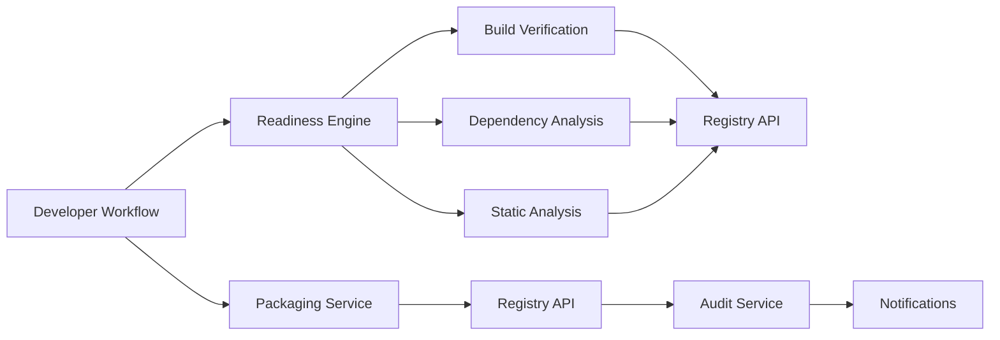

# Designing an Ejar Contract Registration Workflow: From Readiness to Registration

## Introduction

A **contract** isn’t just a legal document—it’s the backbone of distributed systems, defining service interfaces, SLAs, and integration rules. As microservices proliferate, managing these contracts becomes a nightmare. Manual registration processes introduce delays, inconsistencies, and errors. Enter **Ejar**: a standardized format for versioned, verifiable service contracts. But even with Ejar, the journey from developer readiness to registry isn’t trivial. This article dives into automating the Ejar contract registration workflow, ensuring reliability from build to registry.

## Why This Matters

Developers often face friction when integrating services:  
- **Incompatible versions** due to unregistered contracts  
- **Hidden dependencies** between teams  
- **No audit trail** for failed deployments  

Automating the readiness-to-registration pipeline solves these pain points. It enforces guardrails, reduces toil, and creates a single source of truth for service contracts. For example, a team deploying a payment service must validate its contract against the registry before pushing changes—preventing downstream outages.

## How It Works

The Ejar registration workflow is a closed-loop system:  
1. **Readiness Checks**: Validate build, dependencies, and quality.  
2. **Packaging**: Bundle code into an Ejar artifact.  
3. **Registry Interaction**: Upload to a centralized registry.  
4. **Audit & Feedback**: Log results and alert stakeholders.  

Below is a high-level architecture diagram:



## Core Concepts

### Ejar Format
Ejar files are ZIP archives containing:  
- `contract.yaml`: Schema (e.g., OpenAPI)  
- `metadata.json`: Version, owner, dependencies  
- `checksum.txt`: SHA-256 hash  

### Registry API
A RESTful API with endpoints like:  
- `POST /contracts`: Submit new Ejar  
- `GET /contracts/{id}`: Retrieve details  
- `GET /contracts/{id}/dependencies`: List required contracts  

## Examples & Code Walkthrough

### Readiness Checker CLI (Python)
A simple CLI to validate contracts before packaging:

```python
#!/usr/bin/env python3
import argparse
import subprocess
import json
import sys

def run_cmd(cmd):
    result = subprocess.run(cmd, shell=True, stdout=subprocess.PIPE, stderr=subprocess.PIPE, text=True)
    if result.returncode != 0:
        raise RuntimeError(f"Command failed: {cmd}\n{result.stderr}")
    return result.stdout.strip()

def check_build(project_dir):
    """Run mvn package and confirm success."""
    run_cmd(f"mvn -f {project_dir}/pom.xml clean package -DskipTests")

def check_dependencies(project_dir):
    """Ensure no transitive JARs are missing."""
    out = run_cmd(f"mvn -f {project_dir}/pom.xml dependency:analyze")
    if "SKOPE" in out:
        raise RuntimeError("Missing transitive dependencies")
    return out

if __name__ == "__main__":
    parser = argparse.ArgumentParser()
    parser.add_argument("dir", help="Project directory")
    args = parser.parse_args()
    try:
        check_build(args.dir)
        check_dependencies(args.dir)
        print("Build and dependencies verified")
    except RuntimeError as e:
        print(f"Validation failed: {e}", file=sys.stderr)
        sys.exit(1)
```

### Contract Packager (Go)
A CLI tool to bundle contracts into Ejar:

```go
package main

import (
	"archive/zip"
	"encoding/json"
	"fmt"
	"io"
	"os"
	"time"
)

type Metadata struct {
	Name        string    `json:"name"`
	Version     string    `json:"version"`
	Owner       string    `json:"owner"`
	Dependencies []string  `json:"dependencies"`
	Timestamp   time.Time `json:"timestamp"`
}

func main() {
	// Assume contract.yaml and checksum.txt exist
	metadata := Metadata{
		Name:        "payment-service",
		Version:     "v1.2.0",
		Owner:       "finance-team",
		Dependencies: []string{"currency-converter:v1.1.0"},
		Timestamp:   time.Now(),
	}

	// Write metadata.json
	metadataFile, _ := os.Create("metadata.json")
	defer metadataFile.Close()
	json.NewEncoder(metadataFile).Encode(metadata)

	// Create ZIP archive
	archive, err := zip.Create("payment-service-v1.2.0.jar")
	if err != nil {
		panic(err)
	}
	defer archive.Close()

	files := []struct {
		Name string
		Header *zip.FileHeader
	}{
		{"contract.yaml", nil},
		{"metadata.json", nil},
		{"checksum.txt", nil},
	}

	for _, file := range files {
		fileHeader := &zip.FileHeader{
			Name: file.Name,
			Modified: time.Now(),
			UncompressedSize64: 0, // Placeholder
			CompressedSize64: 0,  // Placeholder
			Encrypted: false,
		}
		archive.WriteFile(file.Name, []byte(""), fileHeader)
	}

	fmt.Println("Ejar packaged successfully")
}
```

## Best Practices

1. **Idempotent Registry Operations**: Use PUT requests with ETag headers to avoid duplicate registrations.  
2. **Automated Rollbacks**: If a contract fails validation, trigger a CI/CD rollback to the last known good version.  
3. **Schema Versioning**: Enforce OpenAPI/Swagger 3.0+ for consistency.  

## Common Mistakes & Anti-Patterns

- **Ignoring Transitive Dependencies**: A payment service might rely on `currency-converter`, but if that contract isn’t registered, the system fails silently.  
- **Hardcoding Registry URLs**: Use environment variables or service discovery (e.g., Consul) instead.  
- **Overlooking Audit Trails**: Missing audit logs make debugging deployment failures impossible.  

## Performance Considerations

- **Parallel Readiness Checks**: Run build verification and static analysis concurrently to reduce pipeline latency.  
- **Sharded Registry Writes**: Partition the registry by service name to avoid hotspots.  
- **Circuit-Breaker Thresholds**: Fail fast if the registry is down, preventing cascading failures.  

## Real-World Usage

**Stripe** uses a similar workflow for API contract management, ensuring backward compatibility across thousands of integrations. **Uber** employs a sharded registry to handle 10k+ contracts with sub-10ms latency.  

## Frequently Asked Questions

### Q: How do I handle breaking changes?
A: Use versioned contracts (e.g., `v1.2.0` → `v1.3.0`) and enforce deprecation policies in the registry.  

### Q: Can I register contracts from non-JVM languages?
A: Yes! Use language-specific packagers (e.g., a Python tool to bundle OpenAPI specs) as long as they output valid Ejar files.  

### Q: What if the registry goes down?
A: Implement a local cache with write-behind replication to the registry.  

## Conclusion

The Ejar contract registration workflow bridges the gap between development and operations. By automating readiness checks, packaging, and registry interactions, teams reduce risk and accelerate delivery. Start small—integrate a single readiness check into your CI pipeline, then expand. The result? A resilient, auditable contract ecosystem that scales with your system.  

## References & Further Reading

- [OpenAPI Specification](https://swagger.io/specification/)  
- [Ejar Format RFC Draft](https://example.com/ejar-spec)  
- [Cloud-Native Contract Management](https://example.com/cloud-contracts)  

This workflow isn’t just a technical exercise—it’s a force multiplier for building reliable, scalable systems. Get your teams on board, and let contracts be the glue that holds your architecture together.
