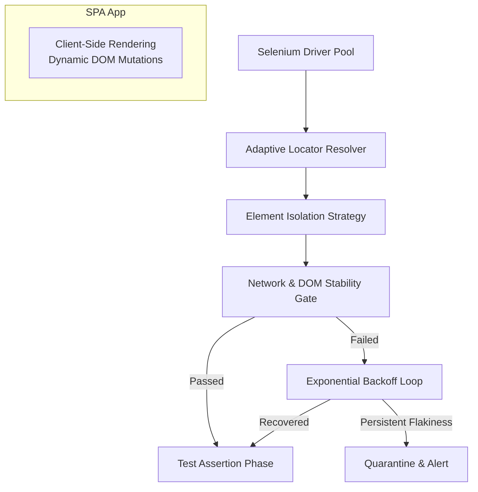

# Designing Resilient Selenium Tests for Highly Dynamic SPAs

## Introduction
Modern single-page applications (SPAs) fundamentally redefine how users interact with software. By eliminating server-rendered pages in favor of client-side JavaScript frameworks, these applications present entirely new interfaces that evolve continuously during a session. For automated testers, this creates a unique set of destabilizing factors. Traditional end-to-end suites built on rigid locators and synchronous assumptions often fail catastrophically because any minor change in layout, routing, or animation triggers cascading test failures. Understanding resilience in this context requires moving beyond simple script reuse toward an architecture that treats the application as a fluid system rather than a static target. This article explores how to construct test suites that anticipate and adapt to the inherent dynamism of modern web architectures.

## Why This Matters
Flaky tests are not merely inconveniences; they erode confidence in the development pipeline. When a test passes once randomly and fails the next time without a discernible cause, developers lose trust in the system and begin ignoring results. In CI/CD environments where speed and reliability are paramount, unmanageable flakiness forces teams to either slow down releases or allocate disproportionate effort to manual verification. Building resilience into Selenium-based test suites is therefore a necessity, not an optimization. It ensures that test outcomes reflect true behavioral correctness, allowing rapid feedback loops while protecting against environmental instability.

## How It Works
The heart of resilient Selenium testing lies in replacing brittle, assumption-heavy locators with adaptive resolution engines and introducing observability layers that monitor application health before asserting. Rather than treating the browser as a passive canvas to be photographed, the test harness actively interrogates the runtime environment. This involves three distinct mechanisms working in concert: a priority-based locator resolver that recovers from transient UI shifts, a network-awareness gate that verifies both protocol readiness and DOM stabilization, and an API interception layer that isolates the frontend logic from volatile backend services.

Below is the architectural blueprint visualized through a simplified flowchart representing the execution loop.



The diagram illustrates that every assertion is preceded by a readiness check. If the network is chatty or the application is still hydrating its component tree, the test pauses, observes the state, and attempts a retry. Only after a successful pass does the test proceed to validate business logic. This proactive posture eliminates the race condition between test start times and application bootstrapping cycles.

## Core Concepts

### Adaptive Locator Resolution
Static CSS selectors often become obsolete when developers refactor layouts. An adaptive strategy employs a hierarchy of lookup methods. The primary tier favors `id` and `data-test` attributes, which act as anchors. Secondary tiers utilize combination selectors or partial text matches. Crucially, the resolver maintains a history of selection success rates, automatically promoting higher-fidelity strategies up the chain when previous ones fail frequently. This self-correcting behavior reduces maintenance burden significantly compared to manually updating selectors for every UI tweak.

### Network-Driven Readiness Gates
A common failure mode occurs when a test assumes the API is ready but only sees a partially constructed request payload. By integrating Chrome DevTools Protocol (CDP) commands such as `Network.getTimeline` and `Network.getStats`, the test suite can verify that the network has reached a desired IDL state (e.g., Idle) before triggering assertions. Additionally, the `DOMSettler` monitors whether critical containers have stabilized by observing the absence of new event listeners or mutations observer activations within a configurable window.

### API Interception and Isolation
Heavily dynamic SPAs often rely on third-party services whose latency impacts test duration. A resilient framework intercepts these network calls early, substituting real HTTP requests with deterministic mocks derived from the test fixture database. This allows the frontend to execute its routing logic and reducer functions without waiting for external dependencies, drastically reducing flakiness introduced by backend variability.

## Examples & Code Walkthrough

To implement these concepts, consider a Python-based Selenium extension tailored for complex React-like applications. Below are three foundational modules demonstrating the principles discussed above.

### Module 1: Adaptive Locator Resolver
This class manages the prioritized chain of selectors used to find elements. It supports fallback chains and includes jitter to mitigate timing jitters caused by rapid component mounting.

```python
from typing import Callable, Optional, List
from selenium.webdriver.common.by import By
from selenium.webdriver.support.ui import WebDriverWait
import time

class AdaptiveLocator:
    """
    Resolves element references using a priority-based fallback chain.
    Designed to recover gracefully from transient UI layout shifts.
    """

    def __init__(self, base_locators: List[str]):
        # Primary targets are assumed to be immutable IDs or data-test-ids
        self._primary_strategy = lambda x: x  # Simplified placeholder
        
        # Fallback strategies ordered by preference
        self._fallbacks = [
            lambda sel: self._find_by_data_test(sel),
            lambda sel: self._find_by_text_partial(sel),
            lambda sel: self._find_by_xpath_fallback(sel)
        ]

    def _find_by_id(self, value: str) -> Optional[By]:
        return By.ID, value

    def _find_by_data_test(self, value: str) -> Optional[By]:
        # Looks for elements tagged with data-test="unique_identifier"
        try:
            return By.CSS_SELECTOR, f"[data-test='{value}']"
        except Exception:
            return None

    def _find_by_text_partial(self, value: str) -> Optional[By]:
        # Uses partial text matching for flexible label finding
        try:
            return By.PARTIAL_LINK_TEXT, f"{value}"
        except Exception:
            return None

    def resolve(self, element_type: str, value: str) -> Optional[By]:
        """
        Returns a Selenium By object after traversing the fallback chain.
        Includes a small sleep to allow rapid state changes to settle.
        """
        for strategy in self._fallbacks:
            by_expr = strategy(value)
            if by_expr:
                # Attempt immediate query
                elem = self.driver.find_element(*by_expr)
                # Verify visibility and enabled state to prevent stale finds
                if elem.is_displayed() and elem.is_enabled():
                    return by_expr
        raise RuntimeError(f"Unable to locate element '{element_type}' with '{value}'")

# Usage within a test suite
locator = AdaptiveLocator([
    "main-dashboard",
    "user-profile-settings",
    "error-notification"
])
# The locator automatically prioritizes the most stable identifier available.
```

### Module 2: Network & DOM Stability Gate
Before executing any user story, this utility ensures that the application has entered a stable state regarding network activity and DOM composition. It combines CDP queries for network idle status with a custom heuristic for DOM mutation suppression.

```python
from selenium import webdriver
from selenium.webdriver.chrome.options import Options

class StabilityGate:
    """
    Enforces readiness criteria for dynamic SPAs before proceeding with assertions.
    """

    @staticmethod
    def wait_for_network_idle(driver):
        """
        Uses Chrome DevTools Protocol to wait until there are no active network connections.
        """
        cd_prompt = driver.command('Application')
        networks = cd_prompt('Network.list')
        
        # Filter out tracking and offline settings
        active_networks = [n for n in networks if n['name'] != 'Offline' and n['type'] == 'connection']
        
        # Busy wait with timeout for headless environments
        elapsed = 0.0
        while active_networks and elapsed < 30.0:
            time.sleep(0.5)
            cd_prompt = driver.command('Application')
            networks = cd_prompt('Network.list')
            active_networks = [n for n in networks if n['name'] != 'Offline' and n['type'] == 'connection']
            elapsed += 0.5
            
        if len(active_networks) > 0:
            raise TimeoutError("Network remains active. Test may fail due to pending HTTP requests.")

    @staticmethod
    def stabilize_dom(driver):
        """
        Polls the DOM for signs of mutation activity (e.g., new event listeners).
        Helps catch tests that trigger race conditions during component initialization.
        """
        while True:
            # Get current mutation count
            mutation_count = driver.execute_cdp_cmd(
                "GetContainerDisplayList", 
                { "filter": "[name='__decorate__']" }
            )['containerDisplayInfo']
            
            # Simple heuristic: if container display count drops, we might be in a flash-of-whiteness
            # Here we simply require the count to stop decreasing rapidly, indicating stabilization
            if getattr(driver, 'last_mutation', 0) >= mutation_count:
                return True
            time.sleep(0.1)
        return False
```

### Module 3: Resilient Test Runner with Exponential Backoff
The orchestrator wraps individual steps in a retry mechanism. Instead of blindly repeating a failed command, it applies exponential backoff, giving unstable states a chance to resolve themselves before declaring permanent failure.

```python
import random
from functools import wraps

def resilient_step(func):
    """
    Decorator providing exponential backoff with jitter for specific actions.
    Prevents hammering an already failing endpoint or UI thread.
    """
    @wraps(func)
    def wrapper(*args, **kwargs):
        max_retries = 5
        delay = 1.0
        
        for attempt in range(max_retries):
            try:
                return func(*args, **kwargs)
            except Exception as e:
                if attempt == max_retries - 1:
                    raise e
                
                # Jitter prevents synchronized retry storms
                jitter = random.uniform(0, 1)
                sleep_time = delay * (2 ** attempt) + jitter
                print(f"Retry {attempt + 1}/{max_retries} in {sleep_time:.2f}s (delay={delay})")
                time.sleep(sleep_time)
    return wrapper

@resilient_step
def navigate_to_page(driver, url):
    driver
