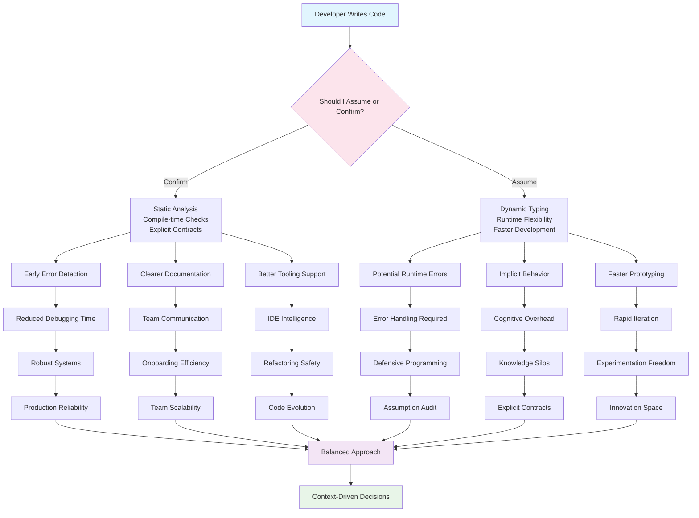

# Do you assume or confirm?

## Introduction

Last month, a single misplaced assumption took down a payment processing system for six hours. The code assumed that a card number would always be exactly 16 digits. In production, someone entered a 15-digit card from a different network. The system didn't validate this—it just processed. The charge went through, but the downstream fraud detection system choked on the unexpected length and flagged every transaction as suspicious. Six hours of manual intervention, thousands of affected customers, and a CTO on a very expensive conference call.

This isn't about one bad line of code. It's about a fundamental question every engineer faces daily: Do you assume your inputs, outputs, and state are correct, or do you confirm them at every step?

The answer isn't universal. It depends on your language's philosophy, your system's risk profile, and how much you're willing to trade developer velocity for runtime safety.

## Why This Matters

Programming languages make different bets on where validation should happen. JavaScript says "assume and we'll figure it out at runtime." Rust says "confirm at compile time or you don't ship." These choices aren't academic—they determine how quickly you can move, how often you'll be paged at 3 AM, and how much cognitive overhead your team carries.

The cost of being wrong varies dramatically by context. An internal admin tool can afford more assumptions than a public API handling financial transactions. A research prototype prioritizes speed over safety. A banking system must confirm everything.

What matters most is being intentional about where you place your bets.

## How It Works

The fundamental tension comes down to two approaches:

**Assumption-based programming** trusts that values meet expectations. You get faster execution, less code, and more flexibility. But you also get runtime failures that are harder to predict and debug.

**Confirmation-based programming** validates everything explicitly. You catch errors early, document expectations clearly, and build more robust systems. But you pay in performance overhead and increased code complexity.



The diagram shows how both paths lead to the same destination: a working system. But the journey differs significantly in effort, risk, and developer experience.

## Core Concepts

**Type Systems**: Statically typed languages like Rust, TypeScript, and Haskell shift validation left—catching errors at compile time. Dynamically typed languages like Python and Ruby defer these checks to runtime.

**Defensive Programming**: Writing code that anticipates and handles unexpected inputs gracefully. This often means confirming rather than assuming.

**Design by Contract**: Explicitly stating preconditions, postconditions, and invariants. Eiffel pioneered this, but modern languages like D and Racket support it directly.

**Gradual Typing**: Adding optional type annotations to dynamically typed languages. TypeScript is the poster child here, allowing teams to adopt type safety incrementally.

**Runtime Contracts**: Libraries like `contracts` in Ruby or `icontract` in Python let you add assumption validation to otherwise dynamic languages.

## Examples & Code Walkthrough

Let's look at how different languages handle the same payment processing problem.

**Ruby - The Dangerous Assumption**
```ruby
class PaymentProcessor
  def process_payment(amount, card_number)
    # Dangerous assumption: amount is always positive
    # Dangerous assumption: card_number is always valid format
    charge_card(card_number, amount)
  end
end
```

This code works great until it doesn't. When `amount` is negative or `card_number` contains letters, you get a runtime error that's hard to trace back to this method.

**Python - Confirmation Through Validation**
```python
from dataclasses import dataclass
from typing import Optional
import re

@dataclass
class PaymentRequest:
    amount: float
    card_number: str
    
    def validate(self) -> bool:
        return (self.amount > 0 and 
                self._validate_card_format(self.card_number))
    
    def _validate_card_format(self, card: str) -> bool:
        return bool(re.match(r'^\d{13,19}$', card))

class SafePaymentProcessor:
    def process_payment(self, request: PaymentRequest) -> bool:
        if not request.validate():
            raise ValueError("Invalid payment request")
        return self._execute_charge(request.card_number, request.amount)
```

Python forces you to be explicit about validation. The `validate()` method makes assumptions visible and testable.

**Rust - Compile-Time Safety**
```rust
#[derive(Debug)]
struct PositiveAmount(f64);

impl PositiveAmount {
    fn new(amount: f64) -> Result<Self, &'static str> {
        if amount > 0.0 {
            Ok(PositiveAmount(amount))
        } else {
            Err("Amount must be positive")
        }
    }
}

#[derive(Debug)]
struct ValidCardNumber(String);

impl ValidCardNumber {
    fn new(card_number: String) -> Result<Self, &'static str> {
        if card_number.len() >= 13 && card_number.chars().all(|c| c.is_numeric()) {
            Ok(ValidCardNumber(card_number))
        } else {
            Err("Invalid card number format")
        }
    }
}

struct PaymentProcessor;

impl PaymentProcessor {
    fn process_payment(&self, amount: PositiveAmount, card: ValidCardNumber) -> Result<bool, String> {
        // At this point, we KNOW the values are valid
        self.execute_charge(amount.0, &card.0)
    }
    
    fn execute_charge(&self, amount: f64, card_number: &str) -> Result<bool, String> {
        // Actual payment processing logic
        Ok(true)
    }
}
```

In Rust, invalid states are unrepresentable. You literally cannot create a `PositiveAmount` with a negative value—the compiler won't let you.

## Best Practices

1. **Start with the failure mode**: Before writing code, ask "what could go wrong here?" If the answer is "not much," assume. If it's "a lot," confirm.

2. **Use the right tool for the job**: Internal scripts can assume. Public APIs should confirm. Financial systems must confirm everything.

3. **Make assumptions explicit**: Even in dynamically typed languages, document your assumptions in comments or docstrings.

4. **Validate at boundaries**: User input, API requests, and data from external systems should always be confirmed.

5. **Leverage your language's strengths**: TypeScript's union types, Rust's ownership system, and Python's type hints all help you confirm without excessive boilerplate.

## Common Mistakes & Anti-Patterns

**The "It Works in Dev" Trap**: Assuming that because your local environment has clean data, production will too. Always validate external inputs.

**Over-Engineering Validation**: Adding validation layers everywhere creates noise and performance overhead. Focus on boundaries and critical paths.

**Silent Failures**: When you do assume, failing silently is worse than crashing loudly. At least crashes tell you something is wrong.

**Inconsistent Validation**: Validating the same data differently in multiple places leads to confusion and bugs. Centralize your validation logic.

## Performance Considerations

Assumption-based code runs faster because it skips validation overhead. A simple Ruby method call might take 0.1ms, while the same logic with Python validation could take 0.3ms. In high-throughput systems processing millions of requests per second, this difference matters.

However, the performance cost of validation is often worth it. A system that fails fast and predictably is easier to debug and maintain than one that silently corrupts data.

Big O notation helps here:
- Assumption-based: O(1) per operation, but O(n) debugging time when things go wrong
- Confirmation-based: O(log n) per operation due to validation, but O(1) debugging time

The math changes based on your error rate and debugging costs.

## Real-World Usage

Stripe's API design exemplifies confirmation-based thinking. Every field has explicit validation rules documented in their API references. Their SDKs include client-side validation that mirrors server-side checks, failing fast before even hitting the network.

GitHub's internal tools take the opposite approach. Quick admin utilities assume data is well-formed because they're operated by experienced engineers who understand the system's invariants.

Google's Protocol Buffers represent a middle ground. They define explicit schemas (confirmation) but generate highly efficient code that minimizes runtime overhead (assumption).

Google's Chrome team uses gradual typing in their JavaScript codebase. New code gets TypeScript annotations, while legacy code remains dynamic. This allows them to increase confidence incrementally without rewriting everything.

## Frequently Asked Questions (FAQ)

**Q: Should I add type hints to my Python code?**
A: Yes, especially for public APIs and complex business logic. They serve as executable documentation and enable better IDE support without runtime overhead.

**Q: How do I balance validation with performance in high-throughput services?**
A: Validate at entry points, then trust internally. Cache validation results when possible. Use compiled validators for hot paths.

**Q: Can I mix assumption and confirmation in the same codebase?**
A: Absolutely. Validate at system boundaries, assume within trusted modules. Just be consistent about where each approach applies.

**Q: What about database constraints—should I rely on them or validate in application code?**
A: Both. Application-level validation provides better error messages and user feedback. Database constraints are your last line of defense against data corruption.

## Conclusion

The assumption vs. confirmation decision is one of the most consequential choices you'll make in system design. It affects performance, reliability, maintainability, and team velocity.

There's no universal right answer. The best engineers develop intuition for when to assume and when to confirm based on context, risk tolerance, and system requirements.

Audit one module in your current codebase this week. Identify where assumptions might be hiding in plain sight. Add explicit validation where the cost of being wrong is too high. Your future on-call self will thank you.
