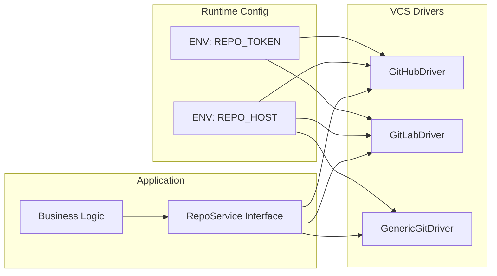

# Don't couple your Go code to GitHub

## Introduction

Most Go projects start life on GitHub. The `go.mod` file records a module path like `github.com/acme/widget`, CI pipelines pull a `GITHUB_TOKEN`, and release scripts call the GitHub API directly. It works—until you need to move the repository, run the same build on a self‑hosted GitLab instance, or satisfy a compliance rule that forbids any outbound call to `github.com`. At that point the hidden coupling becomes a migration project that can take weeks.

The good news is that Go’s module system, the standard library, and a thin abstraction layer are enough to keep the source code repository‑agnostic. In this article I walk through the concrete patterns we use in production to make a Go service portable across GitHub, GitLab, Gitea, Bitbucket, or any plain Git server.

## Why This Matters

* **Vendor lock‑in** – Hard‑coded import paths and GitHub‑specific API calls mean a simple rename or a policy change forces a full code rewrite.
* **CI brittleness** – Pipelines that embed `github.com` in `git clone` URLs or in `go get` commands break the moment the host changes.
* **Security & compliance** – Some environments prohibit any traffic to public SaaS endpoints. A portable code base can run entirely behind a firewall.
* **Operational flexibility** – Teams can experiment with self‑hosted tooling (e.g., a private Gitea for internal libraries) without touching application code.

When we migrated a micro‑service fleet from GitHub Enterprise to an on‑prem GitLab instance, the only files we touched were a handful of environment‑variable definitions and a small `vcs` package. The rest of the codebase—handlers, domain logic, tests—remained untouched.

## How It Works

The core idea is to treat the code host as a **pluggable implementation** behind a stable Go interface. The application depends only on the interface; a concrete driver (GitHub, GitLab, generic Git) is selected at start‑up via configuration.



1. **Configuration** – At process start we read `REPO_HOST` (e.g., `gitlab.internal`) and `REPO_TOKEN_ENV` (name of the env var that holds a PAT). No host name appears in source files.
2. **Factory** – A tiny factory function inspects `REPO_HOST` and returns the appropriate driver implementing `RepoService`.
3. **Business logic** – Calls `FetchLatestTag`, `Clone`, or any other operation through the interface. It never knows whether the call hits the GitHub REST API, the GitLab API, or a plain `git` binary.
4. **Drivers** – Each driver encapsulates the quirks of its target: pagination, authentication headers, URL schema, etc. Adding a new host is a matter of writing a new driver that satisfies the interface.

## Core Concepts

| Concept | Responsibility | Key Types |
|---------|----------------|-----------|
| **RepoService** | Minimal contract: tag discovery, shallow clone, optional archive download. | `interface { FetchLatestTag(ctx, owner, repo) (string, error); Clone(ctx, dst, url, ref) error }` |
| **Config** | Holds host, protocol, token‑env‑var, and optional TLS‑skip flag. | `struct { Host, Protocol, TokenEnvVar string; InsecureSkipTLS bool }` |
| **Driver** | Concrete implementation for a specific host. | `githubDriver`, `gitlabDriver`, `genericGitDriver` |
| **Factory** | Decouples driver selection from callers. | `func NewRepoService(cfg Config) RepoService` |
| **Module path generation** | Build‑time injection of the canonical import path via `-ldflags`. | `var modulePath string` set at link time. |

The `go.mod` file itself still needs a module declaration, but that declaration can be a **placeholder** (e.g., `module example.com/myapp`). The real import path is supplied at build time:

```bash
go build -ldflags="-X 'example.com/myapp/internal/version.ModulePath=gitlab.internal/team/myapp'" ./...
```

Because the placeholder never appears in source imports, the module can be fetched from any proxy that mirrors the repository.

## Examples & Code Walkthrough

Below is a compact, production‑ready implementation of the abstraction layer. It compiles with Go 1.22+ and has no external dependencies beyond the standard library.

### `vcs/config.go`

```go
package vcs

// Config captures everything a driver needs to reach a Git host.
// All fields are populated from environment variables at start‑up.
type Config struct {
	// Host is the domain name of the Git server (e.g., "gitlab.internal").
	Host string
	// Protocol defaults to "https". Override for "http" in air‑gapped labs.
	Protocol string
	// TokenEnvVar names the environment variable that holds a personal access token.
	TokenEnvVar string
	// InsecureSkipTLS disables certificate verification. Use only in controlled test nets.
	InsecureSkipTLS bool
}

// LoadConfig reads the standard env vars used across our fleet.
func LoadConfig() Config {
	return Config{
		Host:          getEnv("REPO_HOST", "github.com"),
		Protocol:      getEnv("REPO_PROTOCOL", "https"),
		TokenEnvVar:   getEnv("REPO_TOKEN_ENV", "GITHUB_TOKEN"),
		InsecureSkipTLS: getEnvBool("REPO_INSECURE_SKIP_TLS", false),
	}
}

func getEnv(key, fallback string) string {
	if v := os.Getenv(key); v != "" {
		return v
	}
	return fallback
}

func getEnvBool(key string, fallback bool) bool {
	if v := os.Getenv(key); v != "" {
		return v == "1" || v == "true"
	}
	return fallback
}
```

### `vcs/service.go`

```go
package vcs

import (
	"context"
	"crypto/tls"
	"encoding/json"
	"errors"
	"fmt"
	"net/http"
	"os"
	"os/exec"
	"path/filepath"
	"strings"
	"time"
)

// RepoService is the stable contract used by the rest of the codebase.
type RepoService interface {
	// FetchLatestTag returns the most recent semantic‑version tag for a repo.
	FetchLatestTag(ctx context.Context, owner, repo string) (string, error)
	// Clone performs a shallow clone of `repoURL` at `ref` into `dst`.
	Clone(ctx context.Context, dst, repoURL, ref string) error
}

// NewRepoService selects a driver based on the configured host.
func NewRepoService(cfg Config) RepoService {
	switch strings.ToLower(cfg.Host) {
	case "github.com", "github.enterprise":
		return &githubDriver{cfg: cfg}
	case "gitlab.com", "gitlab.internal":
		return &gitlabDriver{cfg: cfg}
	default:
		return &genericGitDriver{cfg: cfg}
	}
}
```

### `vcs/github_driver.go`

```go
package vcs

import (
	"context"
	"fmt"
	"net/http"
	"os"
	"strings"
	"time"
)

type githubDriver struct {
	cfg Config
}

// FetchLatestTag calls the GitHub REST API (v3) to list tags.
// The host is taken from cfg, so the same binary works against GitHub.com
// or a GitHub Enterprise instance.
func (g *githubDriver) FetchLatestTag(ctx context.Context, owner, repo string) (string, error) {
	base := fmt.Sprintf("%s://%s/api/v3", g.cfg.Protocol, g.cfg.Host)
	url := fmt.Sprintf("%s/repos/%s/%s/tags?per_page=1", base, owner, repo)

	req, err := http.NewRequestWithContext(ctx, http.MethodGet, url, nil)
	if err != nil {
		return "", fmt.Errorf("build request: %w", err)
	}
	if token := os.Getenv(g.cfg.TokenEnvVar); token != "" {
		req.Header.Set("Authorization", "token "+token)
	}
	req.Header.Set("Accept", "application/vnd.github.v3+json")

	client := httpClient(g.cfg.InsecureSkipTLS)
	resp, err := client.Do(req)
	if err != nil {
		return "", fmt.Errorf("http request: %w", err)
	}
	defer resp.Body.Close()

	if resp.StatusCode != http.StatusOK {
		return "", fmt.Errorf("unexpected status %d", resp.StatusCode)
	}

	var tags []struct {
		Name string `json:"name"`
	}
	if err := json.NewDecoder(resp.Body).Decode(&tags); err != nil {
		return "", fmt.Errorf("decode tags: %w", err)
	}
	if len(tags) == 0 {
		return "", errors.New("no tags found")
	}
	return tags[0].Name, nil
}

// Clone delegates to the `git` binary. The URL is assembled from cfg
// when the caller does not provide an explicit one.
func (g *githubDriver) Clone(ctx context.Context, dst, repoURL, ref string) error {
	if repoURL == "" {
		repoURL = fmt.Sprintf("%s://%s/%s/%s.git", g.cfg.Protocol, g.cfg.Host, dst, strings.TrimSuffix(dst, "-clone"))
	}
	return gitClone(ctx, dst, repoURL, ref)
}
```

### `vcs/gitlab_driver.go`

```go
package vcs

import (
	"context"
	"encoding/json"
	"fmt"
	"net/http"
	"os"
	"strings"
)

type gitlabDriver struct {
	cfg Config
}

// GitLab uses a different API shape: /api/v4/projects/:id/repository/tags
func (g *gitlabDriver) FetchLatestTag(ctx context.Context, owner, repo string) (string, error) {
	// Project path must be URL‑encoded.
	projectPath := fmt.Sprintf("%s%%2F%s", owner, repo)
	base := fmt.Sprintf("%s://%s/api/v4", g.cfg.Protocol, g.cfg.Host)
	url := fmt.Sprintf("%s/projects/%s/repository/tags?per_page=1", base, projectPath)

	req, err := http.NewRequestWithContext(ctx, http.MethodGet, url, nil)
	if err != nil {
		return "", fmt.Errorf("build request: %w", err)
	}
	if token := os.Getenv(g.cfg.TokenEnvVar); token != "" {
		req.Header.Set("PRIVATE-TOKEN", token)
	}
	req.Header.Set("Accept", "application/json")

	client := httpClient(g.cfg.InsecureSkipTLS)
	resp, err := client.Do(req)
	if err != nil {
		return "", fmt.Errorf("http request: %w", err)
	}
	defer resp.Body.Close()

	if resp.StatusCode != http.StatusOK {
		return "", fmt.Errorf("unexpected status %d", resp.StatusCode)
	}

	var tags []struct {
		Name string `json:"name"`
	}
	if err := json.NewDecoder(resp.Body).Decode(&tags); err != nil {
		return "", fmt.Errorf("decode tags: %w", err)
	}
	if len(tags) == 0 {
		return "", errors.New("no tags found")
	}
	return tags[0].Name, nil
}

func (g *gitlabDriver) Clone(ctx context.Context, dst, repoURL, ref string) error {
	if repoURL == "" {
		repoURL = fmt.Sprintf("%s://%s/%s/%s.git", g.cfg.Protocol, g.cfg.Host, dst, strings.TrimSuffix(dst, "-clone"))
	}
	return gitClone(ctx, dst, repoURL, ref)
}
```

### `vcs/generic_driver.go`

```go
package vcs

import (
	"context"
	"fmt"
	"os"
	"strings"
)

type genericGitDriver struct {
	cfg Config
}

// Generic driver assumes a plain Git server that only speaks the Git protocol.
// It cannot list tags via an API, so we fall back to `git ls-remote`.
func (g *genericGitDriver) FetchLatestTag(ctx context.Context, owner, repo string) (string, error) {
	repoURL := fmt.Sprintf("%s://%s/%s/%s.git", g.cfg.Protocol, g.cfg.Host, owner, repo)
	cmd := exec.CommandContext(ctx, "git", "ls-remote", "--tags", "--sort=-v:refname", repoURL)
	cmd.Env = append(os.Environ(), fmt.Sprintf("GIT_TERMINAL_PROMPT=0"))
	if token := os.Getenv(g.cfg.TokenEnvVar); token != "" {
		// Embed token in URL for HTTPS auth.
		repoURL = strings.Replace(repoURL, "://", "://"+token+"@", 1)
		cmd.Args = append(cmd.Args[:2], repoURL) // replace URL argument
	}
	out, err := cmd.Output()
	if err != nil {
		return "", fmt.Errorf("git ls-remote: %w", err)
	}
	lines := strings.Split(strings.TrimSpace(string(out)), "\n")
	if len(lines) == 0 {
		return "", errors.New("no tags returned")
	}
	// First line is the newest tag because of --sort=-v:refname
	parts := strings.Fields(lines[0])
	if len(parts) < 2 {
		return "", errors.New("unexpected ls-remote output")
	}
	return strings.TrimPrefix(parts[1], "refs/tags/"), nil
}

func (g *genericGitDriver) Clone(ctx context.Context, dst, repoURL, ref string) error {
	if repoURL == "" {
		repoURL = fmt.Sprintf("%s://%s/%s/%s.git", g.cfg.Protocol, g.cfg.Host, dst, strings.TrimSuffix(dst, "-clone"))
	}
	return gitClone(ctx, dst, repoURL, ref)
}
```

### `vcs/git_helpers.go`

```go
package vcs

import (
	"context"
	"os/exec"
	"path/filepath"
)

// gitClone runs a shallow clone with a specific ref.
// It creates the parent directory if it does not exist.
func gitClone(ctx context.Context, dst, repoURL, ref string) error {
	if err := os.MkdirAll(filepath.Dir(dst), 0o755); err != nil {
		return fmt.Errorf("mkdir parent: %w", err)
	}
	args := []string{"clone", "--depth", "1", "--branch", ref, repoURL, dst}
	cmd := exec.CommandContext(ctx, "git", args...)
	cmd.Env = append(os.Environ(), "GIT_TERMINAL_PROMPT=0")
	if out, err := cmd.CombinedOutput(); err != nil {
		return fmt.Errorf("git clone failed: %s: %w", string(out), err)
	}
	return nil
}

// httpClient returns a reusable HTTP client with optional TLS skip.
func httpClient(insecure bool) *http.Client {
	tr := &http.Transport{
		TLSClientConfig: &tls.Config{InsecureSkipVerify: insecure},
	}
	return &http.Client{Transport: tr, Timeout: 10 * time.Second}
}
```

### Wiring it up in `main.go`

```go
package main

import (
	"context"
	"fmt"
	"log"
	"os"
	"os/signal"
	"syscall"

	"example.com/myapp/internal/vcs"
)

func main() {
	ctx, stop := signal.NotifyContext(context.Background(), os.Interrupt, syscall.SIGTERM)
	defer stop()

	cfg := vcs.LoadConfig()
	svc := vcs.NewRepoService(cfg)

	// Example: fetch latest tag of an internal library.
	tag, err := svc.FetchLatestTag(ctx, "platform", "shared-lib")
	if err != nil {
		log.Fatalf("tag lookup failed: %v", err)
	}
	fmt.Printf("latest tag: %s\n", tag)

	// Example: clone a dependency at that tag into a temporary workspace.
	workDir := "/tmp/workspace/shared-lib"
	if err := svc.Clone(ctx, workDir, "", tag); err != nil {
		log.Fatalf("clone failed: %v", err)
	}
	fmt.Println("cloned to", workDir)
}
```

**What the code shows**

* **Zero hard‑coded host names** – All host information lives in `Config`.
* **Single public interface** – The rest of the program imports only `vcs.RepoService`.
* **Driver selection at runtime** – `NewRepoService` decides which implementation to use based on `REPO_HOST`.
* **Build‑time module path injection** – The `go.mod` can stay `module example.com/myapp`; the real import path is supplied via `-ldflags` during
