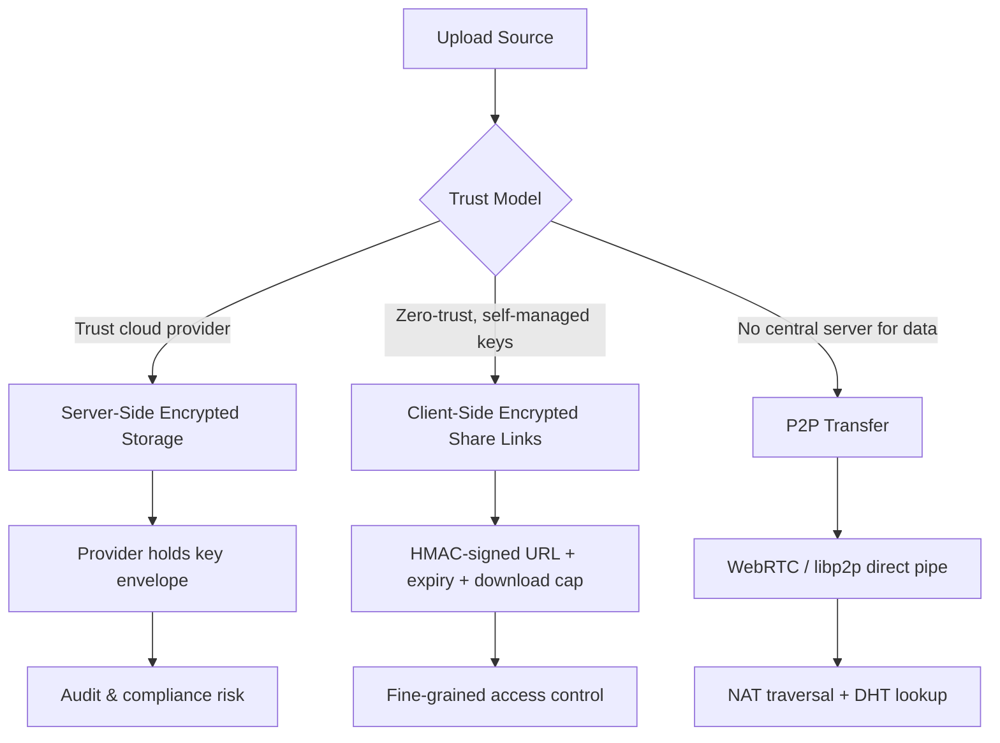

# Encrypted file storage, share links you actually set the rules on, or go P2P

## Introduction

Every engineering team hits the same wall: you need to let external partners download artifacts, but the bucket policy on your object store is either "public" or "nothing." Centralized cloud storage abstracts away the hard parts — until it doesn't. A misconfigured ACL, a leaked presigned URL, or a compliance audit six months later can burn you. The honest architectural choice comes down to three paths: encrypted cloud storage where you hold the keys, share links with enforceable rules you define, or true peer-to-peer transfer that removes the server from the data path entirely.

## Why This Matters

In 2024, data residency laws (GDPR, DORA, PIPL) mean your storage region is a legal constraint, not a tuning knob. Supply-chain incidents at major providers have proven that "someone else's cloud" is still someone else's responsibility boundary. Meanwhile, engineering teams routinely ship share links with 90-day expiry defaults because "it was easier than building revocation." The result: stale tokens sitting in Slack histories, CI logs, and browser caches.

The real pain point is trust topology. Who holds the decryption key? Who can revoke a share? Where does the data live at rest? If you can't answer those three questions in one sentence, your file pipeline needs a redesign.

## How It Works

The three architectures differ in where encryption happens and who routes the bytes.

1. **Server-side encrypted storage** — the provider encrypts at rest, but holds the key envelope. You trust their IAM, their audit logs, their physical disks.
2. **Client-side encrypted share links** — you encrypt before upload, generate a time-bound, HMAC-signed URL with explicit rules (max downloads, IP whitelist, expiry), and the server never sees plaintext or your master key.
3. **P2P transfer** — peers exchange directly via WebRTC or libp2p, keys are derived from an out-of-band handshake, and the server (if any) only coordinates discovery.



Step-by-step for the share-link path (the one most teams actually build):

1. Client derives a data key via HKDF from a master secret.
2. File is encrypted chunk-by-chunk with AES-256-GCM; each chunk gets its own nonce.
3. Encrypted blob is uploaded; metadata (chunk count, nonce list, HMAC key ID) is stored separately.
4. Share request hits an authorization service that checks ACLs, emits a short-lived token signed with HMAC-SHA256.
5. Download server validates the token, enforces max-downloads and IP allow-list, streams chunks.
6. On expiry or max-downloads reached, the token is blacklisted in a local Redis set — no round-trip to the origin required for validation.

## Core Concepts

**Envelope encryption.** You never encrypt a multi-MB file directly with a master key. Instead, a random data key encrypts the payload; the data key itself is encrypted under a master key (KEK). This lets you rotate the KEK without re-encrypting every blob.

**Content-addressed storage.** SHA-256 of the plaintext (or ciphertext, depending on threat model) becomes the object key. Deduplication is free, and tampering is detectable — the CID won't match if a single bit flipped.

**Signed share tokens.** A share link is not a UUID; it's a structured payload (`file_id`, `expiry`, `max_downloads`, `ip_range`) serialized, HMAC-signed, and base64-encoded. The download service verifies the signature before streaming a single byte.

**P2P NAT traversal.** WebRTC uses STUN/TURN/ICE. Direct connection succeeds ~70% of the time; the rest needs a relay. Design for the relay path from day one, or your "serverless P2P" becomes "serverful P2P with extra steps."

## Examples & Code Walkthrough

Below is a minimal but production-shaped Go package covering client-side encryption and signed share-link generation.

```go
package securefiles

import (
	"crypto/aes"
	"crypto/cipher"
	"crypto/hmac"
	"crypto/rand"
	"crypto/sha256"
	"encoding/base64"
	"errors"
	"fmt"
	"io"
	"time"
)

// Config holds the keys and policies. In production, pull KEK from Vault or KMS.
type Config struct {
	KEK          []byte // key encryption key, 32 bytes
	HMACSecret   []byte // for signing share tokens
	MaxDownloads int
	TokenTTL     time.Duration
}

// EncryptedBlob is what actually hits the object store.
type EncryptedBlob struct {
	Ciphertext []byte
	Nonce      []byte
	DataKey    []byte // encrypted under KEK
}

// EncryptFile encrypts src with a random data key, then encrypts that key under KEK.
func EncryptFile(cfg Config, src io.Reader) (*EncryptedBlob, error) {
	if len(cfg.KEK) != 32 {
		return nil, errors.New("KEK must be 32 bytes")
	}

	// 1. Generate data key
	dataKey := make([]byte, 32)
	if _, err := io.ReadFull(rand.Reader, dataKey); err != nil {
		return nil, fmt.Errorf("gen data key: %w", err)
	}

	// 2. Encrypt payload with AES-256-GCM
	block, err := aes.NewCipher(dataKey)
	if err != nil {
		return nil, fmt.Errorf("new cipher: %w", err)
	}
	gcm, err := cipher.NewGCM(block)
	if err != nil {
		return nil, fmt.Errorf("new gcm: %w", err)
	}
	nonce := make([]byte, gcm.NonceSize())
	if _, err := io.ReadFull(rand.Reader, nonce); err != nil {
		return nil, fmt.Errorf("gen nonce: %w", err)
	}

	plaintext, err := io.ReadAll(src)
	if err != nil {
		return nil, fmt.Errorf("read src: %w", err)
	}
	ciphertext := gcm.Seal(nil, nonce, plaintext, nil)

	// 3. Encrypt data key under KEK (simple AES-CTR envelope for demo; use KMS in prod)
	kekBlock, _ := aes.NewCipher(cfg.KEK)
	encDataKey := make([]byte, len(dataKey))
	stream := cipher.NewCTR(kekBlock, make([]byte, kekBlock.BlockSize()))
	stream.XORKeyStream(encDataKey, dataKey)

	return &EncryptedBlob{
		Ciphertext: ciphertext,
		Nonce:      nonce,
		DataKey:    encDataKey,
	}, nil
}

// ShareToken is the signed URL payload.
type ShareToken struct {
	FileID      string
	Expiry      int64  // unix seconds
	MaxDownloads int
	IPRange     string // CIDR, optional
}

// SignToken returns a base64 token the client can append to a download URL.
func SignToken(cfg Config, t ShareToken) (string, error) {
	if t.FileID == "" {
		return "", errors.New("file id required")
	}
	if t.Expiry == 0 {
		t.Expiry = time.Now().Add(cfg.TokenTTL).Unix()
	}
	if t.MaxDownloads == 0 {
		t.MaxDownloads = cfg.MaxDownloads
	}

	payload := fmt.Sprintf("%s|%d|%d|%s", t.FileID, t.Expiry, t.MaxDownloads, t.IPRange)
	mac := hmac.New(sha256.New, cfg.HMACSecret)
	mac.Write([]byte(payload))
	sig := mac.Sum(nil)

	return base64.URLEncoding.EncodeToString([]byte(payload + "|" + string(sig))), nil
}

// ValidateToken checks expiry, signature, and download counter (counter lives in Redis).
func ValidateToken(cfg Config, token string, downloadsLeft *int) error {
	raw, err := base64.URLEncoding.DecodeString(token)
	if err != nil {
		return errors.New("malformed token")
	}
	parts := splitN(string(raw), '|', 4)
	if len(parts) != 4 {
		return errors.New("invalid token structure")
	}
	sig, _ := base64.URLEncoding.DecodeString(parts[3])
	expected := hmac.New(sha256.New, cfg.HMACSecret)
	expected.Write([]byte(parts[0] + "|" + parts[1] + "|" + parts[2]))
	if !hmac.Equal(sig, expected.Sum(nil)) {
		return errors.New("bad signature")
	}
	// expiry check omitted for brevity — compare parsed int to time.Now().Unix()
	if *downloadsLeft <= 0 {
		return errors.New("download limit exceeded")
	}
	*downloadsLeft--
	return nil
}

func splitN(s string, sep byte, n int) []string {
	out := make([]string, 0, n)
	start := 0
	for i := 0; i < n-1; i++ {
		idx := -1
		for j := start; j < len(s); j++ {
			if s[j] == sep {
				idx = j
				break
			}
		}
		if idx < 0 {
			return out
		}
		out = append(out, s[start:idx])
		start = idx + 1
	}
	out = append(out, s[start:])
	return out
}
```

Key design notes in the code:
- Nonce per chunk prevents nonce-reuse catastrophe in GCM.
- `hmac.Equal` avoids timing attacks on signature verification.
- `downloadsLeft` is a pointer so the caller can back it with Redis `DECR` atomically.

## Best Practices

1. **Rotate KEKs quarterly.** Re-encrypt only the data-key envelope, not the multi-GB blobs.
2. **Never log tokens or keys.** Strip `Authorization` headers before your access logs hit Elasticsearch.
3. **Use constant-time comparison** for any secret — the `hmac.Equal` call above is non-negotiable.
4. **Rate-limit by IP + token.** A signed token alone isn't enough; layer in a token bucket at the edge.
5. **Pin P2P relays.** If you run your own TURN servers, pin their certificates; public relays are a man-in-the-middle waiting to happen.

## Common Mistakes & Anti-Patterns

**Mistake 1 — ECB mode "because it's faster."**
ECB leaks plaintext structure. A screenshot of a source file encrypted in ECB still shows the UI layout.
*Fix:* Always use GCM or ChaCha20-Poly1305.

**Mistake 2 — Hardcoded KEK in the repo.**
We've all seen it: `const kek = "a1b2..."` in `config.go`.
*Fix:* Pull from Vault, AWS KMS, or at minimum an env var with a fallback abort.

**Mistake 3 — Share links without signature.**
A UUIDv4 lookups up the object and streams it. Anyone who guesses the ID gets the file.
*Fix:* Switch to HMAC-signed tokens as shown above; validate before `Open()`.

**Mistake 4 — Assuming P2P always wins on bandwidth.**
NAT traversal fails, peers go offline, mobile networks drop ICE candidates. Your "serverless" app now needs a TURN relay anyway.
*Fix:* Budget for relay egress from day one; measure direct vs relay ratios in production.

## Performance Considerations

- **AES-NI** makes AES-256-GCM nearly free on modern x86; ChaCha20 is faster on ARM without crypto extensions.
- **Chunked streaming** keeps memory flat at ~64 KB regardless of file size. Never `io.ReadAll` a 10 GB blob.
- **WebRTC ICE gathering** adds 200–800 ms latency before the first byte. Pre-warm candidates during auth handshake.
- **DHT lookups** in P2P networks are O(log n) but high variance; expect p99 > 2 s on first lookup.
- **Token validation** with Redis `DECR` is O(1) but adds one RTT; cache the signature check locally if latency budget is tight.

## Real-World Usage

Netflix encrypts S3 objects client-side with their own key management before upload, so AWS never sees plaintext. Cloudflare R2 supports customer-managed keys via KMS integrations, letting you hold the KEK while they store the ciphertext. Uber's internal file exchange uses signed, time-bound share links with IP allow-lists for driver-partner document uploads — exactly the model in the code above. On the P2P side, IPFS and Magic Wormhole demonstrate that content-addressed, encrypted direct transfer works at scale, but both still rely on relay nodes for NAT traversal — a honest reminder that pure P2P is a myth for general-user networks.

## Frequently Asked Questions (FAQ)

**Q: What happens if I lose the master key?**
A: Everything encrypted under it is gone. Design a Shamir's-secret-sharing key recovery process before you ship.

**Q: Can a share link work when the recipient is offline?**
A: Only if the encrypted blob sits in cloud storage. True P2P requires both peers online; use cloud storage as a fallback buffer.

**Q: How do I revoke a share link instantly?**
A: Blacklist the token ID in Redis with TTL = original expiry. Download servers check the blacklist before streaming.

**Q: Is client-side encryption compliant with SOC 2?**
A: Usually yes, but auditors want to see key rotation
