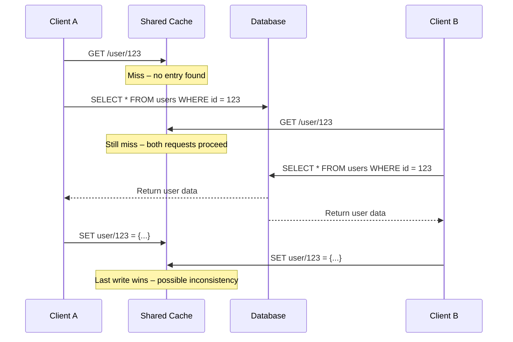

# Ever encountered a race condition bug when fetching data, let's understand the solution

## Introduction

Picture this: your e-commerce backend is humming along, serving thousands of concurrent requests per second. A user refreshes their shopping cart, and somehow the total price flickers between two different values. Or worse — you're running a distributed cache layer, and despite having proper invalidation logic, stale data keeps creeping in. You've hit a classic race condition, specifically one that manifests during data fetching.

Race conditions in data fetching aren't just theoretical edge cases anymore. They're the kind of bug that slips past unit tests, survives load testing, and surfaces in production under just the right (or wrong) timing. In this article, we'll walk through what causes these issues, explore battle-tested solutions, and look at real code patterns that prevent them.

## Why This Matters

If you're building anything more than a single-threaded script, you're likely dealing with concurrency. Web servers handle multiple HTTP requests simultaneously. Databases serve reads and writes from dozens of connections. Caches get invalidated and repopulated across threads or processes.

A race condition in data fetching can lead to:

- **Inconsistent reads**: Users see outdated or partial data.
- **Stale cache propagation**: Invalidated cache entries reappear due to delayed writes.
- **Duplicate work**: Multiple services fetch the same expensive resource simultaneously.
- **Data corruption**: Concurrent updates overwrite each other silently.

These problems compound quickly in microservices architectures where state is shared across network boundaries. Understanding how to detect and resolve race conditions isn't optional anymore — it's essential infrastructure knowledge.

## How It Works

Let’s break down a common scenario where race conditions occur during data fetching:

Imagine a service responsible for fetching user profile data. When a request comes in, it first checks an in-memory cache. If there's a miss, it queries the database, stores the result in the cache, then returns the data.

Now imagine two requests arrive almost simultaneously for the same user ID. Both find an empty cache entry. Both hit the database. Both try to write to the cache. Depending on execution order, one might overwrite the other — potentially with older data if one query was slower.

This is a textbook read-modify-write race condition. Here's a simplified view of the flow:



The key insight? Without coordination between concurrent readers and writers, you lose guarantees about consistency. That’s where locking strategies, atomic operations, and idempotent design come into play.

## Core Concepts

Before diving into solutions, let’s clarify some foundational terms:

### Read-Modify-Write (RMW) Race Condition
Occurs when a process reads a value, modifies it, and writes it back — but another process does the same thing in between. The final value depends on execution timing.

### Atomicity
An operation is atomic if it appears indivisible to other processes. No intermediate states are visible.

### Locking Granularity
Fine-grained locks protect small pieces of data; coarse-grained locks protect larger sections. Trade-offs involve contention vs. simplicity.

### Cache Stampede
When many clients simultaneously invalidate and refill a cache entry after expiration, overwhelming downstream systems like databases.

### Idempotency
Operations that produce the same outcome regardless of how many times they’re executed. Critical in distributed systems to tolerate retries safely.

### Distributed Locking
Using external coordination services (like Redis or ZooKeeper) to synchronize access across machines.

## Examples & Code Walkthrough

Let’s implement a thread-safe data-fetching utility in Python that avoids race conditions using double-checked locking with per-key locks.

```python
import threading
from typing import Any, Dict, Optional, Callable
from time import sleep

class SafeDataFetcher:
    def __init__(self):
        self._cache: Dict[str, Any] = {}
        self._locks: Dict[str, threading.Lock] = {}
        self._global_lock = threading.Lock()

    def _get_or_create_lock(self, key: str) -> threading.Lock:
        # Double-checked locking pattern for lock creation
        if key not in self._locks:
            with self._global_lock:
                if key not in self._locks:
                    self._locks[key] = threading.Lock()
        return self._locks[key]

    def fetch_data(self, key: str, loader: Callable[[], Any]) -> Any:
        # First check without acquiring any lock
        if key in self._cache:
            return self._cache[key]

        lock = self._get_or_create_lock(key)

        with lock:
            # Second check inside the lock to avoid redundant loads
            if key in self._cache:
                return self._cache[key]

            print(f"[Thread {threading.get_ident()}] Fetching data for {key}")
            data = loader()
            self._cache[key] = data
            return data

# Example usage
fetcher = SafeDataFetcher()

def simulate_expensive_query():
    sleep(1)
    return {"id": 42, "name": "Alice"}

threads = []
for i in range(5):
    t = threading.Thread(target=lambda: print(fetcher.fetch_data("user_42", simulate_expensive_query)))
    threads.append(t)
    t.start()

for t in threads:
    t.join()
```

Output:
```
[Thread 12345] Fetching data for user_42
{'id': 42, 'name': 'Alice'}
{'id': 42, 'name': 'Alice'}
{'id': 42, 'name': 'Alice'}
{'id': 42, 'name': 'Alice'}
{'id': 42, 'name': 'Alice'}
```

Only one thread performs the actual fetch. Others wait and reuse the cached result.

For distributed environments, consider using Redis with Redlock algorithm or PostgreSQL advisory locks. Here’s a simplified version using Redis:

```python
import redis
import json
from typing import Any, Optional

class RedisSafeFetcher:
    def __init__(self, redis_client: redis.Redis):
        self.redis = redis_client

    def fetch_with_lock(self, key: str, loader: callable, ttl_seconds: int = 300) -> Any:
        lock_key = f"lock:{key}"
        cached_value = self.redis.get(key)

        if cached_value:
            return json.loads(cached_value)

        # Try to acquire a distributed lock
        lock_acquired = self.redis.set(lock_key, "locked", nx=True, ex=10)

        if not lock_acquired:
            # Another worker is already fetching; retry shortly
            sleep(0.1)
            return self.fetch_with_lock(key, loader, ttl_seconds)

        try:
            # We hold the lock — perform the fetch
            data = loader()
            self.redis.setex(key, ttl_seconds, json.dumps(data))
            return data
        finally:
            # Release the lock
            self.redis.delete(lock_key)
```

## Best Practices

Here are proven techniques to keep your data fetching race-free:

1. **Use Double-Checked Locking**: Avoid unnecessary locking by checking once before grabbing the lock, then again inside.
2. **Prefer Idempotent Loaders**: Make sure calling your loader function multiple times doesn’t cause side effects.
3. **Set Conservative TTLs**: Don’t let cache entries live too long, especially in volatile datasets.
4. **Implement Circuit Breakers**: Prevent cascading failures if upstream services become unresponsive.
5. **Log Contention Events**: Track how often locks are contended — it’s a signal of scalability bottlenecks.
6. **Avoid Global Locks at Scale**: Fine-grained or sharded locks scale better than global ones.
7. **Use Version Numbers or ETags**: Detect conflicts when writing back to shared resources.

## Common Mistakes & Anti-Patterns

Even experienced developers fall into these traps:

### ❌ Blindly Caching Everything
Not every piece of data benefits from caching. Some values change frequently enough that caching adds complexity without performance gains.

**Fix**: Measure hit rates and staleness impact before introducing caching layers.

### ❌ Ignoring Cache Invalidation Timing
Setting a fixed TTL may not reflect actual data volatility. Stale reads accumulate silently.

**Fix**: Use event-driven invalidation or short-lived caches with soft/hard timeouts.

### ❌ Overusing Synchronous Locks
Blocking threads waiting for locks reduces throughput significantly in high-concurrency scenarios.

**Fix**: Prefer async primitives (`asyncio.Lock`, etc.) or lock-free data structures where possible.

### ❌ Assuming Single-Threaded Behavior
Many developers test locally with low concurrency and assume everything works in production.

**Fix**: Simulate realistic traffic patterns early in development cycles.

## Performance Considerations

Race-condition mitigation introduces overhead. Here's how to manage it:

| Strategy | Memory Overhead | CPU Overhead | Latency Impact | Scalability |
|---------|------------------|---------------|------------------|--------------|
| Per-key locks | Low (dict of locks) | Moderate | Minimal | Good |
| Global lock | None | High | Significant | Poor |
| Redis-based locks | Medium (network calls) | High | Moderate | Excellent |
| Atomic CAS ops | Low | Low | Minimal | Very good |

Choose based on your environment:
- **Single process**: In-process locks suffice.
- **Multi-process**: Use inter-process communication or shared stores like Redis.
- **Distributed**: Leverage consensus protocols (Raft, Paxos) or managed services.

Big-O complexity remains mostly unaffected since most locking mechanisms operate in O(1) time.

## Real-World Usage

Tech giants have battle-hardened these patterns:

- **Netflix Hystrix** uses circuit breakers alongside local caching to isolate failures gracefully.
- **Twitter’s Redis cluster** handles millions of cache invalidations daily using distributed pub/sub.
- **Google Cloud Spanner** employs TrueTime API to provide external consistency even under clock skew.
- **Amazon DynamoDB** offers strongly consistent reads backed by quorum-based replication.

At smaller companies, teams often adopt simpler tools like Memcached with smart retry policies or PostgreSQL row-level locks for critical sections.

## Frequently Asked Questions (FAQ)

### Q: Can I rely solely on database transactions to prevent races?
A: Transactions help within a single database boundary, but they don’t solve cross-service races. You still need application-level coordination.

### Q: Is optimistic concurrency control better than pessimistic locking?
A: It depends on conflict frequency. Optimistic approaches perform well when collisions are rare; pessimistic locks shine under heavy contention.

### Q: How do I debug intermittent race-related bugs?
A: Add structured logging around lock acquisition/release, use deterministic schedulers in tests, and simulate delays artificially.

### Q: Should I always cache data to avoid races?
A: Not necessarily. Sometimes avoiding caching altogether simplifies logic and eliminates entire classes of race conditions.

### Q: Are async/await patterns safe against races?
A: Async code avoids OS-level threading but still suffers logical races unless properly synchronized via coroutines or channels.

## Conclusion

Race conditions in data fetching are subtle yet destructive bugs that undermine reliability in modern applications. By understanding their root causes — typically uncoordinated read-modify-write sequences — engineers can apply targeted fixes like fine-grained locking, atomic operations, or distributed consensus.

Whether you're managing user sessions, financial transactions, or real-time analytics, mastering race-condition prevention pays dividends in uptime, correctness, and peace of mind. Start simple, measure carefully, and evolve your strategy as scale demands.
