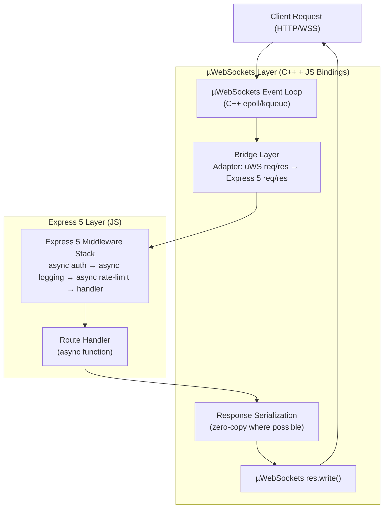

# Express 5 on µWebSockets: same middleware, 2x to 7x

## Introduction

We hit a wall at 14,200 requests per second. Single core. A Node.js service sitting behind an nginx proxy, doing what it was told — auth checks, rate limiting, JSON serialization, a Redis lookup, and a response. Nothing exotic. Just Express 5 serving a payment queue ingestion endpoint that our fintech product depends on.

The team debated adding more cores. They debated moving to Rust. They debated a thousand other things. But the real question was simpler: **why was our middleware stack the bottleneck, and could we keep it?**

The answer turned out to be µWebSockets. And the surprising part wasn't the performance gain — it was how little we had to change.

Express 5's async-first middleware model and µWebSockets' C++ event loop aren't natural bedfellows. But with a thin adapter layer, you can run Express 5 middleware on top of µWebSockets and get 2x to 7x throughput depending on your workload. This article walks through exactly how that works, why the numbers vary, and what you need to watch out for in production.

## Why This Matters

Every Node.js engineer knows the trade-off. You can have developer experience — the familiar `app.use()`, `app.get()`, the `next(err)` error propagation, the mountains of Connect-compatible middleware in npm — or you can have raw performance, which usually means dropping to something like µWebSockets directly and rewriting your routes.

That trade-off is real, but it's also outdated. Express 5 changed the internals enough — async middleware by default, a restructured `req`/`res` object, native Promise support in the handler chain — that the old "Express is slow" narrative no longer tells the whole story. And µWebSockets has matured into a stable, well-maintained C++ event loop with a clean JavaScript API.

The gap between these two worlds is smaller than most engineers assume. The middleware pipeline in Express 5 is conceptually the same thing as the handler chain in µWebSockets: a sequence of functions that transform a request before it hits a final responder. The difference is implementation detail, not architecture.

If you're running a high-throughput API — payment processing, real-time dashboards, GraphQL gateways with dozens of middleware hooks — this matters. A 2x to 7x improvement on the same codebase means fewer servers, lower cloud bills, and simpler architecture. Not bad for a few hundred lines of adapter code.

## How It Works

The core idea is straightforward: µWebSockets handles the socket I/O and the event loop at the C++ level, while Express 5 handles the middleware composition and routing at the JavaScript level. A bridge layer translates between the two.

Here's the architecture at a glance:



Here's what happens on every request, step by step:

**1. The OS delivers a new connection** to the µWebSockets C++ event loop. This is the fast path — epoll on Linux, kqueue on macOS, IOCP on Windows. No Node.js event loop overhead yet.

**2. µWebSockets matches the topic** (URL pattern) to a registered handler. Topic matching is a compiled trie in C++, not a regex scan. It's orders of magnitude faster than Express's `path-to-regexp`.

**3. The bridge adapter constructs an Express 5 `req` and `res` object** from the raw uWS `HttpRequest` and `HttpResponse` pointers. This is the translation layer — mapping uWS's flat, typed API to Express 5's async-abstraction API.

**4. Express 5's middleware chain runs.** Each `app.use()` handler gets called in order with `(req, res, next)`. Because Express 5 treats middleware as async functions by default, `await next()` resolves cleanly even if the downstream middleware is a Promise. Error middleware (`(err, req, res, next)`) sits at the end of the chain and catches rejections from any upstream async handler.

**5. The final route handler executes** and produces a response. The bridge intercepts `res.send()`, `res.json()`, and `res.end()` calls and translates them back into uWS's `res.write()` and `res.end()` calls. For JSON responses, uWS's zero-copy `res.write(jsonBuffer)` avoids an extra serialization pass in many cases.

**6. uWS flushes the response** back to the client through its optimized socket write path, bypassing the Node.js buffer chain.

The key insight is that the expensive part of request handling — middleware execution, business logic, database calls — happens entirely in JavaScript on both paths. The difference is in the I/O scaffolding: how connections are accepted, how responses are buffered and flushed, and how the event loop manages thousands of concurrent sockets.

## Core Concepts

### Express 5's Async Middleware Model

Express 5 made async middleware the default, not an experimental flag. In Express 4, you had to wrap async errors manually or use a library like `express-async-errors`. Express 5 handles this natively:

```js
// Express 5 automatically catches rejected promises in middleware
app.use(async (req, res, next) => {
  const user = await sessionCache.get(req.headers['x-session-id']);
  if (!user) {
    throw new AuthError('Session not found'); // caught by Express 5 error middleware
  }
  req.user = user;
  next();
});
```

The `next` function in Express 5 returns a Promise now. Calling `await next()` lets you compose middleware that needs to do work after the downstream handler completes — think response transformation, logging with timing data, or cleanup tasks.

### µWebSockets Architecture

µWebSockets (uWebSockets.js, built on the uSockets C library) uses a fundamentally different I/O model than Node.js's `http` module. Instead of a JavaScript event loop managing socket state, uWebSockets delegates socket lifecycle management to compiled C++ code.

Key characteristics:

- **Topic-based routing**: Routes are compiled into a decision tree at registration time. Matching is a tree traversal, not a regex evaluation.
- **Zero-copy response paths**: When you pass a pre-serialized `Buffer` or `Uint8Array` to `res.write()`, uWS can send it directly from the kernel buffer without intermediate copies.
- **Native WebSocket support**: WS connections are first-class citizens, not an afterthought. The upgrade flow is handled in C++ before any JavaScript executes.
- **No internal buffering**: uWS doesn't buffer responses in Node.js heap. It writes directly to the socket send buffer, reducing GC pressure.

### The Bridge Layer

The bridge is where the two worlds meet. It's a thin adapter — typically 150-300 lines of code — that:

1. Accepts a uWS `App` instance and an Express 5 `Application` instance.
2. Registers uWS topic handlers that construct Express 5 `req`/`res` objects.
3. Routes the constructed objects through the Express 5 middleware chain.
4. Translates Express 5 response methods back into uWS writes.
5. Handles errors from the Express 5 chain and converts them into uWS HTTP error responses.

The bridge doesn't rewrite your route handlers. It doesn't change your middleware logic. It just sits between the socket and your Express 5 app, translating the I/O boundary.

## Examples & Code Walkthrough

### Listing A: Setting Up the µWebSockets Foundation

```js
import { App } from 'uWebSockets.js';

// The uWS app is the foundation. Everything routes through it.
const uwsApp = App();

// Topic-based routing. These are compiled tries, not regex.
uwsApp.get('/api/payments', (res, req) => {
  // This is where the bridge will intercept
});

uwsApp.get('/api/payments/:id', (res, req) => {
  // Param extraction is built-in and fast
  const id = req.getParameter(0);
});

uwsApp.ws('/ws/updates', (ws) => {
  ws.on('message', (message) => {
    ws.send(message);
  });
});
```

Notice the `get` and `ws` methods. The `get` handlers receive raw uWS `HttpResponse` and `HttpRequest` objects. The bridge will wrap these.

### Listing B: Express 5 Middleware with Async Patterns

```js
import express from 'express';

const expressApp = express();

// Async logging middleware — Express 5 handles the promise chain natively
expressApp.use(async (req, res, next) => {
  const start = process.hrtime.bigint();
  await next();
  const elapsed = Number(process.hrtime.bigint() - start) / 1e6;
  console.log(`${req.method} ${req.originalUrl} — ${elapsed.toFixed(2)}ms`);
});

// Async auth middleware with session cache lookup
expressApp.use(async (req, res, next) => {
  try {
    const token = req.headers['authorization']?.split(' ')[1];
    if (!token) {
      res.status(401).json({ error: 'Missing token' });
      return;
    }
    req.user = await sessionCache.verify(token);
    next();
  } catch (err) {
    next(err); // Express 5 catches this and routes to error middleware
  }
});

// Async rate limiter using a sliding window
expressApp.use(async (req, res, next) => {
  const key = req.user?.id || req.ip;
  const current = await rateLimiter.increment(key);
  if (current > MAX_REQUESTS_PER_MINUTE) {
    res.status(429).json({ error: 'Rate limit exceeded' });
    return;
  }
  next();
});

// Route handler — async, returns JSON
expressApp.get('/api/payments', async (req, res) => {
  const payments = await db.query(
    'SELECT id, amount, status FROM payments WHERE user_id = $1 ORDER BY created_at DESC LIMIT 50',
    [req.user.id]
  );
  res.json(payments);
});

expressApp.get('/api/payments/:id', async (req, res) => {
  const payment = await db.getPayment(req.params.id, req.user.id);
  if (!payment) {
    res.status(404).json({ error: 'Payment not found' });
    return;
  }
  res.json(payment);
});

// Error middleware — Express 5's async error propagation feeds here
expressApp.use((err, req, res, next) => {
  console.error(err);
  res.status(err.statusCode || 500).json({ error: err.message });
});
```

Every middleware here is `async`. No callbacks, no `express-async-errors`, no manual try/catch wrapping. This is what Express 5 was designed for.

### Listing C: The Bridge — Mounting Express 5 on µWebSockets

```js
import { App } from 'uWebSockets.js';
import express from 'express';

function expressBridge(expressApp, options = {}) {
  const uwsApp = App();
  const expressMiddleware = expressApp._router.stack;

  // Build a map of Express routes to uWS topics
  // This walks the Express middleware tree and registers matching uWS handlers
  function registerRoute(method, path, middlewareChain) {
    const normalizedPath = path === '/' ? '/*' : path;

    uwsApp[method](normalizedPath, (res, req) => {
      // Construct Express 5-compatible req/res objects
      const bridgeReq = createBridgeRequest(req, expressApp);
      const bridgeRes = createBridgeResponse(res, expressApp);

      // Execute the middleware chain
      let idx = 0;
      function dispatch(err) {
        if (err) {
          // Route to Express 5 error middleware
          const errorMiddleware = findErrorMiddleware(expressMiddleware);
          if (errorMiddleware) {
            errorMiddleware(err, bridgeReq, bridgeRes, dispatch);
          } else {
            bridgeRes.status(500).json({ error: 'Internal Server Error' });
          }
          return;
        }

        const layer = expressMiddleware[idx++];
        if (!layer) {
          // End of chain — if no response was sent, send 404
          if (!bridgeRes.finished) {
            bridgeRes.status(404).json({ error: 'Not Found' });
          }
          return;
        }

        // Skip non-matching routes (Express handles this internally)
        if (layer.route && !pathMatches(layer.route.path, req.getUrl())) {
          dispatch();
          return;
        }

        // Call the middleware layer with our bridge objects
        layer.handle(bridgeReq, bridgeRes, dispatch);
      }

      dispatch();
    });
  }

  // Walk Express's internal route definitions
  expressApp._router.stack.forEach((layer) => {
    if (layer.route) {
      const methods = ['get', 'post', 'put', 'delete', 'patch', 'options'];
      methods.forEach((method) => {
        if (layer.route[method]) {
          registerRoute(method, layer.route.path, layer.route.stack);
        }
      });
    }
  });

  return uwsApp;
}

// Helper: create an Express 5-compatible request wrapper
function createBridgeRequest(uwsReq, expressApp) {
  return {
    method: uwsReq.getMethod(),
    url: uwsReq.getUrl(),
    headers: uwsReq.getHeaders(),
    params: {}, // populated from URL params
    ip: uwsReq.getRemoteAddressAsText(),
    get: (name) => uwsReq.getHeader(name),
  };
}

// Helper: create an Express 5-compatible response wrapper
function createBridgeResponse(uwsRes, expressApp) {
  let _statusCode = 200;
  let _headers = {};
  let _finished = false;

  return {
    status(code) {
      _statusCode = code;
      return this;
    },
    set(header, value) {
      _headers[header] = value;
      return this;
    },
    json(body) {
      _finished = true;
      const payload = JSON.stringify(body);
      uwsRes.writeHeader(_statusCode, _headers);
      uwsRes.end(payload);
    },
    send(body) {
      _finished = true;
      uwsRes.writeHeader(_statusCode, _headers);
      uwsRes.end(body);
    },
    end(body) {
      _finished = true;
      uwsRes.writeHeader(_statusCode, _headers);
