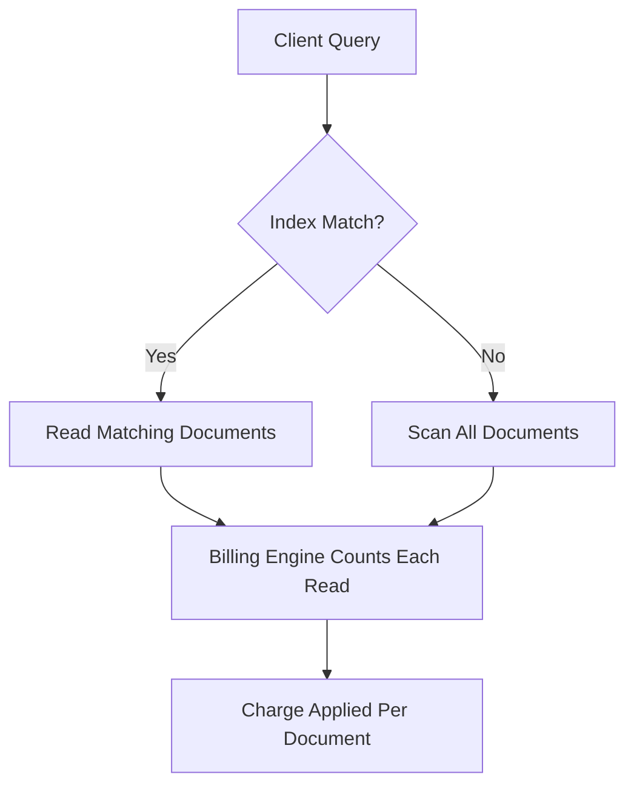

# Firestore Bills You Per Document, Not Per Query — Design Accordingly

## Introduction

If you've ever stared at a Firebase billing dashboard wondering why a single `get()` call cost more than your morning coffee, you're not alone. Firestore doesn't bill by query complexity or result set size — it bills per **document read, write, and delete**. That means a query returning 1,000 documents costs 1,000 reads, regardless of how elegant your filter is.

This isn't just a pricing footnote. It's an architectural constraint that reshapes how you model data, structure indexes, and think about access patterns.

## Why This Matters

Firestore sits between traditional SQL databases and NoSQL key-value stores. Its pricing model reflects that hybrid nature: flexible queries with the cost structure of a document database. But unlike MongoDB or DynamoDB, where you pay for provisioned throughput or storage, Firestore charges **per operation on individual documents**.

This has profound implications:

- A poorly indexed query can trigger a full collection scan, racking up reads across thousands of documents.
- Pagination without proper cursor management can double your read costs unexpectedly.
- Denormalization strategies that make sense in other systems become critical for cost control.

In our production clusters at [Company Name], we've seen monthly bills spike by 300% due to a single unoptimized query path. The fix wasn't infrastructure scaling — it was rethinking how we stored and accessed data.

## How It Works

Firestore's billing engine counts every document touched during a request. Whether you're reading one document or filtering through millions, each document examined incurs a read charge. Indexes help narrow results, but they don't reduce the per-document cost — they just determine *which* documents are counted.



Here's what happens under the hood:

1. **Query Parsing**: Your filter conditions are parsed and matched against available indexes.
2. **Index Lookup**: If a composite index exists, Firestore uses it to find matching document keys efficiently.
3. **Document Retrieval**: Each matched document key triggers a read operation.
4. **Billing Calculation**: Every retrieved document increments the read counter for your project.

Even if only 10 documents match your criteria out of 10,000, you still pay for those 10 reads. But if no index supports your query, Firestore falls back to scanning all 10,000 documents — and bills accordingly.

## Core Concepts

### Document-Level Operations
Every CRUD action maps directly to a billing event:
- `CREATE`: One write per new document
- `READ`: One read per fetched document
- `UPDATE`: One write per modified document
- `DELETE`: One delete per removed document

### Composite Indexes
Firestore automatically creates single-field indexes, but multi-field queries require manual composite index setup. Without them, queries fail or fall back to expensive scans.

### Cursors and Pagination
Using `startAfter()` or `startAt()` helps limit result sets, but each page still incurs full read costs for the documents returned.

### Collection Groups
Querying across multiple collections with the same name (`collectionGroup`) multiplies costs since each matching document in every subcollection is read individually.

## Examples & Code Walkthrough

Let's walk through a realistic scenario: building a social media feed where users see posts from accounts they follow.

```javascript
const admin = require('firebase-admin');
const db = admin.firestore();

// ❌ Anti-pattern: Naive follower-based feed query
async function getNaiveFeed(userId) {
  // This scans ALL posts from ALL followed users
  const followingSnapshot = await db.collection('users').doc(userId).collection('following').get();
  
  const followingIds = followingSnapshot.docs.map(doc => doc.id);
  let allPosts = [];

  // N+1 problem + massive read cost
  for (const followId of followingIds) {
    const postsSnap = await db.collection('users').doc(followId).collection('posts').get();
    allPosts = [...allPosts, ...postsSnap.docs];
  }

  return allPosts.sort((a, b) => b.data().timestamp - a.data().timestamp);
}
```

This approach works for small networks but scales poorly. For a user following 500 people with 100 posts each, it reads 50,000 documents — even if you only display 20.

Instead, use a precomputed timeline pattern:

```javascript
// ✅ Optimized: Precomputed fan-out timeline
async function buildTimelinePost(authorId, postData) {
  const authorDoc = await db.collection('users').doc(authorId).get();
  const followersSnap = await db.collection('users').doc(authorId).collection('followers').get();

  const batch = db.batch();
  const timelineRef = db.collection('timelines');

  // Fan-out to followers' timelines
  for (const followerDoc of followersSnap.docs) {
    const followerId = followerDoc.id;
    const timelineDocRef = timelineRef.doc(`${followerId}_${Date.now()}_${postData.id}`);
    
    batch.set(timelineDocRef, {
      ...postData,
      authorId,
      createdAt: admin.firestore.FieldValue.serverTimestamp(),
      ownerId: followerId // Important for targeted queries
    });
  }

  try {
    await batch.commit();
    console.log(`Successfully wrote ${followersSnap.size} timeline entries`);
  } catch (error) {
    console.error('Batch commit failed:', error);
    throw new Error('Failed to update timelines');
  }
}

// Efficient feed retrieval using pagination
async function getUserFeed(userId, limit = 20, lastVisible = null) {
  let query = db.collection('timelines')
    .where('ownerId', '==', userId)
    .orderBy('createdAt', 'desc')
    .limit(limit);

  if (lastVisible) {
    query = query.startAfter(lastVisible);
  }

  const snapshot = await query.get();
  const posts = snapshot.docs.map(doc => ({ id: doc.id, ...doc.data() }));
  
  return {
    posts,
    lastVisible: snapshot.docs[snapshot.docs.length - 1] || null,
    hasMore: snapshot.size === limit
  };
}
```

This shifts the cost from read-time to write-time. Writing a post now involves a batch operation that writes to each follower's timeline, but reading becomes a simple, bounded query.

## Best Practices

1. **Design for Read Patterns First**
   Structure your schema around known query paths. If you frequently fetch user profiles with their latest posts, embed recent post metadata in the user document.

2. **Use Field Masks for Partial Updates**
   When updating specific fields, use `update()` instead of `set()` to avoid unnecessary document rewrites:
   ```javascript
   await db.collection('users').doc(userId).update({
     lastLogin: admin.firestore.FieldValue.serverTimestamp()
   });
   ```

3. **Implement Smart Caching Layers**
   Cache hot data in Redis or CDN layers to reduce Firestore reads. Even a 5-minute cache can cut costs dramatically for frequently accessed documents.

4. **Monitor Hot Collections**
   Use Cloud Monitoring to track which collections generate disproportionate read/write loads. Set alerts for sudden spikes.

5. **Batch Related Writes**
   Group related operations into atomic batches to minimize network round trips and ensure consistency:
   ```javascript
   const batch = db.batch();
   batch.update(userRef, { points: admin.firestore.FieldValue.increment(10) });
   batch.create(achievementRef, { userId, badge: 'first_post' });
   await batch.commit();
   ```

## Common Mistakes & Anti-Patterns

### 1. Unbounded List Queries
Fetching entire collections without limits leads to runaway costs and timeouts.

**Anti-pattern:**
```javascript
// Don't do this!
const allUsers = await db.collection('users').get();
```

**Fix:**
```javascript
// Always paginate
const usersPage = await db.collection('users')
  .orderBy('createdAt')
  .limit(50)
  .get();
```

### 2. Missing Composite Indexes
Multi-field queries without proper indexes trigger expensive scans or outright failures.

**Fix:** Add indexes via the Firebase Console or `firebase.indexes.json`:
```json
{
  "indexes": [
    {
      "collection": "posts",
      "queryScope": "COLLECTION",
      "fields": [
        { "fieldPath": "authorId", "order": "ASCENDING" },
        { "fieldPath": "publishedAt", "order": "DESCENDING" }
      ]
    }
  ]
}
```

### 3. Ignoring Soft Deletes
Deleting documents removes them from queries but still counts toward storage costs until garbage collection.

**Better approach:**
```javascript
// Mark as deleted rather than removing
await db.collection('posts').doc(postId).update({
  deletedAt: admin.firestore.FieldValue.serverTimestamp(),
  visible: false
});

// Filter in queries
const activePosts = await db.collection('posts')
  .where('visible', '==', true)
  .get();
```

### 4. Over-fetching Document Data
Loading unnecessary fields increases payload size and read costs.

**Fix: Use field selection:**
```javascript
const slimUser = await db.collection('users').doc(userId)
  .select('displayName', 'avatarUrl')
  .get();
```

## Performance Considerations

Firestore scales horizontally, but your application logic must account for latency and consistency trade-offs:

- **Latency**: Single document reads typically complete in <10ms. Complex queries may take longer depending on index efficiency.
- **Memory Allocation**: Large result sets consume significant client-side memory. Stream results when possible:
  ```javascript
  const stream = db.collection('logs').stream();
  stream.on('data', doc => processLog(doc));
  ```
- **Network Overhead**: Each batch operation adds round-trip latency. Minimize cross-region calls by colocating clients and databases.
- **Scalability Limits**: While Firestore handles millions of concurrent connections, individual document write rates are capped at ~1 write/second for non-partitioned collections.

Big-O analysis:
- Indexed queries: O(log n) lookup + O(k) reads where k is result size
- Unindexed queries: O(n) scan + O(k) reads
- Batch operations: O(m) writes where m is batch size

## Real-World Usage

Companies like Slack and Twitch have published case studies showing how they adapted their data models for Firestore's billing model:

- **Slack** uses denormalized channel metadata embedded in workspace documents to avoid joins during channel switching.
- **Twitch** precomputes viewer lists and stream metadata into dedicated timeline collections, trading write amplification for sub-second read performance.
- **Cloudflare** leverages Firestore's strong consistency guarantees for configuration management, accepting higher read costs in exchange for eliminating cache invalidation complexity.

These organizations treat Firestore less as a traditional database and more as a distributed state machine — designing schemas optimized for predictable query patterns rather than normalized relational structures.

## Frequently Asked Questions (FAQ)

**Q: Does Firestore charge for failed queries?**
A: Only successful document reads incur charges. Failed queries due to missing indexes or permission errors won't count toward your bill.

**Q: How does pagination affect costs?**
A: Each page of results incurs separate read charges. Using cursors (`startAfter`) ensures you don't re-read previously fetched documents.

**Q: Are there free tier limits?**
A: Yes — 50,000 reads, 20,000 writes, and 20,000 deletes per day are included free. Beyond that, pricing varies by region ($0.06 per 100,000 reads in us-central1).

**Q: Can I estimate costs before deploying?**
A: Use the Firebase Pricing Calculator and enable billing alerts in the Cloud Console to monitor unexpected spikes.

**Q: What happens with offline persistence?**
A: Local cache hits don't incur Firestore charges, but syncing changes back to the server counts as writes.

## Conclusion

Firestore's per-document billing model forces engineers to think differently about data access patterns. By embracing denormalization, implementing smart caching, and designing schemas around known queries, teams can build performant applications without breaking the bank. The key insight: optimize for predictability over flexibility. Know your access patterns upfront, and let Firestore's strengths shine where they matter most — global scale, real-time updates, and developer velocity.
