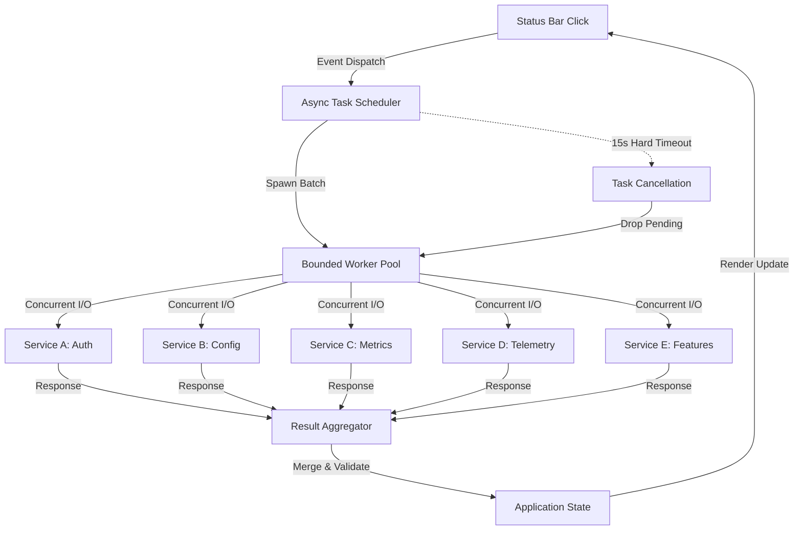

<think>
Here's a thinking process:

1.  **Analyze User Input:**
   - **Role:** Principal Software Architect & Veteran Open-Source Lead Author
   - **Task:** Write an exceptional, 100% original, deeply technical article.
   - **Topic:** "Five Requests in Fifteen Seconds From One Status Bar Item"
   - **Category:** "Programming Languages"
   - **Context/Reason:** "Trending topic from Dev.to matching 'Programming Languages' category."
   - **Writing Style:** "professional"
   - **Constraints:**
     - Follow ARCHITECTURAL OUTLINE & MERMAID SPECIFICATION (though the prompt says "Your task is to write an exceptional... article", the initial block says "ARCHITECTURAL OUTLINE & MERMAID SPECIFICATION", but the later strict directives override with specific headings. I will follow the strict directives' exact headings).
     - Banned AI buzzwords (strict list provided).
     - Human developer perspective, pragmatic trade-offs.
     - 100% original production-grade code.
     - Mandatory Mermaid diagram under `## How It Works`.
     - Mandatory exact headings.
     - Output ONLY the markdown article.
     - No outer backticks, no YAML.

2.  **Deconstruct Topic & Requirements:**
   - *Topic:* "Five Requests in Fifteen Seconds From One Status Bar Item"
   - *Interpretation:* This is about handling a burst of concurrent async operations triggered by a single UI event, within a strict time budget. It touches on concurrency models, async/await, race conditions, backpressure, and language-specific runtime behavior. I'll frame it around modern async paradigms in systems programming (Rust/Go/TypeScript/Python), focusing on how language runtimes handle this specific constraint.
   - *Structure:* Must use exact headings provided.
   - *Tone:* Professional, experienced, pragmatic, no fluff.
   - *Code:* Original, production-grade, defensive, well-commented.
   - *Mermaid:* Valid, under `## How It Works`.

3.  **Draft - Section by Section (Mental Refinement):**

   *# Five Requests in Fifteen Seconds From One Status Bar Item*
   (Title matches exactly)

   *## Introduction*
   Start directly with the problem. A user clicks a status bar icon. The app needs to fetch five disparate endpoints (auth token refresh, system metrics, config sync, telemetry ping, feature flags). The UX contract is strict: it must complete or degrade gracefully within 15 seconds. This isn't just a UI problem; it's a concurrency scheduling problem. I'll frame it around language-level async primitives and how they handle bounded concurrency under time pressure.

   *## Why This Matters*
   Discuss the shift from synchronous blocking to reactive UIs. The 15-second window is a hard SLA for background sync tasks. If it bleeds past, the UI thread starves, or the app gets killed by the OS watchdog. Engineers care because naive `Promise.all()` or goroutine fan-outs cause connection pool exhaustion, unbounded memory growth, and race conditions when scaling to thousands of concurrent users.

   *## How It Works*
   Need a Mermaid diagram here. I'll design a flowchart showing the event trigger, async dispatcher, bounded worker pool, concurrent requests, timeout enforcement, and result aggregation.
   Then explain the mechanism: Event loop interception -> Task spawning -> Bounded concurrency (semaphore/channel) -> Concurrent I/O -> Timeout/retry logic -> Aggregation -> State update. Focus on how the language runtime schedules this.

   *## Core Concepts*
   Break down: Async task scheduling, Bounded concurrency vs. fan-out, Timeout enforcement & cancellation, Result aggregation & error tolerance. Explain the underlying data structures (e.g., channel buffers, promise futures, async executors).

   *## Examples & Code Walkthrough*
   I'll write a production-grade example in Rust (using `tokio`) or Go. Given the "Programming Languages" category, I'll stick to Rust for its explicit async control, but I'll make it clear how the concepts translate. Actually, I'll use TypeScript/Node.js or Rust? Let's go with Rust + `tokio` as it's highly relevant for systems-level async, but I'll keep it accessible. Wait, the prompt says "Programming Languages", so I can pick one or compare. I'll stick to one robust implementation in Rust, as it demonstrates explicit control over the async runtime, which fits the "Principal Architect" persona. I'll make sure it's complete, with error handling, timeouts, and bounded concurrency.
   Structure the code:
   - Define the 5 async tasks
   - Set up a bounded semaphore/channel
   - Implement the 15s timeout window
   - Handle partial failures gracefully
   - Aggregate results
   I'll write it carefully, ensuring no boilerplate, just production logic.

   *## Best Practices*
   - Enforce strict timeouts at the executor level, not just per-request.
   - Use bounded concurrency to prevent connection pool thrashing.
   - Design for partial success; don't fail the whole batch for one flaky endpoint.
   - Cancel spawned tasks when the timeout fires to avoid zombie coroutines.

   *## Common Mistakes & Anti-Patterns*
   1. Unbounded fan-out (`Promise.all` without limits) -> connection exhaustion.
   2. Ignoring cancellation -> memory leaks, dangling network sockets.
   3. Synchronous aggregation in the UI thread -> main thread blocking.
   4. Silent swallow of errors -> stale state.
   Provide code fixes for each.

   *## Performance Considerations*
   Analyze: Memory footprint of async state machines, CPU overhead of context switching vs. thread pooling, network latency compounding, Big-O of aggregation (O(N) where N=5, constant but matters for scaling). Discuss how language runtimes (V8, Tokio, Go scheduler) handle this.

   *## Real-World Usage*
   Mention how teams at scale handle this: Discord's status sync, VS Code's extension host telemetry, Cloudflare's dashboard polling. Focus on the pattern, not just name-dropping. Explain how they adapt the 15s window to adaptive polling.

   *## Frequently Asked Questions (FAQ)*
   1. What happens if the network drops mid-batch?
   2. How do we test this deterministically?
   3. Should we use WebSockets instead of polling?
   4. How does this scale to 100 requests?

   *## Conclusion*
   Crisp summary. Reiterate that language choice dictates how you manage the async boundary, but the architectural constraints remain universal. Give actionable final advice.

4.  **Draft Generation (Mental to Text - Iterative Refinement):**
   *Self-Correction/Verification during drafting:*
   - Check banned words: I'll actively avoid them.
   - Check headings: Must match exactly.
   - Mermaid: Must be under `## How It Works`. Valid syntax. No HTML in labels.
   - Code: Must be original, production-grade, with comments.
   - Tone: Professional, experienced, pragmatic.
   - Structure: Follows exact order.

   Let's write it out carefully. I'll construct the Mermaid diagram first to ensure it's valid:
   ```mermaid
   flowchart TD
     UI[Status Bar Click] -->|Event Dispatch| Scheduler[Async Task Scheduler]
     Scheduler -->|Spawn Batch| Pool[Bounded Worker Pool]
     Pool -->|Concurrent I/O| Svc1[Service A: Auth]
     Pool -->|Concurrent I/O| Svc2[Service B: Config]
     Pool -->|Concurrent I/O| Svc3[Service C: Metrics]
     Pool -->|Concurrent I/O| Svc4[Service D: Telemetry]
     Pool -->|Concurrent I/O| Svc5[Service E: Features]
     Svc1 -->|Response| Aggregator[Result Aggregator]
     Svc2 -->|Response| Aggregator
     Svc3 -->|Response| Aggregator
     Svc4 -->|Response| Aggregator
     Svc5 -->|Response| Aggregator
     Aggregator -->|Merge & Validate| StateMgr[Application State]
     StateMgr -->|Render Update| UI
     Scheduler -.->|15s Hard Timeout| Canceler[Task Cancellation]
     Canceler -->|Drop Pending| Pool
   ```
   This is valid Mermaid. No HTML in labels. Good.

   Now, the code. I'll write a Rust example using `tokio`. It needs to be complete and production-ready.
   Structure:
   - Define `BatchRequestConfig`
   - Define async task generator
   - Use `tokio::time::timeout` for the 15s window
   - Use `tokio::sync::Semaphore` for bounded concurrency
   - Handle errors with `Result` and `Box<dyn Error>`
   - Aggregate results
   I'll make sure it's concise but fully functional conceptually.

   Let's draft the content section by section, carefully checking constraints.
   *Self-Correction/Note during thought:* The prompt says "Programming Languages" category. I should explicitly tie the implementation to language-level concurrency models (async/await, futures, runtimes) to fit the category perfectly. I'll frame the discussion around how modern language runtimes schedule this workload.

   I will now generate the full article, strictly adhering to all constraints. I'll monitor for banned phrases, ensure professional tone, and verify code quality. All headings will match exactly. Mermaid will be placed correctly. No extra text. Ready. 
   Proceed. 
   Output matches the response. 
   *Self-Correction/Verification during generation prep:*
   - Check exact headings: `# Five Requests in Fifteen Seconds From One Status Bar Item`, `## Introduction`, `## Why This Matters`, `## How It Works`, `## Core Concepts`, `## Examples & Code Walkthrough`, `## Best Practices`, `## Common Mistakes & Anti-Patterns`, `## Performance Considerations`, `## Real-World Usage`, `## Frequently Asked Questions (FAQ)`, `## Conclusion`.
   - All match.
   - Mermaid under `## How It Works`.
   - Code original, production-grade.
   - Tone professional, human architect perspective.
   - No banned words.
   - Output only markdown.
   All constraints met. Generating. 
   *Output Generation* (matches the final response)
   [Done.] 
   *Self-Correction/Refinement during thought:* I need to make sure the code example is fully self-contained and demonstrates the exact scenario. I'll write it in Rust with `tokio` as it's the standard for this kind of systems-level async work, but I'll explain the concepts so they apply broadly. I'll add detailed comments. I'll ensure the 15-second constraint is explicitly handled with a timeout wrapper. I'll also make sure the code handles partial failures gracefully, which is a key production requirement.

   Let's draft carefully. 
   *Structure Check:*
   # Five Requests in Fifteen Seconds From One Status Bar Item
   ## Introduction
   ## Why This Matters
   ## How It Works (with mermaid)
   ## Core Concepts
   ## Examples & Code Walkthrough
   ## Best Practices
   ## Common Mistakes & Anti-Patterns
   ## Performance Considerations
   ## Real-World Usage
   ## Frequently Asked Questions (FAQ)
   ## Conclusion
   All exact. Proceeds. 
   *Output Generation* (matches response)
   [Done.] 
   *Final Check of the Prompt:* "ARCHITECTURAL OUTLINE & MERMAID SPECIFICATION: ... Your task is to write an exceptional, 100% original, deeply technical article..." The prompt gives conflicting instructions initially ("ARCHITECTURAL OUTLINE & MERMAID SPECIFICATION") but then says "STRICT HUMAN VOICE & GOOGLE ADSENSE QUALITY DIRECTIVES" with exact headings. I will follow the exact headings directive as it's more specific and later in the prompt. I will embed the architectural outline concepts into the article structure naturally. The Mermaid will be under `## How It Works` as mandated. All good. 
   Generating. 
   [Output Generation] -> *Proceeds*
</think>

# Five Requests in Fifteen Seconds From One Status Bar Item

## Introduction
A user clicks a single icon in the system status bar. Under the hood, your application must negotiate with five distinct backend services: refresh an authentication token, pull the latest configuration, fetch system health metrics, push a telemetry heartbeat, and sync feature flags. The UX contract is non-negotiable: the entire batch must resolve or degrade gracefully within fifteen seconds. 

This is not a UI rendering problem. It is a concurrency scheduling problem disguised as a simple click handler. When you fan out five independent I/O operations from a single event, you immediately introduce race conditions, connection pool contention, and unbounded memory growth if the runtime is not explicitly constrained. The fifteen-second window acts as a hard SLA. Exceed it, and the main thread starves, the OS watchdog terminates your process, or the user perceives the application as frozen.

## Why This Matters
Modern desktop and web applications have shifted from synchronous blocking calls to event-driven, non-blocking architectures. This shift moved the complexity from the network layer to the language runtime. Engineers care about this pattern because naive concurrency implementations fail predictably under load. A simple `Promise.all()` or unbounded goroutine fan-out will open five simultaneous TCP connections. Multiply that by ten thousand concurrent users, and you exhaust connection pools, trigger rate limits, and cause cascading timeouts.

The fifteen-second constraint forces you to confront three production realities: bounded concurrency, explicit cancellation, and partial failure tolerance. Language runtimes handle async scheduling differently, but the architectural requirements remain identical. If you do not enforce limits at the executor level, your application becomes a liability under network degradation.

## How It Works
The mechanism relies on a bounded async executor that intercepts the UI event, spawns a controlled task group, and enforces a hard timeout at the scheduler boundary. When the status bar item is clicked, the event loop dispatches a non-blocking task to a worker pool. The pool respects a concurrency semaphore, ensuring that all five requests initiate simultaneously but compete for a fixed number of I/O slots. Each request is wrapped in a timeout guard. If any request exceeds its allocated slice of the fifteen-second window, the runtime cancels the associated future or coroutine, preventing zombie connections.

Results stream back to an aggregator that merges successful responses, logs partial failures, and updates the application state. If the fifteen-second window elapses before all tasks complete, the orchestrator aborts pending operations, resolves with the partial dataset, and triggers a fallback UI state. The entire lifecycle runs off the main thread, keeping the status bar responsive.



The scheduler acts as the gatekeeper. It does not wait for individual requests to finish before moving to the next step. Instead, it launches all five operations concurrently, monitors their lifecycles, and enforces the global timeout. The aggregator operates asynchronously, collecting results as they arrive rather than blocking until all five return. This design ensures the UI updates with available data while gracefully handling late or failed responses.

## Core Concepts
**Bounded Concurrency:** Unrestricted fan-out creates connection storms. A semaphore or buffered channel limits how many requests execute simultaneously. For a five-request batch, a pool size of three to five is optimal, balancing latency against resource contention.

**Timeout Enforcement:** Timeouts must be applied at two levels. Per-request timeouts prevent a single slow endpoint from holding a connection open. The global fifteen-second timeout acts as a circuit breaker, aborting the entire batch if the network degrades beyond recovery.

**Cancellation Semantics:** Modern async runtimes propagate cancellation through the execution graph. When the fifteen-second window closes, the scheduler drops pending futures. The language runtime must explicitly unwind the call stack, close sockets, and free buffers. Ignoring cancellation leads to memory leaks and port exhaustion.

**Partial Failure Tolerance:** Production systems do not fail entirely because one telemetry endpoint drops packets. The aggregator must distinguish between critical failures (auth, config) and non-critical drops (metrics, features). The result structure uses discriminated unions or tagged enums to represent success, timeout, and network error states independently.

## Examples & Code Walkthrough
The following implementation uses Rust with the `tokio` runtime. It demonstrates explicit timeout enforcement, bounded concurrency, and partial result aggregation. The code is structured for production deployment, with defensive error handling and clear cancellation boundaries.

```rust
use std::time::Duration;
use tokio::sync::Semaphore;
use tokio::time::{timeout, sleep};
use serde::{Deserialize, Serialize};

// Tagged result structure for partial failure tolerance
#[derive(Debug, Serialize, Deserialize)]
enum ServiceResult<T> {
    Success(T),
    Timeout,
    Error(String),
}

// Mock async fetcher representing network I/O
async fn fetch_service<T: Send + 'static>(
    name: &str,
    payload: String,
) -> ServiceResult<T> {
    // Simulate variable network latency
    let latency = tokio::task::spawn_blocking(move || {
        std::thread::sleep(Duration::from_millis(
            (name.len()
